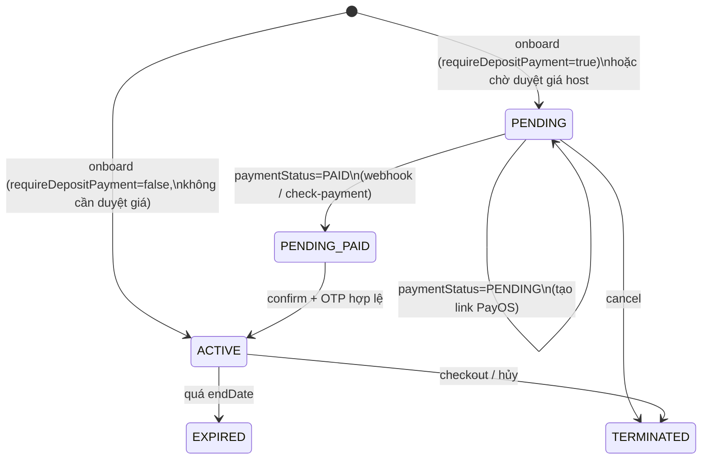
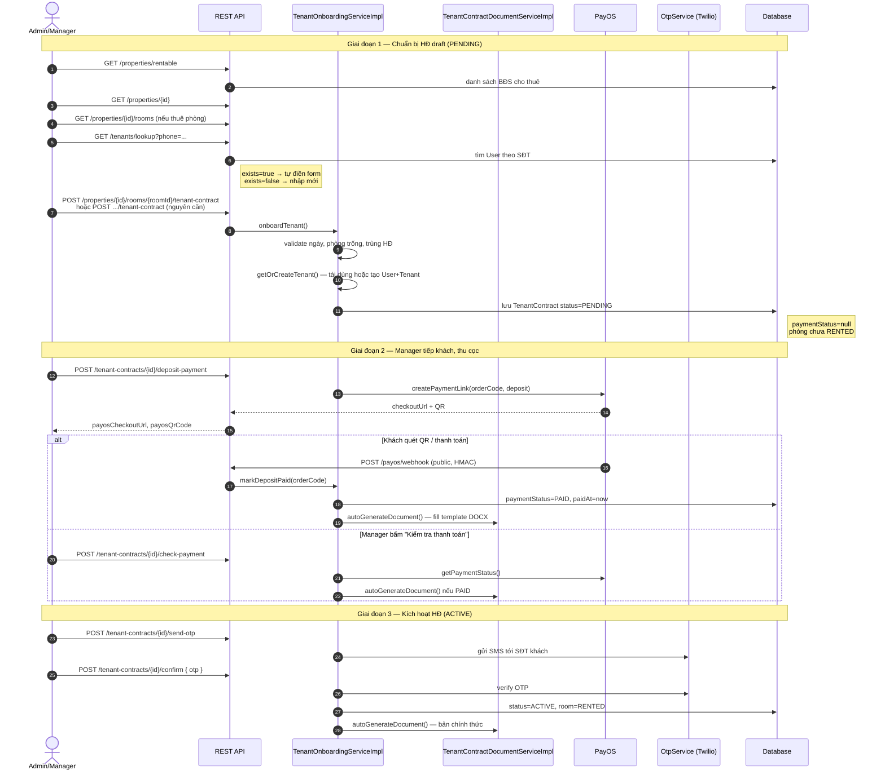
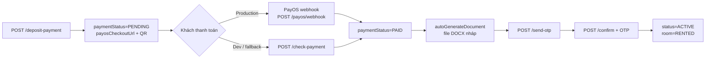

# Luồng tiếp khách (Tenant Onboarding) — FE & BE

Tài liệu mô tả luồng **tiếp khách / onboarding khách thuê** trong SLMS2026: Admin/Manager nhập thông tin tenant, lấy dữ liệu property/room để điền template hợp đồng, Manager tiếp khách tại chỗ, thanh toán cọc và kích hoạt hợp đồng.

**Tham chiếu code:** `TenantOnboardingServiceImpl`, `TenantContractActionController`, `TenantContractDocumentServiceImpl`, `PayosWebhookController`

**Tham chiếu khác:** [`tenant-onboarding-sequence-diagrams.md`](./tenant-onboarding-sequence-diagrams.md) · [`tenant-contract-template-spec.md`](./tenant-contract-template-spec.md) · [`contract-template-content.md`](./contract-template-content.md)

> **Triển khai FE:** Đọc thêm [§11 Lỗ hổng đã biết & hướng khắc phục](#11-lỗ-hổng-đã-biết--hướng-khắc-phục-khi-triển-khai) trước khi code Phase 2.

---

## 1. Tổng quan vai trò

| Vai trò | Việc chính |
|---------|------------|
| **Admin / Manager** | Chọn property/room, nhập thông tin khách, tạo hợp đồng |
| **Hệ thống (BE)** | Lưu `TenantContract`, điền template DOCX, xử lý PayOS |
| **Manager (tại chỗ)** | Mang hợp đồng (màn hình hoặc file DOCX) tiếp khách, thu cọc, OTP |
| **Khách** | Thanh toán cọc (PayOS), nhận OTP SMS |

### Thuật ngữ trạng thái

| Khái niệm nghiệp vụ | Trong hệ thống |
|---------------------|----------------|
| Hợp đồng **draft** | `ContractStatus.PENDING` (chờ thanh toán / duyệt giá) — **không** có enum `DRAFT` cho tenant contract |
| Hợp đồng **active** | `ContractStatus.ACTIVE` |
| Đã thanh toán cọc | `PaymentStatus.PAID` |
| File Word nháp | Xuất được khi `paymentStatus = PAID` (trước confirm) |
| File Word chính thức | Xuất lại sau `confirm` → `status = ACTIVE` |

---

## 2. State machine hợp đồng



### Enum liên quan

**`ContractStatus`:** `PENDING` · `ACTIVE` · `EXPIRED` · `TERMINATED`

**`PaymentStatus`:** `PENDING` · `PAID`

**`PriceApprovalStatus`** (khi `requireHostPriceApproval = true`):
- `PENDING_PRICE_APPROVAL` → Host duyệt → `APPROVED_AWAITING_DEPOSIT` hoặc `PRICE_REJECTED`

---

## 3. Luồng Backend (BE)



### 3.1. Bảng API map

| Bước | Method | Endpoint | Service / Controller |
|------|--------|----------|----------------------|
| Danh sách BĐS cho thuê | GET | `/api/v1/properties/rentable` | `PropertyController` → `PropertyService` |
| Chi tiết căn | GET | `/api/v1/properties/{id}` | `PropertyController` |
| Danh sách phòng | GET | `/api/v1/properties/{id}/rooms` | `RoomController` |
| Chi tiết phòng | GET | `/api/v1/properties/{id}/rooms/{roomId}` | `RoomController` |
| Tra khách theo SĐT | GET | `/api/v1/tenants/lookup?phone=` | `TenantLookupController` |
| Tạo HĐ thuê phòng | POST | `/api/v1/properties/{propertyId}/rooms/{roomId}/tenant-contract` | `TenantContractController` |
| Tạo HĐ nguyên căn | POST | `/api/v1/properties/{propertyId}/tenant-contract` | `TenantContractController` |
| Danh sách HĐ theo property | GET | `/api/v1/properties/{propertyId}/tenant-contracts` | `TenantContractController` — **fallback** lọc `PENDING` cho tiếp khách (§11.1) |
| Chi tiết HĐ | GET | `/api/v1/tenant-contracts/{id}` | `TenantContractActionController` |
| HĐ chờ duyệt giá (manager) | GET | `/api/v1/tenant-contracts/managed` | `TenantContractActionController` — **chỉ** HĐ có `priceApprovalStatus`; xem §11.1 |
| Tạo link thanh toán cọc | POST | `/api/v1/tenant-contracts/{id}/deposit-payment` | `TenantOnboardingServiceImpl.createDepositPayment` |
| Kiểm tra thanh toán | POST | `/api/v1/tenant-contracts/{id}/check-payment` | `TenantOnboardingServiceImpl.syncPaymentStatus` |
| Webhook PayOS | POST | `/api/v1/payos/webhook` | `PayosWebhookController` (public, không JWT) |
| Gửi OTP xác nhận | POST | `/api/v1/tenant-contracts/{id}/send-otp` | `TenantOnboardingServiceImpl.sendContractConfirmOtp` |
| Kích hoạt HĐ | POST | `/api/v1/tenant-contracts/{id}/confirm` | `TenantOnboardingServiceImpl.confirmContract` |
| Xuất file DOCX | POST | `/api/v1/tenant-contracts/{id}/document` | `TenantContractDocumentServiceImpl.generateAndStore` |
| Tải file DOCX đã lưu | GET | `/api/v1/tenant-contracts/{id}/document` | `TenantContractDocumentServiceImpl.getDocument` |
| Hủy HĐ chờ | POST | `/api/v1/tenant-contracts/{id}/cancel` | `TenantOnboardingServiceImpl.cancelContract` |
| Gửi duyệt giá lại | POST | `/api/v1/tenant-contracts/{id}/resubmit-approval` | `TenantOnboardingServiceImpl.resubmitApproval` |

**Phân quyền:** Các API onboarding/thanh toán yêu cầu `ROLE_ADMIN` hoặc `ROLE_MANAGER`, trừ webhook PayOS.

---

## 4. Luồng Frontend (FE) — đề xuất theo API hiện có

> Repo hiện tại chủ yếu có Backend; luồng FE dưới đây là hướng triển khai màn hình dựa trên API đã có.

```mermaid
flowchart TD
    subgraph Phase1["Giai đoạn 1 — Admin chuẩn bị (Web/Admin)"]
        A1[Đăng nhập ADMIN/MANAGER] --> A2[Màn chọn BĐS<br/>GET /properties/rentable]
        A2 --> A3{Thuê phòng hay nguyên căn?}
        A3 -->|Phòng| A4[GET /properties/id/rooms<br/>chọn phòng AVAILABLE]
        A3 -->|Nguyên căn| A5[GET /properties/id]
        A4 --> A6[Form thông tin khách]
        A5 --> A6
        A6 --> A7[Nhập SĐT → blur<br/>GET /tenants/lookup?phone=]
        A7 --> A8{exists?}
        A8 -->|true| A9[Tự điền fullName, cccd<br/>skip tạo account thủ công]
        A8 -->|false| A10[Nhập đủ họ tên, CCCD]
        A9 --> A11[Điền giá, cọc, ngày, chỉ số điện nước, ảnh bàn giao]
        A10 --> A11
        A11 --> A12[POST tenant-contract<br/>requireDepositPayment=true]
        A12 --> A13[Hiển thị HĐ PENDING<br/>contractId + contractCode]
        A13 --> A14[Chuyển sang Phase 2<br/>deep link contractId]
    end

    subgraph Phase2["Giai đoạn 2 — Manager tiếp khách (Mobile)"]
        B0{Luồng nào?}
        B0 -->|Mặc định tiếp khách| B1a[Mở HĐ theo contractId<br/>hoặc GET property/tenant-contracts<br/>lọc status=PENDING]
        B0 -->|Chờ duyệt giá Host| B1b[GET /tenant-contracts/managed]
        B1a --> B2[Chi tiết HĐ PENDING]
        B1b --> B2
        B2 --> B2a{priceApprovalStatus?}
        B2a -->|PENDING_PRICE_APPROVAL| B2b[Chờ Host duyệt — disable Thu cọc]
        B2a -->|APPROVED_AWAITING_DEPOSIT hoặc null| B3[POST /deposit-payment]
        B3 --> B4[Hiển thị QR / link PayOS cho khách]
        B4 --> B5{Đã thanh toán?}
        B5 -->|Webhook tự động| B6[poll GET /tenant-contracts/id<br/>paymentStatus=PAID]
        B5 -->|Nút Kiểm tra| B7[POST /check-payment]
        B7 --> B6
        B6 --> B8[Tải/xem DOCX<br/>GET /document hoặc documentUrl]
    end

    subgraph Phase3["Giai đoạn 3 — Xác nhận & ACTIVE"]
        C1[POST /send-otp] --> C2[Khách đọc SMS]
        C2 --> C3[Nhập OTP trên app Manager]
        C3 --> C4[POST /confirm]
        C4 --> C5[status=ACTIVE<br/>phòng RENTED]
        C5 --> C6[Hiển thị username khách<br/>tenantUsername từ response]
    end

    A14 --> B0
    B8 --> C1
```



### 4.1. Màn hình FE gợi ý

| Màn hình | Vai trò | API chính |
|----------|---------|-----------|
| Chọn BĐS / phòng | Admin | `GET /properties/rentable`, `GET /properties/{id}/rooms` |
| Form onboarding khách | Admin | `GET /tenants/lookup`, `POST .../tenant-contract` |
| Kết quả tạo HĐ + chuyển tiếp | Admin | Response `id` → deep link sang Manager |
| Danh sách HĐ chờ tiếp khách | Manager | `GET /properties/{id}/tenant-contracts` (lọc `PENDING`) **hoặc** mở trực tiếp `/{id}` |
| Danh sách chờ duyệt giá | Manager | `GET /tenant-contracts/managed` (chỉ nhánh Host duyệt giá) |
| Chi tiết HĐ + thanh toán | Manager | `GET /tenant-contracts/{id}`, `POST /deposit-payment` |
| QR / chờ thanh toán | Manager | Poll `GET /tenant-contracts/{id}` hoặc `POST /check-payment` |
| Xem / in hợp đồng | Manager | `GET /tenant-contracts/{id}/document` |
| Xác nhận OTP | Manager | `POST /send-otp`, `POST /confirm` |
| Hủy HĐ chờ | Admin/Manager | `POST /tenant-contracts/{id}/cancel` |
| Gửi duyệt giá lại | Admin/Manager | `POST /tenant-contracts/{id}/resubmit-approval` |

### 4.2. Request body tạo HĐ (`OnboardTenantRequest`)

| Field | Bắt buộc | Mô tả |
|-------|----------|-------|
| `fullName` | ✓ | Họ tên khách |
| `cccd` | ✓ | CCCD |
| `phoneNumber` | ✓ | SĐT (dùng tra cứu + đăng nhập) |
| `moveInDate` | ✓ | Ngày vào ở — **phải là hôm nay** (BE validate) |
| `endDate` | ✓ | Ngày kết thúc — tối đa 5 năm |
| `rentAmount` | ✓ | Giá thuê/tháng |
| `deposit` | ✓ | Tiền cọc |
| `depositMonths` | | Số tháng cọc (1 hoặc 2) |
| `initialElectricReading` | | Chỉ số điện đầu kỳ |
| `initialWaterReading` | | Chỉ số nước đầu kỳ |
| `electricMeterImageUrl` | | Ảnh đồng hồ điện |
| `waterMeterImageUrl` | | Ảnh đồng hồ nước |
| `roomConditionUrls` | | Ảnh hiện trạng phòng |
| `roomConditionNote` | | Ghi chú bàn giao |
| `householdMembers` | | Thành viên ở cùng (nguyên căn) |
| `requireDepositPayment` | | `true` = mobile tiếp khách (`PENDING`); `false` = web (`ACTIVE` ngay **nếu** không chờ duyệt giá) |
| `requireHostPriceApproval` | | `true` = chờ Host duyệt giá trước khi thu cọc |

---

## 5. Tạo tài khoản khách

### Quy tắc nghiệp vụ

- **Khách đã có account** (tìm theo SĐT): FE gọi `GET /tenants/lookup` → tự điền form, **không** cần màn "Tạo tài khoản" riêng.
- **Khách chưa có account**: Admin nhập thông tin trên form; BE tự tạo khi `POST tenant-contract` qua `getOrCreateTenant()`.

### Logic BE (`getOrCreateTenant`)

1. Tìm `User` theo `phoneNumber`.
2. Nếu **đã tồn tại**:
   - `ROLE_USER` → nâng lên `ROLE_TENANT`.
   - `ROLE_TENANT` → tái dùng profile.
   - Role khác → báo lỗi SĐT đã dùng cho tài khoản khác.
3. Nếu **chưa có** → tạo `User` (username `t{phone}`, mật khẩu mặc định `123456`) + `Tenant` profile.

### Response tra cứu (`GET /tenants/lookup`)

```json
// Chưa có
{ "exists": false }

// Đã có
{
  "exists": true,
  "fullName": "Nguyễn Văn A",
  "phoneNumber": "0901234567",
  "cccd": "001234567890",
  "role": "ROLE_TENANT"
}
```

**Lưu ý FE:** API trả `exists=true` với **mọi** `User` có SĐT đó (kể cả `ROLE_ADMIN`, `ROLE_MANAGER`). Nếu `role` không phải `ROLE_USER` / `ROLE_TENANT`, vẫn tự điền form nhưng `POST tenant-contract` sẽ **lỗi** — FE nên hiện cảnh báo khi `role` khác hai giá trị trên.

### Thời điểm tạo tài khoản (quan trọng)

| Sự kiện | Hành vi BE |
|---------|------------|
| `POST tenant-contract` (`getOrCreateTenant`) | Tạo mới `User` + `Tenant` nếu chưa có SĐT; username = **`t{phone}`** (vd. `t0901234567`), mật khẩu mặc định `123456`; hoặc nâng `ROLE_USER` → `ROLE_TENANT` |
| `POST confirm` | Chủ yếu kích hoạt HĐ; trả `tenantUsername` để Manager thông báo cho khách. Cờ `tenantAccountCreated` / `tenantRolePromoted` **thường đã false** vì account đã xử lý ở bước onboard |

**FE nên:** sau onboard thành công, có thể lưu `tenantPhone` / biết account đã tồn tại; sau `confirm` hiển thị `tenantUsername` (thường là `t{phone}`) và mật khẩu mặc định cho khách mới.

---

## 6. Thanh toán cọc (PayOS)

### Vị trí triển khai trong code

| Lớp | File | Trách nhiệm |
|-----|------|-------------|
| Tạo đơn thanh toán | `TenantOnboardingServiceImpl.createDepositPayment` | Gọi PayOS, lưu `payosOrderCode`, `paymentStatus=PENDING`, trả `checkoutUrl` + `qrCode` |
| Webhook | `PayosWebhookController` | `POST /api/v1/payos/webhook` — xác minh HMAC, gọi `markDepositPaid` |
| Đồng bộ thủ công | `TenantOnboardingServiceImpl.syncPaymentStatus` | Dùng khi dev local không có webhook |
| Sau thanh toán | `autoGenerateDocument` | Tự fill template DOCX, lưu `documentUrl` |

### Luồng thanh toán



### Lưu ý quan trọng

- **Thanh toán thành công ≠ HĐ ACTIVE.** Sau `PAID` vẫn cần `send-otp` + `confirm` với OTP hợp lệ.
- Webhook endpoint **public** (không JWT), bảo mật bằng chữ ký HMAC PayOS.
- `PayosWebhookController` cũng xử lý hóa đơn tiền thuê (`TenantBillingService.markInvoicePaidByPayosOrderCode`) — dùng chung `orderCode`.

---

## 7. Template hợp đồng DOCX

### Nguồn dữ liệu

BE map từ DB vào placeholder trong `templates/contract/tenant-rental-template.docx`:

| Nhóm | Nguồn |
|------|-------|
| Bên thuê | `User.fullName`, `Tenant.cccd`, `User.phoneNumber` |
| Nhà / phòng | `Property.*`, `Room.roomNumber` |
| Giá & cọc | `TenantContract.rentAmount`, `deposit`, `depositMonths` |
| Thời hạn | `startDate`, `endDate`, `moveInDate` |
| Bàn giao | `initialElectricReading`, `roomConditionNote`, … |

Chi tiết placeholder: xem [`tenant-contract-template-spec.md`](./tenant-contract-template-spec.md).

### Điều kiện xuất file

Chỉ gọi `POST /document` hoặc auto-generate khi:

- `status = ACTIVE`, **hoặc**
- `paymentStatus = PAID`

Trước khi khách trả cọc, Manager chỉ xem **preview JSON** từ `GET /tenant-contracts/{id}` — chưa có file Word.

### Lưu trữ

- Path: `uploads/contracts/{contractCode}/{contractCode}.docx`
- DB: `TenantContract.documentUrl`, `documentGeneratedAt`
- URL public: `{publicBaseUrl}/uploads/contracts/...`

---

## 7.1. Quy trình xác nhận OTP (chi tiết)

> Cơ chế hiện tại: **Manager xác nhận hộ** — khách nhận OTP qua SMS, đọc cho Manager, Manager nhập vào app.

### Các bước

1. Manager gọi `POST /tenant-contracts/{id}/send-otp` → BE gửi SMS tới SĐT khách (khi Twilio bật).
2. Khách đọc mã cho Manager.
3. Manager gọi `POST /tenant-contracts/{id}/confirm` với `{ "otp": "..." }`.
4. BE xác minh → `status: ACTIVE`, phòng `RENTED`, xuất lại DOCX bản chính thức.

### Trạng thái OTP trong code hiện tại (dev)

`OtpServiceImpl` đang **chế độ dev**: không gửi SMS thật; `confirm` chấp nhận **bất kỳ mã 6 chữ số**. Khi bật Twilio (production), có `expiry-minutes` (mặc định 5) và `max-attempts` (mặc định 5) — xem `application.yaml`.

### Rủi ro / cải tiến sau (backlog)

- Giới hạn gửi lại OTP / nhập sai (đã có trong code Twilio, cần bật).
- Khách chưa có bước “đọc và đồng ý nội dung HĐ” tách biệt — cân nhắc gửi link xem DOCX trong SMS trước OTP.
- Toàn bộ nhập OTP qua tay Manager — cân nhắc sau này cho khách tự xác nhận qua link/app.

---

## 8. Hai nhánh luồng chính

| | **Web admin** | **Mobile tiếp khách** |
|--|---------------|----------------------|
| Flag | `requireDepositPayment = false` | `requireDepositPayment = true` |
| Sau onboard | `ACTIVE` ngay *(nếu không chờ duyệt giá)* | `PENDING` |
| Phòng | `RENTED` ngay *(nếu không chờ duyệt giá)* | `RENTED` sau `confirm` |
| Thanh toán PayOS | Bỏ qua | Bắt buộc |
| OTP | Không cần | Bắt buộc |
| DOCX | Tự xuất ngay sau onboard | Sau `PAID` (nháp) → sau `confirm` (chính thức) |

### Ma trận kết hợp flag (đừng chỉ nhìn một cột)

| `requireDepositPayment` | `requireHostPriceApproval` | Sau onboard | Vào danh sách `/managed`? |
|-------------------------|----------------------------|-------------|----------------------------|
| `true` | `false` | `PENDING`, `priceApprovalStatus=null` | **Không** — dùng `contractId` hoặc `GET .../tenant-contracts` |
| `true` | `true` | `PENDING`, `PENDING_PRICE_APPROVAL` | **Có** |
| `false` | `false` | `ACTIVE` ngay | Không áp dụng |
| `false` | `true` | `PENDING`, chờ Host duyệt | **Có** |

### Nhánh duyệt giá Host (tuỳ chọn)

Khi `requireHostPriceApproval = true`:

1. Onboard → `PENDING` + `priceApprovalStatus = PENDING_PRICE_APPROVAL`
2. Host duyệt qua portal → `APPROVED_AWAITING_DEPOSIT` hoặc `PRICE_REJECTED`
3. Manager chỉ tạo link cọc sau khi `APPROVED_AWAITING_DEPOSIT` — **FE phải disable nút Thu cọc**; BE hiện **chưa chặn** `deposit-payment` khi chưa duyệt (xem §12.3)
4. Nếu bị từ chối → `POST /resubmit-approval` để gửi lại giá

---

## 9. Validation BE khi onboard

| Rule | Mô tả |
|------|-------|
| `moveInDate` = hôm nay | Ngày hiệu lực phải là ngày tiếp khách |
| `endDate` > `moveInDate` | Ngày kết thúc hợp lệ |
| Thời hạn ≤ 5 năm | Từ hôm nay đến `endDate` |
| 1 HĐ active / phòng | Không trùng khoảng thời gian |
| Phòng không `RENTED` | Khi thuê phòng |
| Nguyên căn | Không có HĐ active cấp property |

---

## 10. Tóm tắt theo kịch bản nghiệp vụ

1. **Admin** chọn property/room, tra SĐT khách (`lookup`), nhập form → `POST tenant-contract` với `requireDepositPayment=true` → HĐ **PENDING** (draft).
2. **BE** lưu dữ liệu + `getOrCreateTenant` (tài khoản `t{phone}` nếu khách mới); chưa xuất DOCX (chưa thanh toán).
3. **Manager** mở HĐ qua **deep link `contractId`** hoặc `GET /properties/{id}/tenant-contracts` (lọc `PENDING`) — **không** dùng `/managed` cho luồng mặc định.
4. **Thanh toán cọc** qua PayOS (`deposit-payment` → QR → webhook hoặc `check-payment`) → `PAID` → tự xuất DOCX nháp.
5. **Xác nhận** OTP (`send-otp` → `confirm`) → HĐ **ACTIVE**, phòng **RENTED**; hiển thị `tenantUsername` cho khách.
6. **Tài khoản khách**: tạo tại onboard; FE tra `lookup` để tự điền form — không cần API tạo user riêng.

---

## 11. Lỗ hổng đã biết & hướng khắc phục khi triển khai

Tài liệu này ghi nhận các gap giữa **spec nghiệp vụ**, **tài liệu cũ** và **code BE hiện tại**, kèm cách xử lý cho team FE (và backlog BE).

### 11.1. `GET /tenant-contracts/managed` không liệt kê HĐ tiếp khách thường

| | Chi tiết |
|---|----------|
| **Vấn đề** | Query chỉ trả HĐ có `priceApprovalStatus IN (...)` (`PENDING_PRICE_APPROVAL`, `APPROVED_AWAITING_DEPOSIT`, `PRICE_REJECTED`). Luồng phổ biến `requireDepositPayment=true` + `requireHostPriceApproval=false` → `priceApprovalStatus = null` → **danh sách rỗng**. |
| **Mức độ** | **Blocker** nếu FE dùng `/managed` làm màn chính Phase 2. |
| **Khắc phục FE (ngay)** | (1) Sau `POST tenant-contract`, navigate thẳng tới `/tenant-contracts/{id}` bằng `id` trong response. (2) Hoặc `GET /properties/{propertyId}/tenant-contracts` + lọc `status === PENDING`. |
| **Khắc phục BE (backlog)** | Mở rộng `/managed` để gồm cả `PENDING` + `priceApprovalStatus IS NULL`, hoặc thêm `GET /tenant-contracts/pending`. |
| **Code** | `TenantContractRepository.findManagedContractsByApprovalStatuses` |

### 11.2. Thời điểm tạo tài khoản vs cờ `tenantAccountCreated`

| | Chi tiết |
|---|----------|
| **Vấn đề** | Tài liệu cũ gợi ý `accountCreated=true` sau `confirm`, nhưng `getOrCreateTenant()` đã tạo user lúc **onboard**. `confirm` thường chỉ trả `tenantUsername`. |
| **Mức độ** | Trung bình — UI hiển thị sai “tài khoản mới”. |
| **Khắc phục FE** | Coi account đã có sau onboard thành công; màn confirm chỉ hiện `tenantUsername` + mật khẩu mặc định `123456` cho khách chưa từng đăng nhập. Username = **`t{phone}`**, không phải SĐT thuần. |
| **Khắc phục BE (tuỳ chọn)** | Thêm `tenantAccountCreated` vào response onboard, hoặc dọn logic trùng trong `confirmContract`. |

### 11.3. `POST /deposit-payment` không chặn khi Host chưa duyệt giá

| | Chi tiết |
|---|----------|
| **Vấn đề** | Nghiệp vụ: chỉ thu cọc sau `APPROVED_AWAITING_DEPOSIT`. `createDepositPayment()` không kiểm tra `priceApprovalStatus`. |
| **Mức độ** | Trung bình — lệch quy trình duyệt giá. |
| **Khắc phục FE** | Disable / ẩn nút “Thu cọc” khi `priceApprovalStatus === 'PENDING_PRICE_APPROVAL'` hoặc `'PRICE_REJECTED'`. |
| **Khắc phục BE (backlog)** | Throw `BusinessException` nếu `priceApprovalStatus` không phải `null` hoặc `APPROVED_AWAITING_DEPOSIT`. |

### 11.4. `GET /tenants/lookup` không lọc theo role tenant

| | Chi tiết |
|---|----------|
| **Vấn đề** | Trả `exists=true` cho mọi user có SĐT; onboard sẽ lỗi nếu SĐT thuộc ADMIN/MANAGER/HOST. |
| **Mức độ** | Thấp–trung bình. |
| **Khắc phục FE** | Sau lookup, nếu `role` ∉ `{ROLE_USER, ROLE_TENANT}` → cảnh báo, chặn submit. |
| **Khắc phục BE (tuỳ chọn)** | Lookup chỉ `exists` khi role phù hợp, hoặc trả `eligible: false`. |

### 11.5. OTP đang dev mode

| | Chi tiết |
|---|----------|
| **Vấn đề** | Không gửi SMS; mọi mã 6 chữ số đều pass `confirm`. |
| **Mức độ** | Chấp nhận được khi dev; **blocker UAT/production** nếu quên bật Twilio. |
| **Khắc phục** | Dev: test với mã bất kỳ 6 số. Staging/Prod: bật Twilio trong `OtpServiceImpl`, cấu hình `twilio.*` trong env. |

### 11.6. Thiếu màn hình hủy HĐ & gửi duyệt lại trên FE spec cũ

| | Chi tiết |
|---|----------|
| **Vấn đề** | API `cancel` / `resubmit-approval` có sẵn nhưng chưa có trong flowchart ban đầu. |
| **Khắc phục FE** | Thêm nút “Hủy HĐ” trên chi tiết `PENDING` (trước khi `ACTIVE`). Thêm form sửa giá + `resubmit-approval` khi `PRICE_REJECTED`. |

### 11.7. Handoff Admin → Manager

| | Chi tiết |
|---|----------|
| **Vấn đề** | Spec cũ giả định Manager tự tìm HĐ trong list; list mặc định không đủ (§11.1). |
| **Khắc phục FE** | Sau tạo HĐ: nút “Tiếp khách ngay” → mở cùng `contractId` trên app Manager; hoặc copy link `slms://contract/{id}`. Push notification khi Host duyệt giá (`ResumeContract`) đã có phía BE. |

### Checklist trước khi go-live FE

- [ ] Phase 2 **không** phụ thuộc duy nhất vào `/managed` cho luồng `requireHostPriceApproval=false`
- [ ] Disable thu cọc khi chờ duyệt giá
- [ ] Cảnh báo lookup khi `role` không hợp lệ
- [ ] Hiển thị `tenantUsername` = `t{phone}` sau confirm
- [ ] Dev: dùng `check-payment` khi không có webhook PayOS local
- [ ] Prod: bật Twilio OTP trước demo ký HĐ

---

## 12. File code tham chiếu

| File | Vai trò |
|------|---------|
| `TenantOnboardingServiceImpl.java` | Onboard, PayOS, confirm, auto-xuất file |
| `TenantContractController.java` | POST tạo HĐ theo property/room |
| `TenantContractActionController.java` | Thanh toán, OTP, confirm, document |
| `TenantLookupController.java` | Tra cứu khách theo SĐT |
| `TenantContractDocumentServiceImpl.java` | Fill template DOCX, lưu storage |
| `PayosWebhookController.java` | Webhook thanh toán |
| `OnboardTenantRequest.java` | DTO request tạo HĐ |
| `PropertyController.java` | GET property (màn chọn BĐS) |
| `RoomController.java` | GET room (màn chọn phòng) |
