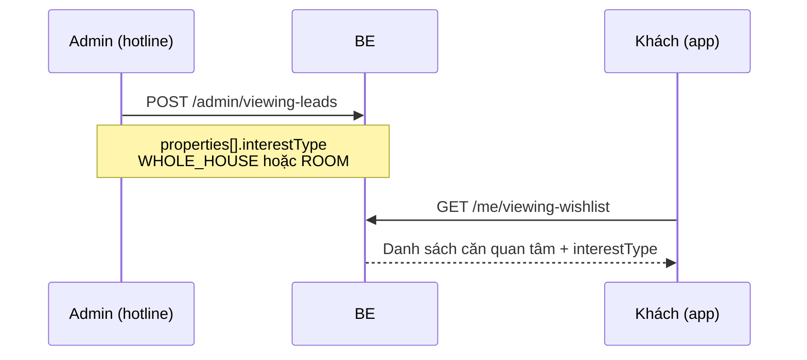

# Luồng Lead xem nhà (Hotline → Wishlist) — FE & BE

Tài liệu mô tả API **nhập lead từ hotline** (Admin) và **wishlist xem nhà** (khách `ROLE_USER` / `ROLE_TENANT`).

**Tham chiếu code:** `AdminViewingLeadController`, `ViewingWishlistController`, `ViewingLeadServiceImpl`

---

## 1. Tổng quan

| Vai trò | Việc chính |
|---------|------------|
| **Admin** | Nhận cuộc gọi hotline → nhập tên, SĐT, danh sách căn quan tâm |
| **Khách (USER/TENANT)** | Đăng nhập app → xem wishlist các căn đã được CS ghi nhận |
| **Hệ thống** | Chuẩn hóa SĐT, link tài khoản nếu trùng SĐT, phân biệt **nguyên căn** vs **phòng** |

### Phân biệt nguyên căn / phòng

Mỗi mục trong `properties[]` **bắt buộc** có `interestType`:

| `interestType` | Khi nào dùng | `roomId` |
|----------------|--------------|----------|
| `WHOLE_HOUSE` | BĐS `property.wholeHouse = true` (nguyên căn) | **Không gửi** / `null` |
| `ROOM` | BĐS cho thuê theo phòng (`wholeHouse = false`) | **Bắt buộc** |

**FE gợi ý UI:**
1. Chọn property từ danh sách (`GET /api/v1/properties/rentable` hoặc public list).
2. Nếu `wholeHouse === true` → tự set `interestType: "WHOLE_HOUSE"`, ẩn chọn phòng.
3. Nếu `wholeHouse === false` → bắt chọn phòng (`GET /api/v1/public/properties/{id}/rooms`), gửi `interestType: "ROOM"` + `roomId`.

---

## 2. Enum

### `ViewingLeadStatus` (trạng thái lead)

| Giá trị | Ý nghĩa |
|---------|---------|
| `NEW` | Mới nhập, chưa phân công manager |
| `ASSIGNED` | Đã gán manager (chưa triển khai API assign) |
| `SCHEDULED` | Đã hẹn giờ xem |
| `COMPLETED` | Đã xem xong |
| `CANCELLED` | Đã hủy |
| `NO_SHOW` | Khách không đến |

### `ViewingInterestType` (loại quan tâm từng mục)

| Giá trị | Ý nghĩa |
|---------|---------|
| `WHOLE_HOUSE` | Quan tâm thuê **nguyên căn** |
| `ROOM` | Quan tâm **một phòng** cụ thể |

---

## 3. API Admin

**Base:** `/api/v1/admin/viewing-leads`  
**Auth:** `Bearer` token, role `ADMIN`

### 3.1 Tạo lead

`POST /api/v1/admin/viewing-leads`

#### Request body

```json
{
  "customerName": "Nguyễn Văn A",
  "customerPhone": "0901234567",
  "note": "Muốn xem cuối tuần, có mang theo vợ",
  "preferredViewingAt": "2026-07-12T14:00:00",
  "properties": [
    {
      "propertyId": 101,
      "interestType": "WHOLE_HOUSE",
      "note": "Thích căn có sân vườn"
    },
    {
      "propertyId": 205,
      "interestType": "ROOM",
      "roomId": 12,
      "note": "Phòng tầng 2, view đẹp"
    }
  ]
}
```

| Field | Bắt buộc | Ghi chú |
|-------|----------|---------|
| `customerName` | Có | Tên khách từ hotline |
| `customerPhone` | Có | BE chuẩn hóa về `0xxxxxxxxx` |
| `note` | Không | Ghi chú chung |
| `preferredViewingAt` | Không | ISO-8601 local datetime |
| `properties` | Có, ≥ 1 phần tử | Danh sách căn quan tâm |
| `properties[].propertyId` | Có | ID BĐS |
| `properties[].interestType` | Có | `WHOLE_HOUSE` hoặc `ROOM` |
| `properties[].roomId` | Có khi `ROOM` | Null khi `WHOLE_HOUSE` |
| `properties[].note` | Không | Ghi chú theo từng căn/phòng |

#### Response `201 Created`

```json
{
  "id": 1,
  "customerName": "Nguyễn Văn A",
  "customerPhone": "0901234567",
  "note": "Muốn xem cuối tuần, có mang theo vợ",
  "status": "NEW",
  "assignedManagerId": null,
  "assignedManagerName": null,
  "createdBy": "a1b2c3d4-e5f6-7890-abcd-ef1234567890",
  "createdByName": "Admin CS",
  "linkedUserId": "b2c3d4e5-f6a7-8901-bcde-f12345678901",
  "preferredViewingAt": "2026-07-12T14:00:00",
  "scheduledAt": null,
  "createdAt": "2026-07-07T15:30:00",
  "updatedAt": "2026-07-07T15:30:00",
  "propertyCount": 2,
  "properties": [
    {
      "id": 10,
      "propertyId": 101,
      "propertyName": "Nhà 12 Nguyễn Trãi",
      "propertyAddress": "12 Nguyễn Trãi, Q.1, TP.HCM",
      "propertyStatus": "ACTIVE",
      "propertyWholeHouse": true,
      "propertyPrice": 15000000,
      "propertyImageUrls": ["/uploads/properties/101/a.jpg"],
      "interestType": "WHOLE_HOUSE",
      "roomId": null,
      "roomNumber": null,
      "roomFloor": null,
      "roomPrice": null,
      "note": "Thích căn có sân vườn"
    },
    {
      "id": 11,
      "propertyId": 205,
      "propertyName": "Chung cư mini 45 Lê Lợi",
      "propertyAddress": "45 Lê Lợi, Q.1, TP.HCM",
      "propertyStatus": "ACTIVE",
      "propertyWholeHouse": false,
      "propertyPrice": null,
      "propertyImageUrls": ["/uploads/properties/205/b.jpg"],
      "interestType": "ROOM",
      "roomId": 12,
      "roomNumber": "P201",
      "roomFloor": 2,
      "roomPrice": 4500000,
      "note": "Phòng tầng 2, view đẹp"
    }
  ]
}
```

#### Lỗi nghiệp vụ thường gặp (`400`)

| Message (ví dụ) | Nguyên nhân |
|-----------------|-------------|
| `... là nguyên căn — không được chọn phòng` | `WHOLE_HOUSE` nhưng gửi `roomId` |
| `... cho thuê theo phòng — phải chọn interestType=ROOM` | Property `wholeHouse=false` nhưng gửi `WHOLE_HOUSE` |
| `... cần chọn phòng cụ thể (roomId)` | `ROOM` nhưng thiếu `roomId` |
| `Danh sách căn nhà quan tâm bị trùng lặp` | Trùng `propertyId` + `roomId` |
| `Số điện thoại không hợp lệ` | SĐT không đúng format VN |

---

### 3.2 Danh sách lead

`GET /api/v1/admin/viewing-leads?status=NEW&phone=0901&keyword=Nguyễn&page=0&size=20&sort=createdAt,desc`

| Query | Mô tả |
|-------|-------|
| `status` | Lọc theo `ViewingLeadStatus` |
| `phone` | Lọc SĐT (BE chuẩn hóa) |
| `keyword` | Tìm trong tên, SĐT, ghi chú |
| `page`, `size`, `sort` | Spring Pageable |

#### Response `200 OK` (trang danh sách — **không** có `properties[]`, chỉ `propertyCount`)

```json
{
  "content": [
    {
      "id": 1,
      "customerName": "Nguyễn Văn A",
      "customerPhone": "0901234567",
      "note": "Muốn xem cuối tuần",
      "status": "NEW",
      "assignedManagerId": null,
      "assignedManagerName": null,
      "createdBy": "a1b2c3d4-e5f6-7890-abcd-ef1234567890",
      "createdByName": "Admin CS",
      "linkedUserId": "b2c3d4e5-f6a7-8901-bcde-f12345678901",
      "preferredViewingAt": "2026-07-12T14:00:00",
      "scheduledAt": null,
      "createdAt": "2026-07-07T15:30:00",
      "updatedAt": "2026-07-07T15:30:00",
      "propertyCount": 2,
      "properties": null
    }
  ],
  "pageable": { "pageNumber": 0, "pageSize": 20 },
  "totalElements": 1,
  "totalPages": 1,
  "last": true,
  "first": true,
  "empty": false
}
```

> **FE:** Màn list dùng `propertyCount`. Bấm vào dòng → gọi API chi tiết để lấy `properties[]`.

---

### 3.3 Chi tiết lead

`GET /api/v1/admin/viewing-leads/{id}`

Response giống mục **3.1** (đầy đủ `properties[]` với `interestType`, `propertyWholeHouse`, thông tin phòng).

---

## 4. API Khách — Wishlist

**Base:** `/api/v1/me/viewing-wishlist`  
**Auth:** `Bearer` token, role `USER` hoặc `TENANT`

Khách thấy lead khi:
- `linkedUserId` = user đang đăng nhập, **hoặc**
- `customerPhone` trùng SĐT tài khoản (BE so khớp cả `0xxx` và `+84xxx`).

### 4.1 Danh sách wishlist

`GET /api/v1/me/viewing-wishlist?page=0&size=20&sort=createdAt,desc`

#### Response `200 OK`

```json
{
  "content": [
    {
      "id": 1,
      "customerName": "Nguyễn Văn A",
      "customerPhone": "0901234567",
      "note": "Muốn xem cuối tuần",
      "status": "NEW",
      "assignedManagerId": null,
      "assignedManagerName": null,
      "createdBy": "a1b2c3d4-e5f6-7890-abcd-ef1234567890",
      "createdByName": "Admin CS",
      "linkedUserId": "b2c3d4e5-f6a7-8901-bcde-f12345678901",
      "preferredViewingAt": "2026-07-12T14:00:00",
      "scheduledAt": null,
      "createdAt": "2026-07-07T15:30:00",
      "updatedAt": "2026-07-07T15:30:00",
      "propertyCount": 2,
      "properties": [
        {
          "id": 10,
          "propertyId": 101,
          "propertyName": "Nhà 12 Nguyễn Trãi",
          "propertyAddress": "12 Nguyễn Trãi, Q.1, TP.HCM",
          "propertyStatus": "ACTIVE",
          "propertyWholeHouse": true,
          "propertyPrice": 15000000,
          "propertyImageUrls": ["/uploads/properties/101/a.jpg"],
          "interestType": "WHOLE_HOUSE",
          "roomId": null,
          "roomNumber": null,
          "roomFloor": null,
          "roomPrice": null,
          "note": "Thích căn có sân vườn"
        },
        {
          "id": 11,
          "propertyId": 205,
          "propertyName": "Chung cư mini 45 Lê Lợi",
          "propertyAddress": "45 Lê Lợi, Q.1, TP.HCM",
          "propertyStatus": "ACTIVE",
          "propertyWholeHouse": false,
          "propertyPrice": null,
          "propertyImageUrls": ["/uploads/properties/205/b.jpg"],
          "interestType": "ROOM",
          "roomId": 12,
          "roomNumber": "P201",
          "roomFloor": 2,
          "roomPrice": 4500000,
          "note": "Phòng tầng 2"
        }
      ]
    }
  ],
  "totalElements": 1,
  "totalPages": 1
}
```

### 4.2 Chi tiết một mục wishlist

`GET /api/v1/me/viewing-wishlist/{id}`

Response: một object `ViewingLeadResponse` (cùng cấu trúc phần tử trong `content` ở trên).

`404` nếu lead không thuộc khách hiện tại.

---

## 5. Hiển thị FE gợi ý

### Badge loại quan tâm

```text
interestType === "WHOLE_HOUSE"  →  "Nguyên căn"
interestType === "ROOM"         →  "Phòng {roomNumber}" (tầng {roomFloor} nếu có)
```

### Giá hiển thị

| Loại | Field giá |
|------|-----------|
| Nguyên căn | `propertyPrice` |
| Phòng | `roomPrice` (fallback `propertyPrice` nếu null) |

### Link sang chi tiết BĐS public

- Nguyên căn: `GET /api/v1/public/properties/{propertyId}`
- Phòng: `GET /api/v1/public/properties/{propertyId}/rooms` → highlight `roomId`

---

## 6. Luồng màn hình (tóm tắt)



---

## 7. API liên quan (chọn property / room khi nhập)

| API | Role | Mục đích |
|-----|------|----------|
| `GET /api/v1/properties/rentable` | ADMIN+ | Danh sách BĐS còn cho thuê (có `wholeHouse`) |
| `GET /api/v1/public/properties` | Public | Catalog khách xem |
| `GET /api/v1/public/properties/{id}/rooms` | Public | Phòng AVAILABLE của BĐS theo phòng |

---

## 8. Chưa triển khai (roadmap)

| Tính năng | Ghi chú |
|-----------|---------|
| `POST /admin/viewing-leads/{id}/assign` | Phân công manager |
| Push notification khi assign | Pattern sẵn có từ `MaintenanceServiceImpl` |
| Cập nhật `status` từ manager | SCHEDULED / COMPLETED / … |

---

## 9. Checklist FE

- [ ] Form admin: chọn property → branch UI theo `wholeHouse`
- [ ] Gửi đúng `interestType` + `roomId` theo bảng mục 1
- [ ] List admin: dùng `propertyCount`, detail mới load `properties[]`
- [ ] Wishlist khách: hiển thị badge Nguyên căn / Phòng
- [ ] Xử lý `400` từ BE khi chọn sai loại
- [ ] Khách chưa đăng ký: wishlist trống cho đến khi đăng ký đúng SĐT hotline
