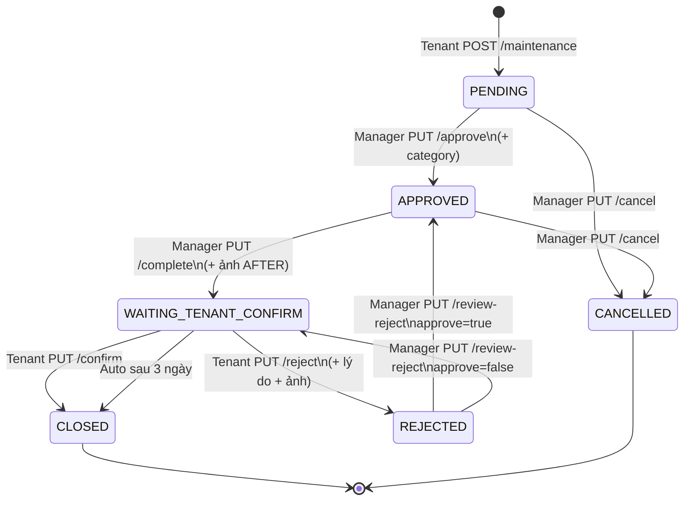
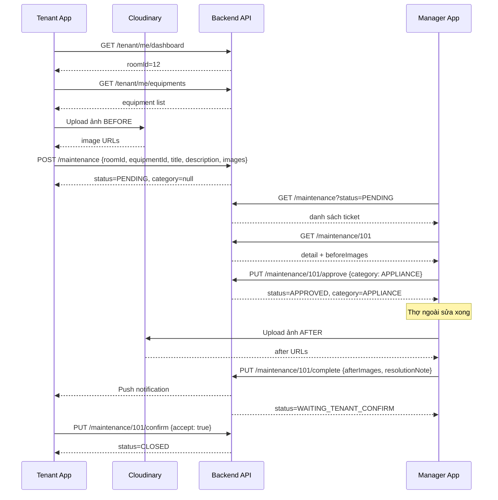

# FE Guide — Luồng Báo hỏng / Bảo trì (Maintenance)

> Tài liệu dành cho team Front-End (mobile tenant + web/manager).  
> Mô tả luồng nghiệp vụ, API, JSON request/response, và gợi ý thiết kế UI.

**Base path maintenance:** `/api/v1/maintenance`  
**Auth:** `Authorization: Bearer {JWT}` — role quyết định API nào được gọi.

---

## 1. Tóm tắt nghiệp vụ

Khách thuê (tenant) phát hiện hư hỏng → chụp ảnh hiện trạng → gửi yêu cầu.  
Operation Manager xem yêu cầu → **phân loại danh mục (`category`)** → duyệt → liên hệ thợ ngoài sửa → upload ảnh sau sửa → tenant xác nhận.

| Vai trò | Việc chính |
|---------|------------|
| **Tenant** | Tạo ticket: tiêu đề + mô tả + ảnh BEFORE. **Không** chọn category/priority. |
| **Manager** | Xem ticket → chọn **category** (bắt buộc) → duyệt → báo sửa xong (ảnh AFTER) → xử lý nếu tenant từ chối. |

> **Lưu ý:** Chi phí sửa chữa, ai trả tiền, khấu hao thiết bị **không** nằm trong luồng này. Sau khi ticket `CLOSED`, phần billing xử lý riêng — `category` trên ticket phục vụ **báo cáo / phân loại chi phí công ty**.

---

## 2. Sơ đồ luồng trạng thái



---

## 3. Phân vai JSON — Tenant gửi gì, Manager làm gì

### 3.1 Tenant tạo request

**API:** `POST /api/v1/maintenance`  
**Role:** `TENANT`

**Request body (JSON tenant gửi):**

```json
{
  "roomId": 12,
  "equipmentId": 45,
  "title": "Máy lạnh không lạnh",
  "description": "Máy lạnh phòng không lạnh, chảy nước ở góc tường",
  "images": [
    "https://res.cloudinary.com/xxx/image/upload/v1/before-1.jpg",
    "https://res.cloudinary.com/xxx/image/upload/v1/before-2.jpg"
  ]
}
```

| Field | Bắt buộc | Ghi chú |
|-------|:--------:|---------|
| `roomId` | ✅ | ID phòng tenant đang thuê |
| `title` | ✅ | Tiêu đề sự cố, tối đa **200 ký tự** — hiển thị trên list |
| `description` | ✅ | Mô tả chi tiết hiện trạng |
| `images` | ✅ | Mảng URL ảnh BEFORE (Cloudinary). **Ít nhất 1 ảnh** |
| `equipmentId` | ❌ | Có khi báo hỏng từ danh sách thiết bị / quét QR |

**Tenant KHÔNG gửi:**

- `category` — manager gán khi duyệt
- `priority` — tùy chọn, manager có thể gán khi duyệt (không bắt buộc)

**Response sau khi tạo (rút gọn):**

```json
{
  "id": 101,
  "requestCode": "M-101",
  "title": "Máy lạnh không lạnh",
  "description": "Máy lạnh phòng không lạnh, chảy nước ở góc tường",
  "status": "PENDING",
  "category": null,
  "priority": null,
  "roomId": 12,
  "roomName": "P01",
  "propertyName": "Nhà Lê Lợi 01",
  "equipmentId": 45,
  "equipmentName": "Máy lạnh Daikin 9000BTU",
  "beforeImages": ["https://.../before-1.jpg", "https://.../before-2.jpg"],
  "afterImages": [],
  "rejectImages": [],
  "createdAt": "2026-07-17T10:00:00"
}
```

---

### 3.2 Manager tiếp nhận & duyệt

**Bước 1 — Xem danh sách ticket chờ xử lý**

```http
GET /api/v1/maintenance?status=PENDING&page=0&size=20
Authorization: Bearer {managerToken}
```

Manager chỉ thấy ticket thuộc property mình quản lý.

**Bước 2 — Xem chi tiết ticket**

```http
GET /api/v1/maintenance/101
Authorization: Bearer {managerToken}
```

UI hiển thị: `title`, `description`, `beforeImages`, thông tin phòng/tenant/thiết bị.  
Lúc này `category` và `priority` vẫn **null** — manager phải chọn trước khi duyệt.

**Bước 3 — Duyệt + gán category**

**API:** `PUT /api/v1/maintenance/{id}/approve`  
**Role:** `MANAGER` | `ADMIN`

**Request body (JSON manager gửi):**

```json
{
  "category": "APPLIANCE",
  "priority": "HIGH"
}
```

| Field | Bắt buộc | Ghi chú |
|-------|:--------:|---------|
| `category` | ✅ | Phân loại sự cố — dùng cho báo cáo chi phí sau này |
| `priority` | ❌ | `LOW` \| `MEDIUM` \| `HIGH` \| `URGENT` — có thể bỏ qua |

**Giá trị `category` (dropdown manager chọn):**

| Value | Label gợi ý (UI tiếng Việt) | Ví dụ |
|-------|----------------------------|-------|
| `APPLIANCE` | Trang thiết bị | Máy lạnh, tủ lạnh, máy giặt |
| `FURNITURE` | Nội thất | Bàn, ghế, tủ quần áo |
| `STRUCTURAL` | Kết cấu / công trình | Sơn tường bong tróc, nước mưa dột |
| `ELECTRICAL` | Điện | Ổ cắm, cầu dao, đèn |
| `PLUMBING` | Nước / ống | Vòi nước, toilet, rò rỉ ống |
| `OTHER` | Khác | Các trường hợp không thuộc loại trên |

**Response sau duyệt:**

```json
{
  "id": 101,
  "status": "APPROVED",
  "category": "APPLIANCE",
  "priority": "HIGH",
  "acknowledgedAt": "2026-07-17T11:00:00"
}
```

**Lỗi thường gặp:**

- Thiếu `category` → `"Danh mục sự cố (category) là bắt buộc khi duyệt yêu cầu"`
- `category` sai giá trị → liệt kê enum hợp lệ

---

### 3.3 Manager báo sửa xong

**API:** `PUT /api/v1/maintenance/{id}/complete`  
**Role:** `MANAGER` | `ADMIN`  
**Điều kiện:** ticket đang `APPROVED`, phải có ảnh AFTER.

```json
{
  "resolutionNote": "Đã thay block máy lạnh, chạy thử OK",
  "afterImages": [
    "https://res.cloudinary.com/xxx/image/upload/v1/after-1.jpg"
  ]
}
```

→ Status: `WAITING_TENANT_CONFIRM`

---

### 3.4 Tenant xác nhận hoặc từ chối

**Xác nhận OK:**

```http
PUT /api/v1/maintenance/101/confirm
{ "accept": true }
```

→ Status: `CLOSED`

**Từ chối (chưa ổn):**

```http
PUT /api/v1/maintenance/101/reject
Content-Type: application/json

{
  "reason": "Máy vẫn không lạnh sau khi thợ đến",
  "images": ["https://.../reject-1.jpg"]
}
```

→ Status: `REJECTED` — manager xem xét qua `PUT /{id}/review-reject`.

---

## 4. API hỗ trợ — Trước khi tenant tạo ticket

Tenant thường vào form báo hỏng qua **danh sách thiết bị** hoặc **quét QR**. FE cần gọi API thật, **không dùng mock**.

### 4.1 Lấy phòng hiện tại (cho `roomId`)

```http
GET /api/v1/tenant/me/dashboard
Authorization: Bearer {tenantToken}
```

Dùng `response.room.id` làm `roomId` khi POST maintenance.

```json
{
  "room": { "id": 12, "roomNumber": "P01", "floor": 2 },
  "building": { "propertyId": 26, "name": "Nhà Lê Lợi 01", "address": "..." },
  "summary": { "maintenancePending": 1, "maintenanceInProgress": 0 }
}
```

### 4.2 Danh sách thiết bị phòng

```http
GET /api/v1/tenant/me/equipments
Authorization: Bearer {tenantToken}
```

Trả về thiết bị thuộc hợp đồng ACTIVE của tenant. Dùng `id` làm `equipmentId`, hiển thị `equipmentName`, `qrCode`.

### 4.3 Quét QR thiết bị

```http
GET /api/v1/equipments/by-qr/{qrCode}
Authorization: Bearer {tenantToken}
```

- QR trong DB có dạng `EQ-226`, `EQ-227`, …
- Response `EquipmentResponse` — lấy `id`, `equipmentName`, `roomId` để pre-fill form.

### 4.4 Upload ảnh (Cloudinary — phía FE)

BE **không** nhận file binary lúc tạo ticket. FE tự upload lên Cloudinary trước, rồi gửi **URL** trong field `images`.

```
Tenant chụp ảnh → FE upload Cloudinary → nhận URL → POST /maintenance với images: [url1, url2]
```

*(Tuỳ chọn)* Sau khi đã có `id`, có thể bổ sung ảnh qua:

```http
POST /api/v1/maintenance/{id}/photos?type=BEFORE|AFTER|REJECT
Content-Type: multipart/form-data
files: <file1>, <file2>
```

---

## 5. Bảng API đầy đủ

| # | Method | Endpoint | Role | Mục đích |
|---|--------|----------|------|----------|
| 1 | `POST` | `/api/v1/maintenance` | TENANT | Tạo yêu cầu |
| 2 | `GET` | `/api/v1/maintenance/my-requests` | TENANT | List ticket của tôi |
| 3 | `GET` | `/api/v1/maintenance/{id}` | ALL | Chi tiết ticket |
| 4 | `GET` | `/api/v1/maintenance?status=&category=&page=` | ALL | List + filter |
| 5 | `PUT` | `/api/v1/maintenance/{id}/approve` | MANAGER | Duyệt + gán category |
| 6 | `PUT` | `/api/v1/maintenance/{id}/complete` | MANAGER | Báo sửa xong |
| 7 | `PUT` | `/api/v1/maintenance/{id}/confirm` | TENANT | Xác nhận OK |
| 8 | `PUT` | `/api/v1/maintenance/{id}/reject` | TENANT | Từ chối kết quả |
| 9 | `PUT` | `/api/v1/maintenance/{id}/review-reject` | MANAGER | Xử lý sau reject |
| 10 | `PUT` | `/api/v1/maintenance/{id}/cancel?reason=` | MANAGER | Hủy ticket |
| 11 | `GET` | `/api/v1/maintenance/dashboard` | MANAGER | Thống kê |
| 12 | `GET` | `/api/v1/tenant/me/dashboard` | TENANT | Lấy roomId |
| 13 | `GET` | `/api/v1/tenant/me/equipments` | TENANT | List thiết bị |
| 14 | `GET` | `/api/v1/equipments/by-qr/{qrCode}` | TENANT | Lookup QR |

Mọi action đổi status (approve, complete, confirm, reject, …) đều trả **full** `MaintenanceRequestResponse` — FE cập nhật state từ response, không bắt buộc GET lại.

---

## 6. Response shape (`MaintenanceRequestResponse`)

Dùng chung cho create, list item, detail, và mọi action thành công.

```json
{
  "id": 101,
  "requestCode": "M-101",
  "title": "Máy lạnh không lạnh",
  "description": "...",
  "category": "APPLIANCE",
  "priority": "HIGH",
  "status": "WAITING_TENANT_CONFIRM",
  "tenantId": "uuid-...",
  "tenantName": "Nguyễn Văn A",
  "tenantPhone": "0901234567",
  "roomId": 12,
  "roomName": "P01",
  "propertyId": 26,
  "propertyName": "Nhà Lê Lợi 01",
  "equipmentId": 45,
  "equipmentName": "Máy lạnh Daikin",
  "assignedManagerName": "Trần Manager",
  "resolutionNote": "Đã thay block",
  "rejectReason": null,
  "beforeImages": ["https://..."],
  "afterImages": ["https://..."],
  "rejectImages": [],
  "createdAt": "2026-07-17T10:00:00",
  "updatedAt": "2026-07-17T14:00:00",
  "timeline": [
    {
      "oldStatus": "PENDING",
      "newStatus": "APPROVED",
      "note": "Manager duyệt yêu cầu [APPLIANCE], chờ sửa chữa bên ngoài",
      "changedByName": "Trần Manager",
      "changedAt": "2026-07-17T11:00:00"
    }
  ]
}
```

**Field quan trọng cho UI:**

| Field | Khi nào có giá trị | UI gợi ý |
|-------|-------------------|----------|
| `title` | Luôn (từ tenant) | Headline trên card list |
| `category` | Sau khi manager duyệt | Badge màu, filter |
| `priority` | Sau duyệt (nếu manager gán) | Badge phụ, có thể ẩn nếu null |
| `beforeImages` | Sau tenant tạo | Gallery trước sửa |
| `afterImages` | Sau manager complete | Gallery sau sửa |
| `rejectReason` + `rejectImages` | Sau tenant reject | Block cảnh báo trên màn manager |

---

## 7. Gợi ý UI — Tenant (Mobile)

### 7.1 Điều hướng vào form báo hỏng

```
Tab Home / Dịch vụ
  └─ Thiết bị phòng ──→ EquipmentDetailScreen ──→ [Báo hỏng]
  └─ Quét QR ──→ ScanScreen ──→ EquipmentDetailScreen ──→ [Báo hỏng]
  └─ (Tuỳ chọn) Tab Bảo trì ──→ [+ Tạo mới] ──→ MaintenanceCreateScreen
```

**Luồng demo khuyến nghị:** Thiết bị phòng → chọn thiết bị → Báo hỏng → Gửi.

### 7.2 Màn `MaintenanceCreateScreen`

```
┌─────────────────────────────────────┐
│  ← Báo hỏng thiết bị                │
├─────────────────────────────────────┤
│  ┌─ Thiết bị (read-only card) ────┐ │
│  │ 🧊 Máy lạnh Daikin 9000BTU     │ │
│  │    P01 · Nhà Lê Lợi 01         │ │
│  └────────────────────────────────┘ │
│                                     │
│  Tiêu đề sự cố *                    │
│  ┌────────────────────────────────┐ │
│  │ Máy lạnh không lạnh            │ │
│  └────────────────────────────────┘ │
│                                     │
│  Mô tả chi tiết *                   │
│  ┌────────────────────────────────┐ │
│  │ Máy chạy nhưng không mát,      │ │
│  │ chảy nước ở góc tường...       │ │
│  └────────────────────────────────┘ │
│                                     │
│  Ảnh hiện trạng * (ít nhất 1)       │
│  [📷] [img1] [img2] [+]            │
│                                     │
│         [ Gửi yêu cầu ]             │
└─────────────────────────────────────┘
```

**Logic FE:**

1. Gọi `GET /tenant/me/dashboard` → lấy `roomId`
2. Nếu vào từ thiết bị/QR → pre-fill card + `equipmentId`
3. Chụp ảnh → upload Cloudinary → thu URL
4. Submit `POST /maintenance` với JSON ở §3.1
5. Success → navigate tới detail hoặc list, hiện toast "Đã gửi yêu cầu"

**Không hiển thị:** dropdown category, priority.

### 7.3 Màn `MaintenanceListScreen` (Tenant)

```
┌─────────────────────────────────────┐
│  Yêu cầu bảo trì của tôi           │
├─────────────────────────────────────┤
│  ┌───────────────────────────────┐  │
│  │ Máy lạnh không lạnh    PENDING│  │
│  │ P01 · 17/07/2026              │  │
│  └───────────────────────────────┘  │
│  ┌───────────────────────────────┐  │
│  │ Vòi nước rò      WAITING...  │  │
│  │ P01 · 15/07/2026              │  │
│  └───────────────────────────────┘  │
└─────────────────────────────────────┘
```

API: `GET /maintenance/my-requests`

**Badge màu theo status:**

| Status | Màu gợi ý | Label |
|--------|-----------|-------|
| `PENDING` | Vàng | Chờ duyệt |
| `APPROVED` | Xanh dương | Đang sửa |
| `WAITING_TENANT_CONFIRM` | Cam | Chờ bạn xác nhận |
| `REJECTED` | Đỏ nhạt | Đang xem xét lại |
| `CLOSED` | Xám | Hoàn tất |
| `CANCELLED` | Xám đậm | Đã hủy |

### 7.4 Màn `MaintenanceDetailScreen` (Tenant)

Theo status hiển thị CTA:

| Status | CTA |
|--------|-----|
| `PENDING` / `APPROVED` | Chỉ xem (read-only) |
| `WAITING_TENANT_CONFIRM` | **[Đã OK]** → confirm · **[Chưa ổn]** → form reject |
| `CLOSED` | Xem timeline + ảnh before/after |
| `REJECTED` | "Đang chờ quản lý xem xét" |

Form reject: textarea lý do + chụp ảnh (Cloudinary) → `PUT /reject`.

---

## 8. Gợi ý UI — Manager (Web / Tablet)

### 8.1 Dashboard tổng quan

API: `GET /maintenance/dashboard`

```
┌──────────┬──────────┬──────────┬──────────┐
│ Chờ duyệt│ Đang xử lý│ Hoàn tất │ Đã hủy  │
│    5     │    12    │    48    │    2     │
└──────────┴──────────┴──────────┴──────────┘
```

Click "Chờ duyệt" → filter list `status=PENDING`.

### 8.2 Màn list ticket

API: `GET /maintenance?status=PENDING&page=0&size=20`

```
┌──────────────────────────────────────────────────────────────┐
│ Bảo trì   [Filter: Status ▼] [Category ▼] [Phòng ▼]         │
├──────────────────────────────────────────────────────────────┤
│ M-101  Máy lạnh không lạnh          P01  Nguyễn Văn A  PENDING│
│ M-102  Vòi nước rò rỉ               P02  Trần Thị B     PENDING│
└──────────────────────────────────────────────────────────────┘
```

- Cột chính: `requestCode`, `title`, `roomName`, `tenantName`, `status`
- Ticket `PENDING`: **chưa có** badge category (vì chưa duyệt)

### 8.3 Màn chi tiết + duyệt (`PENDING`)

```
┌─────────────────────────────────────────────────────────────┐
│ M-101 · PENDING                                             │
├─────────────────────────────────────────────────────────────┤
│ Tiêu đề:    Máy lạnh không lạnh                             │
│ Mô tả:      Máy lạnh phòng không lạnh, chảy nước...         │
│ Phòng:      P01 · Nhà Lê Lợi 01                             │
│ Khách:      Nguyễn Văn A · 0901234567                       │
│ Thiết bị:   Máy lạnh Daikin (EQ-226)                        │
│                                                             │
│ Ảnh hiện trạng:  [img1] [img2] [img3]                       │
│                                                             │
│ ── Phân loại (bắt buộc khi duyệt) ──                        │
│ Danh mục *   [ Trang thiết bị (APPLIANCE)  ▼ ]             │
│ Ưu tiên      [ — Không chọn —               ▼ ]  (tuỳ chọn)│
│                                                             │
│              [ Hủy ticket ]    [ Duyệt yêu cầu ]            │
└─────────────────────────────────────────────────────────────┘
```

**Khi bấm "Duyệt":**

```json
PUT /api/v1/maintenance/101/approve
{ "category": "APPLIANCE" }
```

Mở modal/dropdown chọn category **trước** khi gọi API. Disable nút Duyệt nếu chưa chọn category.

### 8.4 Màn xử lý sau sửa (`APPROVED`)

```
┌─────────────────────────────────────────────────────────────┐
│ M-101 · APPROVED · APPLIANCE                                │
├─────────────────────────────────────────────────────────────┤
│ Ảnh trước sửa:  [img1] [img2]                               │
│                                                             │
│ Ghi chú sau sửa                                             │
│ ┌─────────────────────────────────────────────────────────┐ │
│ │ Đã thay block máy lạnh, chạy thử OK                    │ │
│ └─────────────────────────────────────────────────────────┘ │
│ Ảnh sau sửa *   [📷 upload] [img-after-1]                   │
│                                                             │
│              [ Hủy ]              [ Báo sửa xong ]          │
└─────────────────────────────────────────────────────────────┘
```

Upload ảnh AFTER (Cloudinary hoặc multipart) → `PUT /complete`.

### 8.5 Xử lý tenant reject (`REJECTED`)

Hiển thị block nổi bật:

- `rejectReason`
- `rejectImages`
- 2 nút:
  - **Cho sửa lại** → `PUT /review-reject` `{ "approve": true }` → quay `APPROVED`
  - **Giữ kết quả** → `{ "approve": false }` → quay `WAITING_TENANT_CONFIRM`

---

## 9. Ma trận CTA theo status

| Status | Tenant thấy | Manager thấy |
|--------|---------------|--------------|
| `PENDING` | Chờ duyệt (read-only) | Chọn category → **Duyệt** / **Hủy** |
| `APPROVED` | Đang sửa (read-only) | Upload AFTER → **Báo sửa xong** / **Hủy** |
| `WAITING_TENANT_CONFIRM` | **Xác nhận** / **Từ chối** | Chờ tenant (~3 ngày auto-close) |
| `REJECTED` | Chờ xem xét | **Sửa lại** / **Giữ kết quả** |
| `CLOSED` | Xem lại | Xem lại |
| `CANCELLED` | Xem lại | Xem lại |

---

## 10. Checklist tích hợp FE

### Tenant app

- [ ] `GET /tenant/me/dashboard` lấy `roomId`
- [ ] `GET /tenant/me/equipments` thay mock danh sách thiết bị
- [ ] `GET /equipments/by-qr/{qrCode}` thay mock QR lookup
- [ ] Upload ảnh Cloudinary trước khi POST
- [ ] Form: title + description + images (không category/priority)
- [ ] `GET /maintenance/my-requests` cho list
- [ ] `GET /maintenance/{id}` cho detail
- [ ] `PUT /confirm` và `PUT /reject` khi `WAITING_TENANT_CONFIRM`

### Manager app

- [ ] `GET /maintenance/dashboard` cho thống kê
- [ ] `GET /maintenance?status=PENDING` cho hàng chờ
- [ ] Modal chọn **category** trước `PUT /approve`
- [ ] Upload AFTER + `PUT /complete`
- [ ] Xử lý reject qua `PUT /review-reject`
- [ ] Hiển thị badge `category` sau khi duyệt (dùng cho filter list)

---

## 11. Lỗi BE thường gặp (hiển thị cho user)

| Message BE | Nguyên nhân | FE xử lý |
|------------|-------------|----------|
| `Tiêu đề sự cố là bắt buộc` | Thiếu/blank title | Validate form |
| `Tiêu đề sự cố không được vượt quá 200 ký tự` | Title quá dài | Counter 200 ký tự |
| `Mô tả hiện trạng là bắt buộc` | Thiếu description | Validate form |
| `Bắt buộc đính kèm ảnh hiện trạng` | `images` rỗng | Bắt chụp ≥1 ảnh |
| `Danh mục sự cố (category) là bắt buộc khi duyệt` | Manager duyệt không chọn category | Disable nút Duyệt |
| `Bắt buộc phải có ảnh sau sửa chữa (AFTER)` | Complete không có AFTER | Bắt upload ảnh |

---

## 12. Phụ lục — Sequence diagram end-to-end



---

*Tài liệu cập nhật: 2026-07-17 — đồng bộ với BE hiện tại.*
