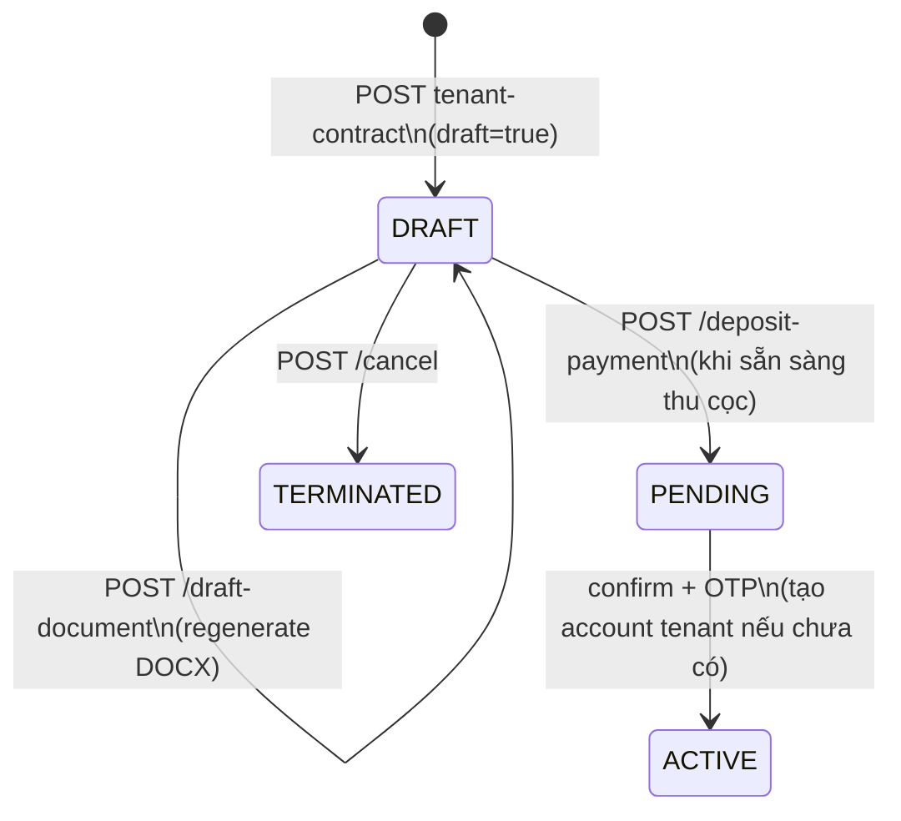
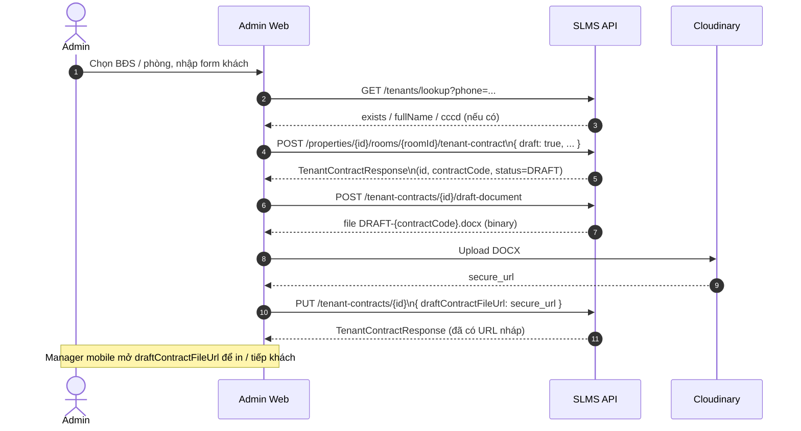

# Hợp đồng nháp (DRAFT) — Hướng dẫn triển khai FE

Tài liệu mô tả luồng **Admin/Manager nhập tay thông tin khách → tạo HĐ nháp → BE fill template Word → FE lưu file lên Cloudinary**.

**Tham chiếu:** [`FE-BE-tenant-onboarding-flow.md`](./FE-BE-tenant-onboarding-flow.md) · [`tenant-contract-template-spec.md`](./tenant-contract-template-spec.md)

---

## 1. Phân công trách nhiệm

| Thành phần | Việc làm |
|------------|----------|
| **FE (Admin Web)** | Form nhập khách + giá + ngày; gọi API tạo DRAFT; gọi API xuất DOCX; upload Cloudinary; lưu `draftContractFileUrl` |
| **BE** | Lưu `TenantContract` status `DRAFT`; đọc template DOCX; điền placeholder từ DB; trả file `.docx` (byte[]) |
| **FE (Manager Mobile)** | Xem HĐ nháp qua `draftContractFileUrl`; tiếp tục luồng thu cọc / confirm (khi chuyển `DRAFT` → `PENDING`) |

> **Lưu ý:** File nháp **không** lưu trên disk BE. Chỉ HĐ chính thức (sau thanh toán cọc / ACTIVE) mới dùng `POST .../document` và `documentUrl` trên server.

---

## 2. State machine (phần nháp)



| Trạng thái | Ý nghĩa |
|------------|---------|
| `DRAFT` | Admin đã nhập thông tin; **chưa** tạo User/Tenant; **chưa** set phòng `RENTED` |
| `PENDING` | Chờ thanh toán cọc (sau `deposit-payment`) |
| `ACTIVE` | HĐ chính thức; có `documentUrl` từ BE (khác `draftContractFileUrl`) |

---

## 3. Luồng FE đề xuất (Admin Web)



### Checklist màn hình Admin

1. Chọn căn / phòng (`GET /properties/rentable`, `GET /properties/{id}/rooms`)
2. Form khách: `fullName`, `cccd`, `phoneNumber` (+ lookup SĐT)
3. Form HĐ: `rentAmount`, `deposit`, `depositMonths`, `moveInDate`, `endDate`, chỉ số điện nước, ảnh bàn giao, `householdMembers`
4. Tuỳ chọn: `assignedManagerId`, `expectedReceptionDate`
5. **Bật `draft: true`** khi submit
6. Sau khi tạo thành công → gọi `POST /draft-document` → upload Cloudinary → `PUT` lưu URL
7. Hiển thị link xem trước từ `draftContractFileUrl`

---

## 4. Bảng API

| Bước | Method | Endpoint | Ghi chú |
|------|--------|----------|---------|
| Tra khách | GET | `/api/v1/tenants/lookup?phone=` | Tự điền form nếu `exists=true` |
| Tạo HĐ nháp (phòng) | POST | `/api/v1/properties/{propertyId}/rooms/{roomId}/tenant-contract` | Body `draft: true` |
| Tạo HĐ nháp (nguyên căn) | POST | `/api/v1/properties/{propertyId}/tenant-contract` | Body `draft: true` |
| **Xuất DOCX nháp** | POST | `/api/v1/tenant-contracts/{id}/draft-document` | Trả file binary |
| Cập nhật nháp | PUT | `/api/v1/tenant-contracts/{id}` | Sau sửa form hoặc sau upload Cloudinary |
| Chi tiết HĐ | GET | `/api/v1/tenant-contracts/{id}` | Đọc `draftContractFileUrl` |
| Danh sách nháp | GET | `/api/v1/tenant-contracts?status=DRAFT` | |
| Gán manager | PATCH | `/api/v1/tenant-contracts/{id}/assign-manager` | |
| Hủy nháp | POST | `/api/v1/tenant-contracts/{id}/cancel` | |

**Phân quyền:** Các API trên yêu cầu `ROLE_ADMIN` hoặc `ROLE_MANAGER` (JWT Bearer).

---

## 5. Request / Response

### 5.1. Tạo HĐ nháp — `POST .../tenant-contract`

```json
{
  "fullName": "Nguyễn Văn A",
  "cccd": "001234567890",
  "phoneNumber": "0901234567",
  "moveInDate": "2026-07-15",
  "endDate": "2027-07-15",
  "rentAmount": 8000000,
  "deposit": 16000000,
  "depositMonths": 2,
  "equipmentSnapshot": "Giường, tủ, điều hòa 1HP",
  "initialElectricReading": 1234.5,
  "initialWaterReading": 56.0,
  "electricMeterImageUrl": "https://res.cloudinary.com/.../electric.jpg",
  "waterMeterImageUrl": "https://res.cloudinary.com/.../water.jpg",
  "roomConditionUrls": ["https://res.cloudinary.com/.../room1.jpg"],
  "roomConditionNote": "Tường sơn mới",
  "householdMembers": [
    {
      "fullName": "Nguyễn Thị B",
      "relation": "Vợ",
      "cccd": "001234567891",
      "phone": "0909876543",
      "dateOfBirth": "1995-03-20"
    }
  ],
  "draft": true,
  "assignedManagerId": "uuid-manager",
  "expectedReceptionDate": "2026-07-15"
}
```

| Field | Bắt buộc (draft) | Ghi chú |
|-------|------------------|---------|
| `draft` | ✓ (`true`) | Khác luồng `PENDING` / `ACTIVE` thường |
| `fullName`, `cccd`, `phoneNumber` | ✓ | Lưu tạm `draftTenant*` — **chưa** tạo account |
| `moveInDate`, `endDate`, `rentAmount`, `deposit` | ✓ | |
| `requireDepositPayment` | | **Bỏ qua** khi `draft=true` |
| `draftContractFileUrl` | | Thường gán ở bước PUT sau upload Cloudinary |

**Khác biệt so với luồng thường:**

- `draft=true` → **không** validate `moveInDate` phải là hôm nay
- **Không** gọi `getOrCreateTenant()` — chưa có `tenantUserId` trong response
- `status = DRAFT`, phòng **không** chuyển `RENTED`

**Response (rút gọn):**

```json
{
  "id": 42,
  "contractCode": "TC-2026-00042",
  "status": "DRAFT",
  "tenantFullName": "Nguyễn Văn A",
  "tenantPhone": "0901234567",
  "tenantCccd": "001234567890",
  "tenantUserId": null,
  "draftContractFileUrl": null,
  "expectedReceptionDate": "2026-07-15",
  "assignedManagerId": "uuid-manager",
  "propertyName": "Sunrise Tower",
  "roomNumber": "101"
}
```

### 5.2. Xuất DOCX nháp — `POST /tenant-contracts/{id}/draft-document`

| | |
|--|--|
| **Điều kiện** | `status === "DRAFT"` |
| **Response** | `200` + body binary |
| **Content-Type** | `application/vnd.openxmlformats-officedocument.wordprocessingml.document` |
| **Content-Disposition** | `attachment; filename="DRAFT-{contractCode}.docx"` |

**Ví dụ gọi (fetch):**

```typescript
async function downloadDraftContract(contractId: number, token: string) {
  const res = await fetch(`/api/v1/tenant-contracts/${contractId}/draft-document`, {
    method: "POST",
    headers: { Authorization: `Bearer ${token}` },
  });
  if (!res.ok) throw new Error(await res.text());
  const blob = await res.blob();
  const code = res.headers.get("Content-Disposition")?.match(/DRAFT-(.+)\.docx/)?.[1]
    ?? `contract-${contractId}`;
  return new File([blob], `DRAFT-${code}.docx`, {
    type: "application/vnd.openxmlformats-officedocument.wordprocessingml.document",
  });
}
```

**Lỗi thường gặp:**

| HTTP | Message BE | FE xử lý |
|------|------------|----------|
| 400 | `Chỉ xuất file nháp khi hợp đồng đang ở trạng thái DRAFT` | Chỉ hiện nút "Xuất nháp" khi `status=DRAFT` |
| 404 | Không tìm thấy hợp đồng | Redirect / toast lỗi |

### 5.3. Upload Cloudinary + lưu URL — `PUT /tenant-contracts/{id}`

Sau khi có `File` / `Blob` từ bước 5.2:

```typescript
// 1. Upload lên Cloudinary (unsigned preset hoặc signed — theo cấu hình project)
const formData = new FormData();
formData.append("file", docxFile);
formData.append("upload_preset", CLOUDINARY_PRESET);
formData.append("folder", `contracts/draft/${contractCode}`);

const uploadRes = await fetch(`https://api.cloudinary.com/v1_1/${CLOUD_NAME}/auto/upload`, {
  method: "POST",
  body: formData,
});
const { secure_url } = await uploadRes.json();

// 2. Lưu URL vào BE
await fetch(`/api/v1/tenant-contracts/${contractId}`, {
  method: "PUT",
  headers: {
    Authorization: `Bearer ${token}`,
    "Content-Type": "application/json",
  },
  body: JSON.stringify({ draftContractFileUrl: secure_url }),
});
```

> Cloudinary hỗ trợ `raw` upload cho `.docx`. Dùng `resource_type: "raw"` nếu preset yêu cầu.

**Khi nào gọi lại `POST /draft-document`?**

- Sau `PUT` cập nhật `fullName`, giá, ngày, thành viên ở cùng…
- Luôn upload lại Cloudinary + `PUT` `draftContractFileUrl` mới (hoặc version mới trên Cloudinary)

### 5.4. Cập nhật HĐ nháp — `PUT /tenant-contracts/{id}`

Body partial — chỉ gửi field thay đổi:

```json
{
  "fullName": "Nguyễn Văn A (sửa)",
  "rentAmount": 8500000,
  "deposit": 17000000,
  "draftContractFileUrl": "https://res.cloudinary.com/.../DRAFT-TC-2026-00042.docx"
}
```

Chỉ chấp nhận khi `status = DRAFT`.

---

## 6. Dữ liệu BE điền vào template

Template: `tenant-apartment-draft-template.docx` (HỢP ĐỒNG THUÊ CĂN HỘ).

| Placeholder | Nguồn dữ liệu |
|-------------|----------------|
| `contractCode` | `TenantContract.contractCode` |
| `signPlace` | Config `app.contract.lessor.signPlace` (mặc định `TP. HCM`) |
| `signDay`, `signMonth`, `signYear` | `expectedReceptionDate` hoặc ngày hiện tại |
| `tenantFullName` | `draftTenantName` (DRAFT) hoặc `User.fullName` |
| `tenantCccd` | `draftTenantCccd` hoặc `Tenant.cccd` |
| `tenantPhone` | `draftTenantPhone` hoặc `User.phoneNumber` |
| `tenantAddress` | *(trống — chưa có field form)* |
| `householdMembers` | Danh sách text nhiều dòng từ `householdMembers` |
| `rentalUnit` | `{propertyName} - Phòng {roomNumber} ({address})` |
| `areaSize` | `Property.areaSize` |
| `leaseDurationMonths` | Tính từ `startDate` → `endDate` |
| `startDate`, `endDate`, `moveInDate` | `TenantContract` |
| `rentAmount`, `rentAmountInWords` | `rentAmount` + format VNĐ / chữ |
| `deposit`, `depositInWords` | `deposit` |
| `equipmentSnapshot` | `equipmentSnapshot` |

**Không do BE điền (hard-code trong Word):** thông tin **Bên A** (chủ nhà), STK ngân hàng, điều khoản cố định Điều 6–9.

---

## 7. Phân biệt file nháp vs file chính thức

| | HĐ nháp (DRAFT) | HĐ chính thức |
|--|-----------------|---------------|
| API xuất | `POST .../draft-document` | `POST .../document` |
| BE lưu file | **Không** | Có (`documentUrl` trên server) |
| FE lưu file | **Cloudinary** → `draftContractFileUrl` | Có thể dùng `documentUrl` từ BE |
| Điều kiện | `status = DRAFT` | `paymentStatus = PAID` hoặc `status = ACTIVE` |
| Template | `tenant-apartment-draft-template.docx` | `tenant-rental-template.docx` |

---

## 8. Chuyển tiếp sang luồng tiếp khách

Khi Manager sẵn sàng thu cọc:

1. `POST /api/v1/tenant-contracts/{id}/deposit-payment`
   - BE tự chuyển `DRAFT` → `PENDING` (nếu đang DRAFT)
2. Khách thanh toán PayOS → `paymentStatus = PAID`
3. `POST /send-otp` → `POST /confirm` → `ACTIVE`, tạo account tenant từ `draftTenant*`
4. File chính thức: `POST .../document` hoặc `documentUrl` auto sau confirm

Chi tiết PayOS / OTP: [`FE-BE-tenant-onboarding-flow.md`](./FE-BE-tenant-onboarding-flow.md) §5–7.

---

## 9. Gợi ý UI/UX

| Tình huống | Gợi ý |
|------------|-------|
| Sau tạo DRAFT | Tự động gọi `draft-document` + upload (loading overlay) |
| Sửa form nháp | Nút "Cập nhật & tạo lại file" → PUT → `draft-document` → Cloudinary → PUT URL |
| Xem file | Mở `draftContractFileUrl` tab mới / iframe (Cloudinary raw URL) |
| `draftContractFileUrl` null | Hiện "Chưa có file — bấm Tạo hợp đồng nháp" |
| Chuyển sang thu cọc | Confirm dialog; sau đó ẩn nút sửa nháp |

---

## 10. Tham chiếu code BE

| File | Vai trò |
|------|---------|
| `TenantContractController` | `POST .../tenant-contract` (tạo DRAFT) |
| `TenantContractActionController` | `POST .../draft-document`, `PUT .../{id}` |
| `TenantOnboardingServiceImpl` | Logic `draft=true`, `updateDraftContract` |
| `TenantContractDocumentServiceImpl` | `renderDraftDocument()`, `buildVariables()` |
| `ApartmentDraftTemplateBuilder` | Build template từ `docs/Template_contract (1).docx` |
| `DocxTemplateRenderer` | Thay `${placeholder}` trong DOCX |

**Test:** `ContractDraftTemplateBuilderTest` — verify build template + render không sót placeholder.
