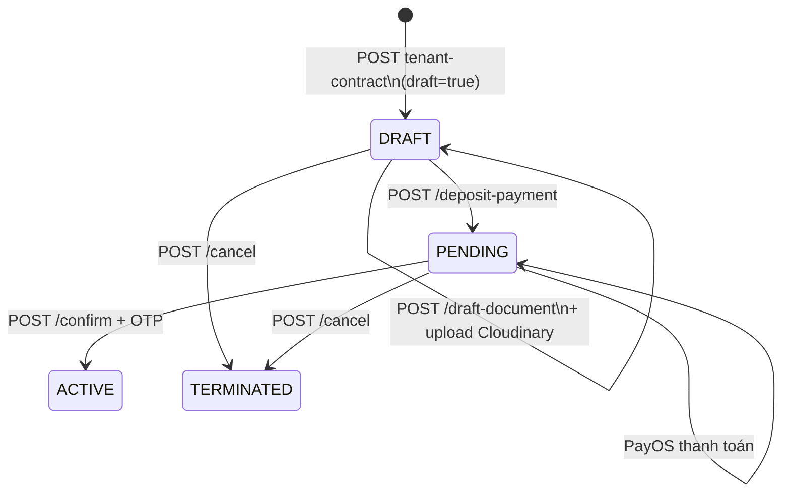
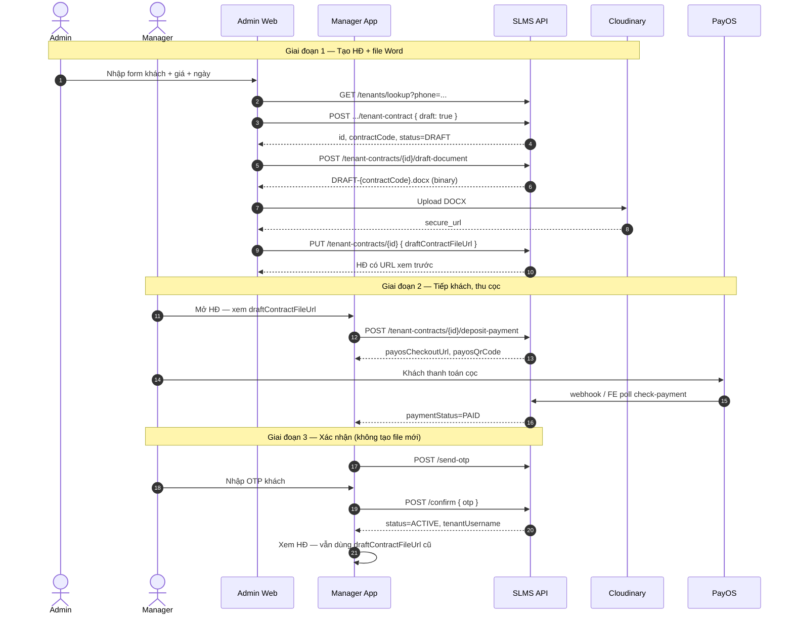

# Hợp đồng thuê căn hộ — Hướng dẫn triển khai FE

Tài liệu **chính thức cho FE** mô tả luồng onboarding khách: Admin tạo HĐ nháp → BE render DOCX → FE lưu Cloudinary → Manager tiếp khách → thanh toán cọc → xác nhận OTP → `ACTIVE`.

**Cập nhật:** 2026-07-09 — thống nhất **một template duy nhất**, file HĐ **không lưu trên disk BE**, sau ký kết **chỉ đổi status** (không render file mới).

**Tham chiếu thêm:** [`FE-BE-tenant-onboarding-flow.md`](./FE-BE-tenant-onboarding-flow.md) (PayOS webhook, OTP, duyệt giá Host)

---

## 1. Nguyên tắc cốt lõi (đọc trước khi code)

| # | Quy tắc |
|---|---------|
| 1 | **Một template Word duy nhất:** `tenant-apartment-draft-template.docx` (classpath BE) |
| 2 | **BE chỉ render file** khi gọi `POST .../draft-document` và `status = DRAFT` |
| 3 | **FE chịu trách nhiệm lưu file** — upload Cloudinary → `PUT draftContractFileUrl` |
| 4 | **Xem lại HĐ** ở mọi giai đoạn (DRAFT / PENDING / ACTIVE) qua **cùng một URL** Cloudinary |
| 5 | **Sau thanh toán cọc + confirm OTP** → BE chỉ set `status = ACTIVE` — **không** tạo file DOCX mới |
| 6 | `documentUrl` trong API response = `draftContractFileUrl` (BE map sẵn để FE dùng một field) |

```
┌─────────────────────────────────────────────────────────────────┐
│  Template (BE classpath)                                        │
│  tenant-apartment-draft-template.docx  +  ${placeholder}        │
└───────────────────────────┬─────────────────────────────────────┘
                            │ POST /draft-document (chỉ DRAFT)
                            ▼
┌─────────────────────────────────────────────────────────────────┐
│  FE nhận byte[] .docx  →  upload Cloudinary  →  PUT URL vào DB  │
│  draft_contract_file_url                                        │
└───────────────────────────┬─────────────────────────────────────┘
                            │ Xem lại / in / gửi khách
                            ▼
              draftContractFileUrl  (= documentUrl trong API)
                            │
         DRAFT ──► PENDING ──► ACTIVE  (cùng file, không đổi URL)
```

---

## 2. Phân công trách nhiệm

| Thành phần | Việc làm |
|------------|----------|
| **FE Admin Web** | Form khách + HĐ; `draft: true`; gọi `draft-document`; upload Cloudinary; `PUT draftContractFileUrl` |
| **BE** | Lưu `TenantContract`; render DOCX từ template; trả binary; lưu URL do FE gửi lên |
| **FE Manager Mobile** | Xem HĐ qua URL; thu cọc PayOS; OTP confirm; **không** chờ file mới sau ACTIVE |

> **BE không lưu file HĐ mới trên disk.** `POST /document` và `GET /document` chỉ **trả metadata + URL** đã có (ưu tiên `draftContractFileUrl`).

---

## 3. State machine



| Trạng thái | Ý nghĩa | File HĐ |
|------------|---------|---------|
| `DRAFT` | Admin nhập tay; **chưa** tạo User/Tenant; phòng **chưa** `RENTED` | Tạo qua `draft-document` + Cloudinary |
| `PENDING` | Chờ thanh toán cọc | **Cùng** `draftContractFileUrl` |
| `ACTIVE` | Đã ký / xác nhận; tạo account tenant nếu cần | **Cùng** `draftContractFileUrl` — không có file mới |

| `paymentStatus` | Ý nghĩa |
|-----------------|---------|
| `PENDING` | Chưa thanh toán cọc |
| `PAID` | Đã thanh toán — có thể gọi `send-otp` → `confirm` |

---

## 4. Luồng end-to-end



---

## 5. Bảng API

### 5.1. Hợp đồng & file

| Bước | Method | Endpoint | Ghi chú |
|------|--------|----------|---------|
| Tra khách | GET | `/api/v1/tenants/lookup?phone=` | Tự điền form |
| Tạo HĐ nháp (phòng) | POST | `/api/v1/properties/{propertyId}/rooms/{roomId}/tenant-contract` | `draft: true` |
| Tạo HĐ nháp (nguyên căn) | POST | `/api/v1/properties/{propertyId}/tenant-contract` | `draft: true` |
| **Render DOCX** | POST | `/api/v1/tenant-contracts/{id}/draft-document` | Chỉ `status=DRAFT`; trả binary |
| Cập nhật HĐ | PUT | `/api/v1/tenant-contracts/{id}` | Partial body; chỉ `DRAFT` |
| Chi tiết HĐ | GET | `/api/v1/tenant-contracts/{id}` | Có `draftContractFileUrl`, `documentUrl` |
| Danh sách HĐ | GET | `/api/v1/tenant-contracts?status=DRAFT` | |
| **Xem URL file** | GET | `/api/v1/tenant-contracts/{id}/document` | Metadata JSON |
| **View / tải file DOCX** | GET | `/api/v1/tenant-contracts/{id}/document/download` | Binary — nút View Contract |
| Gán manager | PATCH | `/api/v1/tenant-contracts/{id}/assign-manager` | |
| Hủy | POST | `/api/v1/tenant-contracts/{id}/cancel` | |

### 5.2. Thanh toán & kích hoạt

| Bước | Method | Endpoint |
|------|--------|----------|
| Tạo link cọc | POST | `/api/v1/tenant-contracts/{id}/deposit-payment` |
| Kiểm tra thanh toán | POST | `/api/v1/tenant-contracts/{id}/check-payment` |
| Gửi OTP | POST | `/api/v1/tenant-contracts/{id}/send-otp` |
| Xác nhận HĐ | POST | `/api/v1/tenant-contracts/{id}/confirm` |

**Phân quyền:** `ROLE_ADMIN` / `ROLE_MANAGER` (JWT Bearer), trừ webhook PayOS.

### 5.3. API không dùng để tạo file mới

| API | Hành vi hiện tại | FE nên |
|-----|------------------|--------|
| `POST .../document` | Trả URL file **đã có** (giống GET) | **Không** dùng để “xuất HĐ mới”. Dùng `GET .../document` hoặc đọc `documentUrl` từ `GET /{id}` |

---

## 6. Request / Response chi tiết

### 6.1. Tạo HĐ — `POST .../tenant-contract`

```json
{
  "fullName": "Nguyễn Văn A",
  "cccd": "001234567890",
  "phoneNumber": "0901234567",
  "dateOfBirth": "1990-01-01",
  "moveInDate": "2026-07-15",
  "endDate": "2027-07-15",
  "rentAmount": 8000000,
  "deposit": 16000000,
  "depositMonths": 2,
  "equipmentSnapshot": "Giường, tủ, điều hòa 1HP",
  "initialElectricReading": 1234.5,
  "initialWaterReading": 56.0,
  "electricMeterImageUrl": "https://res.cloudinary.com/.../electric.jpg",
  "waterMeterImageUrl": "https://res.cloudinary.com/.../water.jpg",
  "roomConditionUrls": ["https://res.cloudinary.com/.../room1.jpg"],
  "roomConditionNote": "Tường sơn mới",
  "householdMembers": [
    {
      "fullName": "Nguyễn Thị B",
      "relation": "Vợ",
      "cccd": "001234567891",
      "phone": "0909876543",
      "dateOfBirth": "1995-03-20"
    }
  ],
  "draft": true,
  "assignedManagerId": "uuid-manager",
  "expectedReceptionDate": "2026-07-15"
}
```

| Field | Bắt buộc (draft) | Ghi chú |
|-------|------------------|---------|
| `draft` | ✓ `true` | Bắt buộc cho luồng này |
| `fullName`, `cccd`, `phoneNumber` | ✓ | Lưu `draftTenant*` — chưa tạo account |
| `moveInDate`, `endDate`, `rentAmount`, `deposit` | ✓ | |
| `requireDepositPayment` | | **Bỏ qua** khi `draft=true` |

**Response (rút gọn):**

```json
{
  "id": 42,
  "contractCode": "TC-2026-00042",
  "status": "DRAFT",
  "paymentStatus": "PENDING",
  "tenantFullName": "Nguyễn Văn A",
  "tenantPhone": "0901234567",
  "tenantCccd": "001234567890",
  "tenantUserId": null,
  "draftContractFileUrl": null,
  "documentUrl": null,
  "propertyName": "Sunrise Tower",
  "roomNumber": "101"
}
```

### 6.2. Render DOCX — `POST /tenant-contracts/{id}/draft-document`

| | |
|--|--|
| **Điều kiện** | `status === "DRAFT"` |
| **Template BE** | `templates/contract/tenant-apartment-draft-template.docx` |
| **Response** | `200` + body binary |
| **Content-Type** | `application/vnd.openxmlformats-officedocument.wordprocessingml.document` |
| **Content-Disposition** | `attachment; filename="DRAFT-{contractCode}.docx"` |

```typescript
async function downloadDraftContract(contractId: number, token: string): Promise<File> {
  const res = await fetch(`/api/v1/tenant-contracts/${contractId}/draft-document`, {
    method: "POST",
    headers: { Authorization: `Bearer ${token}` },
  });
  if (!res.ok) throw new Error(await res.text());
  const blob = await res.blob();
  const code =
    res.headers.get("Content-Disposition")?.match(/DRAFT-(.+)\.docx/)?.[1] ??
    `contract-${contractId}`;
  return new File([blob], `DRAFT-${code}.docx`, {
    type: "application/vnd.openxmlformats-officedocument.wordprocessingml.document",
  });
}
```

| HTTP | Message BE | FE xử lý |
|------|------------|----------|
| 422 | `Chỉ xuất file nháp khi hợp đồng đang ở trạng thái DRAFT` | Ẩn nút render khi không còn DRAFT |
| 404 | Không tìm thấy hợp đồng | Toast + redirect |

### 6.3. Upload Cloudinary + lưu URL

```typescript
async function saveContractFile(
  contractId: number,
  contractCode: string,
  docxFile: File,
  token: string,
): Promise<string> {
  const formData = new FormData();
  formData.append("file", docxFile);
  formData.append("upload_preset", CLOUDINARY_PRESET);
  formData.append("folder", `contracts/draft/${contractCode}`);

  const uploadRes = await fetch(
    `https://api.cloudinary.com/v1_1/${CLOUD_NAME}/raw/upload`,
    { method: "POST", body: formData },
  );
  if (!uploadRes.ok) throw new Error("Upload Cloudinary thất bại");
  const { secure_url } = await uploadRes.json();

  const putRes = await fetch(`/api/v1/tenant-contracts/${contractId}`, {
    method: "PUT",
    headers: {
      Authorization: `Bearer ${token}`,
      "Content-Type": "application/json",
    },
    body: JSON.stringify({ draftContractFileUrl: secure_url }),
  });
  if (!putRes.ok) throw new Error(await putRes.text());
  return secure_url;
}
```

> Dùng `resource_type: raw` cho `.docx`. Tên file gợi ý: `DRAFT-{contractCode}.docx`.

### 6.4. Luồng tạo HĐ hoàn chỉnh (Admin Web)

```typescript
async function createDraftContractWithFile(form: OnboardForm, token: string) {
  // 1. Tạo HĐ DRAFT
  const createRes = await fetch(
    `/api/v1/properties/${form.propertyId}/rooms/${form.roomId}/tenant-contract`,
    {
      method: "POST",
      headers: { Authorization: `Bearer ${token}`, "Content-Type": "application/json" },
      body: JSON.stringify({ ...form, draft: true }),
    },
  );
  const contract = await createRes.json();

  // 2. Render DOCX
  const docxFile = await downloadDraftContract(contract.id, token);

  // 3. Upload + lưu URL
  const fileUrl = await saveContractFile(contract.id, contract.contractCode, docxFile, token);

  return { ...contract, draftContractFileUrl: fileUrl, documentUrl: fileUrl };
}
```

### 6.5. Cập nhật HĐ — `PUT /tenant-contracts/{id}`

Chỉ khi `status = DRAFT`. Gửi partial body:

```json
{
  "fullName": "Nguyễn Văn A (sửa)",
  "rentAmount": 8500000,
  "draftContractFileUrl": "https://res.cloudinary.com/.../DRAFT-TC-2026-00042.docx"
}
```

**Sau khi sửa thông tin quan trọng** (tên, giá, ngày, thành viên…):

1. `PUT` cập nhật DB
2. `POST /draft-document` (vẫn DRAFT)
3. Upload Cloudinary lại
4. `PUT` `draftContractFileUrl` mới

### 6.6. Xem lại file HĐ (nút **View Contract**)

**Khuyên dùng:** `GET /tenant-contracts/{id}/document/download` — BE proxy file qua JWT (ổn trên Web + Mobile).

```typescript
async function viewContract(contractId: number, contractCode: string, token: string) {
  const res = await fetch(`/api/v1/tenant-contracts/${contractId}/document/download`, {
    headers: { Authorization: `Bearer ${token}` },
  });
  if (!res.ok) throw new Error(await res.text());
  const blob = await res.blob();
  const objectUrl = URL.createObjectURL(blob);

  // Web: mở tab mới (trình duyệt có thể tải .docx hoặc mở app Office)
  window.open(objectUrl, "_blank");

  // Mobile (Expo): Sharing.shareAsync(localUri) sau khi ghi FileSystem
}
```

| Cách | API | Khi nào dùng |
|------|-----|--------------|
| **Tải/xem file (khuyên dùng)** | `GET .../document/download` | Nút View Contract — có JWT, không phụ thuộc CORS Cloudinary |
| Lấy URL metadata | `GET .../document` | Chỉ cần link, embed iframe |
| Từ chi tiết HĐ | `GET .../{id}` | Đọc `contractFileAvailable`, `documentUrl` |

**Bật nút View Contract khi:**

```typescript
const canView = contract.contractFileAvailable === true;
// hoặc: !!(contract.draftContractFileUrl ?? contract.documentUrl)
```

| Trường hợp | Cách xem |
|------------|----------|
| Đã upload Cloudinary | `GET .../document/download` |
| Chưa có URL | Ẩn nút / hiện "Chưa có file — tạo hợp đồng" |
| `status != DRAFT` | Vẫn xem được — **cùng file** đã lưu từ bước Admin |

**Lỗi khi chưa có file (422):**

```
Hợp đồng chưa có file — gọi POST .../draft-document, upload Cloudinary, rồi PUT draftContractFileUrl
```

> **Lưu ý:** `.docx` thường không preview inline trong browser như PDF — user có thể cần tải về hoặc mở bằng Word/WPS. Trên mobile dùng share sheet.

---

## 7. Giai đoạn Manager (sau DRAFT)

### 7.1. Thu cọc

```typescript
// POST /deposit-payment — BE tự DRAFT → PENDING nếu đang DRAFT
const res = await fetch(`/api/v1/tenant-contracts/${id}/deposit-payment`, {
  method: "POST",
  headers: { Authorization: `Bearer ${token}` },
});
const { payosCheckoutUrl, payosQrCode, paymentStatus } = await res.json();
```

### 7.2. Poll thanh toán

```typescript
async function waitUntilPaid(contractId: number, token: string, maxAttempts = 30) {
  for (let i = 0; i < maxAttempts; i++) {
    const res = await fetch(`/api/v1/tenant-contracts/${contractId}`, {
      headers: { Authorization: `Bearer ${token}` },
    });
    const contract = await res.json();
    if (contract.paymentStatus === "PAID") return contract;
    await new Promise((r) => setTimeout(r, 2000));
  }
  // Fallback: POST /check-payment
  const check = await fetch(`/api/v1/tenant-contracts/${contractId}/check-payment`, {
    method: "POST",
    headers: { Authorization: `Bearer ${token}` },
  });
  return check.json();
}
```

> **Không poll `documentUrl` mới** sau khi PAID — URL file không đổi.

### 7.3. Xác nhận OTP → ACTIVE

```typescript
await fetch(`/api/v1/tenant-contracts/${id}/send-otp`, {
  method: "POST",
  headers: { Authorization: `Bearer ${token}` },
});

const confirmRes = await fetch(`/api/v1/tenant-contracts/${id}/confirm`, {
  method: "POST",
  headers: { Authorization: `Bearer ${token}`, "Content-Type": "application/json" },
  body: JSON.stringify({ otp: userEnteredOtp }),
});
const activeContract = await confirmRes.json();
// activeContract.status === "ACTIVE"
// activeContract.tenantUsername — mật khẩu mặc định tenant123 (nếu tạo mới)
// File HĐ: vẫn activeContract.draftContractFileUrl
```

---

## 8. Placeholder BE điền vào template

Template: `src/main/resources/templates/contract/tenant-apartment-draft-template.docx`

| Placeholder | Nguồn |
|-------------|--------|
| `contractCode` | `TenantContract.contractCode` |
| `signPlace` | Config `app.contract.lessor.signPlace` |
| `signDay`, `signMonth`, `signYear` | `expectedReceptionDate` hoặc ngày hiện tại |
| `tenantFullName` | `draftTenantName` (DRAFT) hoặc `User.fullName` |
| `tenantCccd` | `draftTenantCccd` hoặc `Tenant.cccd` |
| `tenantPhone` | `draftTenantPhone` hoặc `User.phoneNumber` |
| `tenantDob` | `draftTenantDob` / `Tenant.dateOfBirth` (dd/MM/yyyy) |
| `tenantAddress` | *(trống — phase sau)* |
| `householdMembers` | Text nhiều dòng từ `householdMembers` |
| `rentalUnit` | `{propertyName} - Phòng {roomNumber} ({address})` |
| `areaSize` | `Property.areaSize` |
| `leaseDurationMonths` | `startDate` → `endDate` |
| `startDate`, `endDate` | `TenantContract` |
| `rentAmount`, `rentAmountInWords` | Format VNĐ + chữ |
| `deposit`, `depositInWords` | `deposit` |
| `equipmentSnapshot` | `equipmentSnapshot` |

**Hard-code trong Word (BE không map):** thông tin Bên A, STK ngân hàng, điều khoản cố định.

---

## 9. Gợi ý UI/UX

### Admin Web

| Tình huống | Gợi ý |
|------------|-------|
| Sau tạo DRAFT | Loading: `draft-document` → Cloudinary → `PUT` URL |
| Sửa form | Nút "Cập nhật & tạo lại file" — chỉ khi `status=DRAFT` |
| Xem trước | iframe / tab mới `draftContractFileUrl` |
| Chưa có URL | "Chưa có file — bấm Tạo hợp đồng" |
| Chuyển thu cọc | Confirm dialog → `deposit-payment` |

### Manager Mobile

| Tình huống | Gợi ý |
|------------|-------|
| Mở HĐ tiếp khách | Nút "Xem hợp đồng" → `draftContractFileUrl` |
| Sau PAID | Vẫn cùng nút xem — **không** loading "đang tạo file" |
| Sau ACTIVE | Hiện `tenantUsername`; file HĐ không đổi |
| Push `TENANT_ONBOARDING` | Deep-link `contractId` → chi tiết HĐ |

### Tenant App

| Tình huống | Gợi ý |
|------------|-------|
| `GET /me/tenant-contracts` | Dùng `documentUrl` hoặc `draftContractFileUrl` (cùng giá trị) |
| Chưa có URL | Ẩn nút tải HĐ |

---

## 10. Checklist FE trước khi merge

- [ ] Tạo HĐ với `draft: true`
- [ ] Sau tạo: gọi `POST /draft-document` → upload Cloudinary → `PUT draftContractFileUrl`
- [ ] Nút View Contract: `GET .../document/download` khi `contractFileAvailable=true`
- [ ] Sửa HĐ DRAFT: PUT → render lại → upload lại
- [ ] `deposit-payment` khi sẵn sàng thu cọc
- [ ] Poll `paymentStatus=PAID` (không chờ `documentUrl` mới)
- [ ] `send-otp` → `confirm` → hiện `ACTIVE`
- [ ] Sau ACTIVE: vẫn mở **cùng** URL Cloudinary
- [ ] **Không** gọi `POST /document` expecting file mới từ BE

---

## 11. Tham chiếu code BE

| File | Vai trò |
|------|---------|
| `TenantContractActionController` | `draft-document`, `document`, `confirm`, … |
| `TenantOnboardingServiceImpl` | `draft=true`, onboarding, **không** auto-generate file |
| `TenantContractDocumentServiceImpl` | `renderDraftDocument()`, `buildVariables()`, resolve URL |
| `ContractDocumentUploadProperties` | `templateClasspath` → `tenant-apartment-draft-template.docx` |
| `DocxTemplateRenderer` | Thay `${placeholder}` trong DOCX |
| `ApartmentDraftTemplateBuilder` | Build template từ `docs/Template_contract_source.docx` (dev/test) |

**Test:** `ContractDraftTemplateBuilderTest` — verify render không sót `${...}`.

---

## 12. FAQ

**Hỏi: Sau khi khách ký, có cần gọi lại `draft-document` không?**  
Không. File đã lưu trên Cloudinary từ bước Admin là bản chính thức để xem/in.

**Hỏi: `documentUrl` và `draftContractFileUrl` khác nhau không?**  
Với HĐ mới: BE trả **cùng URL** (ưu tiên `draftContractFileUrl`). FE có thể chỉ đọc một trong hai.

**Hỏi: `POST /document` để làm gì?**  
Chỉ lấy metadata URL file đã có. Không render, không lưu disk. Ưu tiên `GET /document`.

**Hỏi: Khi nào được gọi `draft-document`?**  
Chỉ khi `status = DRAFT` — tạo mới hoặc tạo lại sau sửa form.

**Hỏi: Template sửa ở đâu?**  
`src/main/resources/templates/contract/tenant-apartment-draft-template.docx` — restart BE sau khi đổi file.
