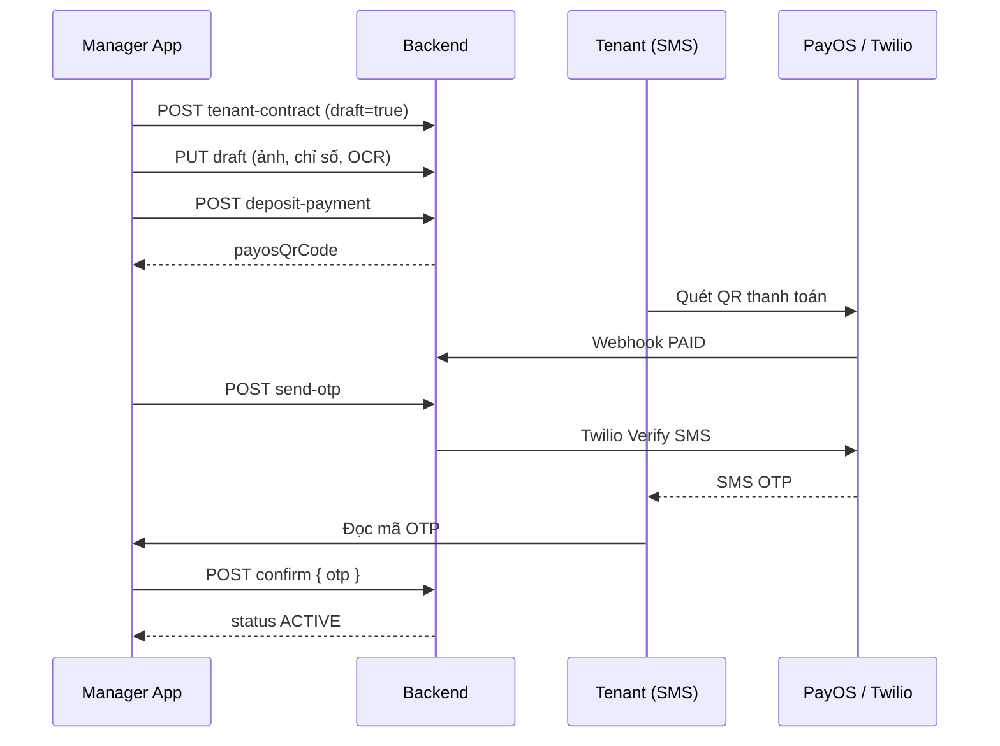

# Onboarding khách thuê + Thanh toán cọc + OTP — Hướng dẫn FE

Tài liệu mô tả **luồng đón khách mới** từ tạo HĐ nháp → chụp hiện trạng / OCR điện nước → thu cọc qua **PayOS (chuyển khoản/QR)** → OTP xác nhận → **ACTIVE**.

**Tham chiếu thêm:**
- Thiết bị bàn giao: [`FE-contract-handover-equipment.md`](./FE-contract-handover-equipment.md)
- Xem file HĐ: [`FE-view-contract.md`](./FE-view-contract.md)

---

## 1. Tóm tắt nhanh

| Giai đoạn | Trạng thái HĐ | `paymentStatus` | Việc FE |
|-----------|---------------|-----------------|---------|
| Tạo nháp | `DRAFT` | `PENDING` | Form khách, ảnh phòng, chỉ số điện/nước |
| Sẵn sàng thu cọc | `DRAFT` hoặc `PENDING` | `PENDING` | Tạo QR PayOS |
| Đã thu cọc | `PENDING` | `PAID` | Gửi/nhận OTP, manager nhập OTP |
| Hoàn tất | `ACTIVE` | `PAID` | Phòng `RENTED`, tenant có thể đăng nhập |

```
[Manager tạo DRAFT]
        │
        ▼
[Onboarding: ảnh hiện trạng + OCR điện nước + thiết bị + HĐ nháp DOCX]
        │
        ▼
[Thu cọc PayOS]
   POST /deposit-payment → QR / link thanh toán
   Webhook hoặc /check-payment → PAID
        │
        ▼
[Manager POST /send-otp]
        │
        ▼
[Tenant đọc OTP SMS → đọc cho Manager]
        │
        ▼
[Manager POST /confirm { otp }] ──► ACTIVE
```

---

## 2. Trạng thái & field quan trọng

### 2.1. `status` (hợp đồng)

| Giá trị | Ý nghĩa |
|---------|---------|
| `DRAFT` | Nháp — chưa tạo tài khoản tenant |
| `PENDING` | Chờ thu cọc / chờ OTP / chờ kích hoạt |
| `ACTIVE` | Đang hiệu lực |
| `TERMINATED` | Đã thanh lý |

### 2.2. `paymentStatus` (cọc)

| Giá trị | Ý nghĩa |
|---------|---------|
| `PENDING` | Chưa thu cọc |
| `PAID` | Đã thu cọc — được phép gửi OTP & confirm |

### 2.3. Field thanh toán PayOS

```json
{
  "payosOrderCode": 1720000000000,
  "payosCheckoutUrl": "https://pay.payos.vn/...",
  "payosQrCode": "data:image/png;base64,..."
}
```

Chỉ có sau `POST /deposit-payment`.

---

## 3. Luồng chi tiết theo bước

### Bước 1 — Tạo hợp đồng nháp

**Auth:** `MANAGER` / `ADMIN`

```http
POST /api/v1/properties/{propertyId}/rooms/{roomId}/tenant-contract
Authorization: Bearer {managerToken}
Content-Type: application/json
```

```json
{
  "draft": true,
  "fullName": "Nguyễn Văn A",
  "cccd": "001234567890",
  "phoneNumber": "0352393203",
  "dateOfBirth": "1995-06-15",
  "cccdIssueDate": "2021-03-10",
  "cccdIssuePlace": "CA TP. Hồ Chí Minh",
  "moveInDate": "2026-07-11",
  "endDate": "2027-07-11",
  "rentAmount": 5000000,
  "deposit": 5000000,
  "depositMonths": 1,
  "selectedEquipmentIds": [12, 15],
  "requireDepositPayment": true
}
```

**Lưu ý:**
- `draft: true` → `status = DRAFT`, **chưa** tạo user tenant
- Không gửi `assignedManagerId` nữa — BE tự gán quản lý = Operation Manager của nhà. Nhà chưa có quản lý → BE trả lỗi.
- `moveInDate` khi **không** draft phải = hôm nay; draft có thể set ngày tương lai nhưng khi thu cọc phải ≥ hôm nay
- Thuê nguyên căn: `POST /api/v1/properties/{propertyId}/tenant-contract` (không có `roomId`)

**Response:** lưu `id` (contractId), `contractCode`, `status: "DRAFT"`.

---

### Bước 2 — Onboarding: hiện trạng phòng + chỉ số điện nước

#### 2a. Upload ảnh (FE → Cloudinary)

FE upload trước, lấy URL public.

#### 2b. OCR đồng hồ (tuỳ chọn)

**Auth:** `MANAGER` / `ADMIN`

```http
POST /api/v1/ocr/meter
Authorization: Bearer {managerToken}

{ "imageUrl": "https://res.cloudinary.com/.../electric-meter.jpg" }
```

#### 2c. Cập nhật draft

```http
PUT /api/v1/tenant-contracts/{contractId}
Authorization: Bearer {managerToken}
```

```json
{
  "initialElectricReading": 12345,
  "initialWaterReading": 56,
  "electricMeterImageUrl": "https://res.cloudinary.com/.../electric.jpg",
  "waterMeterImageUrl": "https://res.cloudinary.com/.../water.jpg",
  "roomConditionUrls": [
    "https://res.cloudinary.com/.../room-1.jpg",
    "https://res.cloudinary.com/.../room-2.jpg"
  ],
  "roomConditionNote": "Tường có vết bẩn nhẹ góc phải"
}
```

#### 2d. Xuất HĐ nháp DOCX (tuỳ chọn)

```http
POST /api/v1/tenant-contracts/{id}/draft-document   → binary DOCX
```

FE upload DOCX lên Cloudinary → `PUT` lại với `draftContractFileUrl`.

---

### Bước 3 — Thu cọc qua PayOS (chuyển khoản / QR)

**Auth:** `MANAGER` / `ADMIN`

```http
POST /api/v1/tenant-contracts/{contractId}/deposit-payment
Authorization: Bearer {managerToken}
```

- Nếu HĐ đang `DRAFT` → BE chuyển sang `PENDING`
- Trả `payosQrCode`, `payosCheckoutUrl`

**FE hiển thị QR** cho khách quét hoặc mở link thanh toán.

**Đồng bộ trạng thái thanh toán:**

| Cách | API |
|------|-----|
| Tự động (prod) | PayOS webhook → BE set `PAID` |
| Thủ công (dev/local) | `POST /api/v1/tenant-contracts/{id}/check-payment` |

Poll `GET /api/v1/tenant-contracts/{id}` cho đến khi `paymentStatus === "PAID"`.

**Sau khi PAID — Manager chủ động gửi OTP:**

```http
POST /api/v1/tenant-contracts/{contractId}/send-otp
Authorization: Bearer {managerToken}
```

```json
{ "success": true, "message": "Đã gửi mã OTP tới số điện thoại khách thuê" }
```

> PayOS **không** tự gửi OTP. Manager phải bấm **Gửi OTP**.

---

### Bước 4 — Xác nhận OTP & kích hoạt HĐ

1. Khách nhận SMS (Twilio Verify), ví dụ:  
   `Mã xác thực SLMS của bạn là: 123456`
2. Khách **đọc mã cho manager** (tenant không nhập OTP trên app manager)
3. Manager nhập OTP:

```http
POST /api/v1/tenant-contracts/{contractId}/confirm
Authorization: Bearer {managerToken}
Content-Type: application/json

{ "otp": "123456" }
```

**Kết quả:**
- `status` → `ACTIVE`
- Phòng → `RENTED`
- Tạo/nâng tài khoản tenant (nếu trước đó là DRAFT)
- Response có thể có `tenantUsername`, `tenantAccountCreated`, `tenantRolePromoted`

---

## 4. Bảng API đầy đủ

| Bước | Method | Path | Auth |
|------|--------|------|------|
| Tạo draft | `POST` | `/api/v1/properties/{propertyId}/rooms/{roomId}/tenant-contract` | Manager |
| Cập nhật draft | `PUT` | `/api/v1/tenant-contracts/{id}` | Manager |
| OCR đồng hồ | `POST` | `/api/v1/ocr/meter` | Manager |
| Chi tiết HĐ | `GET` | `/api/v1/tenant-contracts/{id}` | Manager / Tenant |
| Tạo QR cọc | `POST` | `/api/v1/tenant-contracts/{id}/deposit-payment` | Manager |
| Kiểm tra PayOS | `POST` | `/api/v1/tenant-contracts/{id}/check-payment` | Manager |
| Gửi OTP | `POST` | `/api/v1/tenant-contracts/{id}/send-otp` | Manager |
| Kích hoạt HĐ | `POST` | `/api/v1/tenant-contracts/{id}/confirm` | Manager |
| Hủy HĐ chưa ACTIVE | `POST` | `/api/v1/tenant-contracts/{id}/cancel` | Manager |

---

## 5. Gợi ý UI theo màn hình

### Manager app

| Màn hình | Hành động |
|----------|-----------|
| Tạo HĐ | `draft: true`, chọn phòng, nhập khách |
| Onboarding | Camera ảnh phòng, chụp đồng hồ, gọi OCR, lưu draft |
| Thu cọc | Hiện `payosQrCode` / link PayOS, nút "Kiểm tra thanh toán" |
| Sau PAID | Nút **Gửi OTP** → `/send-otp` |
| Hoàn tất | Input 6 số OTP → **Xác nhận HĐ** |

### Điều kiện bật nút (FE)

```ts
const canSendOtp = contract.paymentStatus === 'PAID' && contract.status !== 'ACTIVE';
const canConfirm = contract.paymentStatus === 'PAID' && contract.status !== 'ACTIVE';
const showQrCheck = contract.payosOrderCode != null && contract.paymentStatus !== 'PAID';
```

---

## 6. Lỗi thường gặp

| HTTP / message | Nguyên nhân | FE xử lý |
|----------------|-------------|----------|
| `Chưa thanh toán cọc, không thể gửi OTP` | `paymentStatus !== PAID` | Hoàn tất bước thu cọc trước |
| `Mã OTP không đúng` / `đã hết hạn` | OTP sai hoặc quá 5 phút | Nút "Gửi lại OTP" → `/send-otp` |
| `Ngày vào ở không hợp lệ để thu cọc` | `moveInDate` < hôm nay | Sửa ngày vào ở trên draft |
| `Hợp đồng cần được chủ nhà duyệt giá...` | `requireHostPriceApproval` chưa duyệt | Chờ host duyệt giá |

---

## 7. Hướng dẫn test

### 7.1. Chuẩn bị môi trường

**`.env` BE (Twilio Verify):**

```env
TWILIO_ACCOUNT_SID=AC...
TWILIO_AUTH_TOKEN=...
TWILIO_VERIFY_SERVICE_SID=VA...
TWILIO_OTP_EXPIRY_MINUTES=5
TWILIO_OTP_MAX_ATTEMPTS=5
```

**Twilio trial:** chỉ gửi SMS tới số đã **Verified** trên Console (`+84352393203`).

### 7.2. Test — QR PayOS + OTP

```bash
# 1. Tạo draft + cập nhật onboarding
POST /api/v1/properties/1/rooms/5/tenant-contract
PUT /api/v1/tenant-contracts/{contractId}

# 2. Tạo QR
POST /api/v1/tenant-contracts/{contractId}/deposit-payment

# 3. Khách quét QR / thanh toán PayOS sandbox
#    Hoặc dev: POST /check-payment sau khi thanh toán

# 4. Manager GỬI OTP thủ công
POST /api/v1/tenant-contracts/{contractId}/send-otp

# 5. Confirm OTP
POST /api/v1/tenant-contracts/{contractId}/confirm
{ "otp": "......" }
```

### 7.3. Test khi Twilio chưa cấu hình (dev)

Nếu thiếu `TWILIO_*` env:
- BE vẫn chạy, **không gửi SMS**
- Log server in: `[DEV] Twilio Verify chưa cấu hình — mã OTP xxxxxx cho +84...`
- FE/QA đọc OTP từ **log console BE** để test `/confirm`

---

## 8. Sequence diagram



---

*Tài liệu đồng bộ với BE: PayOS + Twilio Verify API. Cập nhật lần cuối: 2026-07-16.*
