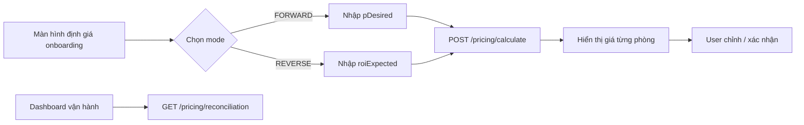

# Hướng dẫn API Định giá — cho Frontend

> **Base path:** `/api/v1/properties/{propertyId}/pricing`  
> **Tài liệu công thức:** [PRICING_FORMULA.md](./PRICING_FORMULA.md)  
> **Endpoint cũ (tương thích):** `/api/v1/properties/{propertyId}/depreciation/*` vẫn hoạt động, cùng service.

---

## 1. Tổng quan luồng FE



| Bước | API | Khi nào gọi |
|------|-----|-------------|
| Tính giá lần đầu | `POST .../pricing/calculate` | Sau khi có HĐ inbound + phòng + chi phí cải tạo/thiết bị |
| Xem lại kết quả đã lưu | `GET .../pricing` | Reload màn hình, trước khi activate |
| Đối soát thực tế | `GET .../pricing/reconciliation` | Dashboard host / báo cáo tháng |

---

## 2. POST `/pricing/calculate`

### Request body

#### Luồng xuôi — biết lợi nhuận mong muốn

```json
{
  "mode": "FORWARD",
  "pDesired": 10000000,
  "oOperation": 5000000,
  "vRate": 0.10,
  "roomQualityFactors": {
    "12": 1.0,
    "13": 1.1
  }
}
```

#### Luồng ngược — biết ROI mong muốn

```json
{
  "mode": "REVERSE",
  "roiExpected": 15,
  "oOperation": 5000000,
  "vRate": 0.10
}
```

### Trường input

| Field | Type | Bắt buộc | Mặc định | Mô tả |
|-------|------|----------|----------|-------|
| `mode` | `"FORWARD"` \| `"REVERSE"` | Không* | Suy từ field có giá trị | *Nếu có `roiExpected` → REVERSE, ngược lại FORWARD |
| `pDesired` | number (VND) | Có khi FORWARD | `0` nếu FORWARD và không gửi | Lợi nhuận ròng mong muốn **mỗi tháng** (cấp tòa) |
| `roiExpected` | number (%) | Có khi REVERSE | — | ROI trên CAPEX, quy đổi theo năm |
| `oOperation` | number (VND) | Không | `0` | Chi phí vận hành cố định/tháng (lương OM, internet…) |
| `vRate` | number (thập phân) | Không | `0.10` | Buffer trống phòng: `0.10` = 10% |
| `roomQualityFactors` | `Record<roomId, number>` | Không | `1.0` mọi phòng | Hệ số chất lượng `k_i` theo `roomId` |

**Lưu ý FE:**

- Chỉ gửi **một** trong hai: `pDesired` hoặc `roiExpected`.
- `roomQualityFactors` key là **string** trong JSON (`"12"`) nhưng map tới `roomId` number.
- Tiền tệ là **VND nguyên**, không có phần thập phân.
- Property phải đang onboarding (`DRAFT`, `PENDING_HOST_REVIEW`, …) và đã có HĐ inbound.

### Response — nhà chia phòng (`pricingScope: "ROOM"`)

```json
{
  "propertyId": 1,
  "pricingScope": "ROOM",
  "mode": "FORWARD",
  "cRent": 600000000,
  "cRenovation": 80000000,
  "cEquipment": 40000000,
  "capex": 720000000,
  "contractMonths": 60,
  "monthlyRecovery": 12000000,
  "fixedOpex": 17000000,
  "revenueMin": 27000000,
  "revenueTarget": 29700000,
  "pDesired": 10000000,
  "roiExpected": null,
  "oOperation": 5000000,
  "vRate": 0.10,
  "commonAreaM2": 0,
  "totalWeight": 37,
  "roomCount": 2,
  "roomResults": [
    {
      "id": 101,
      "propertyId": 1,
      "inboundContractId": 5,
      "pricingScope": "ROOM",
      "roomId": 12,
      "roomNumber": "101",
      "area": 15,
      "effectiveM2": 15,
      "weight": 15,
      "rentShare": 243243243,
      "renovationShare": 32432432,
      "equipmentShare": 16216216,
      "totalInvestment": 291891891,
      "contractMonths": 60,
      "monthlyBreakEven": 4864865,
      "roomFloor": 9800000,
      "suggestedMinPrice": 9800000,
      "suggestedPriceWithProfit": 12040541,
      "belowFloor": false,
      "calculatedAt": "2026-06-25T10:00:00"
    }
  ],
  "wholeHouseResult": null
}
```

### Response — nhà nguyên căn (`pricingScope: "WHOLE_HOUSE"`)

```json
{
  "propertyId": 2,
  "pricingScope": "WHOLE_HOUSE",
  "mode": "FORWARD",
  "capex": 720000000,
  "contractMonths": 60,
  "monthlyRecovery": 12000000,
  "fixedOpex": 17000000,
  "revenueMin": 27000000,
  "revenueTarget": 29700000,
  "wholeHouseResult": {
    "suggestedPriceWithProfit": 29700000,
    "roomFloor": 18700000,
    "suggestedMinPrice": 18700000
  },
  "roomResults": null
}
```

### Trường output quan trọng cho UI

| Field | Ý nghĩa hiển thị |
|-------|------------------|
| `capex` | Tổng vốn đầu tư (thuê trả trước + cải tạo + thiết bị) |
| `monthlyRecovery` | Hoàn vốn kế toán/tháng |
| `fixedOpex` | Chi phí nền/tháng = `oOperation` + hoàn vốn |
| `revenueTarget` | Doanh thu mục tiêu khi lấp đầy 100% (đã cộng buffer trống phòng) |
| `roomResults[].suggestedPriceWithProfit` | **Giá gợi ý niêm yết** cho phòng — map vào form giá phòng |
| `roomResults[].roomFloor` | Giá sàn tối thiểu — cảnh báo nếu user nhập thấp hơn |
| `roomResults[].belowFloor` | `true` → hiển thị warning (không nên xảy ra sau tính toán chuẩn) |
| `roomResults[].effectiveM2` / `weight` | Tooltip giải thích phân bổ m² |

### Xử lý FE sau calculate

1. Gán `suggestedPriceWithProfit` vào `room.price` (hoặc field tương đương) — user có thể chỉnh tay.
2. Hiển thị summary card: CAPEX, hoàn vốn/tháng, doanh thu mục tiêu, lợi nhuận mục tiêu.
3. Với `WHOLE_HOUSE`: một giá duy nhất = `wholeHouseResult.suggestedPriceWithProfit`.
4. Kiểm tra `Σ suggestedPriceWithProfit ≈ revenueTarget` (sai số làm tròn phòng cuối).

---

## 3. GET `/pricing`

Lấy kết quả đã lưu lần calculate gần nhất (không cần body).

- Response cùng schema với POST calculate.
- Một số field input (`mode`, `pDesired`, `oOperation`…) có thể **null** vì không persist — FE nên giữ state local hoặc yêu cầu user nhập lại khi reconcile.

**404** nếu chưa từng calculate.

---

## 4. GET `/pricing/reconciliation`

Đối soát doanh thu / lợi nhuận thực tế theo tháng (mục 8 PRICING_FORMULA).

### Query params

| Param | Bắt buộc | Mặc định | Mô tả |
|-------|----------|----------|-------|
| `month` | Có | — | `YYYY-MM`, ví dụ `2026-06` |
| `oOperation` | Không | `0` | Cùng giá trị đã dùng khi tính giá |
| `pDesired` | Không | `0` | Lợi nhuận mục tiêu để so sánh |
| `vRate` | Không | `0.10` | Dùng nội bộ nếu mở rộng sau |

### Response

```json
{
  "propertyId": 1,
  "month": "2026-06",
  "actualRevenue": 25000000,
  "occupancyRate": 66.67,
  "actualProfit": 8000000,
  "actualCashFlow": 20000000,
  "fixedOpex": 17000000,
  "revenueTarget": 29700000,
  "revenueTargetAtOccupancy": 19800000,
  "pDesired": 10000000,
  "profitTargetMet": false,
  "revenueTargetMet": true
}
```

### Cách hiển thị dashboard

| Field | UI gợi ý |
|-------|----------|
| `actualRevenue` | Doanh thu thực (HĐ tenant PAID trong tháng) |
| `occupancyRate` | % phòng có HĐ active |
| `actualProfit` | `actualRevenue - fixedOpex` — lợi nhuận sau hoàn vốn |
| `actualCashFlow` | `actualRevenue - oOperation` — tiền mặt sau chi vận hành |
| `profitTargetMet` | Badge xanh nếu `actualProfit >= pDesired` |
| `revenueTargetMet` | So `actualRevenue` với `revenueTargetAtOccupancy` |

---

## 5. Mã lỗi thường gặp

| HTTP | Message | Nguyên nhân |
|------|---------|-------------|
| 400 | `Luồng xuôi (FORWARD) yêu cầu pDesired` | mode FORWARD nhưng thiếu pDesired |
| 400 | `Luồng ngược (REVERSE) yêu cầu roiExpected` | mode REVERSE nhưng thiếu roiExpected |
| 400 | `Phòng X chưa có diện tích (m²) hợp lệ` | `room.area` null hoặc ≤ 0 |
| 400 | `Phải ký hợp đồng inbound trước khi tính giá` | Chưa có inbound contract |
| 400 | `Chỉ tính giá khi tòa nhà đang trong quá trình onboarding` | Property đã ACTIVE |
| 404 | `Chưa có kết quả tính giá...` | GET pricing / reconciliation trước khi calculate |

---

## 6. TypeScript interfaces (tham khảo)

```typescript
type PricingMode = 'FORWARD' | 'REVERSE';
type PricingScope = 'ROOM' | 'WHOLE_HOUSE';

interface CalculatePricingRequest {
  mode?: PricingMode;
  pDesired?: number;
  roiExpected?: number;
  oOperation?: number;
  vRate?: number;
  roomQualityFactors?: Record<string, number>;
}

interface RoomPricingResult {
  roomId: number;
  roomNumber: string;
  area: number;
  effectiveM2: number;
  weight: number;
  roomFloor: number;
  suggestedMinPrice: number;
  suggestedPriceWithProfit: number;
  belowFloor?: boolean;
}

interface PricingCalculationResponse {
  propertyId: number;
  pricingScope: PricingScope;
  mode?: PricingMode;
  capex: number;
  contractMonths: number;
  monthlyRecovery: number;
  fixedOpex: number;
  revenueTarget: number;
  revenueMin?: number;
  pDesired?: number;
  roiExpected?: number;
  oOperation?: number;
  vRate?: number;
  roomCount?: number;
  roomResults?: RoomPricingResult[];
  wholeHouseResult?: RoomPricingResult;
}

interface PricingReconciliationResponse {
  propertyId: number;
  month: string;
  actualRevenue: number;
  occupancyRate: number;
  actualProfit: number;
  actualCashFlow: number;
  fixedOpex: number;
  revenueTarget: number;
  revenueTargetAtOccupancy: number;
  pDesired: number;
  profitTargetMet: boolean;
  revenueTargetMet: boolean;
}
```

---

## 7. Ví dụ gọi API (fetch)

```typescript
// Tính giá xuôi
await fetch(`/api/v1/properties/${propertyId}/pricing/calculate`, {
  method: 'POST',
  headers: { 'Content-Type': 'application/json', Authorization: `Bearer ${token}` },
  body: JSON.stringify({
    mode: 'FORWARD',
    pDesired: 10_000_000,
    oOperation: 5_000_000,
    vRate: 0.1,
    roomQualityFactors: { '12': 1.0, '13': 1.1 },
  }),
});

// Đối soát tháng
await fetch(
  `/api/v1/properties/${propertyId}/pricing/reconciliation?month=2026-06&oOperation=5000000&pDesired=10000000`,
  { headers: { Authorization: `Bearer ${token}` } },
);
```
