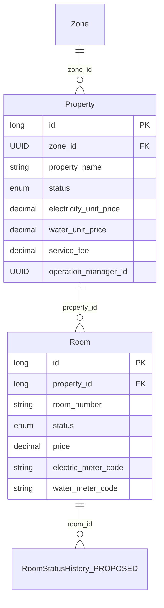
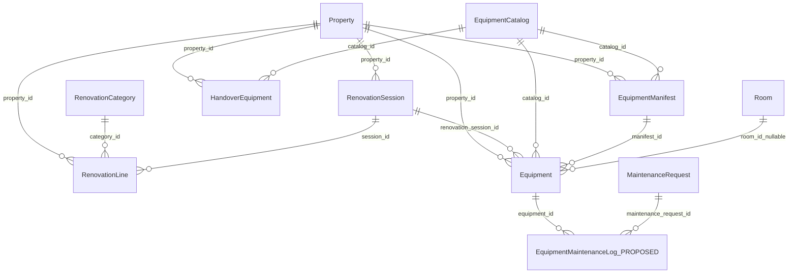
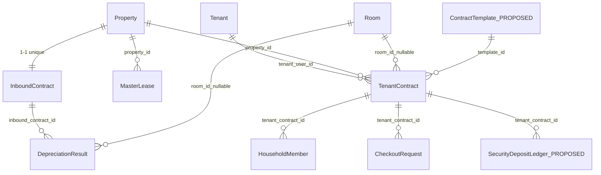
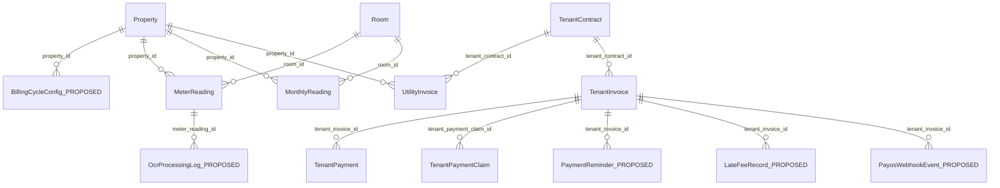
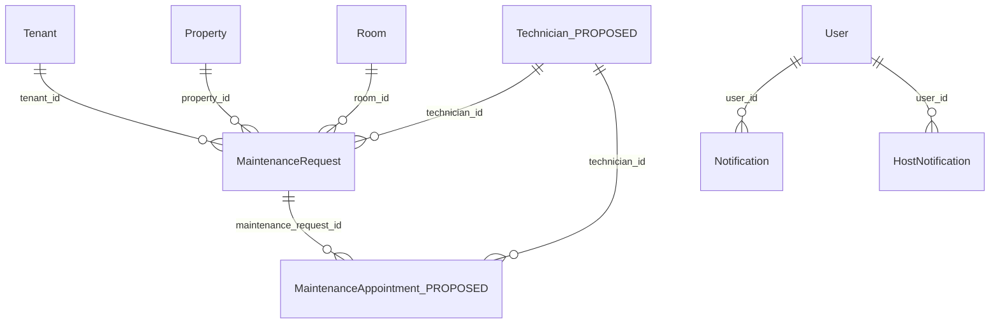
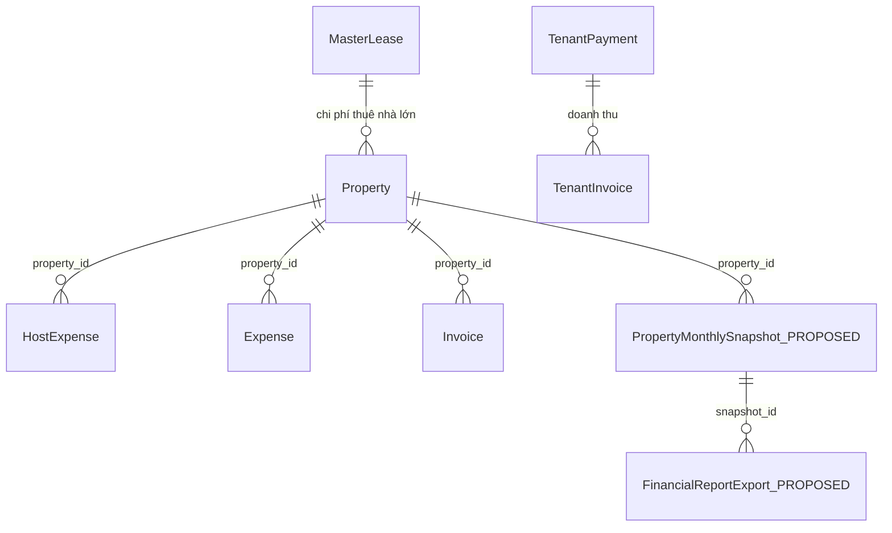

# SLMS2026 — ERD đầy đủ (Proposal + Hiện trạng code)

Tài liệu đối chiếu **Capstone Proposal** *Sub-leasing Management System* (SU26SE096) với **34 entity JPA đã triển khai**, đồng thời đề xuất **entity bổ sung** còn thiếu để phủ đủ user story trong proposal.

| | |
|---|---|
| **Proposal** | SU26SE096 — Hệ thống quản lý kinh doanh thuê và cho thuê lại BĐS |
| **Mã nguồn** | `src/main/java/com/sep490/slms2026/entity/` |
| **Entity đã có** | 34 (✅ IMPLEMENTED) |
| **Entity đề xuất thêm** | 13 (📋 PROPOSED) |
| **Tổng khi đầy đủ** | 47 |
| **Công nghệ** | Java Spring Boot, JPA/Hibernate, PostgreSQL |

---

## Mục lục

1. [Ánh xạ Proposal → Entity](#1-ánh-xạ-proposal--entity)
2. [Ký hiệu & nhóm domain](#2-ký-hiệu--nhóm-domain)
3. [Sơ đồ ERD tổng hợp](#3-sơ-đồ-erd-tổng-hợp)
4. [Nhóm User & phân quyền](#4-nhóm-user--phân-quyền)
5. [Nhóm BĐS, phòng & onboarding](#5-nhóm-bđs-phòng--onboarding)
6. [Nhóm Cải tạo & thiết bị](#6-nhóm-cải-tạo--thiết-bị)
7. [Nhóm Hợp đồng & khách thuê](#7-nhóm-hợp-đồng--khách-thuê)
8. [Nhóm Điện nước, hóa đơn & thanh toán](#8-nhóm-điện-nước-hóa-đơn--thanh-toán)
9. [Nhóm Bảo trì & vận hành](#9-nhóm-bảo-trì--vận-hành)
10. [Nhóm Dòng tiền & báo cáo](#10-nhóm-dòng-tiền--báo-cáo)
11. [Entity đề xuất bổ sung (PROPOSED)](#11-entity-đề-xuất-bổ-sung-proposed)
12. [Ma trận độ phủ Proposal](#12-ma-trận-độ-phủ-proposal)
13. [Danh sách đầy đủ 47 entity](#13-danh-sách-đầy-đủ-47-entity)

---

## 1. Ánh xạ Proposal → Entity

Proposal mô tả **5 luồng nghiệp vụ** chính. Bảng dưới map từng bước sang entity (✅ = đã có, 📋 = đề xuất thêm).

### 1.1 Initial Setup (System Admin)

| Bước proposal | Entity |
|---------------|--------|
| Add Property Portfolio | ✅ `Property`, ✅ `Zone` |
| Configure Room & Pricing | ✅ `Room`, ✅ `DepreciationResult` |
| Record Initial Equipment | ✅ `HandoverEquipment`, ✅ `EquipmentManifest`, ✅ `Equipment`, ✅ `EquipmentCatalog` |
| Cải tạo nhà trước khai trương | ✅ `RenovationSession`, ✅ `RenovationLine`, ✅ `RenovationCategory` |
| HĐ thuê nhà gốc | ✅ `InboundContract`, ✅ `MasterLease` |

### 1.2 Tenant Onboarding (Operations Manager & Tenant)

| Bước proposal | Entity |
|---------------|--------|
| Add New Tenant | ✅ `User`, ✅ `Tenant` |
| Capture Room Condition & Meters | ✅ `TenantContract` (+ `tenant_contract_condition_photos`) |
| Generate E-Contract | ✅ `TenantContract.documentUrl` |
| Confirm via OTP | ✅ `OtpVerification` |
| Thành viên ở cùng | ✅ `HouseholdMember` |
| Tự động cập nhật trạng thái phòng | ✅ `Room.status` (service layer) · 📋 `RoomStatusHistory` |

### 1.3 Monthly Billing & Payment

| Bước proposal | Entity |
|---------------|--------|
| Record Monthly Meter Reading | ✅ `MeterReading`, ✅ `MonthlyReading` |
| OCR ảnh đồng hồ | Service `OcrService` (stateless) · 📋 `OcrProcessingLog` |
| Automatic Billing | ✅ `UtilityInvoice`, ✅ `TenantInvoice` |
| Pay via QR / Bank Transfer | ✅ `TenantPayment`, ✅ `TenantPaymentClaim` |
| Webhook PayOS | Controller (stateless) · 📋 `PayosWebhookEvent` |
| Payment reminders | 📋 `PaymentReminder` |
| Billing cycle rule | 📋 `BillingCycleConfig` |
| Late fee | Trường `TenantInvoice.lateFee` · 📋 `LateFeeRecord` |

### 1.4 Maintenance Request

| Bước proposal | Entity |
|---------------|--------|
| Submit request + photos | ✅ `MaintenanceRequest` |
| Schedule repair | Trường `scheduledSlots` (TEXT) · 📋 `MaintenanceAppointment` |
| Assign technician | Trường `technicianId` (String) · 📋 `Technician` |
| Record repair cost | ✅ `MaintenanceRequest.repairCost` |
| Equipment maintenance history | FK mềm `equipment_id` · 📋 `EquipmentMaintenanceLog` |
| Notify tenant | ✅ `Notification` |

### 1.5 Cash Flow Management

| Bước proposal | Entity |
|---------------|--------|
| Record large-house lease expenses | ✅ `HostExpense`, ✅ `MasterLease`, ✅ `InboundContract` |
| Record income | ✅ `TenantPayment`, ✅ `TenantInvoice` |
| Chi phí vận hành | ✅ `Expense` |
| Reconciliation & dashboard | Service tính toán · 📋 `PropertyMonthlySnapshot` |
| Export Excel | API response DTO · 📋 `FinancialReportExport` |
| Hoàn cọc khi trả phòng | ✅ `CheckoutRequest` · 📋 `SecurityDepositLedger` |

---

## 2. Ký hiệu & nhóm domain

```
✅ IMPLEMENTED  — Đã có file entity JPA + bảng DB
📋 PROPOSED     — Đề xuất thêm theo proposal, chưa có entity
───             — Quan hệ FK mềm (cột ID, không @ManyToOne)
```

| Nhóm | Entity ✅ | Entity 📋 |
|------|-----------|-----------|
| User & Auth | 6 | 1 (`Technician`) |
| BĐS & Phòng | 3 | 1 (`RoomStatusHistory`) |
| Cải tạo & Thiết bị | 9 | 1 (`EquipmentMaintenanceLog`) |
| Hợp đồng | 5 | 2 (`ContractTemplate`, `SecurityDepositLedger`) |
| Billing & Payment | 8 | 5 (`BillingCycleConfig`, `PaymentReminder`, `LateFeeRecord`, `PayosWebhookEvent`, `OcrProcessingLog`) |
| Vận hành | 4 | 1 (`MaintenanceAppointment`) |
| Tài chính & Báo cáo | 2 | 2 (`PropertyMonthlySnapshot`, `FinancialReportExport`) |

---

## 3. Sơ đồ ERD tổng hợp

Bao gồm **entity đã có** và **entity đề xuất** (khung nét đứt trong mô tả).

```mermaid
erDiagram
    %% ===== USER =====
    User ||--o| Admin : profile
    User ||--o| Owner : profile
    User ||--o| Tenant : profile
    User ||--o| OperationManagement : profile
    User ||--o| Technician : "PROPOSED profile"
    OperationManagement }o--o{ Zone : manager_zones

    %% ===== PROPERTY =====
    Zone ||--o{ Zone : parent
    Zone ||--o{ Property : zone_id
    Property ||--o{ Room : property_id
    Room ||--o{ RoomStatusHistory : "PROPOSED"

    %% ===== CONTRACTS =====
    Property ||--|| InboundContract : property_id
    Property ||--o{ MasterLease : property_id
    InboundContract ||--o{ DepreciationResult : inbound_contract_id
    Tenant ||--o{ TenantContract : tenant_user_id
    Property ||--o{ TenantContract : property_id
    Room ||--o{ TenantContract : room_id
    TenantContract ||--o{ HouseholdMember : tenant_contract_id
    TenantContract ||--o{ CheckoutRequest : tenant_contract_id
    TenantContract ||--o{ SecurityDepositLedger : "PROPOSED"
    ContractTemplate ||--o{ TenantContract : "PROPOSED template_id"

    %% ===== RENOVATION & EQUIPMENT =====
    Property ||--o{ RenovationSession : property_id
    RenovationSession ||--o{ RenovationLine : session_id
    RenovationCategory ||--o{ RenovationLine : category_id
    Property ||--o{ RenovationLine : property_id
    Property ||--o{ EquipmentManifest : property_id
    EquipmentCatalog ||--o{ EquipmentManifest : catalog_id
    Property ||--o{ HandoverEquipment : property_id
    Property ||--o{ Equipment : property_id
    Room ||--o{ Equipment : room_id
    EquipmentCatalog ||--o{ Equipment : catalog_id
    EquipmentManifest ||--o{ Equipment : manifest_id
    RenovationSession ||--o{ Equipment : renovation_session_id
    Equipment ||--o{ EquipmentMaintenanceLog : "PROPOSED"
    MaintenanceRequest ||--o{ EquipmentMaintenanceLog : "PROPOSED"

    %% ===== BILLING =====
    Property ||--o{ BillingCycleConfig : "PROPOSED"
    Property ||--o{ MonthlyReading : property_id
    Property ||--o{ MeterReading : property_id
    Room ||--o{ MonthlyReading : room_id
    Room ||--o{ MeterReading : room_id
    TenantContract ||--o{ UtilityInvoice : tenant_contract_id
    Property ||--o{ UtilityInvoice : property_id
    TenantContract ||--o{ TenantInvoice : tenant_contract_id
    TenantInvoice ||--o{ TenantPayment : tenant_invoice_id
    TenantInvoice ||--o{ TenantPaymentClaim : tenant_payment_claim_id
    TenantInvoice ||--o{ PaymentReminder : "PROPOSED"
    TenantInvoice ||--o{ LateFeeRecord : "PROPOSED"
    TenantInvoice ||--o{ PayosWebhookEvent : "PROPOSED"
    MeterReading ||--o{ OcrProcessingLog : "PROPOSED"

    %% ===== MAINTENANCE =====
    Tenant ||--o{ MaintenanceRequest : tenant_id
    Property ||--o{ MaintenanceRequest : property_id
    Room ||--o{ MaintenanceRequest : room_id
    MaintenanceRequest ||--o{ MaintenanceAppointment : "PROPOSED"
    Technician ||--o{ MaintenanceRequest : "PROPOSED"
    Technician ||--o{ MaintenanceAppointment : "PROPOSED"

    %% ===== FINANCE =====
    Property ||--o{ HostExpense : property_id
    Property ||--o{ Expense : property_id
    Property ||--o{ Invoice : property_id
    Property ||--o{ PropertyMonthlySnapshot : "PROPOSED"
    PropertyMonthlySnapshot ||--o{ FinancialReportExport : "PROPOSED"

    %% ===== NOTIFICATIONS =====
    User ||--o{ Notification : user_id_soft
    User ||--o{ HostNotification : user_id_soft
```



---

## 4. Nhóm User & phân quyền

### Sơ đồ

```mermaid
erDiagram
    User {
        UUID id PK
        string username UK
        string phoneNumber UK
        string fullName UK
        enum role
        enum status
        string push_token
    }
    Admin { UUID user_id PK_FK }
    Owner { UUID user_id PK_FK }
    Tenant { UUID user_id PK_FK string cccd }
    OperationManagement { UUID user_id PK_FK }
    Technician_PROPOSED { UUID user_id PK_FK string specialty }

    User ||--|| Admin : MapsId
    User ||--|| Owner : MapsId
    User ||--|| Tenant : MapsId
    User ||--|| OperationManagement : MapsId
    User ||--o| Technician_PROPOSED : MapsId
    OperationManagement }o--o{ Zone : manager_zones
```

### Entity ✅

| Entity | Bảng | PK | Vai trò theo proposal |
|--------|------|-----|----------------------|
| `User` | `User` | UUID | Tài khoản chung (tenant, manager, admin) |
| `Admin` | `Admin` | user_id | System Admin — quản portfolio |
| `Owner` | `Owner` | user_id | Chủ nhà gốc |
| `Tenant` | `Tenant` | user_id | Khách thuê (CCCD) |
| `OperationManagement` | `Operation_Management` | user_id | Operations Manager (mobile) |
| `OtpVerification` | `otp_verifications` | Long | OTP xác nhận HĐ điện tử |

### Entity 📋

| Entity đề xuất | Lý do (proposal) |
|----------------|------------------|
| `Technician` | *"technicianId"* trong maintenance — cần profile thợ sửa chữa, gán lịch |

---

## 5. Nhóm BĐS, phòng & onboarding



### Entity ✅

| Entity | Quan hệ chính |
|--------|---------------|
| `Zone` | Self-parent; N:N `OperationManagement` qua `manager_zones` |
| `Property` | N:1 `Zone`; hub trung tâm mọi module |
| `Room` | N:1 `Property`; trạng thái AVAILABLE / RENTED / … |

**Collection:** `property_images` (ảnh BĐS).

### Entity 📋

| Entity đề xuất | Trường gợi ý | Proposal |
|----------------|--------------|----------|
| `RoomStatusHistory` | `room_id`, `old_status`, `new_status`, `trigger` (CONTRACT_ACTIVE/TERMINATED/MAINTENANCE), `changed_at` | *"automatically update room status based on contract events"* |

---

## 6. Nhóm Cải tạo & thiết bị

Hai nhánh **song song**, gặp nhau tại `RenovationSession` và `Property`. `Room` chỉ gắn khi **materialize** từng `Equipment`.



### Entity ✅

| Entity | Mô tả |
|--------|--------|
| `RenovationCategory` | Master: loại hạng mục cải tạo (sơn, điện…) |
| `RenovationSession` | Đợt cải tạo v1, v2… unique `(property_id, session_number)` |
| `RenovationLine` | Dòng chi phí: category + session + cost |
| `EquipmentCatalog` | Master: loại thiết bị |
| `EquipmentManifest` | Kế hoạch: cần N cái loại X (chưa chia phòng) |
| `HandoverEquipment` | TB chủ nhà bàn giao (chỉ hiển thị) |
| `Equipment` | TB thực tế: QR, bảo hành, `room_id` hoặc `houseArea` |
| `DepreciationResult` | Kết quả khấu hao → gợi ý giá thuê |

### Quan hệ đặc biệt

| Cặp | Quan hệ | Ghi chú |
|-----|---------|---------|
| RenovationLine ↔ EquipmentManifest | **Không FK** | Chi phí sửa chữa vs kế hoạch TB độc lập |
| RenovationCategory ↔ EquipmentCatalog | **Không FK** | Hai master data riêng |
| Equipment ↔ Room | N:1 optional | Gán phòng khi `assignEquipment` |

### Entity 📋

| Entity đề xuất | Proposal |
|----------------|----------|
| `EquipmentMaintenanceLog` | *"update the maintenance history for related equipment items when a repair is completed"* |

---

## 7. Nhóm Hợp đồng & khách thuê



### Entity ✅

| Entity | Business rule (proposal) |
|--------|--------------------------|
| `InboundContract` | HĐ thuê nhà gốc từ chủ — 1:1 Property |
| `MasterLease` | HĐ master lease (chi phí thuê nhà lớn) |
| `TenantContract` | HĐ khách thuê; 1 phòng chỉ 1 ACTIVE (service) |
| `HouseholdMember` | Thành viên ở cùng (thuê nguyên căn) |
| `CheckoutRequest` | Yêu cầu trả phòng |

**Collection:** `tenant_contract_condition_photos`.

### Entity 📋

| Entity | Proposal |
|--------|----------|
| `ContractTemplate` | Quản lý mẫu HĐ điện tử (`tenant-rental-template.docx` hiện là file tĩnh) |
| `SecurityDepositLedger` | *"Security deposit recorded separately… refunded upon contract termination"* — HOLD / DEDUCT / REFUND |

---

## 8. Nhóm Điện nước, hóa đơn & thanh toán



### Entity ✅

| Entity | Vai trò |
|--------|---------|
| `MeterReading` | Ghi chỉ số thô (+ ảnh đồng hồ) |
| `MonthlyReading` | Tính tiền điện/nước theo tháng |
| `UtilityInvoice` | Hóa đơn điện/nước gửi tenant |
| `TenantInvoice` | Hóa đơn tổng (thuê + điện + nước + phí) |
| `TenantPayment` | Thanh toán đã xác nhận |
| `TenantPaymentClaim` | Khai báo CK chờ manager duyệt |
| `Invoice` | Hóa đơn generic (legacy) |

**Luồng PayOS:** `TenantInvoice.payosOrderCode` → webhook `PayosWebhookController` (chưa lưu log entity).

### Entity 📋

| Entity | Trường gợi ý | Proposal |
|--------|--------------|----------|
| `BillingCycleConfig` | `property_id`, `billing_day_of_month`, `due_days_after_billing`, `late_fee_rate` | *"invoices on a designated date each month"* |
| `PaymentReminder` | `tenant_invoice_id`, `sent_at`, `channel` (PUSH/SMS), `reminder_number` | *"automatically send payment reminders"* |
| `LateFeeRecord` | `tenant_invoice_id`, `amount`, `applied_at`, `reason` | *"Late payments will incur additional fees"* |
| `PayosWebhookEvent` | `order_code`, `payload`, `signature_valid`, `processed_at`, `result` | *"process payment webhooks… automatically update status"* |
| `OcrProcessingLog` | `meter_reading_id`, `image_url`, `ocr_result`, `confidence`, `created_at` | *"meter image recognition relies on OCR"* |

---

## 9. Nhóm Bảo trì & vận hành



### Entity ✅

| Entity | Trường nổi bật |
|--------|----------------|
| `MaintenanceRequest` | `status`, `repairCost`, `equipment_id` (FK mềm), `scheduledSlots`, `technicianId` (String) |
| `Notification` | Thông báo in-app (`user_id` FK mềm) |
| `HostNotification` | Thông báo chủ nhà + `dedupe_key` |
| `CheckoutRequest` | Yêu cầu trả phòng |

### Entity 📋

| Entity | Proposal |
|--------|----------|
| `MaintenanceAppointment` | *"review & schedule"* — tách `scheduledSlots` / `confirmedSlot` thành bảng có lịch cụ thể |

---

## 10. Nhóm Dòng tiền & báo cáo



### Entity ✅

| Entity | Vai trò |
|--------|---------|
| `HostExpense` | Chi phí chủ nhà theo tháng (category + amount) |
| `Expense` | Chi phí vận hành property |
| `HostNotification` | Cảnh báo tài chính cho host |

**Tính toán runtime (chưa persist):** `DepreciationService.reconcile()`, `HostPortalService.getFinancialSummary()`.

### Entity 📋

| Entity | Proposal |
|--------|----------|
| `PropertyMonthlySnapshot` | Cache `revenue`, `expenses`, `net_profit`, `occupancy_rate` theo `property_id` + `month` — phục vụ dashboard & đối chiếu |
| `FinancialReportExport` | Log xuất Excel: `exported_by`, `exported_at`, `file_url`, `period_from`, `period_to` |

---

## 11. Entity đề xuất bổ sung (PROPOSED)

Chi tiết thiết kế đề xuất cho 13 entity chưa có trong code.

### 11.1 `Technician`

```java
// Đề xuất: pattern giống Tenant / Owner
@Entity @Table(name = "Technician")
class Technician {
    @Id UUID id;                    // = user_id
    @OneToOne @MapsId User user;
    String specialty;               // Điện, nước, nội thất
    boolean active;
}
```

| Quan hệ | Kiểu |
|---------|------|
| User | 1:1 |
| MaintenanceRequest | 1:N (thay `technicianId` String) |
| MaintenanceAppointment | 1:N |

---

### 11.2 `MaintenanceAppointment`

| Cột | Kiểu | Mô tả |
|-----|------|-------|
| id | Long PK | |
| maintenance_request_id | FK | |
| technician_id | FK nullable | |
| scheduled_start | DateTime | |
| scheduled_end | DateTime | |
| status | Enum | PROPOSED / CONFIRMED / COMPLETED / CANCELLED |
| note | TEXT | |

---

### 11.3 `EquipmentMaintenanceLog`

| Cột | Kiểu | Mô tả |
|-----|------|-------|
| id | Long PK | |
| equipment_id | FK | |
| maintenance_request_id | FK | |
| action | Enum | REPAIRED / REPLACED / INSPECTED |
| cost | Decimal | |
| note | TEXT | |
| logged_at | DateTime | |

---

### 11.4 `RoomStatusHistory`

| Cột | Kiểu | Mô tả |
|-----|------|-------|
| id | Long PK | |
| room_id | FK | |
| old_status | Enum | |
| new_status | Enum | |
| trigger_source | String | CONTRACT_ACTIVATED, CHECKOUT, MAINTENANCE |
| reference_id | Long | tenant_contract_id hoặc maintenance_id |
| changed_at | DateTime | |

---

### 11.5 `BillingCycleConfig`

| Cột | Kiểu | Mô tả |
|-----|------|-------|
| id | Long PK | |
| property_id | FK unique | 1 config / property |
| billing_day_of_month | Integer | Ngày chốt hóa đơn |
| payment_due_days | Integer | Hạn thanh toán sau ngày chốt |
| late_fee_percent | Decimal | % phí trễ hạn |
| reminder_days_before | Integer | Nhắc trước hạn X ngày |
| reminder_days_after | Integer | Nhắc sau hạn Y ngày |

---

### 11.6 `PaymentReminder`

| Cột | Kiểu | Mô tả |
|-----|------|-------|
| id | Long PK | |
| tenant_invoice_id | FK | |
| tenant_user_id | UUID | |
| reminder_type | Enum | BEFORE_DUE / ON_DUE / OVERDUE |
| channel | Enum | PUSH / SMS |
| sent_at | DateTime | |
| success | Boolean | |

---

### 11.7 `LateFeeRecord`

| Cột | Kiểu | Mô tả |
|-----|------|-------|
| id | Long PK | |
| tenant_invoice_id | FK | |
| amount | Decimal | |
| days_overdue | Integer | |
| applied_at | DateTime | |
| waived | Boolean | Manager miễn phí |

---

### 11.8 `PayosWebhookEvent`

| Cột | Kiểu | Mô tả |
|-----|------|-------|
| id | Long PK | |
| order_code | Long | |
| tenant_invoice_id | FK nullable | |
| tenant_contract_id | FK nullable | Cọc HĐ |
| payload | JSONB/TEXT | Raw webhook |
| signature_valid | Boolean | |
| payment_code | String | "00" = success |
| processed_at | DateTime | |
| processing_result | Enum | PAID / IGNORED / ERROR |

---

### 11.9 `OcrProcessingLog`

| Cột | Kiểu | Mô tả |
|-----|------|-------|
| id | Long PK | |
| meter_reading_id | FK nullable | |
| image_url | String | |
| utility_type | Enum | ELECTRIC / WATER |
| detected_reading | Decimal | |
| confidence | Double | |
| raw_response | TEXT | |
| created_by | UUID | |
| created_at | DateTime | |

---

### 11.10 `SecurityDepositLedger`

| Cột | Kiểu | Mô tả |
|-----|------|-------|
| id | Long PK | |
| tenant_contract_id | FK | |
| transaction_type | Enum | COLLECTED / DEDUCT_DAMAGE / DEDUCT_UNPAID / REFUND |
| amount | Decimal | |
| balance_after | Decimal | |
| reference_note | TEXT | |
| checkout_request_id | FK nullable | |
| created_at | DateTime | |

---

### 11.11 `ContractTemplate`

| Cột | Kiểu | Mô tả |
|-----|------|-------|
| id | Long PK | |
| code | String UK | TENANT_RENTAL_V1 |
| name | String | |
| file_path | String | DOCX template |
| version | Integer | |
| active | Boolean | |
| created_at | DateTime | |

---

### 11.12 `PropertyMonthlySnapshot` + `FinancialReportExport`

**PropertyMonthlySnapshot**

| Cột | Mô tả |
|-----|-------|
| property_id + month (UK) | Khóa tổng hợp |
| total_revenue | Tổng thu từ phòng |
| total_host_expense | Tiền thuê nhà gốc |
| total_operating_expense | Chi phí vận hành |
| total_maintenance_cost | Chi sửa chữa |
| net_profit | Lợi nhuận ròng |
| occupancy_rate | Tỷ lệ lấp đầy |
| calculated_at | Thời điểm tính |

**FinancialReportExport**

| Cột | Mô tả |
|-----|-------|
| snapshot_id hoặc period | Phạm vi báo cáo |
| exported_by | UUID user |
| file_url | File Excel |
| exported_at | DateTime |

---

## 12. Ma trận độ phủ Proposal

| User story (proposal) | Trạng thái | Entity / Ghi chú |
|----------------------|------------|------------------|
| Tenant login/register | ✅ | `User`, `Tenant` |
| View room, contract, payment history | ✅ | `TenantContract`, `TenantPayment` |
| Push notification new invoice | ✅ | `User.push_token`, `Notification` |
| Track maintenance status | ✅ | `MaintenanceRequest` |
| Onboard tenant + photos + meters | ✅ | `TenantContract`, `HouseholdMember` |
| E-contract + OTP confirm | ✅ | `TenantContract`, `OtpVerification` |
| Admin manage portfolio | ✅ | `Property`, `Room`, `Zone` |
| Auto update room status | ⚠️ Một phần | Service only → 📋 `RoomStatusHistory` |
| Record meter readings (+ OCR) | ⚠️ Một phần | `MeterReading` + OCR stateless → 📋 `OcrProcessingLog` |
| Auto calculate invoice | ✅ | `TenantInvoice`, `UtilityInvoice` |
| Pay QR / bank transfer | ✅ | `TenantPayment`, `TenantPaymentClaim`, PayOS |
| Webhook auto update Paid | ⚠️ Một phần | Webhook controller → 📋 `PayosWebhookEvent` |
| Payment reminders | ❌ Chưa có | 📋 `PaymentReminder`, `BillingCycleConfig` |
| Late fees | ⚠️ Một phần | Field `lateFee` → 📋 `LateFeeRecord` |
| Maintenance + equipment history | ⚠️ Một phần | `equipment_id` mềm → 📋 `EquipmentMaintenanceLog` |
| Schedule maintenance | ⚠️ Một phần | TEXT field → 📋 `MaintenanceAppointment` |
| Cash flow dashboard | ⚠️ Một phần | Service compute → 📋 `PropertyMonthlySnapshot` |
| Export financial Excel | ⚠️ Một phần | API DTO → 📋 `FinancialReportExport` |
| Security deposit refund | ⚠️ Một phần | `CheckoutRequest` → 📋 `SecurityDepositLedger` |
| Record large-house lease expense | ✅ | `HostExpense`, `MasterLease`, `InboundContract` |
| Net profit per property | ⚠️ Một phần | `DepreciationService.reconcile()` |

**Chú thích:** ✅ Hoàn chỉnh · ⚠️ Một phần (logic/DTO, chưa entity) · ❌ Chưa triển khai

---

## 13. Danh sách đầy đủ 47 entity

### ✅ IMPLEMENTED (34)

| # | Entity | Bảng | Nhóm |
|---|--------|------|------|
| 1 | User | `User` | Auth |
| 2 | Admin | `Admin` | Auth |
| 3 | Owner | `Owner` | Auth |
| 4 | Tenant | `Tenant` | Auth |
| 5 | OperationManagement | `Operation_Management` | Auth |
| 6 | OtpVerification | `otp_verifications` | Auth |
| 7 | Zone | `Zone` | BĐS |
| 8 | Property | `properties` | BĐS |
| 9 | Room | `rooms` | BĐS |
| 10 | InboundContract | `inbound_contracts` | HĐ |
| 11 | MasterLease | `master_leases` | HĐ |
| 12 | DepreciationResult | `depreciation_results` | HĐ |
| 13 | TenantContract | `tenant_contracts` | HĐ |
| 14 | HouseholdMember | `household_members` | HĐ |
| 15 | CheckoutRequest | `checkout_requests` | HĐ |
| 16 | RenovationCategory | `renovation_categories` | Cải tạo |
| 17 | RenovationSession | `renovation_sessions` | Cải tạo |
| 18 | RenovationLine | `renovation_lines` | Cải tạo |
| 19 | EquipmentCatalog | `equipment_catalog` | Thiết bị |
| 20 | EquipmentManifest | `equipment_manifests` | Thiết bị |
| 21 | HandoverEquipment | `handover_equipments` | Thiết bị |
| 22 | Equipment | `equipments` | Thiết bị |
| 23 | MeterReading | `meter_readings` | Billing |
| 24 | MonthlyReading | `monthly_readings` | Billing |
| 25 | UtilityInvoice | `utility_invoices` | Billing |
| 26 | TenantInvoice | `tenant_invoices` | Billing |
| 27 | TenantPayment | `tenant_payments` | Billing |
| 28 | TenantPaymentClaim | `tenant_payment_claims` | Billing |
| 29 | Invoice | `invoices` | Billing |
| 30 | MaintenanceRequest | `maintenance_requests` | Vận hành |
| 31 | Notification | `notifications` | Vận hành |
| 32 | HostNotification | `host_notifications` | Vận hành |
| 33 | Expense | `expenses` | Tài chính |
| 34 | HostExpense | `host_expenses` | Tài chính |

### 📋 PROPOSED (13)

| # | Entity | Nhóm | Ưu tiên |
|---|--------|------|---------|
| 35 | Technician | Auth / Bảo trì | Trung bình |
| 36 | MaintenanceAppointment | Bảo trì | Trung bình |
| 37 | EquipmentMaintenanceLog | Thiết bị | Cao |
| 38 | RoomStatusHistory | BĐS | Trung bình |
| 39 | BillingCycleConfig | Billing | **Cao** |
| 40 | PaymentReminder | Billing | **Cao** |
| 41 | LateFeeRecord | Billing | Cao |
| 42 | PayosWebhookEvent | Billing | Cao |
| 43 | OcrProcessingLog | Billing | Thấp |
| 44 | SecurityDepositLedger | HĐ | Cao |
| 45 | ContractTemplate | HĐ | Thấp |
| 46 | PropertyMonthlySnapshot | Tài chính | Trung bình |
| 47 | FinancialReportExport | Tài chính | Thấp |

> **Lưu ý:** Bảng PROPOSED liệt kê 13 mục (35–47) vì `PropertyMonthlySnapshot` và `FinancialReportExport` tách riêng trong proposal mục 11.12. Tổng **34 + 13 = 47** entity khi triển khai đầy đủ.

---

## Phụ lục: Bảng trung gian & collection

| Bảng | Entity cha | Mô tả |
|------|------------|-------|
| `manager_zones` | OperationManagement ↔ Zone | Manager quản lý khu vực |
| `property_images` | Property | Ảnh BĐS |
| `tenant_contract_condition_photos` | TenantContract | Ảnh hiện trạng phòng khi ký HĐ |

---

## Tham chiếu

- Proposal: `SU26SE096_SUB_LEASING_MANAGEMENT_SYSTEM_khanhkt.docx`
- ERD hiện trạng code: [`SLMS2026-ERD.md`](./SLMS2026-ERD.md)
- Luồng onboarding tenant: [`FE-BE-tenant-onboarding-flow.md`](./FE-BE-tenant-onboarding-flow.md)
- Sequence diagram onboarding: [`tenant-onboarding-sequence-diagrams.md`](./tenant-onboarding-sequence-diagrams.md)

---

*Tài liệu tổng hợp: đối chiếu proposal Capstone SU26SE096 với entity JPA tháng 07/2026. Cập nhật khi thêm entity PROPOSED vào codebase.*
