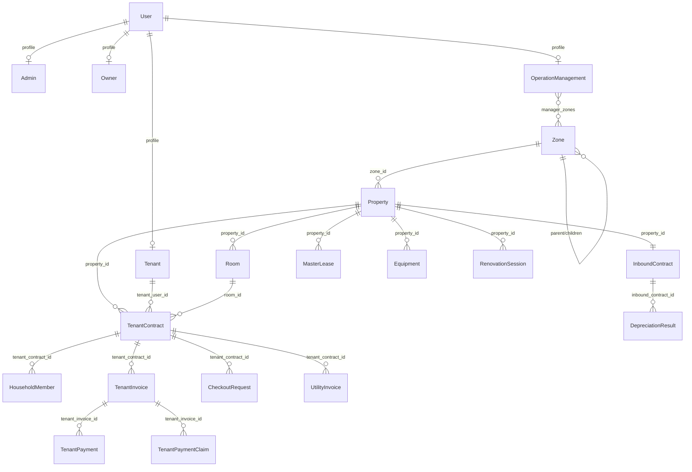
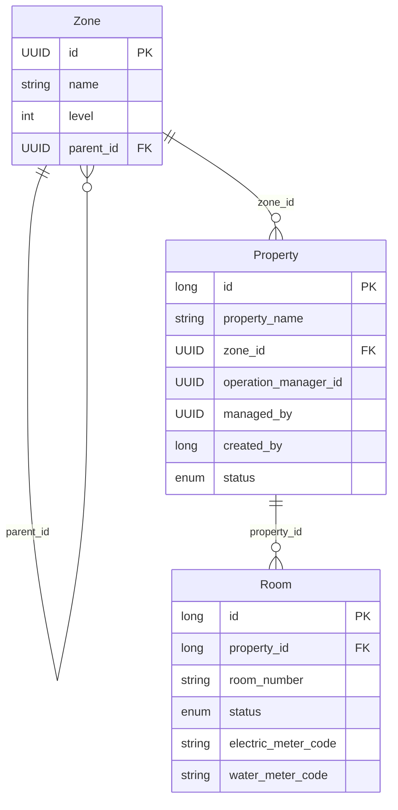
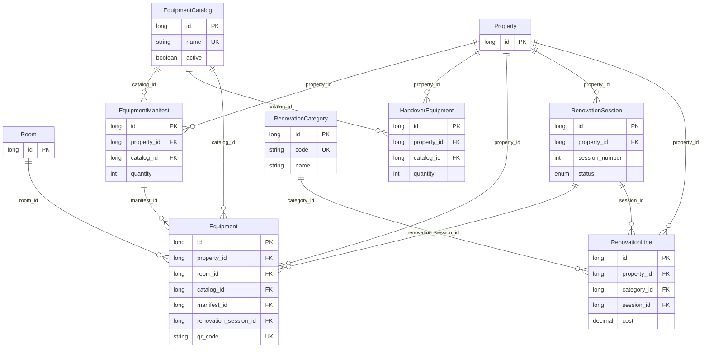
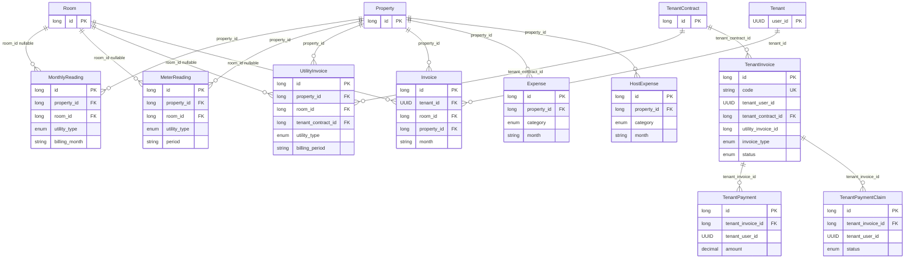
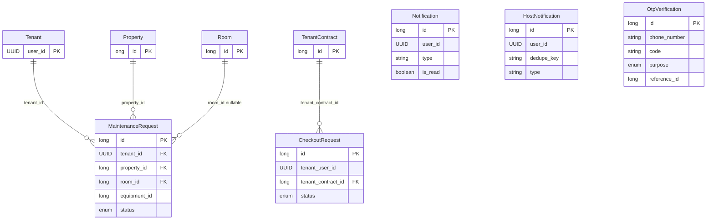

# SLMS2026 — Entity Relationship Diagram (ERD)

Tài liệu mô tả quan hệ giữa các JPA entity trong `com.sep490.slms2026.entity`, sinh từ mã nguồn hiện tại.

**Tổng số entity:** 34  
**Công nghệ:** Spring Boot + JPA/Hibernate

---

## Mục lục

1. [Sơ đồ tổng quan](#1-sơ-đồ-tổng-quan)
2. [Nhóm User & Profile](#2-nhóm-user--profile)
3. [Nhóm Khu vực & Bất động sản](#3-nhóm-khu-vực--bất-động-sản)
4. [Nhóm Thiết bị & Cải tạo](#4-nhóm-thiết-bị--cải-tạo)
5. [Nhóm Hợp đồng](#5-nhóm-hợp-đồng)
6. [Nhóm Điện nước & Hóa đơn](#6-nhóm-điện-nước--hóa-đơn)
7. [Nhóm Vận hành & Thông báo](#7-nhóm-vận-hành--thông-báo)
8. [Bảng trung gian & collection](#8-bảng-trung-gian--collection)
9. [Danh sách entity](#9-danh-sách-entity)
10. [Ma trận quan hệ](#10-ma-trận-quan-hệ)

---

## 1. Sơ đồ tổng quan



---

## 2. Nhóm User & Profile

Pattern **Joined Table Inheritance**: mỗi role có bảng profile riêng, PK = `user_id` (shared primary key với `User`).

```mermaid
erDiagram
    User {
        UUID id PK
        string username UK
        string phoneNumber UK
        string fullName UK
        enum role
        enum status
    }

    Admin {
        UUID user_id PK_FK
        datetime start_at
    }

    Owner {
        UUID user_id PK_FK
    }

    Tenant {
        UUID user_id PK_FK
        string cccd
    }

    OperationManagement {
        UUID user_id PK_FK
        datetime start_at
    }

    User ||--|| Admin : "1-1 MapsId"
    User ||--|| Owner : "1-1 MapsId"
    User ||--|| Tenant : "1-1 MapsId"
    User ||--|| OperationManagement : "1-1 MapsId"
```

| Quan hệ | Kiểu | Ghi chú |
|---------|------|---------|
| User ↔ Admin | 1:1 | `Admin.user_id` = PK + FK |
| User ↔ Owner | 1:1 | `Owner.user_id` = PK + FK |
| User ↔ Tenant | 1:1 | `Tenant.user_id` = PK + FK |
| User ↔ OperationManagement | 1:1 | `Operation_Management.user_id` = PK + FK |
| OperationManagement ↔ Zone | N:N | Bảng trung gian `manager_zones` |

**Tham chiếu lỏng (không có `@ManyToOne`):**

| Bảng | Cột | Tham chiếu logic |
|------|-----|------------------|
| `notifications` | `user_id` | `User.id` |
| `host_notifications` | `user_id` | `User.id` |
| `properties` | `operation_manager_id` | `User.id` (Operation Manager) |
| `properties` | `managed_by` | `User.id` |
| `tenant_invoices` | `tenant_user_id` | `Tenant.user_id` / `User.id` |
| `tenant_payments` | `tenant_user_id` | `Tenant.user_id` |
| `tenant_payment_claims` | `tenant_user_id` | `Tenant.user_id` |
| `checkout_requests` | `tenant_user_id` | `Tenant.user_id` |
| `meter_readings` | `recorded_by` | `User.id` |
| `utility_invoices` | `created_by` | `User.id` |

---

## 3. Nhóm Khu vực & Bất động sản



| Quan hệ | Kiểu | FK |
|---------|------|-----|
| Zone → Zone (parent) | N:1 (self) | `Zone.parent_id` |
| Zone → Property | 1:N | `properties.zone_id` |
| Property → Room | 1:N | `rooms.property_id` |

**Collection table:** `property_images` (`property_id`, `image_url`) — ảnh của Property (`@ElementCollection`).

---

## 4. Nhóm Thiết bị & Cải tạo



| Quan hệ | Kiểu | Ghi chú |
|---------|------|---------|
| Property → Equipment | 1:N | Thiết bị vận hành (có QR, khấu hao) |
| Property → HandoverEquipment | 1:N | Thiết bị bàn giao chủ nhà (chỉ hiển thị) |
| Property → EquipmentManifest | 1:N | Kế hoạch/biên bản thiết bị theo property |
| Property → RenovationSession | 1:N | Unique `(property_id, session_number)` |
| Property → RenovationLine | 1:N | Chi phí cải tạo |
| Room → Equipment | 1:N | `room_id` nullable (thiết bị chung tòa) |
| EquipmentCatalog → * | 1:N | Danh mục master |
| RenovationCategory → RenovationLine | 1:N | Loại hạng mục cải tạo |
| RenovationSession → RenovationLine | 1:N | `session_id` nullable |
| RenovationSession → Equipment | 1:N | Thiết bị mua trong đợt cải tạo |

---

## 5. Nhóm Hợp đồng

```mermaid
erDiagram
    Property {
        long id PK
    }

    InboundContract {
        long id PK
        long property_id FK_UK
        string contract_code UK
        enum status
    }

    MasterLease {
        long id PK
        long property_id FK
        enum status
    }

    DepreciationResult {
        long id PK
        long inbound_contract_id FK
        long room_id FK
        decimal total_investment
        decimal monthly_depreciation
    }

    Tenant {
        UUID user_id PK
    }

    Room {
        long id PK
    }

    TenantContract {
        long id PK
        UUID tenant_user_id FK
        long property_id FK
        long room_id FK
        string contract_code UK
        enum status
        enum payment_status
    }

    HouseholdMember {
        long id PK
        long tenant_contract_id FK
        string full_name
        string cccd
    }

    Property ||--|| InboundContract : "1-1 unique property_id"
    Property ||--o{ MasterLease : "property_id"
    Property ||--o{ TenantContract : "property_id"

    InboundContract ||--o{ DepreciationResult : "inbound_contract_id"
    Room ||--o{ DepreciationResult : "room_id nullable"

    Tenant ||--o{ TenantContract : "tenant_user_id"
    Room ||--o{ TenantContract : "room_id nullable"

    TenantContract ||--o{ HouseholdMember : "tenant_contract_id"
```

| Quan hệ | Kiểu | Ghi chú |
|---------|------|---------|
| Property ↔ InboundContract | 1:1 | HĐ thuê từ chủ nhà gốc; `property_id` unique |
| Property → MasterLease | 1:N | HĐ master lease (song song InboundContract) |
| InboundContract → DepreciationResult | 1:N | Kết quả khấu hao |
| Room → DepreciationResult | 1:N | Null = khấu hao nguyên căn |
| Tenant → TenantContract | 1:N | HĐ thuê khách |
| Property → TenantContract | 1:N | |
| Room → TenantContract | 1:N | Null khi thuê nguyên căn |
| TenantContract → HouseholdMember | 1:N | Thành viên ở cùng |

**Collection table:** `tenant_contract_condition_photos` (`tenant_contract_id`, `image_url`).

**Ràng buộc nghiệp vụ (service layer):** mỗi phòng chỉ có tối đa 1 `TenantContract` ACTIVE tại một thời điểm.

---

## 6. Nhóm Điện nước & Hóa đơn



| Quan hệ | Kiểu | Ghi chú |
|---------|------|---------|
| Property → MonthlyReading | 1:N | Unique `(property_id, room_id, utility_type, billing_month)` |
| Property → MeterReading | 1:N | Ghi chỉ số thô |
| Property → UtilityInvoice | 1:N | Hóa đơn điện/nước gửi tenant |
| Property → Invoice | 1:N | Hóa đơn tổng hợp (legacy/generic) |
| Property → Expense | 1:N | Chi phí vận hành |
| Property → HostExpense | 1:N | Chi phí chủ nhà |
| Tenant → Invoice | 1:N | |
| TenantContract → UtilityInvoice | 1:N | |
| TenantContract → TenantInvoice | 1:N | Hóa đơn tenant (tiền thuê, điện nước, …) |
| TenantInvoice → TenantPayment | 1:N | Thanh toán đã xác nhận |
| TenantInvoice → TenantPaymentClaim | 1:N | Khai báo chuyển khoản chờ duyệt |

**Tham chiếu lỏng:** `tenant_invoices.utility_invoice_id` → `utility_invoices.id` (unique, không map JPA).

---

## 7. Nhóm Vận hành & Thông báo



| Quan hệ | Kiểu | Ghi chú |
|---------|------|---------|
| Tenant → MaintenanceRequest | 1:N | Yêu cầu sửa chữa |
| Property → MaintenanceRequest | 1:N | |
| Room → MaintenanceRequest | 1:N | Nullable |
| TenantContract → CheckoutRequest | 1:N | Yêu cầu trả phòng |
| — → Notification | — | `user_id` không FK JPA |
| — → HostNotification | — | Unique `(user_id, dedupe_key)` |
| OtpVerification | độc lập | `reference_id` tham chiếu entity tùy `purpose` |

**Tham chiếu lỏng:** `maintenance_requests.equipment_id` → `equipments.id`.

---

## 8. Bảng trung gian & collection

| Bảng | Loại | Thành phần | Mô tả |
|------|------|------------|-------|
| `manager_zones` | N:N join | `manager_id` → `Operation_Management.user_id`, `zone_id` → `Zone.id` | Gán manager quản lý khu vực |
| `property_images` | Element collection | `property_id`, `image_url` | Ảnh Property |
| `tenant_contract_condition_photos` | Element collection | `tenant_contract_id`, `image_url` | Ảnh hiện trạng phòng khi ký HĐ |

---

## 9. Danh sách entity

| # | Entity | Bảng DB | PK | Mô tả ngắn |
|---|--------|---------|-----|------------|
| 1 | User | `User` | UUID | Tài khoản hệ thống |
| 2 | Admin | `Admin` | user_id | Profile quản trị viên |
| 3 | Owner | `Owner` | user_id | Profile chủ nhà |
| 4 | Tenant | `Tenant` | user_id | Profile khách thuê |
| 5 | OperationManagement | `Operation_Management` | user_id | Profile quản lý vận hành |
| 6 | Zone | `Zone` | UUID | Khu vực địa lý (cây phân cấp) |
| 7 | Property | `properties` | Long | Bất động sản cho thuê |
| 8 | Room | `rooms` | Long | Phòng / căn trong property |
| 9 | EquipmentCatalog | `equipment_catalog` | Long | Danh mục loại thiết bị |
| 10 | EquipmentManifest | `equipment_manifests` | Long | Kế hoạch thiết bị theo property |
| 11 | HandoverEquipment | `handover_equipments` | Long | Thiết bị bàn giao từ chủ nhà |
| 12 | Equipment | `equipments` | Long | Thiết bị vận hành (QR, bảo hành) |
| 13 | RenovationCategory | `renovation_categories` | Long | Loại hạng mục cải tạo |
| 14 | RenovationSession | `renovation_sessions` | Long | Đợt cải tạo |
| 15 | RenovationLine | `renovation_lines` | Long | Dòng chi phí cải tạo |
| 16 | InboundContract | `inbound_contracts` | Long | HĐ thuê nhà từ chủ gốc |
| 17 | MasterLease | `master_leases` | Long | HĐ master lease |
| 18 | DepreciationResult | `depreciation_results` | Long | Kết quả tính khấu hao |
| 19 | TenantContract | `tenant_contracts` | Long | HĐ thuê khách |
| 20 | HouseholdMember | `household_members` | Long | Thành viên ở cùng |
| 21 | MonthlyReading | `monthly_readings` | Long | Chỉ số điện/nước theo tháng |
| 22 | MeterReading | `meter_readings` | Long | Ghi chỉ số đồng hồ |
| 23 | UtilityInvoice | `utility_invoices` | Long | Hóa đơn điện/nước |
| 24 | Invoice | `invoices` | Long | Hóa đơn tổng hợp |
| 25 | TenantInvoice | `tenant_invoices` | Long | Hóa đơn gửi tenant |
| 26 | TenantPayment | `tenant_payments` | Long | Lịch sử thanh toán |
| 27 | TenantPaymentClaim | `tenant_payment_claims` | Long | Khai báo CK chờ duyệt |
| 28 | Expense | `expenses` | Long | Chi phí vận hành |
| 29 | HostExpense | `host_expenses` | Long | Chi phí chủ nhà |
| 30 | MaintenanceRequest | `maintenance_requests` | Long | Yêu cầu bảo trì |
| 31 | CheckoutRequest | `checkout_requests` | Long | Yêu cầu trả phòng |
| 32 | Notification | `notifications` | Long | Thông báo in-app |
| 33 | HostNotification | `host_notifications` | Long | Thông báo chủ nhà (dedupe) |
| 34 | OtpVerification | `otp_verifications` | Long | Mã OTP xác thực |

---

## 10. Ma trận quan hệ

Ký hiệu: `1` = One, `N` = Many, `—` = không có quan hệ JPA trực tiếp.

| Entity (cha) | Entity (con) | Cardinality | FK column |
|--------------|--------------|-------------|-----------|
| User | Admin | 1:1 | Admin.user_id |
| User | Owner | 1:1 | Owner.user_id |
| User | Tenant | 1:1 | Tenant.user_id |
| User | OperationManagement | 1:1 | Operation_Management.user_id |
| OperationManagement | Zone | N:N | manager_zones |
| Zone | Zone | 1:N (self) | Zone.parent_id |
| Zone | Property | 1:N | properties.zone_id |
| Property | Room | 1:N | rooms.property_id |
| Property | InboundContract | 1:1 | inbound_contracts.property_id |
| Property | MasterLease | 1:N | master_leases.property_id |
| Property | Equipment | 1:N | equipments.property_id |
| Property | EquipmentManifest | 1:N | equipment_manifests.property_id |
| Property | HandoverEquipment | 1:N | handover_equipments.property_id |
| Property | RenovationSession | 1:N | renovation_sessions.property_id |
| Property | RenovationLine | 1:N | renovation_lines.property_id |
| Property | MonthlyReading | 1:N | monthly_readings.property_id |
| Property | MeterReading | 1:N | meter_readings.property_id |
| Property | UtilityInvoice | 1:N | utility_invoices.property_id |
| Property | Invoice | 1:N | invoices.property_id |
| Property | Expense | 1:N | expenses.property_id |
| Property | HostExpense | 1:N | host_expenses.property_id |
| Property | TenantContract | 1:N | tenant_contracts.property_id |
| Property | MaintenanceRequest | 1:N | maintenance_requests.property_id |
| Room | Equipment | 1:N | equipments.room_id |
| Room | TenantContract | 1:N | tenant_contracts.room_id |
| Room | DepreciationResult | 1:N | depreciation_results.room_id |
| Room | MonthlyReading | 1:N | monthly_readings.room_id |
| Room | MeterReading | 1:N | meter_readings.room_id |
| Room | UtilityInvoice | 1:N | utility_invoices.room_id |
| Room | Invoice | 1:N | invoices.room_id |
| Room | MaintenanceRequest | 1:N | maintenance_requests.room_id |
| EquipmentCatalog | Equipment | 1:N | equipments.catalog_id |
| EquipmentCatalog | EquipmentManifest | 1:N | equipment_manifests.catalog_id |
| EquipmentCatalog | HandoverEquipment | 1:N | handover_equipments.catalog_id |
| EquipmentManifest | Equipment | 1:N | equipments.manifest_id |
| RenovationCategory | RenovationLine | 1:N | renovation_lines.category_id |
| RenovationSession | RenovationLine | 1:N | renovation_lines.session_id |
| RenovationSession | Equipment | 1:N | equipments.renovation_session_id |
| InboundContract | DepreciationResult | 1:N | depreciation_results.inbound_contract_id |
| Tenant | TenantContract | 1:N | tenant_contracts.tenant_user_id |
| Tenant | Invoice | 1:N | invoices.tenant_id |
| Tenant | MaintenanceRequest | 1:N | maintenance_requests.tenant_id |
| TenantContract | HouseholdMember | 1:N | household_members.tenant_contract_id |
| TenantContract | TenantInvoice | 1:N | tenant_invoices.tenant_contract_id |
| TenantContract | UtilityInvoice | 1:N | utility_invoices.tenant_contract_id |
| TenantContract | CheckoutRequest | 1:N | checkout_requests.tenant_contract_id |
| TenantInvoice | TenantPayment | 1:N | tenant_payments.tenant_invoice_id |
| TenantInvoice | TenantPaymentClaim | 1:N | tenant_payment_claims.tenant_invoice_id |

---

## Ghi chú thiết kế

1. **Profile theo role:** Mỗi `User` chỉ nên có một profile tương ứng `role` (Admin / Owner / Tenant / OperationManagement); không enforce ở DB.
2. **Hai loại hợp đồng inbound:** `InboundContract` (1:1 Property) và `MasterLease` (1:N Property) cùng tồn tại — kiểm tra nghiệp vụ khi dùng.
3. **Hai luồng thiết bị:** `HandoverEquipment` (bàn giao, không vận hành) vs `Equipment` (vận hành, QR, khấu hao).
4. **Hai luồng đọc chỉ số:** `MeterReading` (ghi nhận thô) vs `MonthlyReading` (tính tiền theo tháng).
5. **FK mềm:** Nhiều cột UUID/Long (`user_id`, `equipment_id`, `utility_invoice_id`) không khai báo `@ManyToOne` — chỉ ràng buộc ở tầng service.

---

*Tài liệu sinh tự động từ entity JPA — cập nhật khi thêm/sửa entity trong `src/main/java/com/sep490/slms2026/entity/`.*
