# Sequence Diagram — Report 4 (Software Design Document)

Tài liệu bổ sung cho **Report 4 – Software Design Document**, mô tả các luồng nghiệp vụ trong §3 bằng **sequence diagram dễ đọc**: hành động diễn đạt bằng ngôn ngữ nghiệp vụ, **không** ghi URL API.

**Phạm vi sprint hiện tại:** §3.1 – §3.4 (4 luồng chính).

---

## Quy ước chung

| Thành phần | Ý nghĩa |
|------------|---------|
| **Admin** | Quản trị hệ thống (`ROLE_ADMIN`) |
| **Host** | Chủ nhà (`ROLE_OWNER`) |
| **Manager** | Quản lý vận hành (`ROLE_MANAGER`) |
| **Khách thuê** | Người thuê nhà (`ROLE_TENANT`) |
| **Ứng dụng Web** | Cổng quản trị React (Admin / Host) |
| **Ứng dụng Mobile** | App React Native (Manager / Khách thuê) |
| **Hệ thống** | Backend xử lý nghiệp vụ & lưu trữ |
| **Cơ sở dữ liệu** | Database quan hệ |
| **PayOS** | Cổng thanh toán / QR |
| **Cloudinary** | Lưu trữ ảnh & file |
| **Dịch vụ OCR** | Đọc chỉ số đồng hồ / hóa đơn từ ảnh |
| **Thông báo** | Push notification tới điện thoại |

---

## 3.1 Tiếp khách (Tenant Onboarding)

### 3.1.2 Tạo hợp đồng nháp & gán Manager

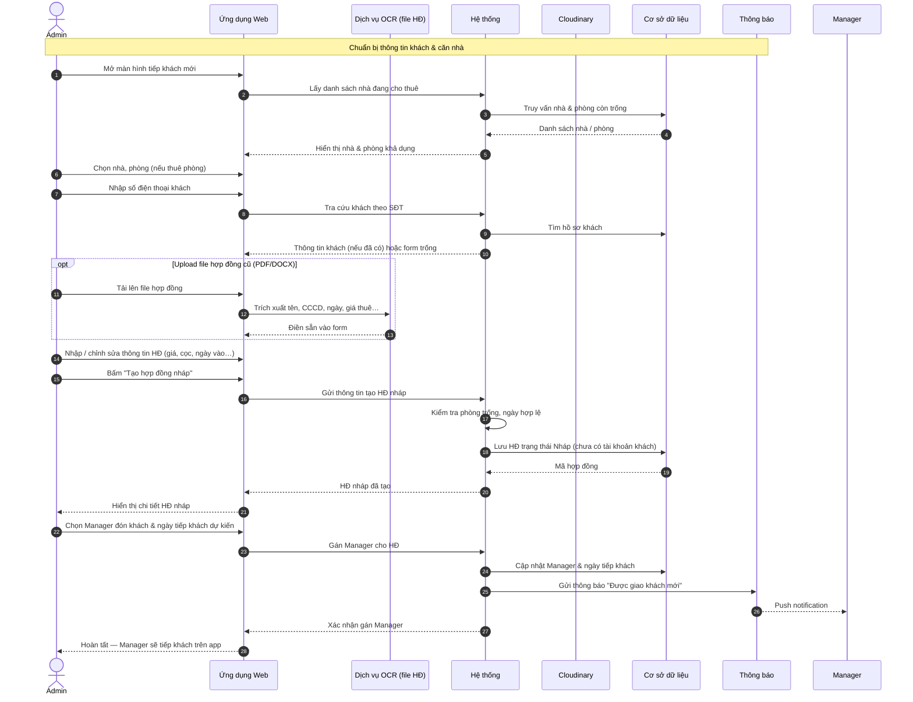

### 3.1.3 Ghi nhận hiện trạng phòng & chỉ số đồng hồ ban đầu

> *Thiết kế mục tiêu — chưa triển khai đầy đủ trên `ResumeContractScreen`.*

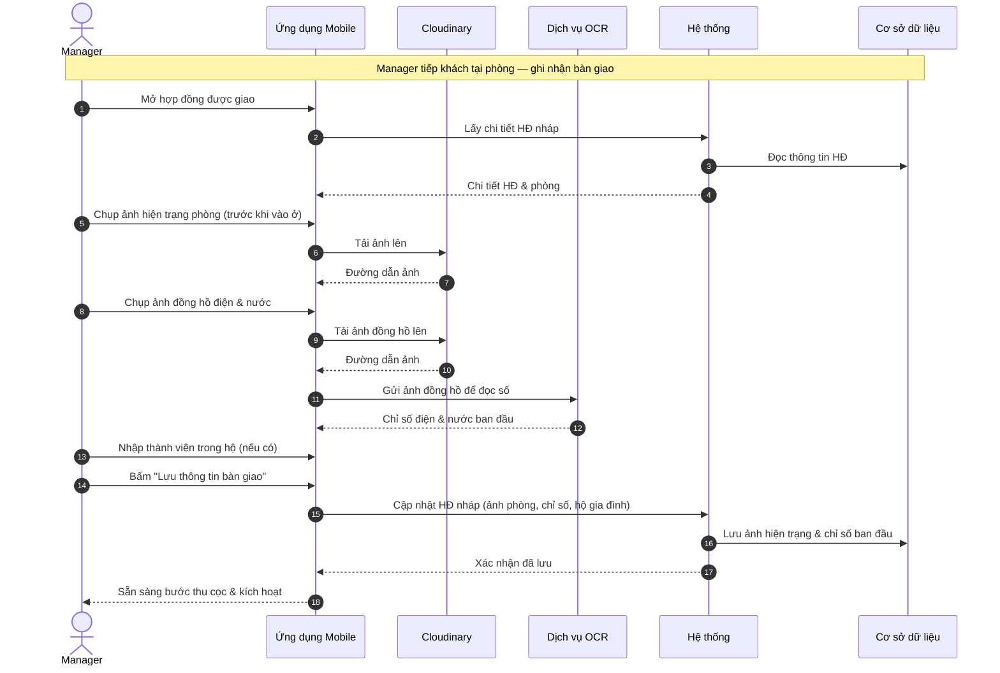

### 3.1.4 Thu cọc, xác nhận OTP & kích hoạt hợp đồng

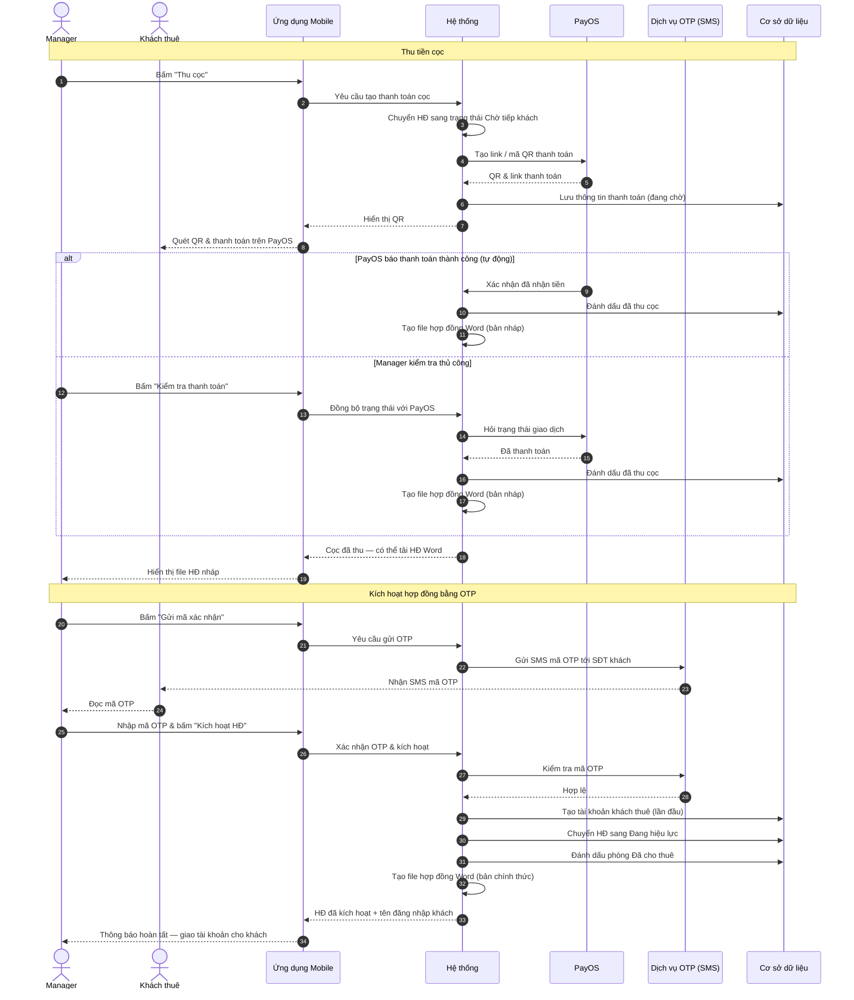

---

## 3.2 Thu phí hàng tháng & Thanh toán

### 3.2.2 Manager lập hóa đơn điện / nước

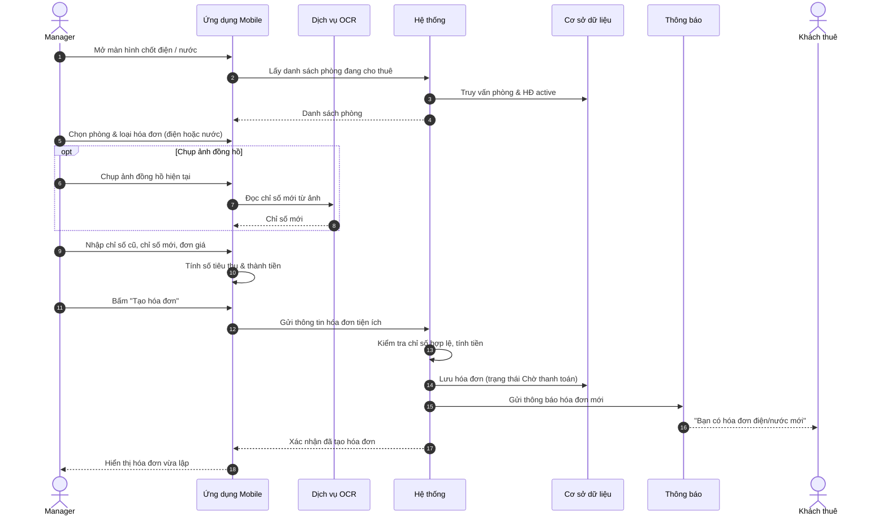

### 3.2.3 Manager lập hóa đơn tiền thuê

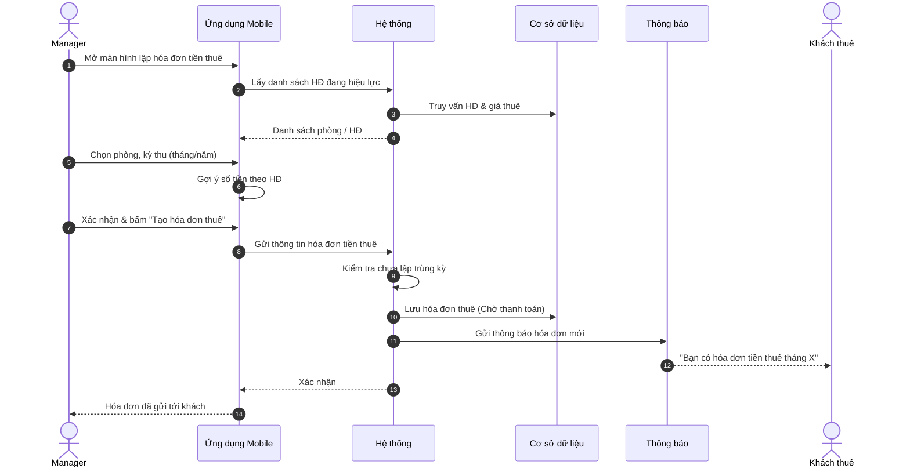

### 3.2.4 Khách thanh toán qua PayOS

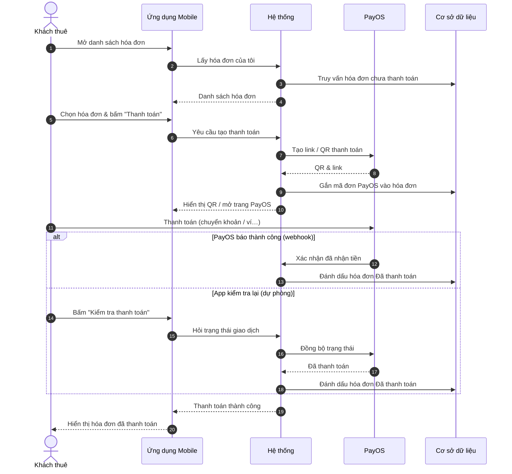

### 3.2.5 Manager xác minh thanh toán thủ công / ghi nhận tiền mặt

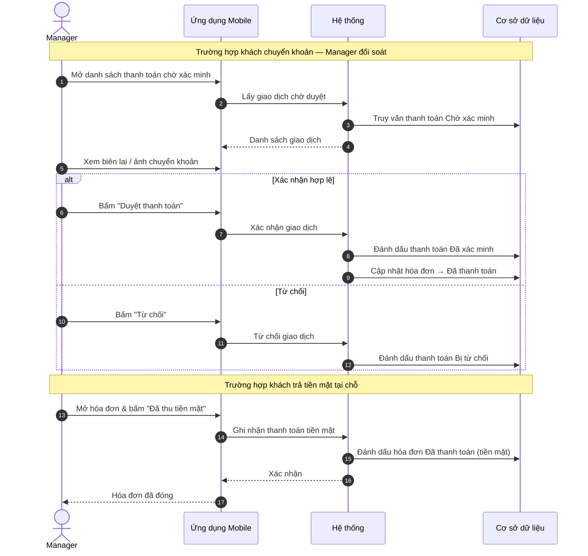

---

## 3.3 Bảo trì thiết bị

### 3.3.2 Gửi yêu cầu, lên lịch & hoàn tất sửa chữa

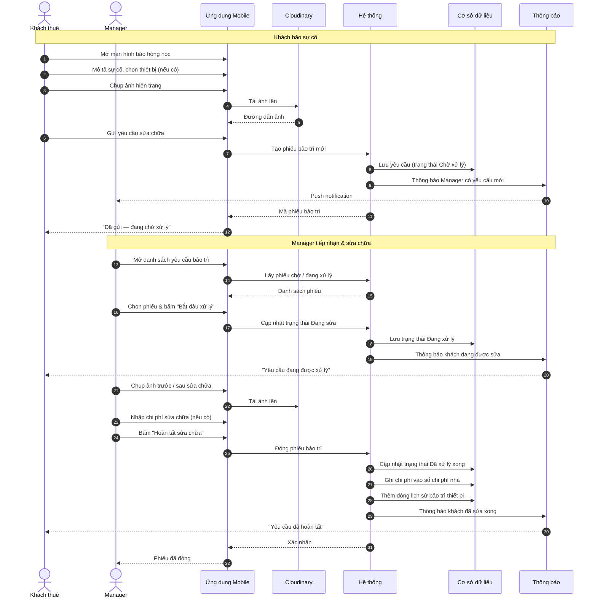

### 3.3.3 Cập nhật vòng đời thiết bị

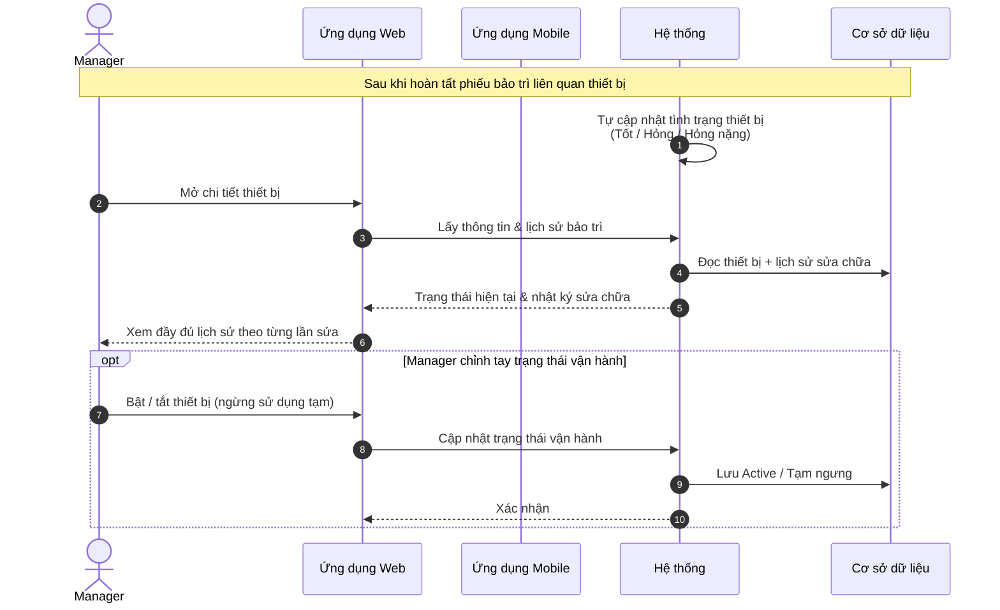

---

## 3.4 Nhập nhà & Kích hoạt lên hệ thống

### 3.4.2 Nhập hàng loạt qua Excel ("Khởi tạo nhà" + "Cấu hình khai thác")

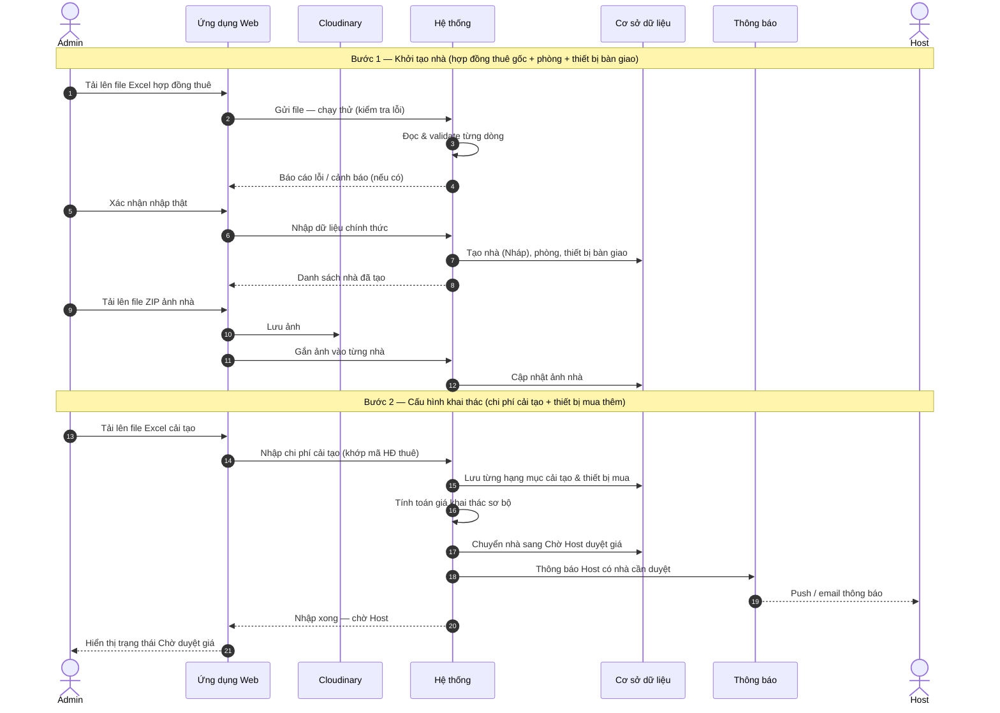

### 3.4.3 Host duyệt giá & Admin kích hoạt nhà

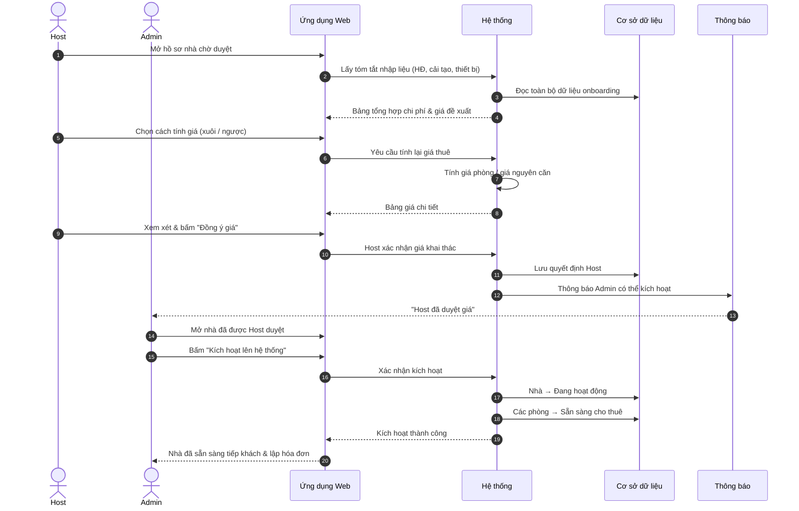

### 3.4.4 Cải tạo bổ sung trên nhà đang hoạt động

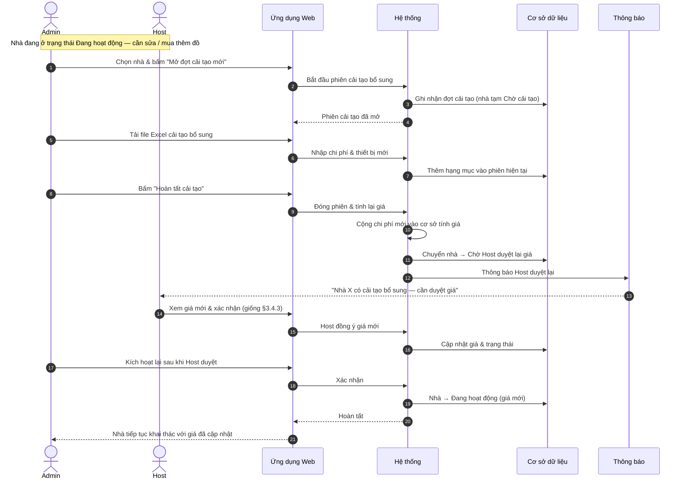

---

## Gợi ý chèn vào Report 4

Thay các placeholder trong SDD:

| Mục SDD | File diagram (export PNG/SVG từ Mermaid) |
|---------|------------------------------------------|
| §3.1.2 | `3.1.2-sequence-draft-assign.png` |
| §3.1.3 | `3.1.3-sequence-room-condition.png` |
| §3.1.4 | `3.1.4-sequence-deposit-otp-activate.png` |
| §3.2.2 | `3.2.2-sequence-utility-invoice.png` |
| §3.2.3 | `3.2.3-sequence-rent-invoice.png` |
| §3.2.4 | `3.2.4-sequence-tenant-payos.png` |
| §3.2.5 | `3.2.5-sequence-manager-verify-payment.png` |
| §3.3.2 | `3.3.2-sequence-maintenance.png` |
| §3.3.3 | `3.3.3-sequence-equipment-lifecycle.png` |
| §3.4.2 | `3.4.2-sequence-bulk-import.png` |
| §3.4.3 | `3.4.3-sequence-host-activation.png` |
| §3.4.4 | `3.4.4-sequence-renovation-supplement.png` |

**Cách export:** dán từng khối `mermaid` vào [mermaid.live](https://mermaid.live) hoặc extension Mermaid trong VS Code / draw.io → Export PNG.

---

## Tham chiếu kỹ thuật (ẩn khỏi diagram)

Chi tiết endpoint API & class diagram nằm ở:

- [`tenant-onboarding-sequence-diagrams.md`](./tenant-onboarding-sequence-diagrams.md) — onboarding (có API map)
- [`FE-BE-tenant-onboarding-flow.md`](./FE-BE-tenant-onboarding-flow.md) — luồng FE/BE onboarding
