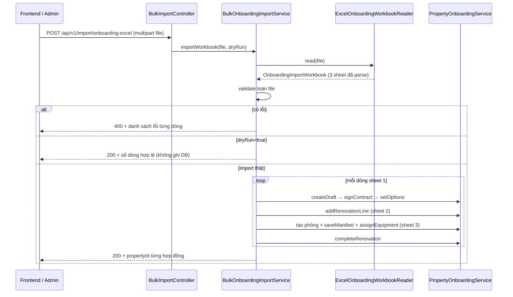

# Backend Import Excel Onboarding — SLMS2026

Tài liệu mô tả cách backend đọc file `SLMS2026_v1.xlsx`, quét 3 sheet dữ liệu và import vào hệ thống.

---

## 1. Tổng quan luồng xử lý



**Nguyên tắc:** Import chạy **tuần tự 3 bước** đúng như onboarding thủ công:

1. **Sheet 1** — Tạo nhà + hợp đồng inbound  
2. **Sheet 2** — Ghi chi phí cải tạo (nếu `Có cải tạo không = TRUE`)  
3. **Sheet 3** — Khai báo manifest thiết bị + gán vị trí  

Sau import, mỗi căn nhà dừng ở trạng thái **`RENOVATION_COMPLETED`** (hoàn tất 3 quy trình onboarding, chưa gửi host).

---

## 2. File Excel — sheet nào được đọc?

| Sheet | Đọc khi import? | Vai trò |
|-------|-----------------|---------|
| `0. Huong_Dan` | Không | Hướng dẫn người dùng |
| `0. Danh_Muc_Tham_Khao` | Không | Tra cứu mã danh mục / catalog |
| `1. Hop_Dong_Thue` | **Có** | 1 dòng = 1 Property + 1 InboundContract |
| `2. Hop_Dong_Cai_Tao` | **Có** | N dòng chi phí cải tạo / hợp đồng |
| `3. Phan_Bo_Thiet_Bi` | **Có** | N dòng phân bổ thiết bị / hợp đồng |

Parser (`ExcelOnboardingWorkbookReader`) dùng **Apache POI**, đọc header dòng 1, map theo **tên cột** (không phụ thuộc vị trí cột cố định nếu tên đúng).

---

## 3. API endpoint

```
POST /api/v1/import/onboarding-excel
Content-Type: multipart/form-data
Authorization: Bearer <token ADMIN>
```

| Param | Kiểu | Bắt buộc | Mô tả |
|-------|------|----------|-------|
| `file` | file `.xlsx` | Có | File template đã điền |
| `dryRun` | boolean | Không (default `false`) | `true` = chỉ validate, không ghi DB |

### Response thành công (200)

```json
{
  "dryRun": false,
  "contractsProcessed": 1,
  "renovationLinesImported": 2,
  "equipmentRowsImported": 3,
  "results": [
    {
      "contractCode": "HD-2026-VILLACG",
      "propertyId": 42,
      "propertyName": "Vinhomes Villa Cầu Giấy",
      "finalStatus": "RENOVATION_COMPLETED"
    }
  ],
  "errors": []
}
```

### Response lỗi validation (400)

```json
{
  "status": 400,
  "error": "Bulk import validation failed",
  "message": "File Excel có lỗi validation",
  "errors": [
    {
      "sheet": "1. Hop_Dong_Thue",
      "rowNumber": 2,
      "contractCode": "HD-2026-VILLACG",
      "field": "Zone",
      "message": "Không tìm thấy Quận/Huyện 'Cầu Giấy' thuộc Hà Nội"
    }
  ]
}
```

---

## 4. Chi tiết xử lý từng sheet

### 4.1 Sheet `1. Hop_Dong_Thue`

Mỗi dòng tạo **một căn nhà** theo thứ tự gọi service có sẵn:

| Bước | Service / hành động | Kết quả DB |
|------|---------------------|------------|
| 1 | `createDraft` | `Property` status `DRAFT` |
| 2 | Gán `hostContingencyPercent` (nếu có) | Cột P |
| 3 | `signContract` | `InboundContract` + status `PENDING` |
| 4 | `setOnboardingOptions` | `wholeHouse`, `hasRenovation` + status `UNDER_RENOVATION` |

**Map Zone địa lý (chỉ 2 cấp):**

| Excel | Zone DB | Ghi chú |
|-------|---------|---------|
| `Tỉnh/Thành phố` | level `1` | Tìm zone gốc (không có parent) |
| `Quận/Huyện` | level `2` | Tìm zone con của tỉnh → gán `Property.zone_id` |
| `Xã/Phường` | — | **Không** map Zone; ghép vào địa chỉ: `{địa chỉ}, {phường}` |

Địa chỉ đầy đủ khi lưu: `{địa chỉ chi tiết}[, {phường}], {quận}, {tỉnh}` (phần quận/tỉnh do `createDraft` tự nối từ Zone).

**Map hình thức thuê:**

| Excel | `Property.wholeHouse` |
|-------|------------------------|
| `WHOLE_HOUSE` | `true` |
| `INDIVIDUAL_ROOM` | `false` |

**Map cải tạo:** `TRUE` / `FALSE` (chuỗi, không phân biệt hoa thường).

---

### 4.2 Sheet `2. Hop_Dong_Cai_Tao`

Chỉ xử lý khi sheet 1 của cùng `Mã hợp đồng thuê` có `Có cải tạo không = TRUE`.

| Cột | Xử lý |
|-----|--------|
| `Mã hợp đồng thuê` | Liên kết với sheet 1 |
| `Mã danh mục cải tạo` | `RenovationCategory.code` → `addRenovationLine` |
| `Chi phí cải tạo (VNĐ)` | `RenovationLine.cost` |
| `Ghi chú chi tiết` | `RenovationLine.note` |

**Validation chéo sheet:**

- `hasRenovation=FALSE` mà sheet 2 có dòng → **lỗi**
- `hasRenovation=TRUE` mà sheet 2 không có dòng → **lỗi**

---

### 4.3 Sheet `3. Phan_Bo_Thiet_Bi`

Xử lý theo 3 phase cho mỗi hợp đồng:

#### Phase A — Tạo phòng nháp (nếu có `Số phòng`)

- Lấy tập `Số phòng` distinct từ sheet 3
- Gọi `RoomService.addRoom` cho từng số phòng chưa tồn tại
- Suy luận tầng từ số phòng: `101` → tầng `1`, `201` → tầng `2`
- Diện tích mặc định: `areaSize / totalRooms`

#### Phase B — Lưu manifest (`saveEquipmentManifest`)

Gom nhóm các dòng theo `(catalogId, source, status, price)` và **cộng dồn `Số lượng`**.

Ví dụ 2 dòng cùng `Điều hòa / PURCHASED / NEW / 16.500.000` → 1 manifest item quantity = tổng.

#### Phase C — Gán thiết bị (`assignEquipment`)

Mỗi dòng sheet 3 gọi `assignEquipment` một lần:

| Cột | Map request |
|-----|-------------|
| `Số phòng` | `roomId` (sau khi tạo phòng) |
| `Khu vực chung` | `houseArea` enum (`LIVING_ROOM`, `KITCHEN`, …) |
| `Tên Catalog thiết bị` | tra `EquipmentCatalog.name` → `catalogId` |
| `Nguồn gốc thiết bị` | `INITIAL_HANDOVER` / `PURCHASED` |
| `Trạng thái thiết bị` | Chỉ `NEW` hoặc `GOOD` khi import |
| `Số lượng` | `quantity` |
| `Đơn giá (VNĐ)` | Bắt buộc > 0 nếu `PURCHASED`; = 0 nếu bàn giao |

**Quy tắc vị trí:** điền **hoặc** `Số phòng` **hoặc** `Khu vực chung`, không được cả hai hoặc bỏ trống cả hai.

> **Lưu ý code:** `assignEquipment` đã được cập nhật để chấp nhận gán chỉ bằng `houseArea` (không bắt buộc `roomId`) — phù hợp dòng kiểu `LIVING_ROOM` trong file mẫu.

#### Phase D — Hoàn tất onboarding

`completeRenovation(propertyId)` → status **`RENOVATION_COMPLETED`**.

---

## 5. Cấu trúc code backend

```
src/main/java/com/sep490/slms2026/
├── controller/
│   └── BulkImportController.java          # API multipart upload
├── service/
│   ├── BulkOnboardingImportService.java
│   └── impl/
│       └── BulkOnboardingImportServiceImpl.java   # validate + orchestrate
├── imports/
│   ├── ExcelOnboardingWorkbookReader.java # Apache POI parse 3 sheet
│   ├── OnboardingImportWorkbook.java
│   ├── LeaseContractImportRow.java
│   ├── RenovationImportRow.java
│   └── EquipmentImportRow.java
├── dto/response/
│   ├── BulkImportResponse.java
│   ├── BulkImportContractResultResponse.java
│   └── BulkImportErrorResponse.java
└── exception/
    └── BulkImportValidationException.java
```

**Dependency mới:** `org.apache.poi:poi-ooxml:5.4.0` trong `pom.xml`.

**Repository bổ sung:**

- `InboundContractRepository.existsByContractCode`
- `EquipmentCatalogRepository.findFirstByNameIgnoreCaseAndActiveTrue`
- `ZoneRepository.findCityLevelZoneByNameIgnoreCase`
- `ZoneRepository.findDistrictLevelZoneByNameIgnoreCaseAndParentId`
- `imports/ZoneImportResolver` — tra cứu 2 cấp Zone khi import
- `RoomRepository.findByPropertyIdAndRoomNumberAndDeletedIsFalse`

---

## 6. Quy tắc validate (trước khi ghi DB)

| Nhóm | Rule |
|------|------|
| File | Phải có đủ 3 sheet tên chính xác |
| Sheet 1 | Mã HĐ unique trong file + chưa tồn tại DB |
| Sheet 1 | Ngày kết thúc > ngày bắt đầu |
| Sheet 1 | Zone tỉnh + quận phải có trong DB |
| Sheet 2 | Mã HĐ phải có ở sheet 1; mã danh mục phải tồn tại |
| Sheet 3 | Catalog name phải khớp DB (ignore case) |
| Sheet 3 | PURCHASED → giá > 0; INITIAL_HANDOVER → giá = 0 |
| Sheet 3 | Trạng thái chỉ NEW / GOOD |
| Chéo sheet | `hasRenovation` khớp với có/không có dòng sheet 2 |

Nếu **bất kỳ** lỗi nào → trả về **toàn bộ lỗi** cùng lúc, **không import** (kể cả khi chỉ 1 dòng sai).

---

## 7. Transaction & dry-run

- `importWorkbook` chạy trong **một `@Transactional`**: lỗi giữa chừng → rollback toàn bộ.
- `dryRun=true`: parse + validate xong dừng, **không gọi** create/sign/assign.

---

## 8. Điều kiện tiên quyết trước khi import

1. **Zone** đã seed trong DB (ít nhất Tỉnh + Quận khớp file).  
   Ví dụ mẫu: `Hà Nội` (level 1) → `Cầu Giấy` (level 2, parent = Hà Nội).

2. **RenovationCategory** và **EquipmentCatalog** đã có (từ `MasterDataSeeder`).

3. Tài khoản gọi API có role **ADMIN**.

---

## 9. Test nhanh bằng curl

```bash
# Validate only
curl -X POST "http://localhost:8080/api/v1/import/onboarding-excel?dryRun=true" \
  -H "Authorization: Bearer <ADMIN_TOKEN>" \
  -F "file=@docs/SLMS2026_v1.xlsx"

# Import thật
curl -X POST "http://localhost:8080/api/v1/import/onboarding-excel" \
  -H "Authorization: Bearer <ADMIN_TOKEN>" \
  -F "file=@docs/SLMS2026_v1.xlsx"
```

---

## 10. Việc còn lại sau import (ngoài scope file Excel)

Import chỉ đưa nhà tới `RENOVATION_COMPLETED`. Các bước tiếp theo vẫn làm qua API onboarding hiện có:

1. `POST /properties/{id}/submit-to-host` — tính khấu hao, gửi host  
2. `POST /properties/{id}/host-confirm` — host xác nhận giá  
3. `POST /properties/{id}/operation-manager` — gán manager, kích hoạt `ACTIVE`

---

## 11. File template tham chiếu

- Template chuẩn: `docs/SLMS2026_v1.xlsx`
- Đặc tả cột gốc: `excel_import_format_design.md`
- Script tái tạo template: `scripts/fix-slms2016-template.js`
