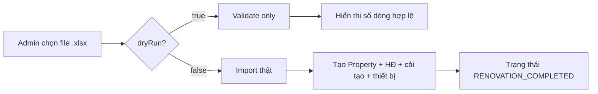

# Import Excel Onboarding hàng loạt — Hướng dẫn Frontend

Tài liệu cho team FE tích hợp màn **Import hàng loạt** (bulk onboarding) từ file Excel.

| Tài liệu liên quan | Đối tượng |
|--------------------|-----------|
| `docs/excel-import-backend.md` | Chi tiết luồng backend, entity DB |
| `docs/excel-import-test-scenarios.md` | Kịch bản QA |
| `excel_import_format_design.md` | Đặc tả cột Excel đầy đủ |
| `docs/SLMS2026_v2.xlsx` | **Template chuẩn** (file mẫu để tải về) |

---

## 1. Tổng quan nghiệp vụ

Một file Excel chứa **3 sheet dữ liệu**. Mỗi dòng sheet 1 = **1 căn nhà + 1 hợp đồng thuê inbound**.



**Sau import thành công**, mỗi căn nhà dừng ở `RENOVATION_COMPLETED` — tương đương hoàn tất 3 bước onboarding thủ công, **chưa** gửi host và **chưa** có giá cho thuê (`properties.price`).

FE nên thiết kế luồng **2 bước**:

1. **Kiểm tra file** (`dryRun=true`) — không ghi DB.
2. **Xác nhận import** (`dryRun=false`) — chỉ bật khi bước 1 không có lỗi.

---

## 2. Quyền truy cập

| Yêu cầu | Giá trị |
|---------|---------|
| Role | `ADMIN` |
| Header | `Authorization: Bearer <access_token>` |
| Không đủ quyền | HTTP `403 Forbidden` |

---

## 3. API

### 3.1 Import / validate file Excel

```
POST /api/v1/import/onboarding-excel
Content-Type: multipart/form-data
```

#### Request (form-data)

| Field | Kiểu | Bắt buộc | Mô tả |
|-------|------|----------|-------|
| `file` | File | Có | Chỉ `.xlsx` hoặc `.xls` |
| `dryRun` | boolean (query) | Không | Mặc định `false`. `true` = chỉ validate |

#### Ví dụ `fetch`

```typescript
async function importOnboardingExcel(
  file: File,
  dryRun: boolean,
  token: string,
): Promise<BulkImportResponse> {
  const form = new FormData();
  form.append('file', file);

  const res = await fetch(
    `/api/v1/import/onboarding-excel?dryRun=${dryRun}`,
    {
      method: 'POST',
      headers: { Authorization: `Bearer ${token}` },
      body: form,
    },
  );

  if (!res.ok) {
    throw await res.json();
  }
  return res.json();
}
```

#### Ví dụ `axios`

```typescript
const { data } = await axios.post<BulkImportResponse>(
  '/api/v1/import/onboarding-excel',
  formData,
  {
    params: { dryRun: true },
    headers: {
      Authorization: `Bearer ${token}`,
      'Content-Type': 'multipart/form-data',
    },
  },
);
```

---

## 4. Response types (TypeScript)

```typescript
interface BulkImportResponse {
  dryRun: boolean;
  contractsProcessed: number;
  renovationLinesImported: number;
  equipmentRowsImported: number;
  results: BulkImportContractResult[];
  errors: BulkImportError[]; // luôn [] khi HTTP 200
}

interface BulkImportContractResult {
  contractCode: string;
  propertyId: number;
  propertyName: string;
  finalStatus: string; // "RENOVATION_COMPLETED" khi import thật
}

interface BulkImportError {
  sheet: string;       // VD: "1. Hop_Dong_Thue"
  rowNumber: number;   // số dòng Excel (1-based, gồm header)
  contractCode: string | null;
  field: string | null;
  message: string;
}

interface BulkImportValidationErrorBody {
  status: 400;
  error: 'Bulk import validation failed';
  message: string;
  errors: BulkImportError[];
}

interface BusinessErrorBody {
  status: 400 | 422;
  error?: string;
  message?: string;
}
```

---

## 5. HTTP status & cách hiển thị trên UI

| HTTP | `error` / ngữ cảnh | FE xử lý |
|------|-------------------|----------|
| `200` | Thành công | Xem mục 6 |
| `400` | `Bulk import validation failed` | Hiển thị **bảng lỗi** từ `errors[]` (sheet, dòng, cột, message) |
| `400` | `Bad Request` + `message` | Lỗi runtime/DB trong lúc import thật (VD: constraint DB). Hiển thị `message` |
| `403` | `Forbidden` | Token hết hạn hoặc không phải ADMIN |
| `422` | `BusinessException` | File/sheet thiếu, sai định dạng (VD: thiếu sheet, thiếu cột header) |

### Gợi ý UI bảng lỗi validation

| Sheet | Dòng | Mã HĐ | Cột | Lỗi |
|-------|------|-------|-----|-----|
| `1. Hop_Dong_Thue` | 2 | `HD-2026-XXX` | Mã hợp đồng | Mã hợp đồng đã tồn tại trong hệ thống |

Map `rowNumber` → highlight dòng tương ứng nếu FE có preview Excel (tùy chọn).

---

## 6. Diễn giải response thành công

### 6.1 Dry-run (`dryRun=true`)

```json
{
  "dryRun": true,
  "contractsProcessed": 1,
  "renovationLinesImported": 2,
  "equipmentRowsImported": 3,
  "results": [],
  "errors": []
}
```

| Trường | Ý nghĩa UI |
|--------|------------|
| `contractsProcessed` | Số hợp đồng / căn nhà sẽ import (sheet 1) |
| `renovationLinesImported` | Số dòng cải tạo (sheet 2) |
| `equipmentRowsImported` | Số dòng thiết bị (sheet 3) |
| `results` | **Luôn rỗng** — chưa tạo DB |

**Copy gợi ý:** *"File hợp lệ: 1 căn nhà, 2 hạng mục cải tạo, 3 dòng thiết bị. Bấm Import để ghi dữ liệu."*

### 6.2 Import thật (`dryRun=false`)

```json
{
  "dryRun": false,
  "contractsProcessed": 1,
  "renovationLinesImported": 2,
  "equipmentRowsImported": 3,
  "results": [
    {
      "contractCode": "HD-2026-VILLACG",
      "propertyId": 1,
      "propertyName": "Vinhomes Villa Cầu Giấy",
      "finalStatus": "RENOVATION_COMPLETED"
    }
  ],
  "errors": []
}
```

| Trường | Ý nghĩa UI |
|--------|------------|
| `results[].propertyId` | Link sang chi tiết nhà `/properties/{id}` |
| `results[].finalStatus` | Luôn `RENOVATION_COMPLETED` khi thành công |

**Lưu ý:** `renovationLinesImported` / `equipmentRowsImported` là **tổng số dòng** đã xử lý, không phải chỉ sheet 1.

---

## 7. Cấu trúc file Excel (template `SLMS2026_v2.xlsx`)

### 7.1 Sheet được đọc

| Sheet | Đọc? | Vai trò |
|-------|------|---------|
| `0. Huong_Dan` | Không | Hướng dẫn người dùng |
| `0. Danh_Muc_Tham_Khao` | Không | Tra cứu mã danh mục |
| `1. Hop_Dong_Thue` | **Có** | 1 dòng = 1 Property + 1 InboundContract |
| `2. Hop_Dong_Cai_Tao` | **Có** | Chi phí cải tạo |
| `3. Phan_Bo_Thiet_Bi` | **Có** | Phân bổ thiết bị |

Tên sheet phải **khớp chính xác** (kể cả prefix số và dấu chấm).

### 7.2 Sheet `1. Hop_Dong_Thue` — cột bắt buộc

| Header | Bắt buộc | Ghi chú FE (dropdown / validate client) |
|--------|----------|----------------------------------------|
| Mã hợp đồng | Có | Unique trong file + chưa có trong DB |
| Tên tòa nhà | Có | |
| Địa chỉ chi tiết | Có | Số nhà, ngõ/đường |
| Xã/Phường | Không | Có trong v1, **bỏ ở v2** — backend vẫn đọc nếu có |
| Quận/Huyện | Có | Phải khớp Zone level 2 trong DB |
| Tỉnh/Thành phố | Có | Phải khớp Zone level 1 trong DB |
| Diện tích (m²) | Có | Số > 0 |
| Tổng số tầng | Có | Số nguyên > 0 |
| Tổng số phòng | Có | Số nguyên > 0 |
| Tên chủ nhà | Có | |
| Tổng tiền thuê | Có | Số > 0 — lưu vào **hợp đồng**, không phải `properties.price` |
| Ngày bắt đầu | Có | `YYYY-MM-DD` |
| Ngày kết thúc | Có | Sau ngày bắt đầu |
| Hình thức thuê | Có | `WHOLE_HOUSE` \| `INDIVIDUAL_ROOM` |
| Có cải tạo không | Có | `TRUE` \| `FALSE` |
| Tỷ lệ chi phí dự phòng (%) | Không | 0–100 |
| Mô tả chi tiết | Có | |

### 7.3 Sheet `2. Hop_Dong_Cai_Tao`

| Header | Bắt buộc | Ghi chú |
|--------|----------|---------|
| Mã hợp đồng thuê | Có | Trùng sheet 1 |
| Mã danh mục cải tạo | Có | Mã `RenovationCategory.code` trong DB |
| Tên danh mục (Gợi ý) | Không | Chỉ hiển thị, không validate |
| Chi phí cải tạo (VNĐ) | Có | > 0 |
| Ghi chú chi tiết | Không | |

**Ràng buộc chéo:** `Có cải tạo không = TRUE` ↔ sheet 2 phải có ít nhất 1 dòng; `FALSE` ↔ sheet 2 phải trống.

### 7.4 Sheet `3. Phan_Bo_Thiet_Bi`

| Header | Bắt buộc | Ghi chú |
|--------|----------|---------|
| Mã hợp đồng thuê | Có | Trùng sheet 1 |
| Số phòng | Một trong hai | VD: `101`, `201` |
| Khu vực chung | Một trong hai | Enum `HouseArea` — xem bảng dưới |
| Tên Catalog thiết bị | Có | Khớp `EquipmentCatalog.name` (ignore case) |
| Nguồn gốc thiết bị | Có | `INITIAL_HANDOVER` \| `PURCHASED` |
| Trạng thái thiết bị | Có | Chỉ `NEW` \| `GOOD` |
| Số lượng | Có | Số nguyên > 0 |
| Đơn giá (VNĐ) | Có | PURCHASED: > 0; INITIAL_HANDOVER: = 0 |
| Ghi chú lắp đặt | Không | |

**Vị trí:** điền **hoặc** `Số phòng` **hoặc** `Khu vực chung`, không được cả hai hoặc bỏ trống cả hai.

#### Enum `Khu vực chung` (`HouseArea`)

```
LIVING_ROOM | BEDROOM | KITCHEN | BATHROOM | BALCONY | GARAGE | OTHER
```

---

## 8. Dữ liệu master cần có trước khi import

FE có thể hiển thị checklist trước màn import:

| # | Điều kiện | API gợi ý |
|---|-----------|-----------|
| 1 | Đăng nhập ADMIN | `POST /api/v1/auth/login` |
| 2 | Zone Tỉnh + Quận khớp file | `GET /api/v1/zones` |
| 3 | Danh mục cải tạo | `GET /renovation-categories` |
| 4 | Catalog thiết bị | `GET /equipment-catalog` |
| 5 | Mã HĐ chưa tồn tại | Lỗi khi trùng — không cần API riêng |

Sheet `0. Danh_Muc_Tham_Khao` trong template giúp người dùng điền đúng mã; FE có thể link sang màn quản lý master data.

---

## 9. Sau import — bước tiếp theo (ngoài scope Excel)

Import **không** thay thế các bước sau. FE có thể hiển thị checklist trên màn chi tiết nhà:

| Bước | API | Trạng thái Property trước |
|------|-----|---------------------------|
| Gửi host (tính khấu hao) | `POST /api/v1/properties/{id}/submit-to-host` | `RENOVATION_COMPLETED` |
| Host xác nhận giá | `POST /api/v1/properties/{id}/host-confirm` | `PENDING_HOST_REVIEW` |
| Gán Operation Manager | `POST /api/v1/properties/{id}/operation-manager` | `PENDING_OPERATION_MANAGER` |
| Xem tổng quan onboarding | `GET /api/v1/properties/{id}/onboarding-summary` | Mọi trạng thái |

### Phân biệt giá — tránh nhầm trên UI

| Trường DB | Nguồn | Khi nào có |
|-----------|-------|------------|
| `inbound_contracts.total_rent_amount` | Cột **Tổng tiền thuê** Excel | Ngay sau import |
| `properties.price` | Host confirm | Sau `host-confirm` |
| Ảnh nhà `property_images` | Chưa hỗ trợ import Excel | Upload riêng |
| File scan HĐ `contract_scan_url` | Chưa hỗ trợ import Excel | Upload riêng |

---

## 10. Phạm vi chưa hỗ trợ (không embed trong Excel)

| Nội dung | Trạng thái | Gợi ý FE |
|----------|------------|----------|
| Ảnh nhà (binary trong ô Excel) | Không | Màn upload ảnh sau import theo `propertyId` |
| File PDF/DOCX hợp đồng trong Excel | Không | Upload riêng → lưu URL `contract_scan_url` |
| Cột URL ảnh / URL hợp đồng trong Excel | Chưa có | Có thể bổ sung sau (phase 2) |

---

## 11. Gợi ý thiết kế màn hình

### 11.1 Layout đề xuất

```
┌─────────────────────────────────────────────┐
│  Import onboarding hàng loạt                │
├─────────────────────────────────────────────┤
│  [ Tải template SLMS2026_v2.xlsx ]        │
│  [ Chọn file .xlsx ]  drag & drop           │
│                                             │
│  [ Kiểm tra file ]     ← dryRun=true        │
│  [ Import dữ liệu ]    ← dryRun=false      │
│       (disabled đến khi kiểm tra OK)        │
└─────────────────────────────────────────────┘
```

### 11.2 State machine đơn giản

```
idle → fileSelected → validating → validateOk → importing → success
                  ↘ validateFail (show errors table)
                  ↘ importFail (show message / rollback toast)
```

### 11.3 Sau import thành công

- Toast: *"Đã import 1 căn nhà"*
- Bảng kết quả: `propertyName`, `contractCode`, `propertyId` (link), `finalStatus`
- Nút: *"Xem chi tiết nhà"* → `/properties/{propertyId}`
- Ghi chú: *"Cần gửi host để tính giá cho thuê"*

### 11.4 Template tải về

Hiện **chưa có API download template**. FE tạm thời:

- Serve static `docs/SLMS2026_v2.xlsx` từ repo / CDN, hoặc
- Copy file vào `public/templates/` của FE build.

---

## 12. Lỗi thường gặp & message

| Message | Nguyên nhân | Hướng xử lý UI |
|---------|-------------|----------------|
| Mã hợp đồng đã tồn tại trong hệ thống | Import lại cùng mã | Đổi mã trong Excel hoặc xóa bản ghi cũ |
| Không tìm thấy Quận/Huyện ... | Zone chưa seed | Hướng dẫn tạo Zone trước |
| Không tìm thấy catalog trong hệ thống | Tên thiết bị sai | Xem sheet `0. Danh_Muc_Tham_Khao` |
| Hợp đồng khai báo TRUE nhưng sheet 2 không có dòng | Thiếu chi phí cải tạo | Bổ sung sheet 2 |
| Phải điền Số phòng hoặc Khu vực chung | Sheet 3 sai vị trí | Sửa dòng lỗi |
| Thiếu sheet bắt buộc: ... | Đổi tên sheet | Dùng đúng template |
| Thiếu cột bắt buộc: ... | Sửa header | Không đổi tên cột template |

---

## 13. Checklist tích hợp FE

- [ ] Chỉ hiển thị màn cho role ADMIN
- [ ] Upload `multipart/form-data`, field name `file`
- [ ] Nút "Kiểm tra" gọi `dryRun=true`
- [ ] Nút "Import" gọi `dryRun=false`, confirm dialog
- [ ] Parse lỗi `400` + `errors[]` thành bảng có sheet/dòng/cột
- [ ] Hiển thị `contractsProcessed`, `renovationLinesImported`, `equipmentRowsImported`
- [ ] Import thật: hiển thị `results` với link `propertyId`
- [ ] Không kỳ vọng `properties.price` ngay sau import
- [ ] Link tải template `SLMS2026_v2.xlsx`
- [ ] (Tùy chọn) Loading + disable double-submit khi import

---

## 14. Tham chiếu nhanh curl

```bash
# Kiểm tra file
curl -X POST "http://localhost:8080/api/v1/import/onboarding-excel?dryRun=true" \
  -H "Authorization: Bearer $TOKEN" \
  -F "file=@docs/SLMS2026_v2.xlsx"

# Import thật
curl -X POST "http://localhost:8080/api/v1/import/onboarding-excel" \
  -H "Authorization: Bearer $TOKEN" \
  -F "file=@docs/SLMS2026_v2.xlsx"
```
