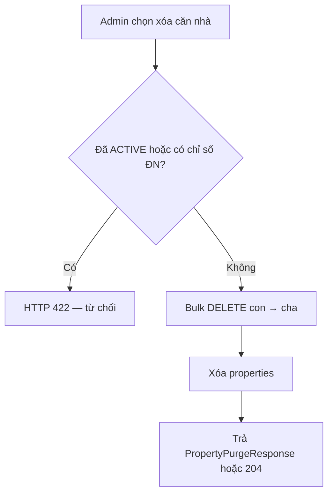
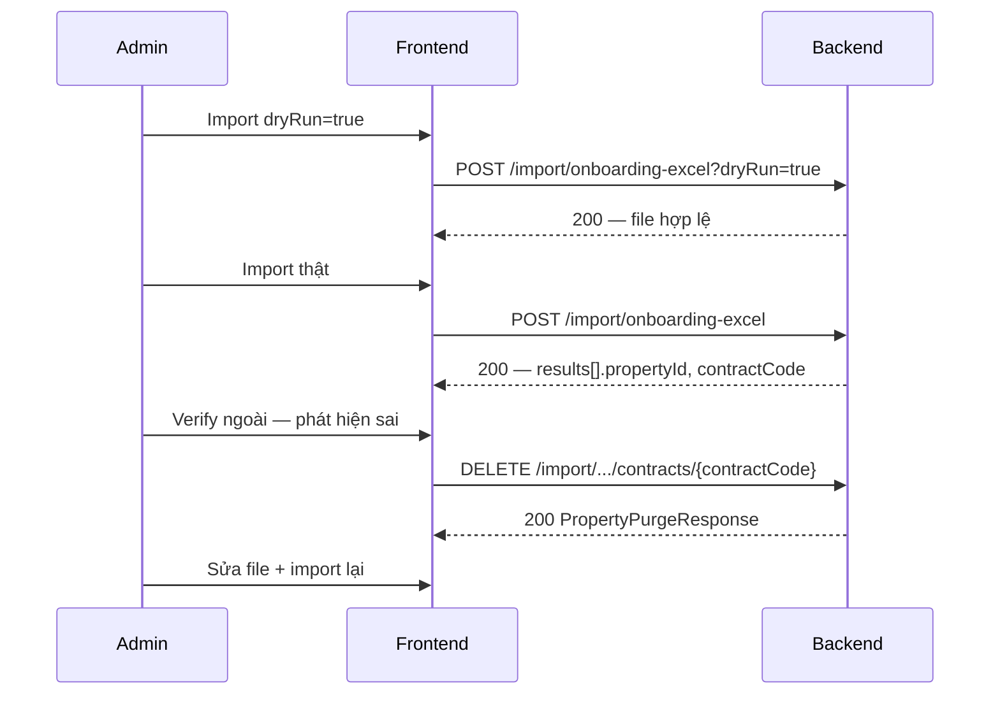

# Xóa căn nhà (Property Purge) — Hướng dẫn Frontend

Tài liệu cho team FE tích hợp **xóa cứng căn nhà** cùng toàn bộ dữ liệu onboarding (hợp đồng inbound, cải tạo, thiết bị, phòng…).

Dùng khi:

- Import Excel sai, cần **rollback** và import lại.
- Có property **mồ côi** (import dở / verify ngoài phát hiện lỗi).
- Admin xóa căn nhà chưa vận hành trên màn quản lý tòa nhà.

| Tài liệu liên quan | Đối tượng |
|--------------------|-----------|
| `docs/excel-import-frontend.md` | Import Excel hàng loạt |
| `docs/excel-import-backend.md` | Luồng backend import |
| `docs/BE-import-excel-status-constraint.md` | Lịch sử bug DB / FK (tham khảo) |
| `docs/Temp/cleanup_property.sql` | Script SQL dọn tay trên DB (DEV/ops) |

---

## 1. Tổng quan



**Đặc điểm quan trọng (2026-06-17):**

- BE **không** load từng entity con rồi `delete()` — chỉ **bulk DELETE** (JPQL + native SQL).
- Tránh lỗi FK (`renovation_lines` → `renovation_sessions`) và lỗi Hibernate `StaleObjectStateException` / `ObjectOptimisticLockingFailureException`.
- Toàn bộ thao tác trong **một transaction** — lỗi giữa chừng rollback, không để dữ liệu dở.

---

## 2. Quyền truy cập

| Yêu cầu | Giá trị |
|---------|---------|
| Role | `ADMIN` (endpoint `/purge` và xóa theo `contractCode`) |
| Header | `Authorization: Bearer <access_token>` |
| `DELETE /api/v1/properties/{id}` | Mọi user **đã đăng nhập** (cùng logic xóa bên trong) |

---

## 3. API — chọn endpoint phù hợp

### 3.1 Khuyến nghị theo ngữ cảnh

| Màn hình / ngữ cảnh | Endpoint | Response |
|---------------------|----------|----------|
| Danh sách tòa nhà — nút **Xóa** | `DELETE /api/v1/properties/{id}` | `204 No Content` |
| Import Excel — rollback theo **mã HĐ** | `DELETE /api/v1/import/onboarding-excel/contracts/{contractCode}` | `200` + body |
| Cần **chi tiết** số bản ghi đã xóa | `DELETE /api/v1/properties/{propertyId}/purge` | `200` + body |

Cả 3 endpoint gọi chung `PropertyDeletionService` — **cùng logic**, khác response.

---

### 3.2 Xóa theo `propertyId` (màn quản lý tòa nhà)

```
DELETE /api/v1/properties/{id}
Authorization: Bearer <token>
```

**Thành công:** `204 No Content` (không có body).

```typescript
async function deleteProperty(id: number, token: string): Promise<void> {
  const res = await fetch(`/api/v1/properties/${id}`, {
    method: 'DELETE',
    headers: { Authorization: `Bearer ${token}` },
  });
  if (!res.ok) throw await res.json();
}
```

---

### 3.3 Xóa theo `propertyId` + báo cáo chi tiết (purge)

```
DELETE /api/v1/properties/{propertyId}/purge
Authorization: Bearer <token>
Role: ADMIN
```

**Thành công:** `200 OK` + `PropertyPurgeResponse`.

```typescript
async function purgeProperty(propertyId: number, token: string): Promise<PropertyPurgeResponse> {
  const res = await fetch(`/api/v1/properties/${propertyId}/purge`, {
    method: 'DELETE',
    headers: { Authorization: `Bearer ${token}` },
  });
  if (!res.ok) throw await res.json();
  return res.json();
}
```

---

### 3.4 Xóa theo mã hợp đồng Excel (rollback import)

```
DELETE /api/v1/import/onboarding-excel/contracts/{contractCode}
Authorization: Bearer <token>
Role: ADMIN
```

`contractCode` = cột **Mã hợp đồng** trên sheet `1. Hop_Dong_Thue` (VD: `HD-2026-001`).

Tiện khi response import có `contractCode` mà FE chưa cần lưu `propertyId`.

```typescript
async function purgeImportedContract(
  contractCode: string,
  token: string,
): Promise<PropertyPurgeResponse> {
  const encoded = encodeURIComponent(contractCode);
  const res = await fetch(
    `/api/v1/import/onboarding-excel/contracts/${encoded}`,
    {
      method: 'DELETE',
      headers: { Authorization: `Bearer ${token}` },
    },
  );
  if (!res.ok) throw await res.json();
  return res.json();
}
```

---

## 4. Response type (TypeScript)

```typescript
interface PropertyPurgeResponse {
  propertyId: number;
  propertyName: string;
  contractCode: string | null;   // null nếu chưa ký inbound contract
  equipmentsDeleted: number;
  equipmentManifestsDeleted: number;
  renovationLinesDeleted: number;
  renovationSessionsDeleted: number;
  roomsDeleted: number;
  depreciationResultsDeleted: number;
  monthlyReadingsDeleted: number;
}
```

### Ví dụ JSON (`200`)

```json
{
  "propertyId": 19,
  "propertyName": "Biệt thự ABC",
  "contractCode": "HD-2026-001",
  "equipmentsDeleted": 3,
  "equipmentManifestsDeleted": 2,
  "renovationLinesDeleted": 2,
  "renovationSessionsDeleted": 1,
  "roomsDeleted": 4,
  "depreciationResultsDeleted": 0,
  "monthlyReadingsDeleted": 0
}
```

**Copy gợi ý UI:** *"Đã xóa căn nhà **Biệt thự ABC** (HĐ HD-2026-001): 3 thiết bị, 2 manifest, 2 dòng cải tạo, 4 phòng."*

---

## 5. HTTP status & hiển thị lỗi

| HTTP | Ngữ cảnh | `message` / `error` mẫu | FE xử lý |
|------|----------|-------------------------|----------|
| `204` | `DELETE /properties/{id}` thành công | — | Toast "Đã xóa", refresh list |
| `200` | Purge / xóa theo contractCode | Body `PropertyPurgeResponse` | Toast + có thể show chi tiết |
| `403` | Không đủ quyền ADMIN | Forbidden | Yêu cầu đăng nhập ADMIN |
| `404` | Không tìm thấy property / contractCode | `Không tìm thấy tòa nhà ID=…` / `Không tìm thấy hợp đồng inbound…` | Báo đã xóa hoặc sai mã |
| `422` | Nghiệp vụ từ chối | Xem mục 6 | Hiển thị `error` trong body |
| `400` | Lỗi runtime khác | `message` trong body | Hiển thị `message` (hiếm sau bản fix bulk delete) |

Body lỗi chuẩn (`404` / `422`):

```typescript
interface ErrorResponse {
  timestamp?: string;
  status: number;
  error: string;
}
```

Body lỗi `400` runtime:

```typescript
interface RuntimeErrorBody {
  status: 400;
  error: 'Bad Request';
  message: string;
}
```

---

## 6. Ràng buộc nghiệp vụ — khi nào BE từ chối xóa

| Điều kiện | HTTP | Message |
|-----------|------|---------|
| `properties.status = ACTIVE` | `422` | Không thể xóa căn nhà đang ACTIVE… |
| Đã có chỉ số điện nước (`monthly_readings`) | `422` | Không thể xóa căn nhà đã có chỉ số điện nước… |
| `propertyId` / `contractCode` không tồn tại | `404` | Không tìm thấy… |

**Được phép xóa** khi property ở các trạng thái onboarding, ví dụ:

`DRAFT`, `PENDING`, `UNDER_RENOVATION`, `PENDING_EQUIPMENT_INSTALLATION`, `RENOVATION_COMPLETED`, `PENDING_HOST_REVIEW`, `PENDING_OPERATION_MANAGER`, `DISABLED`, …

→ Phù hợp property sau import Excel (`RENOVATION_COMPLETED`) hoặc property mồ côi.

---

## 7. Luồng FE gợi ý — Import Excel + rollback



1. Lưu `contractCode` + `propertyId` từ `BulkImportContractResult` sau import thật.
2. Khi rollback, ưu tiên xóa theo `contractCode` (khớp Excel).
3. Sau xóa thành công, cho phép import lại cùng mã HĐ (nếu trước đó bị trùng).

---

## 8. Dữ liệu bị xóa (thứ tự con → cha)

BE xóa **cứng** (hard delete), không soft delete:

| Bước | Bảng |
|------|------|
| 1 | `depreciation_results` |
| 2 | `equipments` |
| 3 | `monthly_readings` |
| 4 | `inbound_contracts` |
| 5 | `renovation_lines` |
| 6 | `renovation_sessions` |
| 7 | `equipment_manifests` |
| 8 | `property_images` |
| 9 | `rooms` |
| 10 | `properties` |

**Lưu ý FK:** `renovation_lines.session_id` → `renovation_sessions` — lines luôn xóa **trước** sessions.

---

## 9. Dọn property mồ côi trên DB (DEV / ops)

Khi API không chạy được, dùng script SQL:

```bash
psql -h localhost -U postgres -d slms2026_db -v pid=19 -f docs/Temp/cleanup_property.sql
```

Đổi `pid` thành `property_id` thực tế. Script cùng thứ tự xóa như API.

---

## 10. FAQ

### Q: `DELETE /properties/{id}` và `/purge` khác gì?

Cùng logic xóa. `/properties/{id}` trả `204` không body (phù hợp list CRUD). `/purge` trả `200` + số lượng bản ghi đã xóa (phù hợp màn import / audit).

### Q: Có cần gọi cả hai không?

**Không.** Chọn một endpoint.

### Q: Lỗi `Row was already updated or deleted` / `InboundContract with id '12'`?

Bản BE cũ trộn entity delete + bulk delete. Bản hiện tại chỉ bulk delete — nếu vẫn gặp, kiểm tra BE đã deploy bản mới và restart.

### Q: Import fail `properties_status_check`?

DB thiếu giá trị `RENOVATION_COMPLETED` trong CHECK constraint. BE tự migration khi startup (`DatabaseSchemaMigration`). Restart app hoặc chạy `manual-migration-v2.sql`.

### Q: Xóa xong import lại báo "Mã hợp đồng đã tồn tại"?

Property cũ chưa xóa hết (xóa fail). Gọi lại API xóa hoặc chạy `cleanup_property.sql`.

---

## 11. Checklist tích hợp FE

- [ ] Nút **Xóa** trên list/detail gọi `DELETE /api/v1/properties/{id}`
- [ ] Màn import có nút **Rollback** / **Xóa bản ghi import** → `DELETE .../contracts/{contractCode}`
- [ ] Xử lý `404`, `422`, `403` với message từ BE
- [ ] Sau xóa thành công: refresh danh sách / cho import lại
- [ ] (Tuỳ chọn) Hiển thị `PropertyPurgeResponse` khi dùng endpoint `/purge`
