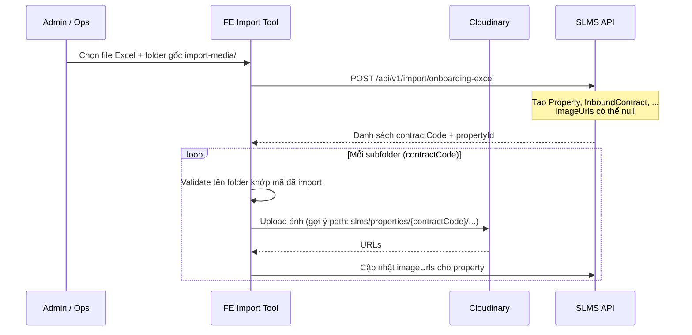

# Import ảnh nhà theo folder (bulk onboarding)

Tài liệu mô tả hướng xử lý ảnh căn nhà khi **import hàng loạt** từ hệ thống nguồn vào SLMS2026, bổ sung cho file Excel `SLMS2026_v2.xlsx`.

---

## 1. Bối cảnh

- Luồng onboarding thường: người dùng chọn ảnh trên máy → FE upload **Cloudinary** → nhận URL → gọi API backend → lưu `Property.imageUrls`.
- Luồng import hàng loạt: dữ liệu nhà/hợp đồng/thiết bị nằm trong **Excel**; nhà đã tồn tại và được verify ở **hệ thống khác**.
- **Hợp đồng gốc (file scan)** không lưu trong SLMS — chỉ giữ **`contractCode`** (mã hợp đồng) để tra cứu bên hệ thống nguồn khi cần.
- **Ảnh nhà** cần có trong SLMS để hiển thị/vận hành; URL có thể điền sau (cho phép `null` lúc import).

Backend và Excel dùng chung một “hợp đồng” dữ liệu: **DB chỉ lưu chuỗi URL**, không lưu file ảnh.

---

## 2. Nguyên tắc

| Thành phần | Vai trò |
|------------|---------|
| **Excel** | Dữ liệu structured (nhà, HĐ, cải tạo, thiết bị). Cột `URL ảnh nhà` **tùy chọn**, có thể để trống. |
| **Folder ảnh** | Chuẩn bị offline: mỗi mã hợp đồng một thư mục con chứa ảnh căn nhà đó. |
| **FE** | Upload folder lên Cloudinary, nhận URL, gắn vào property qua API. |
| **Backend** | Lưu `Property.imageUrls` (`List<String>`). Không upload ảnh, không bắt buộc Cloudinary domain. |
| **`contractCode`** | Khóa nối giữa Excel, folder ảnh và `InboundContract` trong DB. |

**Cách 2 (đã chọn):** Ảnh từ hệ thống nguồn được đưa lên **Cloudinary** (cùng account FE đang dùng) trước khi hoặc ngay sau import Excel; SLMS chỉ lưu URL Cloudinary.

---

## 3. Cấu trúc folder

```
import-media/                          ← folder gốc (admin chọn trên FE)
├── HD-HCM-WH-RENO-01/                 ← tên folder = contractCode (khớp cột A sheet 1)
│   ├── 01-mat-tien.jpg
│   ├── 02-phong-khach.jpg
│   └── 03-phong-ngu.jpg
├── HD-HCM-ROOM-RENO-01/
│   ├── 01-tong-the.jpg
│   └── 02-hanh-lang.jpg
└── HD-HCM-WH-NORENO-01/
    └── 01-mat-tien.jpg
```

### Quy ước

1. **Tên folder con** = `contractCode` trong Excel (đúng ký tự, không thêm hậu tố).
2. **Chỉ file ảnh** trong folder: `jpg`, `jpeg`, `png`, `webp` (bỏ qua file hệ thống).
3. **Thứ tự hiển thị:** đặt tên có prefix số (`01-`, `02-`, …).
4. **Thuê nguyên căn (`WHOLE_HOUSE`):** ảnh đặt trực tiếp trong folder mã HĐ → map vào `Property.imageUrls`.
5. **Thuê từng phòng (`INDIVIDUAL_ROOM`) — giai đoạn sau:** có thể thêm subfolder theo số phòng (`101/`, `102/`) → map vào `Room.imageUrls`. Giai đoạn 1 chỉ cần ảnh cấp nhà.

---

## 4. Luồng xử lý đề xuất



### Thứ tự bắt buộc

1. **Import Excel trước** — tạo bản ghi nhà/hợp đồng trong DB.
2. **Upload ảnh sau** — theo từng folder `contractCode`.
3. **Gắn URL** — cập nhật `Property.imageUrls`.

Lý do: tránh upload Cloudinary cho căn import thất bại hoặc mã trùng/lỗi validation.

---

## 5. Trách nhiệm FE

1. Cho phép chọn **folder gốc** sau (hoặc cùng lúc với) bước import Excel.
2. **Validate trước upload:**
   - Folder không khớp `contractCode` nào trong kết quả import → cảnh báo.
   - `contractCode` import thành công nhưng không có folder → cảnh báo (cho phép bỏ qua).
3. Upload lên Cloudinary (path gợi ý: `slms/properties/{contractCode}/{filename}`).
4. Gọi API cập nhật `imageUrls` theo `propertyId` hoặc `contractCode`.
5. UI **“Bước 2: Gắn ảnh”** tách biệt với bước import Excel.

---

## 6. Backend (hiện trạng & gợi ý)

### Đã có

- Import Excel: `POST /api/v1/import/onboarding-excel` (`dryRun` tùy chọn).
- Cột Excel **`URL ảnh nhà`** (optional): parse nhiều URL (`;` hoặc `,`) → `Property.imageUrls` khi import.
- `Property.imageUrls` cho phép **null/rỗng** khi chưa có ảnh.
- `InboundContract.contractCode` unique — dùng làm khóa tham chiếu hệ thống nguồn.
- Rollback một dòng: `DELETE /api/v1/import/onboarding-excel/contracts/{contractCode}`.

### Có thể bổ sung (tùy FE)

- `PATCH /api/v1/import/onboarding-excel/contracts/{contractCode}/images`  
  Body: `{ "imageUrls": ["https://res.cloudinary.com/..."] }`  
  → FE gắn ảnh theo mã HĐ mà không cần tra `propertyId`.

---

## 7. Rủi ro & xử lý

| Rủi ro | Cách xử |
|--------|---------|
| Sai tên folder | Validate tên = `contractCode` trước upload |
| Import fail một phần | Chỉ upload/gắn ảnh cho mã import thành công |
| Upload xong, chưa ghi DB | Lưu mapping tạm; nút “Gắn lại ảnh” theo `contractCode` |
| Import lại cùng mã | Purge theo `contractCode` trước khi import lại; hoặc ghi đè `imageUrls` |
| Ảnh hệ thống nguồn chưa trên Cloudinary | FE/script upload folder → Cloudinary trước khi gắn URL |

---

## 8. Tóm tắt

- **Excel** = dữ liệu + `contractCode`; cột URL ảnh có thể để trống ban đầu.
- **Folder** = `import-media/{contractCode}/*.jpg` — chuẩn bị ảnh theo từng căn.
- **FE** = batch upload Cloudinary + gắn `Property.imageUrls` sau import Excel.
- **Hợp đồng gốc** = chỉ mã tham chiếu, không lưu scan trong SLMS.

Hai kênh đưa ảnh vào hệ thống (upload tay qua FE vs folder bulk) **cùng kết thúc tại URL trong DB** — không mâu thuẫn với kiến trúc hiện tại.
