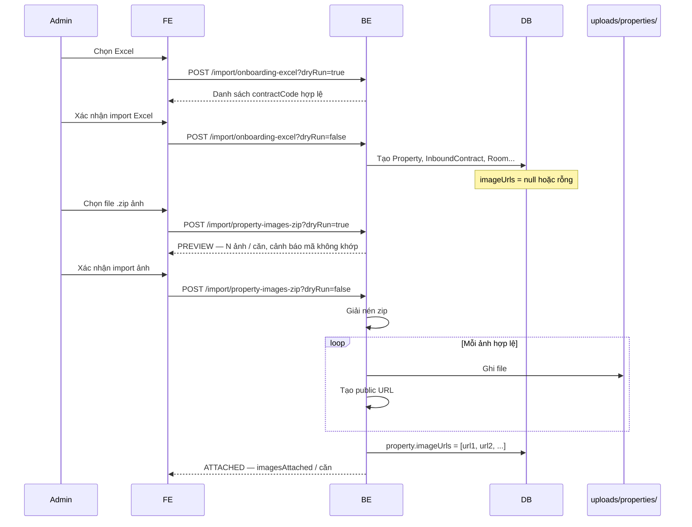

# Import hàng loạt — Cách hoạt động & cách lưu ảnh

**Ngày:** 20/06/2026  
**Đối tượng:** Team FE, BE, Ops  
**Phạm vi:** Màn admin import nhiều căn nhà + gắn ảnh bằng file ZIP

---

## 1. Tổng quan

Import hàng loạt chia **2 bước tách biệt**:

| Bước | Input | API | Kết quả |
|------|--------|-----|---------|
| **1. Dữ liệu** | File Excel `.xlsx` | `POST /api/v1/import/onboarding-excel` | Tạo căn, hợp đồng, phòng, thiết bị… trong DB |
| **2. Ảnh** | File ZIP (folder ảnh đã nén) | `POST /api/v1/import/property-images-zip` | Lưu ảnh trên server BE, gán URL vào `Property.imageUrls` |

**Khóa nối giữa Excel và ZIP:** `contractCode` (mã hợp đồng — cột trên sheet Excel, tên folder con trong zip).

```
Excel import                    ZIP import
     │                               │
     ▼                               ▼
InboundContract.contractCode ◄──► folder "HD001/"
     │                               │
     └──────────► Property.imageUrls ◄┘
```

---

## 2. Luồng chi tiết (sequence)



---

## 3. Bước 1 — Import Excel

### API

```http
POST /api/v1/import/onboarding-excel?dryRun={true|false}
Authorization: Bearer <ADMIN>
Content-Type: multipart/form-data

file = SLMS2026_v2.xlsx
```

- `dryRun=true`: chỉ parse + validate, **không ghi DB**.
- `dryRun=false`: tạo dữ liệu thật.

### Ảnh lúc này

- BE **không** nhận ảnh ở bước Excel.
- `Property.imageUrls` thường **null hoặc rỗng** sau bước 1.
- Mỗi căn đã có `InboundContract` với `contractCode` unique — dùng cho bước 2.

### Giới hạn file

- Chung với multipart toàn app: **200MB** / file (Excel thực tế thường nhỏ hơn nhiều).

---

## 4. Bước 2 — Import ZIP ảnh

### Chuẩn bị file ZIP (Ops / Admin)

1. Tạo folder ảnh trên máy:

```
ảnh các toà nhà/
├── HD-HCM-WH-RENO-01/       ← tên folder = contractCode trong Excel
│   ├── 01-mat-tien.jpg
│   ├── 02-phong-khach.jpg
│   └── 03-phong-ngu.jpg
├── HD-HCM-ROOM-RENO-01/
│   └── 01-tong-the.png
└── ...
```

2. **Nén cả folder** thành một file `.zip` (vd. `anh-cac-toa-nha.zip`).

Cấu trúc **bên trong zip** chấp nhận:

| Pattern | Ví dụ |
|---------|--------|
| `{contractCode}/{ảnh}` | `HD001/mat-tien.jpg` |
| `{folder-tổng}/{contractCode}/{ảnh}` | `import-media/HD001/mat-tien.jpg` |

**Không** chấp nhận lồng sâu hơn (vd. `HD001/tang1/phong/anh.jpg` → bỏ qua file đó).

### Quy tắc ảnh

| Quy tắc | Chi tiết |
|---------|----------|
| Định dạng | `.jpg`, `.jpeg`, `.png`, `.webp` |
| Khớp mã HĐ | Tên folder con = `contractCode`; **không phân biệt hoa/thường** |
| Thứ tự hiển thị | Sắp theo **tên file** (nên prefix `01-`, `02-`…) |
| Bỏ qua | `__MACOSX`, `.DS_Store`, file không phải ảnh |
| Ghi đè | Import zip lại → **thay thế** toàn bộ `imageUrls` của căn (không nối thêm) |

### API

**Kiểm tra trước (không ghi DB / không lưu file):**

```http
POST /api/v1/import/property-images-zip?dryRun=true
Authorization: Bearer <ADMIN>
Content-Type: multipart/form-data

file = anh-cac-toa-nha.zip
```

**Import thật:**

```http
POST /api/v1/import/property-images-zip?dryRun=false
```

### Giới hạn ZIP

| | Giá trị |
|---|--------|
| Dung lượng tối đa | **200MB** |
| Request tổng | **210MB** |
| Nginx (production) | `client_max_body_size 210m;` |

Zip lớn hơn → HTTP **413** `Maximum upload size exceeded`.

---

## 5. Cách BE lưu ảnh (chi tiết kỹ thuật)

### Không dùng Cloudinary

Luồng import zip **khác** luồng tạo căn thủ trên FE (FE upload Cloudinary → URL Cloudinary).

| Luồng | Nơi lưu file | URL trong `imageUrls` |
|-------|--------------|------------------------|
| Tạo/sửa căn trên FE | Cloudinary | `https://res.cloudinary.com/...` |
| **Import zip hàng loạt** | **Disk server BE** | `{APP_PUBLIC_BASE_URL}/uploads/properties/...` |

### Cấu trúc trên disk

```
{PROPERTY_IMAGES_DIR}/          ← mặc định: uploads/properties/ (cạnh project)
├── HD-HCM-WH-RENO-01/
│   ├── a1b2c3d4-01-mat-tien.jpg
│   └── e5f6g7h8-02-phong-khach.jpg
└── HD-HCM-ROOM-RENO-01/
    └── i9j0k1l2-01-tong-the.png
```

- Mỗi file được đặt tên: `{8-ký-tự-uuid}-{tên-file-đã-sanitize}` — tránh trùng tên khi import lại.
- Thư mục `uploads/` **không commit git** (`.gitignore`).

### URL ghi vào database

Bảng `properties`, cột collection `property_images` → field JPA `Property.imageUrls` (`List<String>`).

Ví dụ URL lưu trong DB (dev):

```
http://localhost:8080/uploads/properties/HD-HCM-WH-RENO-01/a1b2c3d4-01-mat-tien.jpg
```

Công thức:

```
{APP_PUBLIC_BASE_URL}/uploads/properties/{contractCode}/{uuid}-{filename}
```

### Phục vụ ảnh ra ngoài

- Spring map `GET /uploads/properties/**` → đọc file từ thư mục disk.
- `SecurityConfig`: **public, không cần JWT** — guest web/mobile xem ảnh qua API public property (`imageUrls` trong response).

### Config

```yaml
# application.yaml
app:
  upload:
    property-images:
      dir: ${PROPERTY_IMAGES_DIR:uploads/properties}
      public-base-url: ${APP_PUBLIC_BASE_URL:http://localhost:8080}

spring:
  servlet:
    multipart:
      max-file-size: 200MB
      max-request-size: 210MB
```

| Biến môi trường | Khi nào cần | Mặc định dev |
|-----------------|-------------|--------------|
| `PROPERTY_IMAGES_DIR` | Production (volume Docker, path cố định) | `uploads/properties` |
| `APP_PUBLIC_BASE_URL` | Production (domain API thật) | `http://localhost:8080` |

**Dev:** không cần set env — chạy BE port 8080 là đủ.

**Production:** bắt buộc set `APP_PUBLIC_BASE_URL` để URL trong DB mở được từ FE/mobile/guest.

---

## 6. Xử lý lỗi & partial success

### Fail cả request (HTTP 400)

- File rỗng / không phải `.zip`
- Zip không chứa **ảnh hợp lệ nào**
- Lỗi đọc/ghi file (IO exception)

### Partial success (HTTP 200, một số căn lỗi)

| Tình huống | Hành vi |
|------------|---------|
| Folder trong zip **không khớp** mã HĐ nào trong DB | **Bỏ qua** căn đó; căn khớp vẫn gán ảnh |
| File path sai cấu trúc | Bỏ qua **từng file** (im lặng, trừ khi zip rỗng hết) |
| Căn đã import Excel nhưng **không có** trong zip | Không báo lỗi — `imageUrls` giữ null/rỗng |

### Response mẫu

```json
{
  "dryRun": false,
  "contractsInZip": 3,
  "contractsMatched": 2,
  "contractsNotFound": 1,
  "imagesAttached": 5,
  "results": [
    {
      "status": "ATTACHED",
      "contractCode": "HD-HCM-WH-RENO-01",
      "propertyId": 12,
      "propertyName": "Biệt thự A",
      "imagesAttached": 3,
      "message": null
    },
    {
      "status": "NOT_FOUND",
      "contractCode": "HD-SAI-MA",
      "propertyId": null,
      "propertyName": null,
      "imagesAttached": 0,
      "message": "Không tìm thấy căn với mã hợp đồng này (import Excel trước?)"
    }
  ],
  "warnings": [
    "Mã hợp đồng \"HD-SAI-MA\" có 2 ảnh trong zip nhưng không tìm thấy trong DB — bỏ qua"
  ]
}
```

**`status` từng căn:**

| status | Ý nghĩa |
|--------|---------|
| `ATTACHED` | Đã gán ảnh vào DB |
| `PREVIEW` | dryRun — chỉ báo sẽ gán bao nhiêu ảnh |
| `NOT_FOUND` | Mã HĐ trong zip không có trong DB |

FE hiển thị **"đã gán N ảnh / căn"** → `results[i].imagesAttached`.

---

## 7. Ai làm gì

### Admin / Ops

1. Chuẩn bị Excel + folder ảnh theo `contractCode`.
2. Nén folder → `.zip`.
3. Import Excel trước, zip sau.

### FE

1. Màn 2 bước: Excel → ZIP.
2. Gọi `dryRun=true` trước mỗi bước để preview.
3. Hiển thị `warnings`, `imagesAttached`, `NOT_FOUND`.
4. Cảnh báo user nén zip **≤ 200MB**.

### BE

1. Excel: tạo entity + `contractCode`.
2. ZIP: parse → lưu disk → gán `imageUrls`.
3. Serve static `/uploads/properties/**`.

---

## 8. Sơ đồ dữ liệu sau import xong

```
┌─────────────────────────────────────────────────────────┐
│  PostgreSQL                                             │
│  ┌──────────────┐      ┌─────────────────────────────┐  │
│  │ properties   │      │ inbound_contracts           │  │
│  │ id           │◄─────│ property_id                 │  │
│  │ property_name│      │ contract_code = "HD001"     │  │
│  │ image_urls[] │      └─────────────────────────────┘  │
│  │  └─ URL 1    │──┐                                    │
│  │  └─ URL 2    │  │                                    │
│  └──────────────┘  │                                    │
└────────────────────│────────────────────────────────────┘
                     │
                     ▼
┌─────────────────────────────────────────────────────────┐
│  Disk: uploads/properties/HD001/                        │
│    a1b2c3d4-01-mat-tien.jpg                             │
│    e5f6g7h8-02-phong-khach.jpg                          │
└─────────────────────────────────────────────────────────┘
                     │
                     ▼  GET /uploads/properties/HD001/...
┌─────────────────────────────────────────────────────────┐
│  Guest web / mobile / admin FE                          │
│  Hiển thị ảnh từ imageUrls trong API property            │
└─────────────────────────────────────────────────────────┘
```

---

## 9. Rollback & import lại

| Thao tác | API |
|----------|-----|
| Xóa một căn import sai | `DELETE /api/v1/import/onboarding-excel/contracts/{contractCode}` |
| Import lại Excel cùng mã | Mã đã tồn tại → `SKIPPED` (hoặc purge trước) |
| Import lại zip cùng căn | **Ghi đè** `imageUrls`; file cũ trên disk **vẫn còn** (orphan) — chưa có dọn rác tự động |

---

## 10. Checklist test

- [ ] Import Excel → DB có `contractCode`, `imageUrls` rỗng
- [ ] Zip dryRun → `PREVIEW`, DB không đổi
- [ ] Zip import → `imageUrls` có URL, mở URL trên browser thấy ảnh
- [ ] Guest API `/api/v1/public/properties/{id}` trả `imageUrls` load được
- [ ] Mã sai trong zip → `NOT_FOUND`, căn đúng vẫn `ATTACHED`
- [ ] Zip > 200MB → 413
- [ ] Production: `APP_PUBLIC_BASE_URL` đúng domain

---

## 11. File code & tài liệu liên quan

| Tài liệu / file | Nội dung |
|-----------------|----------|
| `docs/import-anh-theo-folder.md` | Thiết kế ban đầu (folder + Cloudinary — FE) |
| `docs/BE-import-property-images-zip.md` | API zip ngắn gọn |
| `BulkImportController.java` | Endpoints import |
| `BulkPropertyImageImportServiceImpl.java` | Logic gán ảnh |
| `PropertyImageZipParser.java` | Giải nén zip |
| `LocalPropertyImageStorage.java` | Ghi file + tạo URL |
| `WebMvcConfig.java` | Static file handler |
| `SecurityConfig.java` | Public GET uploads |

---

## 12. FAQ nhanh

**Q: Import zip có dùng Cloudinary không?**  
A: Không. BE lưu local, URL trỏ về server BE.

**Q: Zip tối đa bao nhiêu?**  
A: 200MB. Lớn hơn thì tách nhiều zip.

**Q: Sai tên folder một vài căn?**  
A: Bỏ qua + cảnh báo; căn đúng vẫn import.

**Q: Phải import Excel trước không?**  
A: Có — zip chỉ **gắn ảnh** cho căn đã có `contractCode` trong DB.

**Q: Dev có cần set env không?**  
A: Không. Production cần `APP_PUBLIC_BASE_URL` (và thường `PROPERTY_IMAGES_DIR`).
