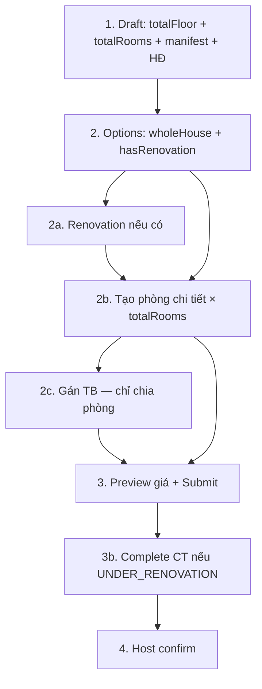

# SLMS — Inbound Onboarding: Thay đổi mới & Hướng dẫn Frontend

> **Phiên bản:** đồng bộ backend hiện tại (Jun 2026)  
> **Base URL:** `http://localhost:8080/api/v1`  
> **Auth:** `Authorization: Bearer <token>` (trừ `/auth/*`, Swagger)  
> **Swagger:** `http://localhost:8080/swagger-ui.html`

Tài liệu này gom **toàn bộ thay đổi gần đây**, **luồng nghiệp vụ**, **URL + JSON mẫu** và **link file kịch bản test** để team Frontend tích hợp và kiểm thử nhanh.

**File JSON test (import Postman / Thunder Client / Bruno):**

| File | Mô tả |
|------|--------|
| [`test-scenarios/case-1-whole-house-e2e.json`](test-scenarios/case-1-whole-house-e2e.json) | Nguyên căn, không cải tạo |
| [`test-scenarios/case-3-room-rental-e2e.json`](test-scenarios/case-3-room-rental-e2e.json) | Chia phòng, không cải tạo + gán TB |
| [`test-scenarios/assign-equipment-duplicate-catalog.json`](test-scenarios/assign-equipment-duplicate-catalog.json) | Manifest trùng `catalogId`, khác `status` |

---

## 1. Tóm tắt thay đổi (Breaking Changes)

### 1.1 Cấu trúc Property — bỏ `roomsPerFloor`

| Trước (đã bỏ) | Sau (dùng) | Ghi chú |
|---------------|------------|---------|
| `floorCount` | `totalFloor` | Số tầng — nhập trực tiếp |
| `roomsPerFloor` | *(xóa)* | Không còn dùng |
| `totalRooms` = `floorCount × roomsPerFloor` | `totalRooms` | Nhập trực tiếp, **không** tự nhân |

**Ảnh hưởng FE:**
- Form draft: 2 field `totalFloor` + `totalRooms` (cả hai bắt buộc, ≥ 1).
- `PUT /structure`: gửi `{ totalFloor, totalRooms }` thay vì `{ floorCount, roomsPerFloor }`.
- Response property/summary: đọc `totalFloor`, `totalRooms` — **không** còn `floorCount`, `roomsPerFloor`.

### 1.2 Luồng nhập phòng & phân bố thiết bị

| Hạng mục | Trước | Sau |
|----------|-------|-----|
| Nhập phòng | Chỉ nhà chia phòng | **Mọi nhánh** phải tạo đủ `totalRooms` phòng chi tiết trước submit |
| `maxOccupants` | Bắt buộc khi tạo phòng | **Không bắt buộc** khi onboarding (optional) |
| Gán thiết bị | Nguyên căn gán theo `houseArea` | **Chỉ nhà chia phòng** (`wholeHouse = false`), gán theo `roomId` |
| Nhà nguyên căn | Gọi `equipments/assign` | **Không** gọi — BE trả 400 nếu gọi |

### 1.3 Manifest & assign thiết bị — fix bug trùng `catalogId`

| Trước (lỗi) | Sau (đúng) |
|-------------|------------|
| BE tìm manifest chỉ theo `catalogId` | Tìm theo **`catalogId` + `status`** |
| `assignedCount` gộp chung theo catalog | `assignedCount` **riêng từng dòng** manifest |
| 2 dòng cùng catalog khác status → crash | Gán bình thường nếu gửi đúng `status` |

**Ảnh hưởng FE:**
- Manifest có thể có nhiều dòng cùng `catalogId` nếu khác `status` (VD: 2 điều hòa `NEW` + 1 `GOOD`).
- UI gán TB: hiển thị progress **`assignedCount / quantity` theo từng dòng** (không gộp theo catalog).
- Request assign **bắt buộc** gửi `status` khớp manifest.

### 1.4 `source` thiết bị

| Giá trị | Ý nghĩa | Khi nào dùng |
|---------|---------|--------------|
| `INITIAL_HANDOVER` | Có sẵn khi nhận nhà | Thiết bị trong manifest ban đầu |
| `PURCHASED` | Mua thêm | Thiết bị mua trong đợt cải tạo (chi phí nằm ở renovation line category `EQUIPMENT`) |

| `status` thiết bị (tình trạng) | Ý nghĩa |
|--------------------------------|---------|
| `NEW` | Mới |
| `GOOD` | Đã dùng, còn tốt |

> `status` ≠ `source`. Manifest chỉ dùng `NEW` / `GOOD`. Assign gửi cả `status` và `source`.

### 1.5 Endpoint đã thay thế

| Cũ | Mới |
|----|-----|
| `POST /properties/{id}/activation/confirm` | `POST /properties/{id}/host-confirm` |
| `POST /properties/{id}/equipments` | `POST /properties/{id}/equipments/assign` |
| `POST /properties/{id}/renovations` | `POST /properties/{id}/renovation-lines` |

---

## 2. State machine

```
DRAFT
  └─ POST submit-to-host
       ├─ hasRenovation=true & chưa xong CT  → UNDER_RENOVATION
       └─ còn lại                             → PENDING_HOST_REVIEW
            └─ POST renovation/complete (nếu UNDER_RENOVATION)
                 → PENDING_HOST_REVIEW
                      └─ POST host-confirm → ACTIVE

Bất kỳ trước ACTIVE ── POST disable ──→ DISABLED
```

| PropertyStatus | FE hiển thị |
|----------------|-------------|
| `DRAFT` | Nháp |
| `UNDER_RENOVATION` | Đang cải tạo |
| `PENDING_HOST_REVIEW` | Chờ host duyệt |
| `ACTIVE` | Đang kinh doanh |
| `DISABLED` | Đã vô hiệu |

**RoomStatus:** `DRAFT` → sau `host-confirm` → `AVAILABLE` (nhà chia phòng).

---

## 3. Bốn nhánh nghiệp vụ

| Case | wholeHouse | hasRenovation | Tóm tắt luồng |
|------|------------|---------------|---------------|
| **1** | `true` | `false` | draft → manifest → HĐ → options → tạo phòng → submit → host confirm |
| **2** | `true` | `true` | ... → structure? → renovation → tạo phòng → submit → complete CT → host confirm |
| **3** | `false` | `false` | ... → tạo phòng → **gán TB** → submit → host confirm |
| **4** | `false` | `true` | ... → renovation → tạo phòng → **gán TB** → submit → complete CT → host confirm |

---

## 4. Bảng API đầy đủ

### 4.1 Master data

| Method | URL | Body |
|--------|-----|------|
| `GET` | `/api/v1/equipment-catalog` | — |
| `GET` | `/api/v1/renovation-categories` | — |

### 4.2 Onboarding wizard

| # | Method | URL | Khi nào gọi |
|---|--------|-----|-------------|
| 1 | `POST` | `/api/v1/properties/draft` | Tạo nháp |
| 2 | `PUT` | `/api/v1/properties/{id}/equipment-manifest` | Khai báo TB có sẵn |
| 3 | `GET` | `/api/v1/properties/{id}/equipment-manifest` | Đọc manifest + `assignedCount` |
| 4 | `POST` | `/api/v1/properties/{id}/inbound-contract` | Ký HĐ inbound |
| 5 | `GET` | `/api/v1/properties/{id}/inbound-contract` | Đọc HĐ |
| 6 | `POST` | `/api/v1/properties/{id}/onboarding-options` | Chọn nguyên căn / chia phòng + CT |
| 7 | `PUT` | `/api/v1/properties/{id}/structure` | Đổi `totalFloor` / `totalRooms` (tuỳ chọn) |
| 8 | `POST` | `/api/v1/properties/{id}/renovation-lines` | Thêm hạng mục CT |
| 9 | `GET` | `/api/v1/properties/{id}/renovation-lines` | Đọc danh sách CT |
| 10 | `PUT` | `/api/v1/properties/{id}/renovation-schedule` | Lịch CT |
| 11 | `POST` | `/api/v1/properties/{id}/rooms` | Tạo từng phòng chi tiết |
| 12 | `GET` | `/api/v1/properties/{id}/rooms` | Danh sách phòng |
| 13 | `POST` | `/api/v1/properties/{id}/equipments/assign` | Gán TB (**chỉ chia phòng**) |
| 14 | `GET` | `/api/v1/properties/{id}/equipments` | TB đã gán |
| 15 | `POST` | `/api/v1/properties/{id}/depreciation/calculate` | Preview giá (tuỳ chọn) |
| 16 | `GET` | `/api/v1/properties/{id}/depreciation` | Đọc kết quả giá |
| 17 | `POST` | `/api/v1/properties/{id}/submit-to-host` | Admin gửi host |
| 18 | `POST` | `/api/v1/properties/{id}/renovation/complete` | Đánh dấu CT xong |
| 19 | `GET` | `/api/v1/properties/{id}/onboarding-summary` | Host xem tổng hợp |
| 20 | `POST` | `/api/v1/properties/{id}/host-confirm` | Host xác nhận giá → ACTIVE |
| 21 | `POST` | `/api/v1/properties/{id}/disable` | Hủy nháp |

### 4.3 API phụ

| Method | URL |
|--------|-----|
| `GET` | `/api/v1/properties` |
| `GET` | `/api/v1/properties/{id}` |
| `PUT` | `/api/v1/properties/{id}` |
| `DELETE` | `/api/v1/properties/{id}` |
| `GET` | `/api/v1/properties/{id}/rooms/{roomId}` |
| `GET` | `/api/v1/user/managers` | Dropdown Operation Manager |

---

## 5. JSON mẫu từng bước

> Thay `{propertyId}`, `{zoneId}`, `{roomId}` bằng giá trị thực sau mỗi bước tạo.

### 5.1 Tạo nháp

```http
POST http://localhost:8080/api/v1/properties/draft
Content-Type: application/json
Authorization: Bearer <token>
```

```json
{
  "propertyName": "Nhà Nguyễn Trãi 123",
  "address": "123 Nguyễn Trãi",
  "descriptions": "Nhà 3 tầng, mặt tiền 5m",
  "zoneId": "550e8400-e29b-41d4-a716-446655440000",
  "areaSize": 120.5,
  "totalFloor": 3,
  "totalRooms": 12,
  "imageUrls": ["https://cdn.example.com/nha1.jpg"]
}
```

**Response 201 — lưu `id` làm `propertyId`:**
```json
{
  "id": 1,
  "propertyName": "Nhà Nguyễn Trãi 123",
  "totalFloor": 3,
  "totalRooms": 12,
  "wholeHouse": null,
  "hasRenovation": null,
  "status": "DRAFT",
  "renovationCompleted": false
}
```

---

### 5.2 Khai báo manifest thiết bị

```http
PUT http://localhost:8080/api/v1/properties/1/equipment-manifest
```

```json
{
  "items": [
    { "catalogId": 1, "quantity": 2, "status": "NEW" },
    { "catalogId": 1, "quantity": 1, "status": "GOOD" },
    { "catalogId": 2, "quantity": 1, "status": "GOOD" }
  ]
}
```

**Response — mỗi dòng có `assignedCount` riêng:**
```json
[
  { "id": 10, "catalogId": 1, "catalogName": "Điều hòa", "quantity": 2, "status": "NEW",  "assignedCount": 0 },
  { "id": 11, "catalogId": 1, "catalogName": "Điều hòa", "quantity": 1, "status": "GOOD", "assignedCount": 0 },
  { "id": 12, "catalogId": 2, "catalogName": "Tủ lạnh",  "quantity": 1, "status": "GOOD", "assignedCount": 0 }
]
```

> `PUT` **ghi đè** toàn bộ manifest — sửa thì gửi lại full list.

---

### 5.3 Ký hợp đồng inbound

```http
POST http://localhost:8080/api/v1/properties/1/inbound-contract
```

```json
{
  "contractCode": "INB-2026-001",
  "ownerName": "Nguyễn Văn A",
  "totalRentAmount": 2000000000,
  "startDate": "2026-01-01",
  "endDate": "2028-01-01",
  "contractScanUrl": "https://cdn.example.com/contracts/inb-2026-001.pdf"
}
```

---

### 5.4 Chọn loại hình

```http
POST http://localhost:8080/api/v1/properties/1/onboarding-options
```

**Chia phòng, không CT (Case 3):**
```json
{ "wholeHouse": false, "hasRenovation": false }
```

**Nguyên căn, có CT (Case 2):**
```json
{ "wholeHouse": true, "hasRenovation": true }
```

---

### 5.5 Cập nhật cấu trúc (tuỳ chọn)

```http
PUT http://localhost:8080/api/v1/properties/1/structure
```

```json
{
  "totalFloor": 3,
  "totalRooms": 15
}
```

---

### 5.6 Cải tạo (khi `hasRenovation = true`)

```http
POST http://localhost:8080/api/v1/properties/1/renovation-lines
```

```json
{
  "categoryId": 1,
  "cost": 150000000,
  "note": "Sơn toàn bộ 3 tầng"
}
```

```json
{
  "categoryId": 5,
  "cost": 80000000,
  "note": "2 điều hòa mới — category EQUIPMENT"
}
```

```http
PUT http://localhost:8080/api/v1/properties/1/renovation-schedule
```

```json
{
  "startDate": "2026-02-01",
  "endDate": "2026-03-15"
}
```

---

### 5.7 Tạo phòng chi tiết (bắt buộc mọi nhánh)

```http
POST http://localhost:8080/api/v1/properties/1/rooms
```

```json
{
  "roomNumber": "P101",
  "area": 18.5,
  "propertyType": "INDIVIDUAL_ROOM",
  "structureDescription": "Tầng 1 — phòng 1, 1 giường, WC riêng",
  "imageUrls": "https://cdn.example.com/p101.jpg",
  "electricMeterCode": "EL-P101",
  "waterMeterCode": "WT-P101"
}
```

- Lặp đến khi `count(rooms) == totalRooms`.
- `maxOccupants`: **không bắt buộc** lúc onboarding.
- `price`, `deposit`: không cần — set khi host confirm.

---

### 5.8 Gán thiết bị (chỉ `wholeHouse = false`)

```http
POST http://localhost:8080/api/v1/properties/1/equipments/assign
```

```json
{
  "catalogId": 1,
  "quantity": 1,
  "status": "NEW",
  "source": "INITIAL_HANDOVER",
  "roomId": 5
}
```

| Field | Bắt buộc | Ghi chú |
|-------|----------|---------|
| `catalogId` | ✓ | ID danh mục |
| `status` | ✓ | `NEW` hoặc `GOOD` — khớp dòng manifest |
| `source` | ✓ | `INITIAL_HANDOVER` hoặc `PURCHASED` |
| `roomId` | ✓ | Phòng đích |
| `quantity` | ✓ | ≥ 1 |
| `houseArea` | ✗ | **Không dùng** — BE từ chối nếu gửi |

**Sau mỗi lần assign:** gọi lại `GET /equipment-manifest` để cập nhật UI `assignedCount`.

---

### 5.9 Submit & hoàn tất CT

```http
POST http://localhost:8080/api/v1/properties/1/submit-to-host
```
Không body.

```http
POST http://localhost:8080/api/v1/properties/1/renovation/complete
```
Gọi khi `status = UNDER_RENOVATION` và thi công xong.

**Điều kiện submit (BE validate):**

| # | Điều kiện |
|---|-----------|
| 1 | `wholeHouse`, `hasRenovation` đã chọn |
| 2 | Đã ký inbound contract |
| 3 | Manifest không rỗng |
| 4 | **Chia phòng:** mỗi dòng manifest (`catalogId`+`status`): `assignedCount == quantity` |
| 5 | **Mọi nhánh:** `count(rooms) == totalRooms` |
| 6 | **Có CT:** ≥ 1 renovation line + đã có lịch CT |

---

### 5.10 Host confirm

```http
GET http://localhost:8080/api/v1/properties/1/onboarding-summary
```

```http
POST http://localhost:8080/api/v1/properties/1/host-confirm
```

**Nguyên căn:**
```json
{
  "contingencyPercent": 110,
  "operationManagerId": "550e8400-e29b-41d4-a716-446655440042"
}
```

**Chia phòng:**
```json
{
  "contingencyPercent": 110,
  "operationManagerId": "550e8400-e29b-41d4-a716-446655440042",
  "roomPrices": [
    { "roomId": 5, "price": 3500000 },
    { "roomId": 6, "price": 2800000 }
  ]
}
```

> Gửi đủ giá cho **tất cả** phòng `DRAFT`. Host có thể ghi đè giá tay — khi có `price` cụ thể BE không nhân `%` nữa.

---

## 6. Kịch bản test E2E (URL tuần tự)

### Case 1 — Nguyên căn, không cải tạo

```
POST   /api/v1/properties/draft
PUT    /api/v1/properties/{id}/equipment-manifest
POST   /api/v1/properties/{id}/inbound-contract
POST   /api/v1/properties/{id}/onboarding-options          {"wholeHouse":true,"hasRenovation":false}
POST   /api/v1/properties/{id}/rooms                       × totalRooms
POST   /api/v1/properties/{id}/submit-to-host            → PENDING_HOST_REVIEW
GET    /api/v1/properties/{id}/onboarding-summary
POST   /api/v1/properties/{id}/host-confirm
```

📄 JSON đầy đủ: [`test-scenarios/case-1-whole-house-e2e.json`](test-scenarios/case-1-whole-house-e2e.json)

---

### Case 3 — Chia phòng, không cải tạo

```
POST   /api/v1/properties/draft
PUT    /api/v1/properties/{id}/equipment-manifest
POST   /api/v1/properties/{id}/inbound-contract
POST   /api/v1/properties/{id}/onboarding-options          {"wholeHouse":false,"hasRenovation":false}
POST   /api/v1/properties/{id}/rooms                       × totalRooms
POST   /api/v1/properties/{id}/equipments/assign           × N (đủ manifest)
GET    /api/v1/properties/{id}/equipment-manifest          (verify assignedCount)
POST   /api/v1/properties/{id}/submit-to-host
POST   /api/v1/properties/{id}/host-confirm                + roomPrices
```

📄 JSON đầy đủ: [`test-scenarios/case-3-room-rental-e2e.json`](test-scenarios/case-3-room-rental-e2e.json)

---

### Test đặc biệt — manifest trùng catalogId

```
PUT    /api/v1/properties/{id}/equipment-manifest
       items: [{catalogId:1, qty:2, status:NEW}, {catalogId:1, qty:1, status:GOOD}]
POST   /api/v1/properties/{id}/equipments/assign
       {catalogId:1, status:NEW,  source:INITIAL_HANDOVER, roomId:...}
POST   /api/v1/properties/{id}/equipments/assign
       {catalogId:1, status:GOOD, source:INITIAL_HANDOVER, roomId:...}
```

📄 JSON đầy đủ: [`test-scenarios/assign-equipment-duplicate-catalog.json`](test-scenarios/assign-equipment-duplicate-catalog.json)

---

## 7. Công thức giá (tóm tắt)

```
totalInvestment       = totalRentAmount + SUM(renovation lines)
adminSuggestedMonthly = totalInvestment / contractMonths
```

- `INITIAL_HANDOVER`: **không** tính vào giá.
- TB mua thêm: chi phí nằm trong renovation line `EQUIPMENT`.
- Chia phòng: `suggestedMinPrice` mỗi phòng = `adminSuggestedMonthly / totalRooms` (chia đều).
- Host confirm: `giá cuối = suggested × (contingencyPercent / 100)` hoặc ghi đè giá tay.

---

## 8. Lỗi thường gặp (HTTP 400)

| Message BE | Nguyên nhân | FE xử lý |
|------------|-------------|----------|
| `Chỉ chỉnh sửa onboarding khi nhà ở trạng thái DRAFT` | Gọi API setup sau submit | Khóa wizard sau submit |
| `Catalog ID=X (NEW): đã gán A/B` | Gán thừa/thiếu hoặc sai `status` | Progress theo từng dòng manifest |
| `Thiết bị catalog ID=X trạng thái Y chưa có trong manifest` | Assign sai `status` | Dropdown status khớp manifest |
| `Nhà nguyên căn không cần phân bố thiết bị` | Gọi assign khi `wholeHouse=true` | Ẩn bước gán TB |
| `Phải tạo đủ N phòng chi tiết` | Chưa đủ phòng | Counter `rooms / totalRooms` |
| `Chỉ có thể xác nhận khi nhà ở trạng thái PENDING_HOST_REVIEW` | Host confirm sớm | Disable khi `UNDER_RENOVATION` |
| `Trạng thái thiết bị inbound chỉ chấp nhận NEW hoặc GOOD` | Gửi DAMAGED/BROKEN | Chỉ 2 option trên UI |

---

## 9. Checklist Frontend

- [ ] Đổi form draft: `totalFloor` + `totalRooms` (bỏ `floorCount`, `roomsPerFloor`)
- [ ] Load `GET /equipment-catalog` + `GET /renovation-categories` khi mở wizard
- [ ] Manifest: hỗ trợ nhiều dòng cùng `catalogId` khác `status`
- [ ] Hiển thị `assignedCount / quantity` **theo từng dòng manifest**
- [ ] Tạo phòng chi tiết cho **mọi nhánh** (không bắt `maxOccupants`)
- [ ] Chỉ hiện bước gán TB khi `wholeHouse = false`
- [ ] Assign gửi: `catalogId`, `status`, `source`, `roomId`, `quantity`
- [ ] `source` mặc định `INITIAL_HANDOVER`; `PURCHASED` cho TB mua trong CT
- [ ] Sau submit: badge theo `status` (`UNDER_RENOVATION` / `PENDING_HOST_REVIEW`)
- [ ] Host: disable confirm khi `UNDER_RENOVATION`
- [ ] Host confirm: `operationManagerId` + `contingencyPercent` + `roomPrices` (chia phòng)
- [ ] Nút hủy: `POST /properties/{id}/disable`

---

## 10. Gợi ý Wizard UI



| Step | wholeHouse=true | wholeHouse=false |
|------|-----------------|------------------|
| Gán TB | Ẩn | Hiện |
| Submit cần assign đủ | Không | Có |
| Host confirm giá | `propertyPrice` hoặc % | `roomPrices[]` |

---

*Tài liệu tham chiếu chi tiết hơn: [`inbound-onboarding-frontend-guide.md`](inbound-onboarding-frontend-guide.md)*
