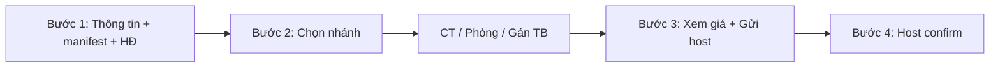

# SLMS — Luồng Inbound Onboarding (Hướng dẫn Frontend)

Tài liệu mô tả luồng nghiệp vụ inbound đã implement trên backend, kèm **URL**, **JSON mẫu** và **kịch bản test** để team Frontend tích hợp.

**Base URL:** `http://localhost:8080/api/v1`  
**Auth:** Tất cả endpoint (trừ auth/swagger) cần header `Authorization: Bearer <token>`.

---

## 1. Vai trò & trách nhiệm màn hình

| Role | Màn hình FE gợi ý | Việc làm |
|------|-------------------|----------|
| **Admin vận hành** | Wizard onboarding (bước 1→3) | Tạo nháp, khai manifest TB, ký HĐ, chọn nhánh, nhập phòng/cải tạo, gán TB, gửi host |
| **Host** (chủ đầu tư) | Màn hình duyệt giá | Xem `onboarding-summary`, nhập %, sửa giá, gán Operation Manager, confirm |
| **Operation Manager** | — | Được gán khi host confirm — vận hành sau ACTIVE |

---

## 2. State machine Property

```
DRAFT
  └─ Admin: submit-to-host
       ├─ Có cải tạo & chưa xong  → UNDER_RENOVATION
       └─ Không CT / CT đã xong   → PENDING_HOST_REVIEW
            └─ Admin: renovation/complete (nếu đang UNDER_RENOVATION)
                 → PENDING_HOST_REVIEW
                      └─ Host: host-confirm → ACTIVE

DRAFT (hoặc bất kỳ trước ACTIVE) ── disable ──→ DISABLED
```

| Status | Ý nghĩa | FE hiển thị gợi ý |
|--------|---------|-------------------|
| `DRAFT` | Đang setup | Nháp |
| `UNDER_RENOVATION` | Đã gửi host, đang cải tạo | Đang cải tạo |
| `PENDING_HOST_REVIEW` | Chờ host xác nhận giá | Chờ host duyệt |
| `ACTIVE` | Sẵn sàng kinh doanh | Đang kinh doanh |
| `DISABLED` | Hủy / đổi ý luồng | Đã vô hiệu |

**RoomStatus** (chỉ nhà chia phòng): `DRAFT` → sau host confirm → `AVAILABLE`.

---

## 3. Công thức giá

### Admin đề xuất (tự tính khi `submit-to-host` hoặc gọi `depreciation/calculate`)

```
totalInvestment     = totalRentAmount (HĐ inbound) + SUM(renovation lines)
contractMonths      = số tháng giữa startDate và endDate của HĐ
adminSuggestedMonthly = totalInvestment / contractMonths
```

- Thiết bị có sẵn (`INITIAL_HANDOVER`): **không** tính vào giá.
- Tiền thiết bị mua thêm: nằm trong **dòng cải tạo** (category `EQUIPMENT`), không tách riêng.
- **Không** có gợi ý lời 10% — chỉ `suggestedMinPrice` (= giá hoàn vốn/tháng).

### Nhà chia phòng

```
giá gợi ý mỗi phòng = adminSuggestedMonthly / số phòng
```
Chia **đều**, không theo diện tích.

### Host confirm

```
giá cuối = adminSuggested × (contingencyPercent / 100)
```

- Host có thể **ghi đè giá tay** (`propertyPrice` hoặc `roomPrices[].price`) — khi gửi giá tay thì BE dùng giá đó, không nhân % nữa.
- **Không** nhập cọc ở bước inbound — cọc thuộc HĐ tenant sau này.

**Ví dụ số:**

| Khoản | Giá trị |
|-------|---------|
| Tiền thuê HĐ (2 năm) | 2.000.000.000 |
| Cải tạo | 500.000.000 |
| contractMonths | 24 |
| adminSuggested | (2.000.000.000 + 500.000.000) / 24 ≈ **104.166.667** đ/tháng |
| Host nhập 110% | ≈ **114.583.333** đ/tháng |

---

## 4. Bốn nhánh nghiệp vụ (kịch bản)

| # | wholeHouse | hasRenovation | Luồng FE |
|---|------------|---------------|----------|
| **1** | `true` | `false` | Draft → manifest → HĐ → options → **gán TB theo `houseArea`** → submit → host confirm |
| **2** | `true` | `true` | ... → options → (đổi structure nếu cần) → renovation lines + schedule → **sau CT xong** gán TB → submit → `complete` → host confirm |
| **3** | `false` | `false` | ... → options → **tạo đủ N phòng** → gán TB theo `roomId` → submit → host confirm |
| **4** | `false` | `true` | ... → options → (đổi structure) → renovation → tạo phòng → gán TB → submit → `complete` → host confirm |

`N = floorCount × roomsPerFloor` (tự tính trên BE, field `totalRooms`).

---

## 5. Master data (load trước khi vào form)

### GET `/equipment-catalog`

```http
GET /api/v1/equipment-catalog
Authorization: Bearer <token>
```

**Response mẫu:**
```json
[
  { "id": 1, "name": "Điều hòa", "description": "Máy lạnh / điều hòa không khí" },
  { "id": 2, "name": "Tủ lạnh", "description": "Tủ lạnh các loại" }
]
```

### GET `/renovation-categories`

```http
GET /api/v1/renovation-categories
Authorization: Bearer <token>
```

**Response mẫu:**
```json
[
  { "id": 1, "code": "PAINTING", "name": "Sơn sửa", "description": "Sơn tường, trần nhà" },
  { "id": 5, "code": "EQUIPMENT", "name": "Thiết bị mua thêm", "description": "Mua thêm thiết bị trong đợt cải tạo" }
]
```

---

## 6. API theo từng bước wizard

> Trong các ví dụ dưới đây, giả sử `propertyId = 1`. Thay ID thực tế sau mỗi bước tạo.

---

### Bước 1A — Tạo nháp Property

```http
POST /api/v1/properties/draft
Content-Type: application/json
```

**Request:**
```json
{
  "propertyName": "Nhà Nguyễn Trãi 123",
  "address": "123 Nguyễn Trãi",
  "descriptions": "Nhà 3 tầng, mặt tiền 5m",
  "zoneId": "550e8400-e29b-41d4-a716-446655440000",
  "areaSize": 120.5,
  "floorCount": 3,
  "roomsPerFloor": 4,
  "createdBy": 1,
  "imageUrls": ["https://cdn.example.com/nha1.jpg"]
}
```

**Response (201):**
```json
{
  "id": 1,
  "propertyName": "Nhà Nguyễn Trãi 123",
  "shortAddress": "123 Nguyễn Trãi",
  "fullAddress": "123 Nguyễn Trãi, Quận 1, TP.HCM",
  "descriptions": "Nhà 3 tầng, mặt tiền 5m",
  "zoneId": "550e8400-e29b-41d4-a716-446655440000",
  "zoneName": "Quận 1",
  "areaSize": 120.5,
  "wholeHouse": null,
  "hasRenovation": null,
  "floorCount": 3,
  "roomsPerFloor": 4,
  "totalRooms": 12,
  "status": "DRAFT",
  "price": null,
  "createdBy": 1,
  "operationManagerId": null,
  "renovationCompleted": false
}
```

---

### Bước 1B — Khai báo manifest thiết bị có sẵn

```http
PUT /api/v1/properties/1/equipment-manifest
Content-Type: application/json
```

**Request:**
```json
{
  "items": [
    { "catalogId": 1, "quantity": 3, "status": "NEW" },
    { "catalogId": 2, "quantity": 1, "status": "GOOD" },
    { "catalogId": 5, "quantity": 4, "status": "GOOD" }
  ]
}
```

| `status` hợp lệ (inbound) | Ý nghĩa |
|---------------------------|---------|
| `NEW` | Mới |
| `GOOD` | Đã qua sử dụng, vẫn dùng tốt |

**Response:**
```json
[
  {
    "id": 10,
    "catalogId": 1,
    "catalogName": "Điều hòa",
    "quantity": 3,
    "status": "NEW",
    "assignedCount": 0
  },
  {
    "id": 11,
    "catalogId": 2,
    "catalogName": "Tủ lạnh",
    "quantity": 1,
    "status": "GOOD",
    "assignedCount": 0
  }
]
```

**GET manifest:** `GET /api/v1/properties/1/equipment-manifest`

> `PUT` **ghi đè** toàn bộ manifest — gửi lại full list khi sửa.

---

### Bước 1C — Ký hợp đồng Inbound

```http
POST /api/v1/properties/1/inbound-contract
Content-Type: application/json
```

**Request:**
```json
{
  "contractCode": "INB-2026-001",
  "ownerName": "Nguyễn Văn A",
  "totalRentAmount": 2000000000,
  "startDate": "2026-01-01",
  "endDate": "2028-01-01",
  "contractScanUrl": "https://cdn.example.com/contracts/inb-2026-001.pdf"
}
```

**Response (201):**
```json
{
  "id": 1,
  "propertyId": 1,
  "contractCode": "INB-2026-001",
  "ownerName": "Nguyễn Văn A",
  "totalRentAmount": 2000000000,
  "startDate": "2026-01-01",
  "endDate": "2028-01-01",
  "contractScanUrl": "https://cdn.example.com/contracts/inb-2026-001.pdf",
  "status": "ACTIVE"
}
```

**GET HĐ:** `GET /api/v1/properties/1/inbound-contract`

**Điều kiện:** Property phải `DRAFT`, chưa có HĐ.

---

### Bước 2A — Chọn loại hình & cải tạo

```http
POST /api/v1/properties/1/onboarding-options
Content-Type: application/json
```

**Request (Case 3 — chia phòng, không cải tạo):**
```json
{
  "wholeHouse": false,
  "hasRenovation": false
}
```

**Request (Case 2 — nguyên căn, có cải tạo):**
```json
{
  "wholeHouse": true,
  "hasRenovation": true
}
```

**Response:** `PropertyResponse` với `wholeHouse`, `hasRenovation` đã set. Nếu `hasRenovation = false` → `renovationCompleted = true` tự động.

---

### Bước 2B — (Tuỳ chọn) Cập nhật cấu trúc sau cải tạo

Dùng khi cải tạo làm thay đổi số tầng / số phòng.

```http
PUT /api/v1/properties/1/structure
Content-Type: application/json
```

**Request:**
```json
{
  "floorCount": 3,
  "roomsPerFloor": 5
}
```

→ `totalRooms` tự tính = 15.

---

### Bước 2C — Nhập cải tạo (chỉ khi `hasRenovation = true`)

#### Thêm từng dòng chi phí

```http
POST /api/v1/properties/1/renovation-lines
Content-Type: application/json
```

**Request (sơn tường):**
```json
{
  "categoryId": 1,
  "cost": 150000000,
  "note": "Sơn toàn bộ 3 tầng"
}
```

**Request (mua thêm thiết bị — tính chung chi phí cải tạo):**
```json
{
  "categoryId": 5,
  "cost": 80000000,
  "note": "2 điều hòa + 1 máy giặt mới"
}
```

**Response:**
```json
{
  "id": 1,
  "categoryId": 1,
  "categoryCode": "PAINTING",
  "categoryName": "Sơn sửa",
  "cost": 150000000,
  "note": "Sơn toàn bộ 3 tầng"
}
```

**GET danh sách:** `GET /api/v1/properties/1/renovation-lines`

#### Đặt lịch cải tạo

```http
PUT /api/v1/properties/1/renovation-schedule
Content-Type: application/json
```

**Request:**
```json
{
  "startDate": "2026-02-01",
  "endDate": "2026-03-15"
}
```

---

### Bước 2D — Tạo phòng (chỉ khi `wholeHouse = false`)

Lặp cho đến khi đủ `totalRooms` phòng.

```http
POST /api/v1/properties/1/rooms
Content-Type: application/json
```

**Request:**
```json
{
  "roomNumber": "P101",
  "area": 18.5,
  "maxOccupants": 2,
  "propertyType": "INDIVIDUAL_ROOM",
  "structureDescription": "1 giường, 1 WC riêng",
  "imageUrls": "https://cdn.example.com/p101.jpg",
  "electricMeterCode": "EL-P101",
  "waterMeterCode": "WT-P101"
}
```

| `propertyType` | Ý nghĩa |
|----------------|---------|
| `INDIVIDUAL_ROOM` | Phòng lẻ |
| `WHOLE_HOUSE` | *(ít dùng trong chia phòng)* |

**Response (201):** `RoomResponse` với `status: "DRAFT"`.

**GET phòng:** `GET /api/v1/properties/1/rooms`

---

### Bước 2E — Gán thiết bị vào vị trí

#### Nhà nguyên căn — gán theo khu vực (`houseArea`)

```http
POST /api/v1/properties/1/equipments/assign
Content-Type: application/json
```

**Request:**
```json
{
  "catalogId": 1,
  "quantity": 2,
  "status": "NEW",
  "houseArea": "BEDROOM"
}
```

| `houseArea` | Ý nghĩa |
|-------------|---------|
| `LIVING_ROOM` | Phòng khách |
| `BEDROOM` | Phòng ngủ |
| `KITCHEN` | Bếp |
| `BATHROOM` | WC |
| `BALCONY` | Ban công |
| `GARAGE` | Garage |
| `OTHER` | Khác |

> **Không** gửi `roomId` khi nguyên căn.

#### Nhà chia phòng — gán theo phòng (`roomId`)

**Request:**
```json
{
  "catalogId": 1,
  "quantity": 1,
  "status": "NEW",
  "roomId": 5
}
```

> **Không** gửi `houseArea` khi chia phòng.

**GET thiết bị đã gán:** `GET /api/v1/properties/1/equipments`

**Ràng buộc:** Tổng số gán theo từng `catalogId` phải **khớp chính xác** `quantity` trong manifest.

---

### Bước 3 — Admin gửi host

```http
POST /api/v1/properties/1/submit-to-host
```

Không cần body. BE tự:
1. Validate đủ điều kiện
2. Tính giá đề xuất (`depreciation`)
3. Đổi status:
   - Có CT & chưa xong → `UNDER_RENOVATION`
   - Còn lại → `PENDING_HOST_REVIEW`

**Response:** `OnboardingSummaryResponse`

```json
{
  "propertyId": 1,
  "status": "UNDER_RENOVATION",
  "wholeHouse": false,
  "hasRenovation": true,
  "floorCount": 3,
  "roomsPerFloor": 4,
  "totalRooms": 12,
  "renovationCompleted": false,
  "renovationStartDate": "2026-02-01",
  "renovationEndDate": "2026-03-15",
  "submittedToHostAt": "2026-06-10T10:30:00",
  "equipmentManifest": [ "..."] ,
  "renovationLines": [ "..." ],
  "totalRenovationCost": 230000000,
  "inboundContract": { "..." },
  "pricing": {
    "propertyId": 1,
    "pricingScope": "ROOM",
    "roomResults": [
      {
        "roomId": 5,
        "roomNumber": "P101",
        "totalRentAmount": 2000000000,
        "totalRenovationCost": 230000000,
        "totalEquipmentCost": 0,
        "totalInvestment": 2230000000,
        "contractMonths": 24,
        "monthlyBreakEven": 10416666.67,
        "suggestedMinPrice": 10416666.67,
        "calculatedAt": "2026-06-10T10:30:00"
      }
    ]
  }
}
```

**Điều kiện trước khi gửi (BE validate):**

| # | Điều kiện |
|---|-----------|
| 1 | `wholeHouse` và `hasRenovation` đã chọn |
| 2 | Đã ký inbound contract |
| 3 | Manifest TB không rỗng |
| 4 | Mỗi catalog: `assignedCount == quantity` |
| 5 | Chia phòng: `count(rooms) == totalRooms` |
| 6 | Có CT: ít nhất 1 renovation line + đã có lịch CT |

**Tính giá riêng (tuỳ chọn, preview trước khi gửi):**

```http
POST /api/v1/properties/1/depreciation/calculate
Content-Type: application/json
```

Body: `{}` hoặc không gửi body.

**GET kết quả giá:** `GET /api/v1/properties/1/depreciation`

---

### Bước 3B — Đánh dấu cải tạo hoàn tất

Admin gọi sau khi thi công xong. Host **chưa** confirm được trước bước này (nếu có cải tạo).

```http
POST /api/v1/properties/1/renovation/complete
```

**Response:** `PropertyResponse` với `renovationCompleted: true`, `status: "PENDING_HOST_REVIEW"` (nếu trước đó là `UNDER_RENOVATION`).

> Sau khi CT xong, admin tiếp tục **gán thiết bị** (nếu chưa gán hết) — **lưu ý:** hiện tại BE chỉ cho sửa onboarding khi `DRAFT`. Nếu đã submit, cần hoàn tất gán TB **trước** `submit-to-host`, hoặc team BE sẽ mở thêm API cập nhật sau CT. **Khuyến nghị FE:** gán TB xong rồi mới submit; nếu có CT, submit khi CT xong và đã gán đủ TB.

---

### Bước 4 — Host xem tổng hợp

```http
GET /api/v1/properties/1/onboarding-summary
```

Dùng cho màn host: hiển thị toàn bộ draft + giá admin đề xuất.

**Khi `status = UNDER_RENOVATION`:** Host **xem được** nhưng **chưa** confirm.

---

### Bước 4B — Host confirm & kích hoạt

```http
POST /api/v1/properties/1/host-confirm
Content-Type: application/json
```

**Điều kiện:**
- `status = PENDING_HOST_REVIEW`
- Cải tạo đã xong (hoặc không có cải tạo)
- Bắt buộc `operationManagerId`

#### Nhà nguyên căn

**Request (dùng % — BE tự nhân):**
```json
{
  "contingencyPercent": 110,
  "operationManagerId": 42
}
```

**Request (ghi đè giá tay):**
```json
{
  "contingencyPercent": 110,
  "propertyPrice": 12000000,
  "operationManagerId": 42
}
```

#### Nhà chia phòng

Host đặt **từng phòng tùy ý** — không ràng buộc tổng.

**Request:**
```json
{
  "contingencyPercent": 110,
  "operationManagerId": 42,
  "roomPrices": [
    { "roomId": 5, "price": 3500000 },
    { "roomId": 6, "price": 2800000 },
    { "roomId": 7, "price": 4000000 }
  ]
}
```

> Phải gửi đủ giá cho **tất cả** phòng `DRAFT`.

**Response:**
```json
{
  "propertyId": 1,
  "pricingScope": "ROOM",
  "propertyStatus": "ACTIVE",
  "hostContingencyPercent": 110,
  "operationManagerId": 42,
  "rooms": [
    {
      "roomId": 5,
      "roomNumber": "P101",
      "price": 3500000,
      "adminSuggestedPrice": 10416666.67,
      "status": "AVAILABLE"
    }
  ]
}
```

---

### Hủy / vô hiệu nháp

```http
POST /api/v1/properties/1/disable
```

→ `status: "DISABLED"`. Dùng khi admin đổi ý — tạo property mới nếu cần luồng khác.

---

## 7. Kịch bản test E2E

### Kịch bản A — Nguyên căn, không cải tạo (Case 1)

```
1. POST /properties/draft
2. PUT  /properties/{id}/equipment-manifest     (VD: 2 điều hòa, 1 tủ lạnh)
3. POST /properties/{id}/inbound-contract
4. POST /properties/{id}/onboarding-options     { wholeHouse: true, hasRenovation: false }
5. POST /properties/{id}/equipments/assign      × N lần (gán đủ manifest, dùng houseArea)
6. POST /properties/{id}/submit-to-host         → PENDING_HOST_REVIEW
7. GET  /properties/{id}/onboarding-summary       (host xem)
8. POST /properties/{id}/host-confirm             → ACTIVE
```

### Kịch bản B — Nguyên căn, có cải tạo (Case 2)

```
1–3. Giống kịch bản A
4. POST /properties/{id}/onboarding-options     { wholeHouse: true, hasRenovation: true }
5. PUT  /properties/{id}/structure              (nếu đổi số phòng)
6. POST /properties/{id}/renovation-lines       (nhiều dòng)
7. PUT  /properties/{id}/renovation-schedule
8. POST /properties/{id}/equipments/assign      (gán đủ TB)
9. POST /properties/{id}/submit-to-host           → UNDER_RENOVATION
10. POST /properties/{id}/renovation/complete     → PENDING_HOST_REVIEW
11. POST /properties/{id}/host-confirm            → ACTIVE
```

### Kịch bản C — Chia phòng, không cải tạo (Case 3)

```
1–3. Draft + manifest + HĐ
4. POST /properties/{id}/onboarding-options     { wholeHouse: false, hasRenovation: false }
5. POST /properties/{id}/rooms                    × totalRooms lần
6. POST /properties/{id}/equipments/assign      (mỗi lần có roomId)
7. POST /properties/{id}/submit-to-host
8. POST /properties/{id}/host-confirm           (roomPrices cho từng phòng)
```

### Kịch bản D — Chia phòng, có cải tạo (Case 4)

```
Giống C, thêm bước renovation (lines + schedule) sau bước 4,
submit → UNDER_RENOVATION → complete → host confirm.
```

---

## 8. Gợi ý cấu trúc Wizard FE



| Step | Màn hình | API chính |
|------|----------|-----------|
| 1 | Form nhà + bảng manifest + upload PDF HĐ | `draft`, `equipment-manifest`, `inbound-contract` |
| 2 | 2 toggle: nguyên căn / chia phòng + cải tạo | `onboarding-options` |
| 2a | Form CT (nếu có) | `renovation-lines`, `renovation-schedule` |
| 2b | Danh sách phòng (nếu chia phòng) | `rooms` |
| 2c | UI gán TB (drag/drop hoặc form) | `equipments/assign` |
| 3 | Preview giá + nút Gửi host | `depreciation/calculate`, `submit-to-host` |
| 3b | Banner "Đang cải tạo" + nút Hoàn tất CT | `renovation/complete` |
| 4 | Host: % + bảng giá + chọn Manager | `onboarding-summary`, `host-confirm` |

---

## 9. Lỗi thường gặp (HTTP 400)

| Message BE | Nguyên nhân | FE xử lý |
|------------|-------------|----------|
| `Chỉ chỉnh sửa onboarding khi nhà ở trạng thái DRAFT` | Gọi API setup sau khi đã submit | Khóa form sau submit |
| `Catalog ID=X: đã gán A/B` | Gán thừa hoặc thiếu TB | Hiển thị progress `assignedCount/quantity` |
| `Phải tạo đủ N phòng` | Chưa tạo đủ phòng | Counter phòng vs `totalRooms` |
| `Chỉ có thể xác nhận khi nhà ở trạng thái PENDING_HOST_REVIEW` | Host confirm sớm | Disable nút confirm khi `UNDER_RENOVATION` |
| `Phải hoàn tất cải tạo trước khi host xác nhận giá` | CT chưa complete | Hiện trạng thái chờ admin hoàn tất CT |
| `Trạng thái thiết bị inbound chỉ chấp nhận NEW hoặc GOOD` | Gửi DAMAGED/BROKEN | Chỉ 2 option trên UI |

---

## 10. API phụ (đã có sẵn)

| Method | URL | Mô tả |
|--------|-----|-------|
| `GET` | `/properties` | Danh sách property (phân trang) |
| `GET` | `/properties/{id}` | Chi tiết property |
| `PUT` | `/properties/{id}` | Cập nhật thông tin cơ bản |
| `DELETE` | `/properties/{id}` | Xóa (không xóa được ACTIVE) |
| `GET` | `/properties/{id}/rooms/{roomId}` | Chi tiết 1 phòng |

---

## 11. Checklist tích hợp Frontend

- [ ] Load `equipment-catalog` + `renovation-categories` khi mở wizard
- [ ] Step 1: `floorCount × roomsPerFloor` hiển thị `totalRooms` (read-only từ response)
- [ ] Manifest: hiển thị `assignedCount / quantity` realtime sau mỗi lần assign
- [ ] Phân nhánh UI theo `wholeHouse` + `hasRenovation` (4 case)
- [ ] Nguyên căn: form gán dùng `houseArea` enum
- [ ] Chia phòng: form gán dùng `roomId`
- [ ] Sau submit: đọc `status` để hiện badge `UNDER_RENOVATION` / `PENDING_HOST_REVIEW`
- [ ] Màn host: disable confirm khi `UNDER_RENOVATION`
- [ ] Host confirm: dropdown Operation Manager + input `contingencyPercent`
- [ ] Chia phòng: bảng giá từng phòng, host sửa tự do
- [ ] Nút "Hủy nháp" → `POST /disable`

---

## 12. Ghi chú phiên bản

- **Cọc (deposit):** Không dùng trong luồng inbound — thuộc HĐ tenant sau.
- **Giá lời 10%:** Đã bỏ — thay bằng `% dự phòng` do host nhập.
- **Endpoint cũ đã thay thế:**
  - `POST /properties/{id}/activation/confirm` → `POST /properties/{id}/host-confirm`
  - `POST /properties/{id}/equipments` (nhập tay) → `POST /properties/{id}/equipments/assign`
  - `POST /properties/{id}/renovations` → `POST /properties/{id}/renovation-lines`

---

*Tài liệu đồng bộ với backend branch hiện tại. Swagger UI: `http://localhost:8080/swagger-ui.html`*
