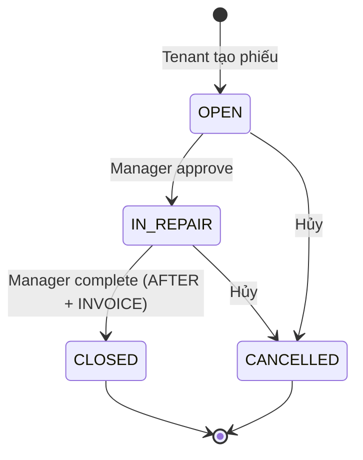
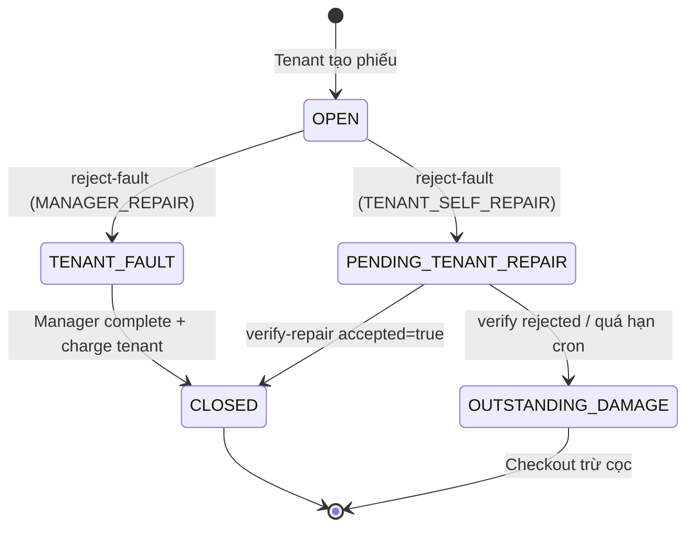

# Maintenance Module — Implementation Spec (As-Built)

> Tài liệu ghi nhận **code đã triển khai** trên backend SLMS2026.  
> Thiết kế gốc: [`maintenance-redesign-spec.md`](./maintenance-redesign-spec.md)  
> Chốt FE/BE: [`BE-YEUCAU-chot-redesign-maintenance-2026-09-01.md`](./BE-YEUCAU-chot-redesign-maintenance-2026-09-01.md)
>
> **Ngày implement:** 01/09/2026  
> **Trạng thái:** ✅ Backend Phase 1 + Phase 2 đã ship — FE có thể tích hợp

---

## Mục lục

1. [Tóm tắt thay đổi](#1-tóm-tắt-thay-đổi)
2. [Luồng nghiệp vụ](#2-luồng-nghiệp-vụ)
3. [Status & enum](#3-status--enum)
4. [API Reference](#4-api-reference)
5. [Request / Response contract](#5-request--response-contract)
6. [Ảnh & bằng chứng](#6-ảnh--bằng-chứng)
7. [Thông báo push](#7-thông-báo-push)
8. [Database & migration](#8-database--migration)
9. [Tích hợp Checkout](#9-tích-hợp-checkout)
10. [Mapping FE — status cũ → mới](#10-mapping-fe--status-cũ--mới)
11. [API đã xóa](#11-api-đã-xóa)
12. [File code liên quan](#12-file-code-liên-quan)

---

## 1. Tóm tắt thay đổi

| Khía cạnh | Trước | Sau (as-built) |
|-----------|-------|----------------|
| Status | `PENDING`, `APPROVED`, `WAITING_TENANT_CONFIRM`, `REJECTED`, `CLOSED`, `CANCELLED` | `OPEN`, `IN_REPAIR`, `TENANT_FAULT`, `PENDING_TENANT_REPAIR`, `OUTSTANDING_DAMAGE`, `CLOSED`, `CANCELLED` |
| Tenant confirm/reject | Bắt buộc confirm hoặc reject kết quả sửa | **Không** — im lặng = OK; không ổn → tạo phiếu mới |
| Reopen cùng phiếu | Có (`review-reject`) | **Không** |
| Cost dispute trong maintenance | Có (`confirm` + `resolve-cost`) | **Không** — charge tự động (Luồng B) hoặc checkout trừ cọc |
| Ảnh hóa đơn | Không có | `INVOICE` — bắt buộc khi `complete` |
| Lỗi tenant | Không có luồng riêng | Luồng B: `reject-fault` → sửa hộ / tự sửa |
| Category | 6 loại | 4 loại: `APPLIANCE`, `FURNITURE`, `PLUMBING`, `ELECTRICAL` |
| Auto-close 3 ngày | Có cron | **Đã bỏ** |
| Cron mới | — | Quá hạn tự sửa → `OUTSTANDING_DAMAGE` (09:00 ICT) |

---

## 2. Luồng nghiệp vụ

### 2.1 Luồng A — Hao mòn / lỗi chủ (`flowType: NORMAL_WEAR`)



**Tenant sau khi `CLOSED`:**
- Nhận push notification, xem bằng chứng (read-only).
- **Không** bấm confirm.
- Không hài lòng → `POST /maintenance` với `previousRequestId`.

**Chi phí:** Chủ nhà chịu. FE hiển thị `invoiceAmount` với `billingHint: HOST_PAID` (tham khảo, không nút trả).

---

### 2.2 Luồng B — Lỗi tenant (`flowType: TENANT_FAULT`)



**Nhánh B1 — Manager sửa hộ (`resolutionPath: MANAGER_REPAIR`):**
1. `reject-fault` → status `TENANT_FAULT`
2. Manager sửa → `complete` → `CLOSED`
3. Hệ thống tự tạo `TenantPendingCharge` + `TenantInvoice`
4. Response có `issuedInvoice`, `billingHint: TENANT_CHARGE_PENDING`

**Nhánh B2 — Tenant tự sửa (`resolutionPath: TENANT_SELF_REPAIR`):**
1. `reject-fault` → status `PENDING_TENANT_REPAIR` + `selfRepairDeadline`
2. Tenant `submit-self-repair` (upload `SELF_REPAIR`)
3. Manager `verify-repair`:
   - `accepted: true` → `CLOSED`
   - `accepted: false` → `OUTSTANDING_DAMAGE` + ghi `outstanding_damage_records`
4. Cron 09:00: quá `selfRepairDeadline` mà chưa có ảnh `SELF_REPAIR` → `OUTSTANDING_DAMAGE`

---

## 3. Status & enum

### 3.1 `MaintenanceStatus`

| Status | Mô tả | Ai chuyển |
|--------|-------|-----------|
| `OPEN` | Chờ manager check | Tenant (tạo) |
| `IN_REPAIR` | Đang sửa (Luồng A) | Manager `approve` |
| `TENANT_FAULT` | Lỗi tenant, manager sẽ sửa hộ | Manager `reject-fault` |
| `PENDING_TENANT_REPAIR` | Giao tenant tự sửa | Manager `reject-fault` |
| `OUTSTANDING_DAMAGE` | Chờ checkout trừ cọc | `verify-repair` reject / cron |
| `CLOSED` | Hoàn tất | Manager `complete` / `verify-repair` |
| `CANCELLED` | Đã hủy | Tenant (chỉ `OPEN`) / Manager |

### 3.2 `MaintenanceFlowType`

| Value | Ý nghĩa |
|-------|---------|
| `NORMAL_WEAR` | Luồng A — hao mòn / lỗi chủ |
| `TENANT_FAULT` | Luồng B — lỗi do tenant |

### 3.3 `MaintenanceBillingHint` (FE dùng để render UI)

| Value | Khi nào | FE hiển thị |
|-------|---------|-------------|
| `HOST_PAID` | `CLOSED` + `NORMAL_WEAR` | Số tiền tham khảo, label *"Chi phí do chủ nhà chi trả"* |
| `TENANT_CHARGE_PENDING` | `CLOSED` + tenant fault + manager sửa hộ | Nút thanh toán / link invoice |
| `DEPOSIT_DEDUCTION_PENDING` | `OUTSTANDING_DAMAGE` hoặc đang `PENDING_TENANT_REPAIR` | Nhắc sẽ trừ cọc khi checkout |
| `NONE` | Các trạng thái khác | Không hiện block billing |

### 3.4 `MaintenanceCategory`

`APPLIANCE` | `FURNITURE` | `PLUMBING` | `ELECTRICAL`

> `STRUCTURAL`, `OTHER` — **không còn hỗ trợ**. FE không hiển thị option này.

### 3.5 `MaintenancePhotoType`

| Type | Ai upload | Bắt buộc |
|------|-----------|----------|
| `BEFORE` | Tenant | Không |
| `FAULT_EVIDENCE` | Manager | Có (khi `reject-fault`) |
| `SELF_REPAIR` | Tenant | Có (khi `submit-self-repair`) |
| `AFTER` | Manager | Có (khi `complete`) |
| `INVOICE` | Manager | Có (khi `complete`) |

### 3.6 `FaultResolutionPath`

| Value | Hành vi |
|-------|---------|
| `MANAGER_REPAIR` | Manager sửa hộ → tenant trả qua invoice |
| `TENANT_SELF_REPAIR` | Tenant tự sửa trong deadline |

### 3.7 `DamageCause`

`WEAR` | `TENANT_MISUSE` | `TENANT_MODIFICATION` | `MISUSE` (deprecated)

---

## 4. API Reference

Base path: `/api/v1/maintenance`

### 4.1 Đọc dữ liệu

| Method | Path | Role | Mô tả |
|--------|------|------|-------|
| `GET` | `/` | ALL | Danh sách (filter: `status`, `priority`, `category`, `propertyId`, `roomId`) |
| `GET` | `/my-requests` | TENANT | Phiếu của tenant hiện tại |
| `GET` | `/{id}` | ALL | Chi tiết phiếu |
| `GET` | `/dashboard` | MANAGER, ADMIN | Thống kê (`open`, `inProgress`, `resolved`, `cancelled`, `totalRepairCost`) |
| `GET` | `/outstanding-damages` | MANAGER, ADMIN | Thiết bị hư chờ checkout (`propertyId`, `tenantContractId` optional) |

### 4.2 Luồng A

| Method | Path | Role | Status trước → sau |
|--------|------|------|-------------------|
| `POST` | `/` | TENANT | — → `OPEN` |
| `PUT` | `/{id}/approve` | MANAGER, ADMIN | `OPEN` → `IN_REPAIR` |
| `PUT` | `/{id}/complete` | MANAGER, ADMIN | `IN_REPAIR` → `CLOSED` |
| `PUT` | `/{id}/cancel` | ALL* | `OPEN` / `IN_REPAIR` → `CANCELLED` |

### 4.3 Luồng B

| Method | Path | Role | Status trước → sau |
|--------|------|------|-------------------|
| `PUT` | `/{id}/reject-fault` | MANAGER, ADMIN | `OPEN` → `TENANT_FAULT` hoặc `PENDING_TENANT_REPAIR` |
| `PUT` | `/{id}/submit-self-repair` | TENANT | `PENDING_TENANT_REPAIR` (giữ nguyên) |
| `PUT` | `/{id}/verify-repair` | MANAGER, ADMIN | `PENDING_TENANT_REPAIR` → `CLOSED` hoặc `OUTSTANDING_DAMAGE` |
| `PUT` | `/{id}/complete` | MANAGER, ADMIN | `TENANT_FAULT` → `CLOSED` (+ charge) |

### 4.4 Upload ảnh

| Method | Path | Role | Query `type` |
|--------|------|------|--------------|
| `POST` | `/{id}/photos` | ALL* | `BEFORE`, `AFTER`, `INVOICE`, `FAULT_EVIDENCE`, `SELF_REPAIR` |

> \* Tenant: chỉ `BEFORE`, `SELF_REPAIR`; chỉ cancel khi `OPEN`.

---

## 5. Request / Response contract

### 5.1 `POST /` — Tạo phiếu

```json
{
  "roomId": 12,
  "propertyId": null,
  "equipmentId": 42,
  "previousRequestId": 105,
  "title": "Máy lạnh không lạnh",
  "description": "Bật 16 độ nhưng không mát",
  "category": "APPLIANCE",
  "images": ["https://storage/.../before1.jpg"]
}
```

| Field | Bắt buộc | Ghi chú |
|-------|----------|---------|
| `roomId` hoặc `propertyId` | Có (một trong hai) | Thuê phòng vs nguyên căn |
| `title` | Có | Max 200 ký tự |
| `category` | Có nếu không có `equipmentId` | 4 loại trên |
| `images` | Không | Ảnh BEFORE — optional |
| `previousRequestId` | Không | Link phiếu trước nếu chưa ổn |

**Validation:** Chặn keyword mua mới (`mua mới`, `thay mới`, `lắp thêm`, `nâng cấp`).

---

### 5.2 `PUT /{id}/approve`

```json
{
  "category": "PLUMBING",
  "priority": "HIGH"
}
```

| Field | Bắt buộc |
|-------|----------|
| `category` | Có nếu phiếu chưa có category |
| `priority` | Không (`LOW`, `MEDIUM`, `HIGH`, `URGENT`) |

---

### 5.3 `PUT /{id}/complete`

```json
{
  "resolutionNote": "Đã thay block gas",
  "repairDescription": "Nạp gas máy lạnh 1.5HP",
  "afterImages": ["https://storage/.../after1.jpg"],
  "invoiceImages": ["https://storage/.../invoice1.jpg"],
  "invoiceVendor": "Điện lạnh ABC",
  "invoiceNumber": "HD-001234",
  "invoiceDate": "2026-09-01",
  "invoiceAmount": 450000
}
```

| Field | Bắt buộc |
|-------|----------|
| `repairDescription` | Có |
| `afterImages` hoặc upload `POST /photos?type=AFTER` trước | Có |
| `invoiceImages` hoặc upload `POST /photos?type=INVOICE` trước | Có |
| `invoiceVendor` | Có |
| `invoiceDate` | Có |
| `invoiceAmount` | Có (> 0) |
| `invoiceNumber` | Không |
| `resolutionNote` | Không |

**Điều kiện status:** `IN_REPAIR` (Luồng A) hoặc `TENANT_FAULT` + `MANAGER_REPAIR` (Luồng B).

**Side effect:** Tự `CLOSED` + notify tenant. Luồng B nhánh manager sửa hộ → tạo charge + `issuedInvoice` trong response.

---

### 5.4 `PUT /{id}/reject-fault`

```json
{
  "faultReason": "Tenant tự tháo ống nước máy lạnh",
  "faultEvidenceImages": ["https://storage/.../fault1.jpg"],
  "resolutionPath": "TENANT_SELF_REPAIR",
  "selfRepairDeadline": "2026-09-15",
  "estimatedDamageAmount": 500000
}
```

| Field | Bắt buộc | Khi nào |
|-------|----------|---------|
| `faultReason` | Có | Luôn |
| `faultEvidenceImages` | Có (≥1 URL) | Luôn |
| `resolutionPath` | Có | `MANAGER_REPAIR` hoặc `TENANT_SELF_REPAIR` |
| `selfRepairDeadline` | Có | `TENANT_SELF_REPAIR` |
| `estimatedDamageAmount` | Có (> 0) | `TENANT_SELF_REPAIR` |

**FE gợi ý:** Prefill `selfRepairDeadline` = hôm nay + 14 ngày (`maintenance.self-repair-default-days` trong config).

---

### 5.5 `PUT /{id}/submit-self-repair`

JSON:
```json
{
  "note": "Đã thay ống mới",
  "selfRepairImages": ["https://storage/.../self1.jpg"]
}
```

Multipart: `note` + `files[]`

**Điều kiện:** Status `PENDING_TENANT_REPAIR`, role TENANT.

---

### 5.6 `PUT /{id}/verify-repair`

```json
{
  "accepted": true,
  "note": "Đã kiểm tra, ống mới OK",
  "verifyImages": ["https://storage/.../verify1.jpg"]
}
```

| `accepted` | Kết quả |
|------------|---------|
| `true` | → `CLOSED` |
| `false` | → `OUTSTANDING_DAMAGE` + tạo `outstanding_damage_records` |

**Điều kiện:** Phải có ≥1 ảnh `SELF_REPAIR` từ tenant trước đó.

---

### 5.7 Response — `MaintenanceRequestResponse` (trường chính)

```json
{
  "id": 112,
  "requestCode": "M-112",
  "title": "Máy lạnh không lạnh",
  "status": "CLOSED",
  "flowType": "NORMAL_WEAR",
  "billingHint": "HOST_PAID",
  "category": "APPLIANCE",
  "invoiceVendor": "Điện lạnh ABC",
  "invoiceNumber": "HD-001234",
  "invoiceDate": "2026-09-01",
  "invoiceAmount": 450000,
  "repairDescription": "Nạp gas máy lạnh 1.5HP",
  "beforeImages": ["..."],
  "afterImages": ["..."],
  "invoiceImages": ["..."],
  "previousRequestId": 105,
  "issuedInvoice": null,
  "timeline": [...],
  "photoHistory": [...]
}
```

**Field đã bỏ khỏi response:** `costPaidBy`, `costAgreementStatus`, `costDisputeReason`, `reopenCount`, `rejectReason`, `rejectImages`.

---

## 6. Ảnh & bằng chứng

### Upload qua multipart

```
POST /api/v1/maintenance/{id}/photos?type=AFTER
Content-Type: multipart/form-data
files: [File, File, ...]
```

### Quyền upload theo role

| Type | Tenant | Manager |
|------|--------|---------|
| `BEFORE` | ✅ | ✅ |
| `SELF_REPAIR` | ✅ | ❌ |
| `AFTER` | ❌ | ✅ |
| `INVOICE` | ❌ | ✅ |
| `FAULT_EVIDENCE` | ❌ | ✅ |

### Lịch sử ảnh

- Bảng `maintenance_images` — append-only, không xóa.
- Response có `photoHistory[]` (đầy đủ mọi vòng) và snapshot fields (`beforeImages`, `afterImages`, ...).

---

## 7. Thông báo push

| `type` | Người nhận | Trigger |
|--------|------------|---------|
| `MAINTENANCE_CREATED` | Manager | Tenant tạo phiếu |
| `MAINTENANCE_APPROVED` | Tenant | Manager approve |
| `MAINTENANCE_COMPLETED` | Tenant | Manager complete → CLOSED |
| `MAINTENANCE_TENANT_FAULT` | Tenant | reject-fault (manager sửa hộ) |
| `MAINTENANCE_SELF_REPAIR_ASSIGNED` | Tenant | reject-fault (tenant tự sửa) |
| `MAINTENANCE_SELF_REPAIR_SUBMITTED` | Manager | Tenant submit-self-repair |
| `MAINTENANCE_SELF_REPAIR_OVERDUE` | Tenant, Manager | Quá hạn / verify reject |
| `MAINTENANCE_CHARGE_ISSUED` | Tenant | complete Luồng B + charge |
| `MAINTENANCE_CANCELLED` | Tenant | Manager hủy |

**Screen params (mobile):**
- Tenant: `MaintenanceDetail` + `requestId`
- Manager: `MaintenanceTicketDetail` + `ticketId`

---

## 8. Database & migration

Migration tự chạy qua `DatabaseSchemaMigration` khi app start.

### 8.1 Cột mới `maintenance_requests`

| Cột | Kiểu |
|-----|------|
| `flow_type` | VARCHAR(50) |
| `invoice_image_urls` | TEXT |
| `invoice_vendor` | VARCHAR(255) |
| `invoice_number` | VARCHAR(100) |
| `invoice_date` | DATE |
| `invoice_amount` | DECIMAL(15,2) |
| `repair_description` | TEXT |
| `previous_request_id` | BIGINT |
| `damage_cause` | VARCHAR(50) |
| `fault_reason` | TEXT |
| `fault_resolution_path` | VARCHAR(50) |
| `self_repair_deadline` | DATE |
| `estimated_damage_amount` | DECIMAL(15,2) |

### 8.2 Bảng mới

- `outstanding_damage_records`
- `outstanding_damage_photos`
- `checkout_damage_items.maintenance_request_id` (link checkout)

### 8.3 Map status cũ → mới (migration)

| Status cũ | Status mới |
|-----------|------------|
| `PENDING` | `OPEN` |
| `APPROVED` | `IN_REPAIR` |
| `WAITING_TENANT_CONFIRM` | `IN_REPAIR` |
| `REJECTED` | `IN_REPAIR` |
| `CLOSED` | `CLOSED` |
| `CANCELLED` | `CANCELLED` |

Ảnh `REJECT` cũ → migrate sang `FAULT_EVIDENCE`.

### 8.4 Config (`application.yaml`)

```yaml
maintenance:
  self-repair-default-days: 14   # Gợi ý FE prefill deadline
```

> `maintenance.auto-confirm-days` — **đã xóa**.

---

## 9. Tích hợp Checkout

### Lấy danh sách thiết bị hư chờ xử lý

```
GET /api/v1/maintenance/outstanding-damages?tenantContractId=10
```

Response `OutstandingDamageResponse`:
```json
{
  "id": 1,
  "maintenanceRequestId": 112,
  "tenantContractId": 10,
  "equipmentId": 42,
  "label": "Máy lạnh không lạnh",
  "estimatedAmount": 500000,
  "note": "Tenant tự tháo ống...",
  "photos": ["..."],
  "createdAt": "2026-09-01T10:00:00"
}
```

### Khi lưu biên bản checkout

Gửi `maintenanceRequestId` trong damage item:

```json
{
  "damages": [
    {
      "maintenanceRequestId": 112,
      "equipmentId": 42,
      "label": "Máy lạnh — ống hỏng",
      "amount": 480000,
      "note": "Điều chỉnh từ estimate 500k",
      "photos": ["..."]
    }
  ]
}
```

→ Hệ thống gọi `markOutstandingDamageResolved` — đánh dấu record đã xử lý tại checkout.

---

## 10. Mapping FE — status cũ → mới

Dùng khi app còn cache data cũ hoặc trong giai đoạn chuyển tiếp:

| Status cũ (FE) | Hiển thị / map sang |
|----------------|---------------------|
| `PENDING` | `OPEN` — "Chờ xử lý" |
| `APPROVED` | `IN_REPAIR` — "Đang sửa" |
| `WAITING_TENANT_CONFIRM` | `IN_REPAIR` — "Đang sửa" |
| `REJECTED` | `IN_REPAIR` — "Đang sửa" |
| `CLOSED` | `CLOSED` |
| `CANCELLED` | `CANCELLED` |
| Status lạ | Fallback: "Đang xử lý" — không crash |

### Label gợi ý cho UI

| Status | Label tiếng Việt |
|--------|------------------|
| `OPEN` | Chờ kiểm tra |
| `IN_REPAIR` | Đang sửa chữa |
| `TENANT_FAULT` | Lỗi do khách — chờ sửa |
| `PENDING_TENANT_REPAIR` | Khách tự sửa |
| `OUTSTANDING_DAMAGE` | Chờ xử lý checkout |
| `CLOSED` | Hoàn tất |
| `CANCELLED` | Đã hủy |

---

## 11. API đã xóa

| Endpoint cũ | Thay thế |
|-------------|----------|
| `PUT /{id}/confirm` | Không cần — manager `complete` = đóng |
| `PUT /{id}/reject` | Tạo phiếu mới (`previousRequestId`) |
| `PUT /{id}/review-reject` | Không còn reopen |
| `PUT /{id}/resolve-cost` | Charge tự động khi `complete` (Luồng B) |
| `GET /pending-cost-resolution` | Đã bỏ |

---

## 12. File code liên quan

| File | Vai trò |
|------|---------|
| `controller/MaintenanceController.java` | REST API |
| `service/impl/MaintenanceServiceImpl.java` | Business logic |
| `service/MaintenanceService.java` | Interface |
| `entity/MaintenanceRequest.java` | Entity chính |
| `entity/OutstandingDamageRecord.java` | Thiết bị hư chờ checkout |
| `entity/MaintenanceImage.java` | Log ảnh append-only |
| `entity/MaintenanceTimeline.java` | Audit trail |
| `enums/MaintenanceStatus.java` | Status enum |
| `enums/MaintenancePhotoType.java` | Loại ảnh |
| `enums/MaintenanceBillingHint.java` | Hint cho FE |
| `enums/MaintenanceFlowType.java` | Luồng A/B |
| `enums/FaultResolutionPath.java` | Nhánh Luồng B |
| `config/DatabaseSchemaMigration.java` | Migration tự động |
| `service/impl/CheckoutProcessServiceImpl.java` | Nối outstanding → checkout |
| `dto/response/MaintenanceRequestResponse.java` | Response contract |

---

## Phụ lục — Checklist tích hợp FE

- [ ] Cập nhật enum status (7 status mới)
- [ ] Bỏ UI confirm/reject kết quả sửa trên phiếu đã `CLOSED`
- [ ] Màn manager: form `complete` với AFTER + INVOICE + invoice fields
- [ ] Màn manager: `reject-fault` với 2 nhánh (sửa hộ / tự sửa)
- [ ] Màn tenant: `submit-self-repair` upload ảnh
- [ ] Hiển thị `billingHint` trên detail
- [ ] Tạo phiếu mới với `previousRequestId` thay vì reopen
- [ ] Category dropdown: 4 loại
- [ ] Checkout: pull `outstanding-damages`, gửi `maintenanceRequestId` khi lưu damage
- [ ] Bỏ gọi API `/confirm`, `/reject`, `/review-reject`, `/resolve-cost`

---

*Tài liệu as-built — cập nhật khi có thay đổi API.*
