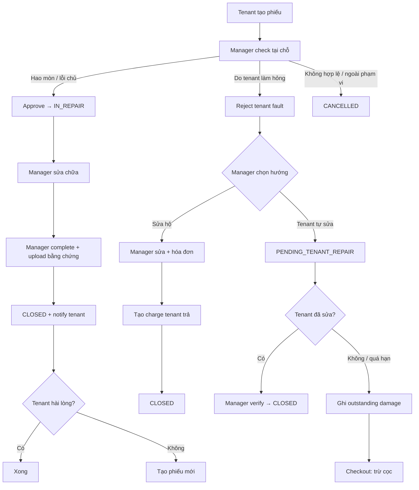
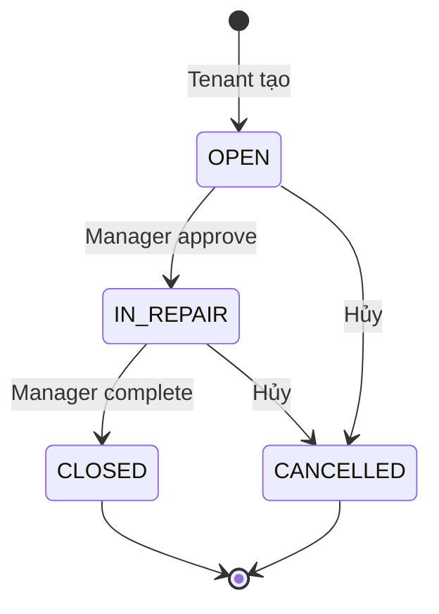
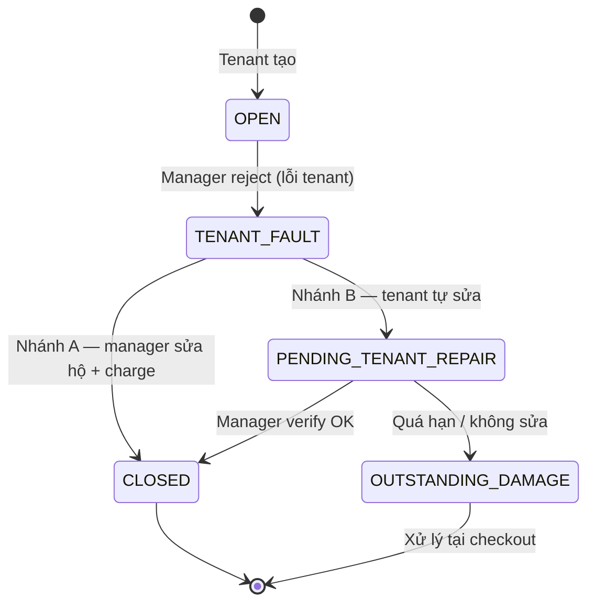

# Đặc tả thiết kế lại luồng Maintenance (gộp ý kiến)

> Tài liệu mô tả thiết kế lại module Bảo trì (Maintenance), gộp:
> - Ý kiến **mentor**
> - Ý kiến **thành viên nhóm** (phân trách nhiệm, checkout)
> - Phân tích **codebase hiện tại**
>
> **Ngày tạo:** 31/08/2026  
> **Cập nhật:** 01/09/2026 — chốt 6 câu hỏi FE/BE  
> **Trạng thái:** Chốt spec — BE đã implement  
> **As-built:** [`maintenance-implementation-spec.md`](./maintenance-implementation-spec.md)

---

## Mục lục

1. [Nguồn ý kiến & nguyên tắc chung](#1-nguồn-ý-kiến--nguyên-tắc-chung)
2. [Hiện trạng hệ thống](#2-hiện-trạng-hệ-thống)
3. [Thiết kế gộp — tổng quan](#3-thiết-kế-gộp--tổng-quan)
4. [Phạm vi module](#4-phạm-vi-module)
5. [Luồng A — Sửa chữa bình thường (hao mòn / lỗi chủ)](#5-luồng-a--sửa-chữa-bình-thường-hao-mòn--lỗi-chủ)
6. [Luồng B — Lỗi do tenant (tenant fault)](#6-luồng-b--lỗi-do-tenant-tenant-fault)
7. [Hai loại reject — phân biệt rõ](#7-hai-loại-reject--phân-biệt-rõ)
8. [Bằng chứng vật chứng](#8-bằng-chứng-vật-chứng)
9. [Trách nhiệm chi phí & tích hợp billing/checkout](#9-trách-nhiệm-chi-phí--tích-hợp-billingcheckout)
10. [Data model](#10-data-model)
11. [API contract](#11-api-contract)
12. [Thông báo](#12-thông-báo)
13. [Kế hoạch triển khai](#13-kế-hoạch-triển-khai)
14. [So sánh cũ vs mới](#14-so-sánh-cũ-vs-mới)
15. [Phụ lục](#15-phụ-lục)
16. [Chốt quyết định 01/09/2026 (FE ↔ BE)](#16-chốt-quyết-định-01092026-fe--be)

---

## 1. Nguồn ý kiến & nguyên tắc chung

### 1.1 Ý kiến mentor

| # | Nguyên tắc |
|---|------------|
| 1 | **Một yêu cầu = một lần sửa, xong đóng.** Muốn sửa tiếp thì tạo yêu cầu mới. |
| 2 | **Maintenance chỉ sửa chữa nội thất đang hư.** Sửa chữa công trình lớn và mua mới nằm ngoài module này. |
| 3 | **Manager chụp hóa đơn, nhập dữ liệu → hệ thống tự động thông báo tenant** (phần sửa chữa). Hệ thống ghi nhận bằng chứng vật chứng. |

### 1.2 Ý kiến thành viên nhóm

| # | Ý kiến |
|---|--------|
| 1 | Tenant tạo phiếu → manager đến **check & approve** → tiến hành sửa → manager **hoàn thành**. |
| 2 | Tenant kiểm tra: **ổn thì không làm gì**; không ổn → **gửi phiếu mới**. |
| 3 | Manager check thấy **do tenant tự sửa / làm hỏng** → **reject** phiếu đó. |
| 4 | Nếu reject (lỗi tenant): **manager sửa hộ** → tenant **thanh toán hóa đơn**. |
| 5 | Hoặc manager **không sửa** → tenant **tự sửa**; không sửa thì thiết bị vẫn hư → **checkout trừ cọc**. |

### 1.3 Nguyên tắc gộp (chốt thiết kế)

| # | Nguyên tắc | Nguồn |
|---|------------|-------|
| 1 | Một phiếu = một lần xử lý, đóng khi xong. Không reopen cùng phiếu. | Mentor + Nhóm |
| 2 | Manager **check & approve** trước khi sửa (bước xác nhận sự cố hợp lệ). | Nhóm |
| 3 | Manager complete → **đóng ngay** + notify tenant. Tenant **không cần bấm confirm**. | Mentor |
| 4 | Tenant không hài lòng kết quả sửa → **tạo phiếu mới** (link `previousRequestId`). | Mentor + Nhóm |
| 5 | Phân biệt **hao mòn/lỗi chủ** vs **lỗi tenant** — hai luồng xử lý khác nhau. | Nhóm |
| 6 | Lỗi tenant: manager sửa hộ (tenant trả) **hoặc** tenant tự sửa (checkout trừ cọc nếu không sửa). | Nhóm |
| 7 | Bằng chứng chính do **manager** upload (ảnh sau sửa + hóa đơn). | Mentor |
| 8 | **Không** có vòng reject/reopen chất lượng sửa trên cùng phiếu như code cũ. | Mentor |

### 1.4 Mục tiêu thiết kế lại

- Đơn giản hóa luồng chính: bỏ `WAITING_TENANT_CONFIRM`, `review-reject`, cost dispute trong maintenance.
- Thêm luồng phụ **tenant fault** với trách nhiệm chi phí rõ ràng.
- Nối nhánh "tenant không sửa" với module **Checkout** (`CheckoutDamageItem`, trừ cọc) — đã có sẵn trong codebase.
- Làm rõ phạm vi: Maintenance = sửa nội thất/thiết bị có sẵn trong phòng.

---

## 2. Hiện trạng hệ thống

### 2.1 Luồng đang chạy (code cũ)

```
PENDING → APPROVED → WAITING_TENANT_CONFIRM → CLOSED
                         ↘ REJECTED → (manager review-reject)
                              ├─ approve=true  → APPROVED (reopen / sửa lại)
                              └─ approve=false → WAITING_TENANT_CONFIRM (bắt xác nhận lại)
```

### 2.2 File backend liên quan

| File | Vai trò |
|------|---------|
| `MaintenanceController.java` | REST API maintenance |
| `MaintenanceServiceImpl.java` | Business logic maintenance |
| `MaintenanceRequest.java` | Entity chính |
| `MaintenanceImage.java` | Lịch sử ảnh |
| `CheckoutProcessServiceImpl.java` | Checkout inspection |
| `CheckoutDamageItem.java` | Thiết bị hư khi checkout |
| `TenantPendingChargeServiceImpl.java` | Charge / invoice tenant |
| `TenantCheckoutServiceImpl.java` | Trừ cọc khi checkout |

> Repo này chỉ có backend. Mobile app nằm ở repo riêng.

### 2.3 Vấn đề so với thiết kế mới

| Vấn đề | Mức độ |
|--------|--------|
| Vòng reopen (`REJECTED → reviewReject → APPROVED`) | 🔴 Cao |
| Tenant phải confirm + đồng ý/khiếu nại chi phí | 🔴 Cao |
| Không phân biệt reject chất lượng vs reject lỗi tenant | 🔴 Cao |
| Không có loại ảnh INVOICE | 🟡 Trung bình |
| Category quá rộng, không phân biệt sửa vs mua mới | 🟡 Trung bình |
| Chưa nối outstanding damage → checkout | 🟡 Trung bình |

---

## 3. Thiết kế gộp — tổng quan

### 3.1 Sơ đồ tổng thể



### 3.2 Vai trò từng bên

| Vai trò | Luồng A (hao mòn) | Luồng B (lỗi tenant) |
|---------|-------------------|----------------------|
| **Tenant** | Tạo phiếu, xem bằng chứng sau khi đóng. Không ổn → phiếu mới. | Nhận thông báo lỗi do mình. Tự sửa (nếu được giao) hoặc trả hóa đơn (nếu manager sửa hộ). |
| **Manager** | Check & approve, sửa, upload bằng chứng, complete. | Check & reject tenant fault, chọn sửa hộ hoặc giao tenant tự sửa, verify kết quả. |
| **Hệ thống** | Đóng ticket + notify tenant khi complete. | Tạo charge / ghi outstanding damage → checkout. |
| **Admin** | Giống manager, không giới hạn property scope. | Giống manager. |

### 3.3 Tenant KHÔNG làm

- Không bấm confirm/reject trên phiếu đã complete.
- Không reopen phiếu đã đóng.
- Không khiếu nại chi phí trong luồng maintenance (case lỗi tenant → charge riêng qua billing).

---

## 4. Phạm vi module

### 4.1 Thuộc Maintenance ✅

Sửa chữa nội thất / thiết bị **đã có trong phòng** và đang hư hỏng.

| Ví dụ | Category |
|-------|----------|
| Ghế gãy chân, tủ hỏng bản lề | `FURNITURE` |
| Máy lạnh không lạnh, tủ lạnh hỏng | `APPLIANCE` |
| Vòi nước rò, ổ cắm hỏng | `PLUMBING`, `ELECTRICAL` |

### 4.2 Nằm ngoài Maintenance ❌

| Loại | Module đề xuất |
|------|----------------|
| Mua mới / thay thế thiết bị | `Equipment Procurement` (tương lai) |
| Sửa chữa công trình lớn (sơn, chống thấm, điện hệ thống) | `Facility Work Order` (tương lai) |

### 4.3 Validation khi tạo

- Bắt buộc chọn `equipmentId` hoặc mô tả nội thất trong inventory phòng.
- Cho phép category: `APPLIANCE`, `FURNITURE`, `PLUMBING`, `ELECTRICAL` (thiết bị có sẵn trong phòng — đã chốt 01/09).
- Chặn keyword: "mua mới", "thay mới", "lắp thêm", "nâng cấp".

---

## 5. Luồng A — Sửa chữa bình thường (hao mòn / lỗi chủ)

> Áp dụng khi manager check và xác định hư hỏng do hao mòn tự nhiên hoặc không phải lỗi tenant.

### 5.1 Các bước

| Bước | Ai | Hành động | Status |
|------|-----|-----------|--------|
| 1 | Tenant | Tạo phiếu (mô tả + ảnh BEFORE tùy chọn) | `OPEN` |
| 2 | Manager | Đến check, approve | `IN_REPAIR` |
| 3 | Manager | Sửa chữa (thợ ngoài, ngoài hệ thống) | `IN_REPAIR` |
| 4 | Manager | Complete: upload ảnh AFTER + INVOICE + nhập dữ liệu | `CLOSED` |
| 5 | Hệ thống | Notify tenant (read-only bằng chứng) | — |
| 6 | Tenant | Xem kết quả. Ổn → không làm gì. Không ổn → tạo phiếu mới | — |

### 5.2 State machine — Luồng A



### 5.3 Chi phí — Luồng A

- Chi phí sửa chữa do **chủ nhà/manager** chịu (hao mòn bình thường).
- Hóa đơn vẫn được upload làm **bằng chứng vật chứng** (theo mentor).
- Tenant **không trả tiền** trong luồng này.
- Response API trả `invoiceAmount` + `invoiceVendor` + `invoiceImages` — FE hiển thị dạng **thông tin tham khảo**, label rõ **"Chi phí do chủ nhà chi trả"**, không hiện nút thanh toán (đã chốt 01/09).

---

## 6. Luồng B — Lỗi do tenant (tenant fault)

> Áp dụng khi manager check và xác định hư hỏng do tenant tự sửa, sử dụng sai, hoặc làm hỏng.

### 6.1 Các bước

| Bước | Ai | Hành động | Status |
|------|-----|-----------|--------|
| 1 | Tenant | Tạo phiếu | `OPEN` |
| 2 | Manager | Check, phát hiện lỗi tenant → reject + upload bằng chứng | `TENANT_FAULT` |
| 3 | Manager | Chọn hướng xử lý (sửa hộ **hoặc** tenant tự sửa) | — |
| 4a | Manager | **Nhánh A:** Sửa hộ → complete + hóa đơn → tạo charge tenant | `CLOSED` |
| 4b | Manager | **Nhánh B:** Giao tenant tự sửa + deadline | `PENDING_TENANT_REPAIR` |
| 5b | Tenant | Tự sửa trong thời hạn | `PENDING_TENANT_REPAIR` |
| 6b | Manager | Verify tenant đã sửa → complete | `CLOSED` |
| 7b | Hệ thống | Tenant không sửa / quá hạn → ghi outstanding damage | `OUTSTANDING_DAMAGE` |
| 8b | Checkout | Trừ cọc qua `CheckoutDamageItem` | — |

### 6.2 State machine — Luồng B



### 6.3 Nhánh A — Manager sửa hộ, tenant trả tiền

```
TENANT_FAULT
  → Manager sửa chữa
  → Manager complete (AFTER + INVOICE bắt buộc)
  → Hệ thống tạo TenantPendingCharge (category MAINTENANCE)
  → Phát hành TenantInvoice
  → CLOSED + notify tenant (kèm thông tin hóa đơn cần thanh toán)
```

### 6.4 Nhánh B — Tenant tự sửa

```
TENANT_FAULT
  → Manager chọn "tenant tự sửa" + đặt deadline (VD: 14 ngày)
  → PENDING_TENANT_REPAIR + notify tenant
  → Tenant tự sửa
  → Manager đến verify:
      ├─ OK → CLOSED
      └─ Không OK / quá hạn → OUTSTANDING_DAMAGE
           → Ghi vào outstanding_damage_records
           → Khi checkout: tạo CheckoutDamageItem + trừ cọc
           → Nếu tenant không trả phần còn lại → cọc không hoàn
```

### 6.5 Dữ liệu manager cần nhập khi reject tenant fault

| Field | Bắt buộc | Mô tả |
|-------|----------|-------|
| `faultReason` | Có | Lý do: tenant tự sửa, sử dụng sai, ... |
| `faultEvidenceImages` | Có | Ảnh bằng chứng |
| `resolutionPath` | Có | `MANAGER_REPAIR` hoặc `TENANT_SELF_REPAIR` |
| `selfRepairDeadline` | Có (nhánh B) | Hạn tenant tự sửa |
| `estimatedDamageAmount` | Có (nhánh B) | Ước tính chi phí sửa (dùng khi checkout trừ cọc) |

---

## 7. Hai loại reject — phân biệt rõ

> **Quan trọng:** Không gộp hai loại reject vào cùng một status như code cũ.

| | Reject chất lượng sửa (BỎ) | Reject lỗi tenant (GIỮ) |
|--|---------------------------|-------------------------|
| **Ai reject** | Tenant (sau khi manager sửa xong) | Manager (lúc check ban đầu) |
| **Khi nào** | Manager complete rồi, tenant không hài lòng | Manager check, thấy do tenant làm hỏng |
| **Xử lý** | ~~Reopen cùng phiếu~~ → **Tạo phiếu mới** | Chuyển sang Luồng B |
| **Status** | Không có (phiếu cũ đã CLOSED) | `TENANT_FAULT` |
| **Nguồn ý kiến** | Mentor: bỏ reopen | Nhóm: thêm tenant fault |

---

## 8. Bằng chứng vật chứng

### 8.1 Loại ảnh

| Type | Ai upload | Bắt buộc | Khi nào |
|------|-----------|----------|---------|
| `BEFORE` | Tenant | Không | Lúc tạo phiếu |
| `FAULT_EVIDENCE` | Manager | Có (Luồng B) | Lúc reject tenant fault |
| `SELF_REPAIR` | Tenant | Có (Luồng B nhánh B) | Tenant báo đã tự sửa — manager verify từ xa |
| `AFTER` | Manager | Có | Lúc complete |
| `INVOICE` | Manager | Có | Lúc complete |

### 8.2 Dữ liệu hóa đơn (manager nhập khi complete)

| Field | Kiểu | Bắt buộc | Mô tả |
|-------|------|----------|-------|
| `invoiceVendor` | string | Có | Tên cửa hàng / thợ |
| `invoiceNumber` | string | Không | Số hóa đơn |
| `invoiceDate` | date | Có | Ngày hóa đơn |
| `invoiceAmount` | decimal | Có | Tổng tiền |
| `repairDescription` | string | Có | Mô tả công việc sửa chữa |
| `resolutionNote` | string | Không | Ghi chú manager |

### 8.3 Ví dụ payload complete (Luồng A)

```json
{
  "resolutionNote": "Đã thay bản lề tủ quần áo",
  "repairDescription": "Thay 2 bản lề tủ, siết ốc vít",
  "afterImages": ["https://storage/.../after1.jpg"],
  "invoiceImages": ["https://storage/.../invoice1.jpg"],
  "invoiceVendor": "Cửa hàng phụ kiện nội thất ABC",
  "invoiceNumber": "HD-001234",
  "invoiceDate": "2026-08-31",
  "invoiceAmount": 350000
}
```

### 8.4 Ví dụ payload reject tenant fault

```json
{
  "faultReason": "Tenant tự tháo và lắp sai ống nước máy lạnh",
  "faultEvidenceImages": ["https://storage/.../fault1.jpg"],
  "resolutionPath": "MANAGER_REPAIR",
  "estimatedDamageAmount": 500000
}
```

### 8.5 Lưu trữ

- Upload qua `PropertyImageStorage`, prefix `MAINT-{requestId}`.
- Append-only log trong `maintenance_images`.
- Snapshot CSV trên `maintenance_requests` (giữ pattern hiện tại).

---

## 9. Trách nhiệm chi phí & tích hợp billing/checkout

### 9.1 Ma trận trách nhiệm

| Tình huống | Ai sửa | Ai trả | Module xử lý |
|------------|--------|--------|--------------|
| Hao mòn / lỗi chủ (Luồng A) | Manager | Chủ nhà | Maintenance — ghi nhận hóa đơn, không charge tenant |
| Lỗi tenant — manager sửa hộ (Luồng B, nhánh A) | Manager | Tenant | Maintenance complete → `TenantPendingCharge` |
| Lỗi tenant — tenant tự sửa OK (Luồng B, nhánh B) | Tenant | Tenant (tự chi) | Maintenance verify → CLOSED |
| Lỗi tenant — tenant không sửa (Luồng B, nhánh B) | Không ai | Tenant (trừ cọc) | `CheckoutDamageItem` → trừ cọc |

### 9.2 Tích hợp billing (nhánh A — manager sửa hộ)

```
Manager complete (TENANT_FAULT → MANAGER_REPAIR)
  → maintenance_requests.status = CLOSED
  → TenantPendingChargeService.createAndIssueMaintenanceCharge()
  → TenantInvoice (type MAINTENANCE)
  → Optional PayOS payment link
  → Notify tenant: "Có khoản thanh toán sửa chữa do lỗi của bạn"
```

> Tách khỏi luồng confirm — charge tạo **tự động** khi manager complete, không cần tenant đồng ý trước.

### 9.3 Tích hợp checkout (nhánh B — tenant không sửa)

```
PENDING_TENANT_REPAIR quá hạn
  → maintenance_requests.status = OUTSTANDING_DAMAGE
  → Ghi outstanding_damage_records:
      - equipmentId, label, estimatedAmount, photos, maintenanceRequestId
  → Khi checkout (CheckoutProcessServiceImpl):
      - Tạo CheckoutDamageItem từ outstanding records
      - Trừ cọc (deductFromDeposit)
      - Nếu tenant không trả phần còn lại → cọc không hoàn
```

**Entity checkout hiện có (tái sử dụng):**

- `CheckoutInspection` — inspection khi checkout
- `CheckoutDamageItem` — thiết bị hư, số tiền, ảnh
- `CheckoutSettlement` — quyết toán cọc

### 9.4 Enum nguyên nhân hư hỏng

```java
public enum DamageCause {
    WEAR,                  // Hao mòn tự nhiên → Luồng A
    TENANT_MISUSE,         // Sử dụng sai → Luồng B
    TENANT_MODIFICATION    // Tenant tự sửa / tháo lắp → Luồng B
}
```

---

## 10. Data model

### 10.1 Enum `MaintenanceStatus`

```java
public enum MaintenanceStatus {
    OPEN,                    // Tenant tạo, chờ manager check
    IN_REPAIR,               // Manager approve, đang sửa (Luồng A)
    TENANT_FAULT,            // Manager reject — lỗi tenant (Luồng B)
    PENDING_TENANT_REPAIR,   // Giao tenant tự sửa (Luồng B, nhánh B)
    OUTSTANDING_DAMAGE,      // Tenant không sửa, chờ checkout
    CLOSED,                  // Hoàn tất
    CANCELLED                // Đã hủy
}
```

### 10.2 Enum `MaintenancePhotoType`

```java
public enum MaintenancePhotoType {
    BEFORE,
    FAULT_EVIDENCE,   // Bằng chứng lỗi tenant (manager upload)
    SELF_REPAIR,      // Bằng chứng tenant đã tự sửa (tenant upload)
    AFTER,
    INVOICE
}
```

### 10.3 Enum `FaultResolutionPath`

```java
public enum FaultResolutionPath {
    MANAGER_REPAIR,       // Manager sửa hộ, tenant trả
    TENANT_SELF_REPAIR    // Tenant tự sửa
}
```

### 10.4 Enum `MaintenanceCategory`

```java
public enum MaintenanceCategory {
    APPLIANCE,
    FURNITURE,
    PLUMBING,     // Vòi, ống nước có sẵn trong phòng
    ELECTRICAL    // Ổ cắm, công tắc, đèn có sẵn trong phòng
    // STRUCTURAL, OTHER — ngoài phạm vi Maintenance
}
```

### 10.5 Bảng `maintenance_requests` — thêm field

```sql
ALTER TABLE maintenance_requests
  ADD COLUMN invoice_vendor          VARCHAR(255),
  ADD COLUMN invoice_number          VARCHAR(100),
  ADD COLUMN invoice_date            DATE,
  ADD COLUMN invoice_amount          DECIMAL(15,2),
  ADD COLUMN repair_description      TEXT,
  ADD COLUMN previous_request_id     BIGINT REFERENCES maintenance_requests(id),
  ADD COLUMN damage_cause            VARCHAR(50),
  ADD COLUMN fault_reason            TEXT,
  ADD COLUMN fault_resolution_path   VARCHAR(50),
  ADD COLUMN self_repair_deadline    DATE,
  ADD COLUMN estimated_damage_amount DECIMAL(15,2);
```

### 10.6 Bảng `maintenance_requests` — xóa / deprecate

| Field | Lý do |
|-------|-------|
| `reopen_count` | Không còn reopen |
| `reject_reason`, `reject_image_urls` | Thay bằng `fault_reason` + `FAULT_EVIDENCE` |
| `cost_agreement_status`, `cost_dispute_reason` | Bỏ cost dispute |
| `scheduled_date`, `scheduled_slots`, `technician_id`, ... | Legacy |

### 10.7 Bảng mới: `outstanding_damage_records`

```sql
CREATE TABLE outstanding_damage_records (
  id                      BIGSERIAL PRIMARY KEY,
  maintenance_request_id  BIGINT NOT NULL REFERENCES maintenance_requests(id),
  tenant_contract_id      BIGINT NOT NULL,
  equipment_id            BIGINT,
  label                   VARCHAR(255) NOT NULL,
  estimated_amount        DECIMAL(15,2) NOT NULL,
  note                    TEXT,
  resolved_at_checkout    BOOLEAN DEFAULT FALSE,
  checkout_damage_item_id BIGINT,
  created_at              TIMESTAMP DEFAULT NOW()
);

CREATE TABLE outstanding_damage_photos (
  record_id  BIGINT NOT NULL REFERENCES outstanding_damage_records(id),
  photo_url  VARCHAR(500) NOT NULL
);
```

### 10.8 Link ticket liên tiếp

Khi tenant không hài lòng kết quả sửa (Luồng A) hoặc vấn đề tái phát:

```json
{
  "title": "Tủ vẫn còn hỏng bản lề",
  "previousRequestId": 105,
  "equipmentId": 42
}
```

UI hiển thị chuỗi: `M-101 → M-105 → M-112`.

---

## 11. API contract

### 11.1 Endpoints

| Method | Endpoint | Role | Mô tả |
|--------|----------|------|-------|
| `GET` | `/api/v1/maintenance` | ALL | Danh sách |
| `POST` | `/api/v1/maintenance` | TENANT | Tạo phiếu |
| `GET` | `/api/v1/maintenance/my-requests` | TENANT | Phiếu của tenant |
| `GET` | `/api/v1/maintenance/{id}` | ALL | Chi tiết |
| `GET` | `/api/v1/maintenance/dashboard` | MANAGER, ADMIN | Thống kê |
| `PUT` | `/api/v1/maintenance/{id}/approve` | MANAGER, ADMIN | Check OK → `IN_REPAIR` (Luồng A) |
| `PUT` | `/api/v1/maintenance/{id}/reject-fault` | MANAGER, ADMIN | Lỗi tenant → `TENANT_FAULT` (Luồng B) |
| `PUT` | `/api/v1/maintenance/{id}/assign-self-repair` | MANAGER, ADMIN | Giao tenant tự sửa → `PENDING_TENANT_REPAIR` |
| `PUT` | `/api/v1/maintenance/{id}/submit-self-repair` | TENANT | Upload ảnh SELF_REPAIR + ghi chú — chờ manager verify |
| `PUT` | `/api/v1/maintenance/{id}/verify-repair` | MANAGER, ADMIN | Verify tenant đã sửa → `CLOSED` hoặc `OUTSTANDING_DAMAGE` |
| `PUT` | `/api/v1/maintenance/{id}/complete` | MANAGER, ADMIN | Hoàn tất → `CLOSED` + notify (+ charge nếu Luồng B nhánh A) |
| `PUT` | `/api/v1/maintenance/{id}/cancel` | ALL* | Hủy |
| `POST` | `/api/v1/maintenance/{id}/photos` | ALL* | Upload ảnh |
| `GET` | `/api/v1/maintenance/outstanding-damages` | MANAGER, ADMIN | Danh sách thiết bị hư chưa xử lý |

> \* Tenant chỉ cancel khi `OPEN`.

### 11.2 Endpoints xóa (code cũ)

| Endpoint | Lý do |
|----------|-------|
| `PUT /{id}/confirm` | Tenant không confirm nữa |
| `PUT /{id}/reject` | Tenant không reject chất lượng — tạo phiếu mới thay thế |
| `PUT /{id}/review-reject` | Không còn reopen |
| `PUT /{id}/resolve-cost` | Cost dispute bỏ; charge tự động (Luồng B) |
| `GET /pending-cost-resolution` | Không còn cost dispute |

### 11.3 Request DTO

**`MaintenanceRejectFaultRequest`** (mới):

```java
@Data
public class MaintenanceRejectFaultRequest {
    private String faultReason;
    private List<String> faultEvidenceImages;
    private FaultResolutionPath resolutionPath;  // MANAGER_REPAIR | TENANT_SELF_REPAIR
    private LocalDate selfRepairDeadline;         // bắt buộc nếu TENANT_SELF_REPAIR
    private BigDecimal estimatedDamageAmount;     // bắt buộc nếu TENANT_SELF_REPAIR
}
```

**`MaintenanceCompleteRequest`**:

```java
@Data
public class MaintenanceCompleteRequest {
    private String resolutionNote;
    private String repairDescription;
    private List<String> afterImages;
    private List<String> invoiceImages;
    private String invoiceVendor;
    private String invoiceNumber;
    private LocalDate invoiceDate;
    private BigDecimal invoiceAmount;
}
```

**`MaintenanceVerifyRepairRequest`** (mới):

```java
@Data
public class MaintenanceVerifyRepairRequest {
    private boolean accepted;           // true = tenant đã sửa OK
    private String note;                // ghi chú manager
    private List<String> verifyImages;  // ảnh verify (optional)
}
```

**`MaintenanceCreateRequest`** (bổ sung):

```java
private Long previousRequestId;  // link phiếu trước (optional)
```

---

## 12. Thông báo

### 12.1 Danh sách thông báo

| Type | Người nhận | Trigger |
|------|------------|---------|
| `MAINTENANCE_CREATED` | Manager | Tenant tạo phiếu |
| `MAINTENANCE_APPROVED` | Tenant | Manager approve (Luồng A) |
| `MAINTENANCE_COMPLETED` | Tenant | Manager complete → CLOSED |
| `MAINTENANCE_TENANT_FAULT` | Tenant | Manager reject lỗi tenant |
| `MAINTENANCE_SELF_REPAIR_ASSIGNED` | Tenant | Giao tenant tự sửa + deadline |
| `MAINTENANCE_SELF_REPAIR_OVERDUE` | Tenant, Manager | Quá hạn tự sửa |
| `MAINTENANCE_CHARGE_ISSUED` | Tenant | Charge phát hành (Luồng B nhánh A) |
| `MAINTENANCE_CANCELLED` | Tenant / Manager | Hủy phiếu |

### 12.2 Xóa (code cũ)

| Type | Lý do |
|------|-------|
| `MAINTENANCE_REJECTED_BY_TENANT` | Tenant không reject chất lượng nữa |
| `MAINTENANCE_COST_DISPUTED` | Không còn cost dispute |
| `MAINTENANCE_COST_RESOLVED` | Charge tự động |
| `MAINTENANCE_AUTO_CONFIRMED` | Không còn auto-confirm |
| `MAINTENANCE_REOPEN_ESCALATION` | Không còn reopen |

### 12.3 Nội dung notify tenant khi complete (Luồng A)

```
Tiêu đề: "Bảo trì đã hoàn tất — [tên sự cố]"
Nội dung:
  - Mô tả sửa chữa: [repairDescription]
  - Xem ảnh sau sửa và hóa đơn trong chi tiết phiếu.
  - Nếu chưa hài lòng, tạo yêu cầu mới trong app.
```

### 12.4 Nội dung notify tenant khi tenant fault (Luồng B)

```
Tiêu đề: "Yêu cầu bảo trì — lỗi do khách thuê"
Nội dung (nhánh A):
  - Lý do: [faultReason]
  - Manager sẽ sửa hộ. Bạn sẽ nhận hóa đơn thanh toán sau khi hoàn tất.

Nội dung (nhánh B):
  - Lý do: [faultReason]
  - Bạn cần tự sửa chữa trước [selfRepairDeadline].
  - Nếu không sửa, chi phí sẽ được trừ khi checkout.
```

---

## 13. Kế hoạch triển khai

### Phase 1 — Core refactor (Luồng A)

- [ ] Enum status mới + migration dữ liệu cũ
- [ ] Bỏ reopen / tenant reject / cost dispute
- [ ] API `/approve` (check & approve → IN_REPAIR)
- [ ] API `/complete` → auto CLOSED + notify
- [ ] Thêm INVOICE photo type + invoice fields
- [ ] Deprecate API cũ (`/confirm`, `/reject`, `/review-reject`, `/resolve-cost`)

### Phase 2 — Luồng B (tenant fault)

- [ ] API `/reject-fault`, `/assign-self-repair`, `/verify-repair`
- [ ] Enum `FaultResolutionPath`, `DamageCause` mở rộng
- [ ] Tích hợp `TenantPendingCharge` (nhánh A)
- [ ] Bảng `outstanding_damage_records`
- [ ] Tích hợp `CheckoutDamageItem` (nhánh B)
- [ ] Cron check overdue self-repair

### Phase 3 — Scope & validation

- [ ] Giới hạn category (APPLIANCE, FURNITURE)
- [ ] Bắt buộc `equipmentId` hoặc inventory item
- [ ] Validation chặn keyword "mua mới"
- [ ] Field `previousRequestId` + query linked requests

### Phase 4 — Mobile app + polish

- [ ] UI tenant: tạo phiếu, xem bằng chứng, tạo phiếu mới nếu chưa ổn
- [ ] UI manager: check/approve, reject fault, complete form, verify self-repair
- [ ] Dashboard metrics mới
- [ ] Wire tenant dashboard maintenance counts

### Phase 5 — Cleanup

- [ ] Xóa DTO legacy (7 file orphan)
- [ ] Xóa field legacy trên entity
- [ ] Xóa bảng `maintenance_history` nếu không dùng
- [ ] Cập nhật test cases

---

## 14. So sánh cũ vs mới

| Khía cạnh | Code cũ | Thiết kế gộp |
|-----------|---------|--------------|
| Số status | 6 (+ legacy) | 7 (có thêm tenant fault) |
| Vòng reopen | Có | Không — tạo phiếu mới |
| Tenant confirm sửa chữa | Bắt buộc | Không — im lặng = OK |
| Reject chất lượng sửa | Tenant reject → reopen | Bỏ — tạo phiếu mới |
| Reject lỗi tenant | Không có | Manager reject → Luồng B |
| Ai trả tiền (lỗi tenant) | Cost dispute trong maintenance | Charge tự động hoặc trừ cọc checkout |
| Ảnh hóa đơn | Không có | Manager upload INVOICE |
| Bằng chứng lỗi tenant | Không có | Manager upload FAULT_EVIDENCE |
| Checkout trừ cọc | Không nối maintenance | Nối qua outstanding_damage_records |
| Category | 6 loại | 4 loại (APPLIANCE, FURNITURE, PLUMBING, ELECTRICAL) |
| Auto-close | Sau 3 ngày không confirm | Manager complete = đóng ngay |

### Bảng gộp 3 nguồn ý kiến

| | Mentor | Nhóm | Thiết kế gộp |
|--|--------|------|--------------|
| 1 phiếu 1 lần sửa | ✅ | ✅ | ✅ |
| Manager check & approve | Ngầm định | ✅ | ✅ |
| Tenant im lặng nếu OK | ✅ | ✅ | ✅ |
| Không ổn → phiếu mới | ✅ | ✅ | ✅ |
| Hóa đơn + notify | ✅ | Case lỗi tenant | ✅ cả 2 luồng |
| Reject lỗi tenant | — | ✅ | ✅ Luồng B |
| Tenant trả nếu lỗi mình | — | ✅ | ✅ Charge / checkout |
| Checkout trừ cọc | — | ✅ | ✅ outstanding_damage |

---

## 15. Phụ lục

### A. Câu hỏi đã chốt (01/09/2026)

→ Xem mục [16. Chốt quyết định](#16-chốt-quyết-định-01092026-fe--be).

### B. Tài liệu & code liên quan

| Path | Mô tả |
|------|-------|
| `MaintenanceServiceImpl.java` | Logic maintenance hiện tại |
| `CheckoutProcessServiceImpl.java` | Checkout inspection |
| `CheckoutDamageItem.java` | Thiết bị hư khi checkout |
| `TenantPendingChargeServiceImpl.java` | Charge tenant |
| `TenantCheckoutServiceImpl.java` | Trừ cọc |
| `schema.sql` | Schema DB |
| `application.yaml` | `maintenance.auto-confirm-days` (sẽ xóa) |

### C. Diagram tổng hợp (reference)

```
┌─────────────────────────────────────────────────────────────┐
│                    MAINTENANCE MODULE                        │
├─────────────────────────────────────────────────────────────┤
│                                                              │
│  LUỒNG A (hao mòn)          LUỒNG B (lỗi tenant)            │
│  ─────────────────          ────────────────────            │
│  OPEN                       OPEN                             │
│    ↓ approve                  ↓ reject-fault                 │
│  IN_REPAIR                  TENANT_FAULT                       │
│    ↓ complete                 ├→ complete + charge (A)       │
│  CLOSED + notify              │    ↓ CLOSED                   │
│    ↓                          └→ self-repair (B)             │
│  Tenant xem                     ↓                             │
│  (OK: im lặng)              PENDING_TENANT_REPAIR              │
│  (Không OK: phiếu mới)        ├→ verify OK → CLOSED           │
│                               └→ quá hạn → OUTSTANDING_DAMAGE  │
│                                    ↓ checkout                  │
│                                  Trừ cọc                       │
│                                                              │
└─────────────────────────────────────────────────────────────┘
```

---

## 16. Chốt quyết định 01/09/2026 (FE ↔ BE)

> Nguồn: [`BE-YEUCAU-chot-redesign-maintenance-2026-09-01.md`](./BE-YEUCAU-chot-redesign-maintenance-2026-09-01.md) (FE gửi).  
> BE đồng ý hướng thiết kế tổng thể và chốt như sau.

| # | Câu hỏi | Đề xuất FE | **Quyết định BE** | Ghi chú triển khai |
|---|---------|------------|-------------------|-------------------|
| 1 | Hóa đơn Luồng A: hiện số tiền cho tenant? | Hiện **thông tin tham khảo**, không phải "cần trả" | ✅ **Đồng ý** | Response trả `invoiceAmount`, `invoiceVendor`, `invoiceImages`. FE label: *"Chi phí do chủ nhà chi trả — tham khảo"*. Không gắn `TenantPendingCharge`. |
| 2 | Deadline tự sửa mặc định? | Manager **tự nhập**, gợi ý 14 ngày trên form | ✅ **Đồng ý** | BE validate `selfRepairDeadline` bắt buộc khi `resolutionPath=TENANT_SELF_REPAIR`. Không hardcode trong BE; FE prefill 14 ngày. Config `maintenance.self-repair-default-days: 14` chỉ là gợi ý API (optional). |
| 3 | Ai verify tenant đã tự sửa? | Tenant **upload ảnh** trước, manager duyệt từ xa | ✅ **Đồng ý** | Thêm photo type `SELF_REPAIR`. API `PUT /submit-self-repair` (tenant). `PUT /verify-repair` (manager) chỉ khi đã có ≥1 ảnh SELF_REPAIR. |
| 4 | Ticket cũ `REJECTED` migrate sang đâu? | Xin BE xác nhận cho mapper FE | ✅ **BE chốt** — xem bảng migration bên dưới | FE mapper legacy: map string cũ → status mới qua field `status` sau migration. |
| 5 | `PLUMBING`/`ELECTRICAL` thuộc Maintenance? | **Giữ trong Maintenance** | ✅ **Đồng ý** | Category cho phép: `APPLIANCE`, `FURNITURE`, `PLUMBING`, `ELECTRICAL`. Loại `STRUCTURAL`, `OTHER` redirect / từ chối. |
| 6 | `estimatedDamageAmount` chốt lúc nào? | Ước tính lúc `reject-fault`, điều chỉnh lúc checkout | ✅ **Đồng ý** | Lưu `estimatedDamageAmount` trên ticket + `outstanding_damage_records`. Checkout có thể override `amount` trên `CheckoutDamageItem`; ghi audit nếu khác estimate. |

### 16.1 Migration status cũ → mới (câu #4)

| Status cũ | Status mới | Lý do |
|-----------|------------|-------|
| `PENDING` | `OPEN` | Chờ manager |
| `APPROVED` | `IN_REPAIR` | Đang xử lý |
| `WAITING_TENANT_CONFIRM` | `IN_REPAIR` | Bỏ bước chờ tenant confirm |
| `REJECTED` | `IN_REPAIR` | Reject chất lượng cũ → manager xử lý tiếp hoặc đóng thủ công; không map sang `TENANT_FAULT` |
| `CLOSED` | `CLOSED` | Giữ nguyên |
| `CANCELLED` | `CANCELLED` | Giữ nguyên |
| Legacy (`ACKNOWLEDGED`, `SCHEDULED`, …) | `IN_REPAIR` hoặc `CLOSED` | Theo migration script hiện có |

**FE fallback trong giai đoạn chuyển tiếp:** nếu API trả status string lạ (ticket chưa migrate), hiển thị label *"Đang xử lý"* và không crash. Sau khi BE deploy migration, chỉ còn 7 status mới.

### 16.2 Response field cho FE — Luồng A (invoice)

```json
{
  "status": "CLOSED",
  "flowType": "NORMAL_WEAR",
  "invoiceAmount": 350000,
  "invoiceVendor": "Cửa hàng ABC",
  "invoiceImages": ["..."],
  "billingHint": "HOST_PAID"
}
```

| `billingHint` | Ý nghĩa FE |
|---------------|------------|
| `HOST_PAID` | Luồng A — chỉ hiển thị tham khảo, không nút trả |
| `TENANT_CHARGE_PENDING` | Luồng B nhánh A — có nút thanh toán |
| `DEPOSIT_DEDUCTION_PENDING` | Luồng B nhánh B — hiện estimate, nhắc checkout |

### 16.3 Thứ tự ship BE (để FE code Phase 1)

| Ưu tiên | Hạng mục BE | FE có thể bắt đầu |
|---------|-------------|-------------------|
| P0 | Status mới + migration + `/approve` + `/complete` + invoice fields + `billingHint` | Màn list/detail Luồng A, hiển thị hóa đơn tham khảo |
| P0 | Category 4 loại trên API create/approve | Màn tạo yêu cầu |
| P1 | `/reject-fault`, `/submit-self-repair`, `/verify-repair` | Luồng B |
| P1 | `outstanding_damage_records` + checkout nối | Màn checkout damage |

### 16.4 Trạng thái FE (01/09)

- ✅ FE đã đồng bộ `TenantMaintenanceScreen` về bộ status/category chung.
- ⏳ FE chờ BE ship Phase 1 (hiện mới có spec, chưa có code redesign trong repo BE).

---

*Tài liệu gộp ý kiến mentor + nhóm + chốt FE/BE 01/09/2026.*
