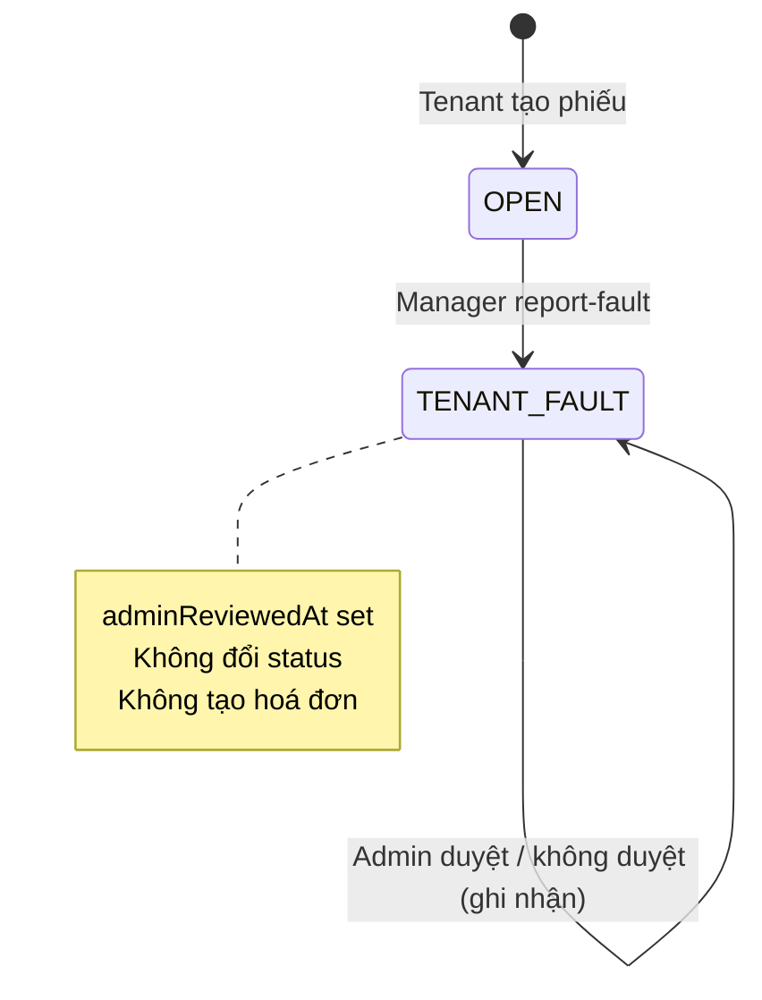

# Báo lỗi do khách — Admin duyệt (As-Built)

> Yêu cầu gốc: BE-YEUCAU — Luồng lỗi do khách gửi admin duyệt (01/09/2026)  
> **Ngày implement:** 01/09/2026  
> **Trạng thái:** ✅ Backend đã ship — FE mobile + web có thể tích hợp

---

## 1. Tóm tắt

| Khía cạnh | Trước | Sau (as-built) |
|-----------|-------|----------------|
| Manager báo lỗi khách | `reject-fault` bắt buộc `resolutionPath` → tự rẽ nhánh sửa/hoá đơn | Endpoint mới `report-fault` — chỉ ghi mô tả + ảnh, chờ admin |
| Admin duyệt | Không có | `PUT /admin-review` — ghi nhận duyệt/không duyệt |
| Sau admin duyệt | verify-repair / tạo hoá đơn trong app | **Kết thúc** — xử lý ngoài hệ thống |
| Tra cứu phiếu | `GET /maintenance?status=TENANT_FAULT` | Giữ nguyên — lọc thêm `adminReviewedAt == null` phía FE |

`reject-fault` **giữ nguyên** cho luồng cũ (nếu còn dùng).

---

## 2. Luồng mới



---

## 3. API

### 3.1 Manager báo lỗi do khách

`PUT /api/v1/maintenance/{id}/report-fault`  
**Role:** `ADMIN`, `MANAGER`

**Request:**
```json
{
  "faultReason": "Khách làm vỡ kính cửa sổ",
  "faultEvidenceImages": [
    "https://cdn.example.com/evidence1.jpg"
  ]
}
```

| Field | Bắt buộc | Ghi chú |
|-------|----------|---------|
| `faultReason` | Có | Mô tả lỗi |
| `faultEvidenceImages` | Có | Ít nhất 1 URL ảnh |

**Điều kiện:** `status == OPEN`

**Hành vi:**
- Set `flowType = TENANT_FAULT`, `damageCause = TENANT_MISUSE`
- Set `status = TENANT_FAULT`
- Lưu `faultReason`, append ảnh `FAULT_EVIDENCE`
- **Không** set `faultResolutionPath`
- **Không** notify tenant, **không** tạo hoá đơn / verify-repair

**Response:** `MaintenanceRequestResponse` (các field admin review = `null`)

---

### 3.2 Admin duyệt / không duyệt

`PUT /api/v1/maintenance/{id}/admin-review`  
**Role:** `ADMIN` only

**Request:**
```json
{
  "approved": true,
  "note": "Đồng ý, xử lý ngoài hệ thống"
}
```

| Field | Bắt buộc | Ghi chú |
|-------|----------|---------|
| `approved` | Có | `true` = duyệt, `false` = không duyệt |
| `note` | Không | Ghi chú admin |

**Điều kiện:**
- `status == TENANT_FAULT`
- `flowType == TENANT_FAULT`
- `faultReason` không rỗng
- `faultResolutionPath == null` (luồng mới, không phải `reject-fault` cũ)
- `adminReviewedAt == null` (chưa duyệt)

**Hành vi:**
- Ghi `adminReviewedAt`, `adminReviewedBy`, `adminApproved`, `adminReviewNote`
- **Không** đổi `status`
- Thêm timeline: `"Duyệt báo lỗi do khách"` hoặc `"Không duyệt báo lỗi do khách"`

---

### 3.3 Tra cứu (không đổi)

`GET /api/v1/maintenance?status=TENANT_FAULT` — role `ADMIN` xem toàn bộ.

**Lọc chờ duyệt (FE):** `adminReviewedAt == null && faultResolutionPath == null`

**Lọc đã duyệt (FE):** `adminReviewedAt != null`

---

## 4. Response — field mới

```json
{
  "id": 42,
  "status": "TENANT_FAULT",
  "flowType": "TENANT_FAULT",
  "faultReason": "Khách làm vỡ kính",
  "faultResolutionPath": null,
  "faultEvidenceImages": ["https://..."],
  "adminReviewedAt": "2026-09-01T14:30:00",
  "adminReviewedBy": "uuid-admin",
  "adminReviewedByName": "Nguyễn Văn Admin",
  "adminApproved": true,
  "adminReviewNote": "Đồng ý"
}
```

---

## 5. Database

Migration tự chạy qua `DatabaseSchemaMigration.ensureMaintenanceAdminReviewColumns()`.

| Cột | Kiểu | Ghi chú |
|-----|------|---------|
| `admin_reviewed_at` | `TIMESTAMP` | Thời điểm admin quyết định |
| `admin_reviewed_by` | `UUID` | User admin |
| `admin_approved` | `BOOLEAN` | `true`/`false` |
| `admin_review_note` | `TEXT` | Ghi chú tùy chọn |

---

## 6. Lỗi thường gặp

| HTTP | Khi nào |
|------|---------|
| `400` | Thiếu `faultReason` / `faultEvidenceImages` / `approved` |
| `400` | Phiếu không ở `OPEN` khi `report-fault` |
| `400` | Phiếu đã duyệt / thuộc luồng `reject-fault` cũ |
| `403` | Manager không quản lý nhà / non-admin gọi `admin-review` |

---

## 7. File code liên quan

| File | Vai trò |
|------|---------|
| `dto/request/MaintenanceReportFaultRequest.java` | Body report-fault |
| `dto/request/MaintenanceAdminReviewRequest.java` | Body admin-review |
| `entity/MaintenanceRequest.java` | Cột admin review |
| `dto/response/MaintenanceRequestResponse.java` | Expose field mới |
| `service/impl/MaintenanceServiceImpl.java` | `reportFault`, `adminReviewFault` |
| `controller/MaintenanceController.java` | 2 endpoint mới |
| `config/DatabaseSchemaMigration.java` | Migration cột |

---

## 8. Checklist FE

### Mobile (manager)
- [ ] Form "Báo lỗi do khách": bỏ UI chọn "Hướng xử lý"
- [ ] Gọi `PUT /report-fault` thay `reject-fault`
- [ ] Hiển thị trạng thái chờ admin (`adminReviewedAt == null`)

### Web (admin)
- [ ] Trang list `GET /maintenance?status=TENANT_FAULT`, lọc `adminReviewedAt == null`
- [ ] Chi tiết: xem `faultReason`, `faultEvidenceImages`
- [ ] Nút duyệt / không duyệt → `PUT /admin-review`
- [ ] Sau duyệt: hiển thị `adminApproved`, `adminReviewNote`, `adminReviewedByName`

---

*Tài liệu as-built — cập nhật khi có thay đổi API.*
