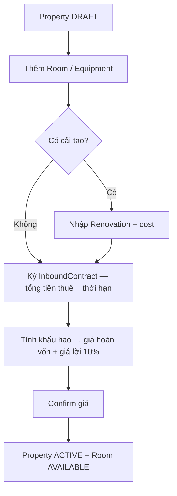

# SLMS — Property Onboarding Flow (Frontend Integration Guide)

Tài liệu mô tả ngữ cảnh, luồng nghiệp vụ, API và quy tắc UI cho team Frontend khi tích hợp quy trình onboarding tài sản (Property).

---

## 1. Bối cảnh

Hệ thống quản lý tài sản cho thuê (SLMS). Một **Property** (tòa nhà/căn nhà) đi qua quy trình **onboarding** trước khi sẵn sàng cho thuê:

1. Khảo sát & tạo nháp
2. Khai báo phòng / thiết bị / *(tuỳ chọn)* cải tạo
3. Ký **Inbound Contract** với chủ nhà gốc — nhập **tổng tiền thuê** trả trong cả kỳ HĐ + thời hạn
4. Tính **khấu hao** → hệ thống gợi ý **giá thuê dự kiến** (hoàn vốn) và **giá có lời 10%**
5. User **confirm giá** → Property/Room chuyển trạng thái kinh doanh

**Hai loại tài sản — hai cách tính giá (không gom chung):**

| Loại | `wholeHouse` | Pricing scope | Nơi lưu giá sau confirm |
|------|--------------|---------------|--------------------------|
| Nhà nguyên căn | `true` | `WHOLE_HOUSE` | `Property.price`, `Property.deposit` |
| Nhà chia phòng | `false` | `ROOM` | `Room.price`, `Room.deposit` từng phòng |

---

## 2. Trạng thái (State machine)

### PropertyStatus

| Status | Ý nghĩa | FE hiển thị gợi ý |
|--------|---------|-------------------|
| `DRAFT` | Đang setup, chưa kinh doanh | "Nháp" |
| `ACTIVE` | Đã confirm giá, sẵn sàng | "Đang kinh doanh" |
| `MAINTENANCE` | Đang cải tạo | "Đang cải tạo" |
| `INACTIVE` | Ngừng / trả nhà chủ gốc | "Ngừng hoạt động" |

### RoomStatus (chỉ nhà chia phòng)

| Status | Ý nghĩa |
|--------|---------|
| `DRAFT` | Vừa tạo, chưa có giá thật |
| `AVAILABLE` | Sẵn sàng cho thuê |
| `RENTED` | Đang cho thuê |
| `MAINTENANCE` | Đang cải tạo |

### InboundContract

- Status sau khi ký: `ACTIVE`
- Mỗi Property chỉ có **1** Inbound Contract

---

## 3. Luồng onboarding

### Luồng A — Inbound (onboarding lần đầu)

Một luồng duy nhất; **cải tạo là bước tuỳ chọn** — có thì nhập chi phí, không thì bỏ qua.



**Điều kiện FE cần check trước mỗi bước:**

- **Bước C:** Property phải `DRAFT`, chưa có HĐ
- **Bước D:** Đã có HĐ; mọi Equipment `PURCHASED` phải có `purchasePrice`; mọi Renovation đã khai báo phải có `cost`
- **Bước E:** Đã có kết quả khấu hao; giá confirm ≥ `suggestedMinPrice` (giá hoàn vốn — từng phòng hoặc cả căn)

**Công thức tính giá (Luồng A — inbound):**

```
totalInvestment = totalRentAmount(HĐ) + equipment(PURCHASED) + renovation (0 nếu không có)

monthlyBreakEven = totalInvestment / số tháng HĐ
suggestedMinPrice      = monthlyBreakEven          // giá hoàn vốn / tháng (chưa tính lời)
suggestedPriceWithProfit = monthlyBreakEven × 1.10  // gợi ý có lời 10%
```

**Ví dụ:** Thuê nhà 2 tỷ / 2 năm (24 tháng), mua thiết bị 200 triệu, cải tạo 300 triệu:

```
totalInvestment = 2.000.000.000 + 200.000.000 + 300.000.000 = 2.500.000.000
monthlyBreakEven = 2.500.000.000 / 24 ≈ 104.166.667 đ/tháng  → suggestedMinPrice
suggestedPriceWithProfit ≈ 114.583.333 đ/tháng
```

> **Khác với backend hiện tại:** BE đang dùng `baseRentPrice` (tháng) + `depositAmount` và cộng thêm `baseRent` vào `suggestedMinPrice`. Target nghiệp vụ mới: HĐ chỉ nhập **tổng tiền thuê cả kỳ**, **không nhập cọc**; `suggestedMinPrice` = hoàn vốn/tháng. BE sẽ được cập nhật theo doc này.

---

### Luồng B — Tái đầu tư sau khi đã kinh doanh (PLANNED — chưa có API)

Áp dụng khi căn đã vận hành một thời gian nhưng **bỏ giữa chừng** (chưa hoàn vốn) hoặc **cải tạo thêm để cho thuê lại**. Chi phí mới **cộng dồn** với phần vốn còn lại chưa hoàn.

**Công thức (giữ như cũ — cộng dồn):**

```
remainingInvestment = vốn đã bỏ ra − đã thu hồi qua doanh thu
totalInvestment     = remainingInvestment + renovation_mới + equipment_mới
monthlyDepreciation = totalInvestment / số tháng HĐ còn lại
suggestedMinPrice   = monthlyDepreciation + chi phí vận hành (nếu có)
```

- **Cải tạo tiếp** → chi phí mới cộng dồn với phần vốn còn lại
- **Bỏ / chấp nhận lỗ** → không cộng thêm, có thể ghi nhận lỗ

FE: chưa implement màn hình/API này — chỉ cần biết để thiết kế chỗ trống (ví dụ tab "Tái đầu tư" trên Property `ACTIVE`).

---

## 4. Phân nhánh theo loại nhà

### 4.1 Nhà nguyên căn (`wholeHouse: true`)

| Hành động | Cho phép? |
|-----------|-----------|
| Thêm Room | **Không** |
| Thêm Equipment / Renovation với `roomId` | **Không** — chỉ cấp Property |
| Tính khấu hao | 1 kết quả `wholeHouseResult` |
| Confirm giá | `propertyPrice` + `propertyDeposit` |

### 4.2 Nhà chia phòng (`wholeHouse: false`)

| Hành động | Cho phép? |
|-----------|-----------|
| Thêm Room | Có — status mặc định `DRAFT`, `price`/`deposit` optional |
| Equipment / Renovation | Có thể gắn `roomId` (riêng phòng) hoặc để null (chi phí chung) |
| Tính khấu hao | 1 kết quả **mỗi phòng** trong `roomResults[]` |
| Confirm giá | `roomPrices[]` — validate **từng phòng**, không so tổng |

**Chi phí chung** (equipment/renovation không có `roomId`, **tổng tiền thuê HĐ**) được **chia theo tỷ lệ diện tích** từng phòng khi tính khấu hao.

---

## 5. API Reference

Base URL: `/api/v1` — tất cả endpoint yêu cầu JWT (trừ auth).

### Bước 1 — Tạo Property

```
POST /properties
```

Body chính: `propertyName`, `address`, `zoneId`, `managedBy`, `wholeHouse`, `totalRooms` (nếu chia phòng), `areaSize`, `descriptions`, `imageUrls`

→ Response: `status = "DRAFT"`

---

### Bước 2a — Thêm phòng (chỉ `wholeHouse = false`)

```
POST /properties/{propertyId}/rooms
GET  /properties/{propertyId}/rooms
GET  /properties/{propertyId}/rooms/{roomId}
```

```json
{
  "roomNumber": "P101",
  "area": 25.5,
  "propertyType": "SINGLE_ROOM",
  "maxOccupants": 2
}
```

`price`, `deposit` **không bắt buộc** lúc tạo nháp.

---

### Bước 2b — Thêm thiết bị

```
POST /properties/{propertyId}/equipments
GET  /properties/{propertyId}/equipments
```

```json
{
  "name": "Máy lạnh",
  "source": "PURCHASED",
  "purchasePrice": 8000000,
  "roomId": 1
}
```

- `source`: `INITIAL_HANDOVER` | `PURCHASED`
- Nhà nguyên căn: **không gửi** `roomId`
- `PURCHASED` cần `purchasePrice` trước khi tính khấu hao
- `INITIAL_HANDOVER` (thiết bị có sẵn khi nhận nhà) **không** tính vào `totalInvestment`

---

### Bước 2c — Thêm cải tạo *(tuỳ chọn)*

Bước này **có thể bỏ qua hoàn toàn**. Chỉ hiện form khi user chọn "Có cải tạo".

```
POST /properties/{propertyId}/renovations
GET  /properties/{propertyId}/renovations
```

```json
{
  "description": "Sơn lại tường",
  "cost": 5000000,
  "completed": true,
  "roomId": 1
}
```

- `roomId` null = cải tạo chung tòa
- Nhà nguyên căn: không gửi `roomId`
- Nếu có renovation thì **bắt buộc** `cost` trước khi tính khấu hao
- Không có renovation → `totalInvestment` không cộng thêm phần này

> **Chưa có API** cập nhật renovation — FE tạm gửi `completed: true` kèm `cost` lúc POST hoặc chờ API `PATCH`.

---

### Bước 3 — Ký Inbound Contract

```
POST /properties/{propertyId}/inbound-contract
GET  /properties/{propertyId}/inbound-contract
```

**Target nghiệp vụ (Luồng A):**

```json
{
  "contractCode": "INB-2026-001",
  "ownerName": "Nguyễn Văn A",
  "totalRentAmount": 2000000000,
  "startDate": "2026-01-01",
  "endDate": "2028-01-01",
  "contractScanUrl": "https://..."
}
```

| Field | Ý nghĩa |
|-------|---------|
| `totalRentAmount` | **Tổng tiền thuê** trả chủ sở hữu gốc trong **cả kỳ** HĐ (vd: 2 tỷ / 2 năm) |
| `startDate` / `endDate` | Dùng để tính `contractMonths` (vd: 24 tháng) |

- **Không nhập cọc** (`depositAmount`) trong luồng inbound
- Điều kiện: Property `DRAFT`, chưa có HĐ

> **Backend hiện tại** vẫn nhận `baseRentPrice` + `depositAmount` — sẽ migrate sang `totalRentAmount`. FE nên thiết kế UI theo target ở trên.

**Request hiện tại của BE (tạm thời):**

```json
{
  "contractCode": "INB-2026-001",
  "ownerName": "Nguyễn Văn A",
  "baseRentPrice": 15000000,
  "depositAmount": 50000000,
  "startDate": "2026-01-01",
  "endDate": "2028-12-31",
  "contractScanUrl": "https://..."
}
```

---

### Bước 4 — Tính khấu hao

```
POST /properties/{propertyId}/depreciation/calculate
GET  /properties/{propertyId}/depreciation
```

Body: không bắt buộc *(Luồng A không dùng `monthlyOperatingCost`)*

**Response target — nhà nguyên căn:**

```json
{
  "propertyId": 1,
  "pricingScope": "WHOLE_HOUSE",
  "wholeHouseResult": {
    "suggestedMinPrice": 104166667,
    "suggestedPriceWithProfit": 114583334,
    "monthlyBreakEven": 104166667,
    "totalRentAmount": 2000000000,
    "totalEquipmentCost": 200000000,
    "totalRenovationCost": 300000000,
    "totalInvestment": 2500000000,
    "contractMonths": 24
  }
}
```

**Response target — nhà chia phòng:**

```json
{
  "propertyId": 2,
  "pricingScope": "ROOM",
  "roomResults": [
    {
      "roomId": 1,
      "roomNumber": "P101",
      "suggestedMinPrice": 41666667,
      "suggestedPriceWithProfit": 45833334
    },
    {
      "roomId": 2,
      "roomNumber": "P102",
      "suggestedMinPrice": 45833333,
      "suggestedPriceWithProfit": 50416666
    }
  ]
}
```

**Công thức hiển thị breakdown (Luồng A):**

```
totalInvestment = totalRentAmount + equipment(PURCHASED) + renovation
monthlyBreakEven = totalInvestment / contractMonths
suggestedMinPrice        = monthlyBreakEven
suggestedPriceWithProfit = monthlyBreakEven × 1.10
```

(Nhà chia phòng: `totalRentAmount` và chi phí chung được phân bổ theo diện tích từng phòng.)

---

### Bước 5 — Confirm giá

```
POST /properties/{propertyId}/activation/confirm
```

**Nhà nguyên căn:**

```json
{
  "propertyPrice": 110000000,
  "propertyDeposit": 220000000
}
```

Validation: `propertyPrice >= wholeHouseResult.suggestedMinPrice` (giá hoàn vốn)

**Nhà chia phòng:**

```json
{
  "roomPrices": [
    { "roomId": 1, "price": 5000000, "deposit": 5000000 },
    { "roomId": 2, "price": 5500000, "deposit": 5500000 }
  ]
}
```

Validation: **mỗi** `price >= suggestedMinPrice` của phòng tương ứng; phải đủ tất cả phòng `DRAFT`.

**Response thành công:**

- `propertyStatus`: `ACTIVE`
- Room: `AVAILABLE`

> `propertyDeposit` / `deposit` từng phòng là **cọc cho khách thuê** (output), không liên quan cọc trả chủ gốc lúc inbound.

---

## 6. Gợi ý UI / Wizard cho FE

### Wizard steps (đề xuất)

| Step | Tiêu đề | wholeHouse | wholeHouse=false |
|------|---------|------------|------------------|
| 1 | Thông tin tòa | ✓ | ✓ |
| 2 | Phòng | Ẩn | Danh sách phòng DRAFT |
| 3 | Thiết bị | Cấp tòa | Cấp tòa + từng phòng |
| 4 | Cải tạo | **Optional** — toggle "Có cải tạo?" | **Optional** — toggle "Có cải tạo?" |
| 5 | Hợp đồng inbound | Tổng tiền thuê + thời hạn | Tổng tiền thuê + thời hạn |
| 6 | Khấu hao & gợi ý giá | 1 card: hoàn vốn + lời 10% | Bảng từng phòng |
| 7 | Confirm giá | 1 form giá căn | Form giá từng phòng |

**Step 4 — Cải tạo optional:**

- Mặc định: "Không cải tạo" → skip, không gọi API renovations
- User bật "Có cải tạo" → hiện form nhập `description` + `cost`
- Không block wizard nếu không có renovation

**Step 5 — Hợp đồng:**

- Chỉ 1 field tiền: **Tổng tiền thuê cả kỳ** (vd: `2.000.000.000`)
- Hiển thị số tháng tự tính từ `startDate` → `endDate`
- Không có field cọc trả chủ gốc

**Step 6 — Hiển thị giá gợi ý:**

| Label UI | Field | Ý nghĩa |
|----------|-------|---------|
| Giá hoàn vốn / tháng | `suggestedMinPrice` | Chưa tính lời — user không được confirm thấp hơn |
| Giá gợi ý có lời 10% | `suggestedPriceWithProfit` | Tham khảo, có thể pre-fill nhưng user tự chỉnh |

### Enable/disable nút theo state

```
hasContract       = GET inbound-contract thành công
hasDepreciation   = GET depreciation có data
hasRenovationWithoutCost = renovations có item thiếu cost

[Tính khấu hao]   = DRAFT + hasContract + !hasRenovationWithoutCost
[Confirm giá]     = DRAFT + hasDepreciation
```

### Hiển thị giá gợi ý

- Show **2 mức giá**: hoàn vốn (`suggestedMinPrice`) và có lời 10% (`suggestedPriceWithProfit`)
- Có thể pre-fill input confirm bằng `suggestedPriceWithProfit`, nhưng validate ≥ `suggestedMinPrice`
- Input giá < suggestedMinPrice → hiện lỗi trước khi gọi API (422 từ BE: `BusinessException`)

---

## 7. Error handling

| HTTP | Ý nghĩa | FE xử lý |
|------|---------|----------|
| 404 | Không tìm thấy resource | Toast + quay list |
| 422 | Lỗi nghiệp vụ (`BusinessException`) | Hiện `error` message |
| 400 | Validation field | Hiện `fieldErrors` |

**Ví dụ lỗi thường gặp:**

- "Phải ký hợp đồng inbound trước khi tính khấu hao"
- "Thiết bị PURCHASED phải có purchasePrice trước khi tính khấu hao"
- "Cải tạo phải có cost trước khi tính khấu hao"
- "Giá thuê xác nhận (...) thấp hơn giá tối thiểu gợi ý (...)"
- "Nhà nguyên căn không thêm phòng riêng lẻ"

---

## 8. Checklist tích hợp

- [ ] Phân nhánh UI theo `property.wholeHouse`
- [ ] Đọc `pricingScope` từ response khấu hao (`WHOLE_HOUSE` vs `ROOM`)
- [ ] Step cải tạo optional — toggle, không bắt buộc
- [ ] HĐ inbound: chỉ nhập tổng tiền thuê cả kỳ + thời hạn, không cọc chủ gốc
- [ ] Hiển thị breakdown: totalRent + equipment + renovation → totalInvestment → monthlyBreakEven
- [ ] Hiển thị 2 mức giá: hoàn vốn và lời 10%
- [ ] Không gửi `roomPrices` cho nhà nguyên căn
- [ ] Không gửi `propertyPrice` cho nhà chia phòng
- [ ] Sau confirm thành công → redirect sang màn Property detail với status `ACTIVE`
- [ ] Giữ chỗ UI cho Luồng B (tái cải tạo / bỏ giữa chừng — cộng dồn) — API chưa có

---

## 9. Thứ tự gọi API mẫu

### Nhà chia phòng, không cải tạo

```
1. POST /properties
2. POST /properties/1/rooms          (lặp N phòng)
3. POST /properties/1/equipments       (tuỳ chọn)
4. POST /properties/1/inbound-contract   { totalRentAmount, startDate, endDate }
5. POST /properties/1/depreciation/calculate
6. POST /properties/1/activation/confirm
```

### Nhà nguyên căn, có cải tạo

```
1. POST /properties          { wholeHouse: true }
2. POST /properties/1/equipments
3. POST /properties/1/renovations        { cost, completed: true }
4. POST /properties/1/inbound-contract
5. POST /properties/1/depreciation/calculate
6. POST /properties/1/activation/confirm   { propertyPrice, propertyDeposit }
```

### Nhà nguyên căn, không cải tạo

```
1. POST /properties          { wholeHouse: true }
2. POST /properties/1/equipments         (tuỳ chọn)
3. POST /properties/1/inbound-contract
4. POST /properties/1/depreciation/calculate
5. POST /properties/1/activation/confirm
```

---

## 10. Enum tham chiếu nhanh

| Enum | Giá trị |
|------|---------|
| `PropertyStatus` | `DRAFT`, `ACTIVE`, `MAINTENANCE`, `INACTIVE` |
| `RoomStatus` | `DRAFT`, `AVAILABLE`, `RENTED`, `MAINTENANCE` |
| `PricingScope` | `WHOLE_HOUSE`, `ROOM` |
| `EquipmentSource` | `INITIAL_HANDOVER`, `PURCHASED` |
| `ContractStatus` | `PENDING`, `ACTIVE`, `EXPIRED`, `TERMINATED` |

---

## 11. Ghi chú triển khai backend

| Tính năng | Trạng thái |
|-----------|------------|
| Onboarding 2 tầng giá (WHOLE_HOUSE / ROOM) | ✅ Đã có API |
| Khấu hao từng phòng + phân bổ chi phí chung | ✅ Đã có API |
| HĐ inbound: `totalRentAmount` thay `baseRentPrice` + `depositAmount` | ⏳ Target — chưa migrate BE |
| Công thức mới: `suggestedMinPrice` = hoàn vốn/tháng | ⏳ Target — chưa migrate BE |
| Field `suggestedPriceWithProfit` (+10%) | ⏳ Target — chưa có BE |
| Cải tạo optional (không block nếu không có) | ✅ FE enforce; BE không block |
| API PATCH hoàn thành renovation | ⏳ Chưa có |
| Tái đầu tư / bỏ giữa chừng — cộng dồn (Luồng B) | 📋 Planned |
