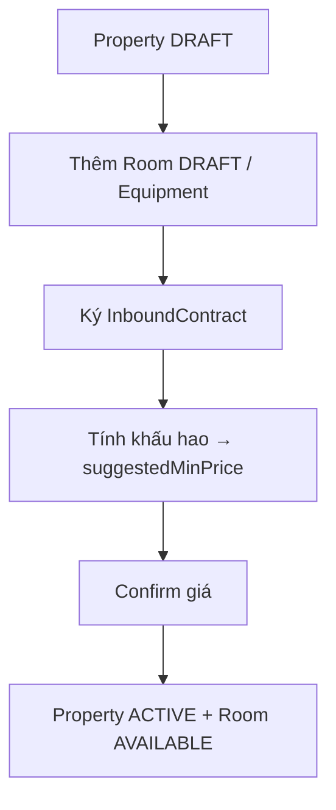
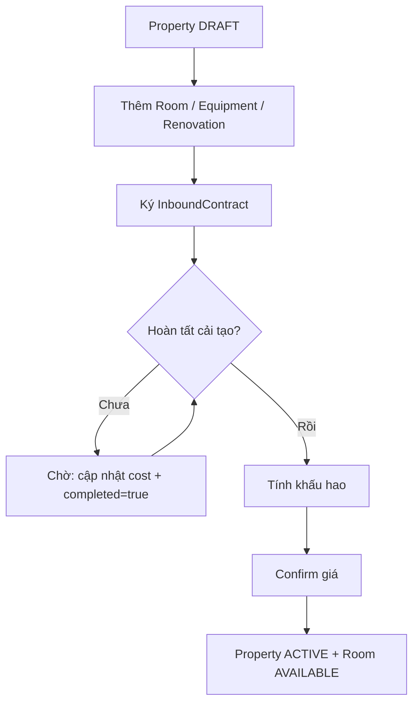

# SLMS — Property Onboarding Flow (Frontend Integration Guide)

Tài liệu mô tả ngữ cảnh, luồng nghiệp vụ, API và quy tắc UI cho team Frontend khi tích hợp quy trình onboarding tài sản (Property).

---

## 1. Bối cảnh

Hệ thống quản lý tài sản cho thuê (SLMS). Một **Property** (tòa nhà/căn nhà) đi qua quy trình **onboarding** trước khi sẵn sàng cho thuê:

1. Khảo sát & tạo nháp
2. Khai báo phòng / thiết bị / (tuỳ chọn) cải tạo
3. Ký **Inbound Contract** với chủ nhà gốc (giá thuê gốc + cọc + thời hạn)
4. Tính **khấu hao** → hệ thống gợi ý **giá thuê tối thiểu** (`suggestedMinPrice`)
5. User **confirm giá** → Property/Room chuyển trạng thái kinh doanh

**Hai loại tài sản — hai cách tính giá (không gom chung):**

| Loại | `wholeHouse` | Pricing scope | Nơi lưu giá sau confirm |
|------|--------------|---------------|--------------------------|
| Nhà nguyên căn | `true` | `WHOLE_HOUSE` | `Property.price`, `Property.deposit` |
| Nhà chia phòng | `false` | `ROOM` | `Room.price`, `Room.deposit` từng phòng |

---

## 2. Trạng thái (State machine)

### PropertyStatus

| Status | Ý nghĩa | FE hiển thị gợi ý |
|--------|---------|-------------------|
| `DRAFT` | Đang setup, chưa kinh doanh | "Nháp" |
| `ACTIVE` | Đã confirm giá, sẵn sàng | "Đang kinh doanh" |
| `MAINTENANCE` | Đang cải tạo | "Đang cải tạo" |
| `INACTIVE` | Ngừng / trả nhà chủ gốc | "Ngừng hoạt động" |

### RoomStatus (chỉ nhà chia phòng)

| Status | Ý nghĩa |
|--------|---------|
| `DRAFT` | Vừa tạo, chưa có giá thật |
| `AVAILABLE` | Sẵn sàng cho thuê |
| `RENTED` | Đang cho thuê |
| `MAINTENANCE` | Đang cải tạo |

### InboundContract

- Status sau khi ký: `ACTIVE`
- Mỗi Property chỉ có **1** Inbound Contract

---

## 3. Hai luồng onboarding chính

### Luồng A — Không có cải tạo (happy path)



**Điều kiện FE cần check trước mỗi bước:**

- **Bước C:** Property phải `DRAFT`, chưa có HĐ
- **Bước D:** Đã có HĐ; mọi Equipment `PURCHASED` phải có `purchasePrice`
- **Bước E:** Đã có kết quả khấu hao; giá confirm ≥ `suggestedMinPrice` (từng phòng hoặc cả căn)

---

### Luồng B — Có cải tạo (target nghiệp vụ)



**Quy tắc nghiệp vụ (target — FE nên enforce UI):**

- Nếu Property có **bất kỳ** Renovation nào (`completed = false`) → **không cho** bấm "Tính khấu hao" / "Confirm giá"
- Renovation cần có `cost` trước khi đánh dấu `completed = true`
- Sau khi confirm → `ACTIVE` / `AVAILABLE` (không qua `MAINTENANCE` nếu không còn cải tạo dang dở)

> **Lưu ý backend hiện tại:** API vẫn cho phép tính khấu hao khi còn renovation chưa xong, và confirm có thể đưa vào `MAINTENANCE` qua flag `hasOngoingRenovation`. FE nên follow **Luồng B (target)**; backend sẽ được siết rule sau.

---

### Luồng C — Cải tạo bổ sung sau khi đã kinh doanh (PLANNED — chưa có API)

Sau một thời gian vận hành, owner thấy chưa hoàn vốn → có thể:

- **Cải tạo tiếp** → chi phí mới **cộng dồn** với phần vốn còn lại chưa hoàn
- **Bỏ / chấp nhận lỗ** → không cộng thêm

FE: chưa implement màn hình/API này — chỉ cần biết để thiết kế chỗ trống (ví dụ tab "Tái đầu tư" trên Property `ACTIVE`).

---

## 4. Phân nhánh theo loại nhà

### 4.1 Nhà nguyên căn (`wholeHouse: true`)

| Hành động | Cho phép? |
|-----------|-----------|
| Thêm Room | **Không** |
| Thêm Equipment / Renovation với `roomId` | **Không** — chỉ cấp Property |
| Tính khấu hao | 1 kết quả `wholeHouseResult` |
| Confirm giá | `propertyPrice` + `propertyDeposit` |

### 4.2 Nhà chia phòng (`wholeHouse: false`)

| Hành động | Cho phép? |
|-----------|-----------|
| Thêm Room | Có — status mặc định `DRAFT`, `price`/`deposit` optional |
| Equipment / Renovation | Có thể gắn `roomId` (riêng phòng) hoặc để null (chi phí chung) |
| Tính khấu hao | 1 kết quả **mỗi phòng** trong `roomResults[]` |
| Confirm giá | `roomPrices[]` — validate **từng phòng**, không so tổng |

**Chi phí chung** (equipment/renovation không có `roomId`, cọc HĐ, baseRent HĐ) được **chia theo tỷ lệ diện tích** từng phòng khi tính khấu hao.

---

## 5. API Reference

Base URL: `/api/v1` — tất cả endpoint yêu cầu JWT (trừ auth).

### Bước 1 — Tạo Property

```
POST /properties
```

Body chính: `propertyName`, `address`, `zoneId`, `managedBy`, `wholeHouse`, `totalRooms` (nếu chia phòng), `areaSize`, `descriptions`, `imageUrls`

→ Response: `status = "DRAFT"`

---

### Bước 2a — Thêm phòng (chỉ `wholeHouse = false`)

```
POST /properties/{propertyId}/rooms
GET  /properties/{propertyId}/rooms
GET  /properties/{propertyId}/rooms/{roomId}
```

```json
{
  "roomNumber": "P101",
  "area": 25.5,
  "propertyType": "SINGLE_ROOM",
  "maxOccupants": 2
}
```

`price`, `deposit` **không bắt buộc** lúc tạo nháp.

---

### Bước 2b — Thêm thiết bị

```
POST /properties/{propertyId}/equipments
GET  /properties/{propertyId}/equipments
```

```json
{
  "name": "Máy lạnh",
  "source": "PURCHASED",
  "purchasePrice": 8000000,
  "roomId": 1
}
```

- `source`: `INITIAL_HANDOVER` | `PURCHASED`
- Nhà nguyên căn: **không gửi** `roomId`
- `PURCHASED` cần `purchasePrice` trước khi tính khấu hao

---

### Bước 2c — Thêm cải tạo (tuỳ chọn)

```
POST /properties/{propertyId}/renovations
GET  /properties/{propertyId}/renovations
```

```json
{
  "description": "Sơn lại tường",
  "cost": 5000000,
  "completed": false,
  "roomId": 1
}
```

- `roomId` null = cải tạo chung tòa
- Nhà nguyên căn: không gửi `roomId`

> **Chưa có API** cập nhật renovation (đánh dấu hoàn thành) — FE tạm gửi `completed: true` lúc POST hoặc chờ API `PATCH`.

---

### Bước 3 — Ký Inbound Contract

```
POST /properties/{propertyId}/inbound-contract
GET  /properties/{propertyId}/inbound-contract
```

```json
{
  "contractCode": "INB-2026-001",
  "ownerName": "Nguyễn Văn A",
  "baseRentPrice": 15000000,
  "depositAmount": 50000000,
  "startDate": "2026-01-01",
  "endDate": "2028-12-31",
  "contractScanUrl": "https://..."
}
```

Điều kiện: Property `DRAFT`, chưa có HĐ.

---

### Bước 4 — Tính khấu hao

```
POST /properties/{propertyId}/depreciation/calculate
GET  /properties/{propertyId}/depreciation
```

Body (optional):

```json
{
  "monthlyOperatingCost": 2000000
}
```

**Response — nhà nguyên căn:**

```json
{
  "propertyId": 1,
  "pricingScope": "WHOLE_HOUSE",
  "wholeHouseResult": {
    "suggestedMinPrice": 25000000,
    "monthlyDepreciation": 3000000,
    "baseRent": 15000000,
    "totalInvestment": 120000000,
    "contractMonths": 36
  }
}
```

**Response — nhà chia phòng:**

```json
{
  "propertyId": 2,
  "pricingScope": "ROOM",
  "roomResults": [
    {
      "roomId": 1,
      "roomNumber": "P101",
      "suggestedMinPrice": 4800000
    },
    {
      "roomId": 2,
      "roomNumber": "P102",
      "suggestedMinPrice": 5200000
    }
  ]
}
```

**Công thức (để hiển thị breakdown cho user):**

```
totalInvestment = renovation + equipment(PURCHASED) + deposit(HĐ)
monthlyDepreciation = totalInvestment / số tháng HĐ
suggestedMinPrice = baseRent + monthlyDepreciation + monthlyOperatingCost
```

(Nhà chia phòng: mỗi phòng có bộ số riêng sau khi phân bổ theo diện tích.)

---

### Bước 5 — Confirm giá

```
POST /properties/{propertyId}/activation/confirm
```

**Nhà nguyên căn:**

```json
{
  "propertyPrice": 26000000,
  "propertyDeposit": 52000000
}
```

Validation: `propertyPrice >= wholeHouseResult.suggestedMinPrice`

**Nhà chia phòng:**

```json
{
  "roomPrices": [
    { "roomId": 1, "price": 5000000, "deposit": 5000000 },
    { "roomId": 2, "price": 5500000, "deposit": 5500000 }
  ]
}
```

Validation: **mỗi** `price >= suggestedMinPrice` của phòng tương ứng; phải đủ tất cả phòng `DRAFT`.

**Response thành công:**

- `propertyStatus`: `ACTIVE`
- Room: `AVAILABLE` (hoặc `MAINTENANCE` nếu backend detect còn cải tạo — FE target luồng A/B nên tránh case này)

---

## 6. Gợi ý UI / Wizard cho FE

### Wizard steps (đề xuất)

| Step | Tiêu đề | wholeHouse | wholeHouse=false |
|------|---------|------------|------------------|
| 1 | Thông tin tòa | ✓ | ✓ |
| 2 | Phòng | Ẩn | Danh sách phòng DRAFT |
| 3 | Thiết bị | Cấp tòa | Cấp tòa + từng phòng |
| 4 | Cải tạo | Optional | Optional |
| 5 | Hợp đồng inbound | ✓ | ✓ |
| 6 | Khấu hao & gợi ý giá | 1 card | Bảng từng phòng |
| 7 | Confirm giá | 1 form giá căn | Form giá từng phòng |

### Enable/disable nút theo state

```
hasContract       = GET inbound-contract thành công
hasDepreciation   = GET depreciation có data
hasOpenRenovation = renovations có item completed=false

[Tính khấu hao]   = DRAFT + hasContract + !hasOpenRenovation
[Confirm giá]     = DRAFT + hasDepreciation + !hasOpenRenovation
```

### Hiển thị `suggestedMinPrice`

- Luôn show như **giá sàn gợi ý**, không auto-fill (user tự nhập, hệ thống validate)
- Input giá < suggested → hiện lỗi trước khi gọi API (422 từ BE: `BusinessException`)

---

## 7. Error handling

| HTTP | Ý nghĩa | FE xử lý |
|------|---------|----------|
| 404 | Không tìm thấy resource | Toast + quay list |
| 422 | Lỗi nghiệp vụ (`BusinessException`) | Hiện `error` message |
| 400 | Validation field | Hiện `fieldErrors` |

**Ví dụ lỗi thường gặp:**

- "Phải ký hợp đồng inbound trước khi tính khấu hao"
- "Thiết bị PURCHASED phải có purchasePrice trước khi tính khấu hao"
- "Giá thuê xác nhận (...) thấp hơn giá tối thiểu gợi ý (...)"
- "Nhà nguyên căn không thêm phòng riêng lẻ"

---

## 8. Checklist tích hợp

- [ ] Phân nhánh UI theo `property.wholeHouse`
- [ ] Đọc `pricingScope` từ response khấu hao (`WHOLE_HOUSE` vs `ROOM`)
- [ ] Không gửi `roomPrices` cho nhà nguyên căn
- [ ] Không gửi `propertyPrice` cho nhà chia phòng
- [ ] Block wizard nếu còn renovation `completed = false` (target Luồng B)
- [ ] Sau confirm thành công → redirect sang màn Property detail với status `ACTIVE`
- [ ] Giữ chỗ UI cho Luồng C (tái cải tạo sau kinh doanh) — API chưa có

---

## 9. Thứ tự gọi API mẫu

### Nhà chia phòng, không cải tạo

```
1. POST /properties
2. POST /properties/1/rooms          (lặp N phòng)
3. POST /properties/1/equipments       (tuỳ chọn)
4. POST /properties/1/inbound-contract
5. POST /properties/1/depreciation/calculate
6. POST /properties/1/activation/confirm
```

### Nhà nguyên căn

```
1. POST /properties          { wholeHouse: true }
2. POST /properties/1/equipments
3. POST /properties/1/inbound-contract
4. POST /properties/1/depreciation/calculate
5. POST /properties/1/activation/confirm   { propertyPrice, propertyDeposit }
```

### Nhà có cải tạo (target)

```
1. POST /properties
2. POST /properties/1/rooms / equipments / renovations
3. POST /properties/1/inbound-contract
4. (Chờ hoàn tất renovation — cost + completed=true)
5. POST /properties/1/depreciation/calculate
6. POST /properties/1/activation/confirm
```

---

## 10. Enum tham chiếu nhanh

| Enum | Giá trị |
|------|---------|
| `PropertyStatus` | `DRAFT`, `ACTIVE`, `MAINTENANCE`, `INACTIVE` |
| `RoomStatus` | `DRAFT`, `AVAILABLE`, `RENTED`, `MAINTENANCE` |
| `PricingScope` | `WHOLE_HOUSE`, `ROOM` |
| `EquipmentSource` | `INITIAL_HANDOVER`, `PURCHASED` |
| `ContractStatus` | `PENDING`, `ACTIVE`, `EXPIRED`, `TERMINATED` |

---

## 11. Ghi chú triển khai backend

| Tính năng | Trạng thái |
|-----------|------------|
| Onboarding 2 tầng giá (WHOLE_HOUSE / ROOM) | ✅ Đã có API |
| Khấu hao từng phòng + phân bổ chi phí chung | ✅ Đã có API |
| Block khấu hao khi renovation chưa xong | ⏳ Target — chưa siết BE |
| API PATCH hoàn thành renovation | ⏳ Chưa có |
| Tái cải tạo sau kinh doanh (Luồng C) | 📋 Planned |
