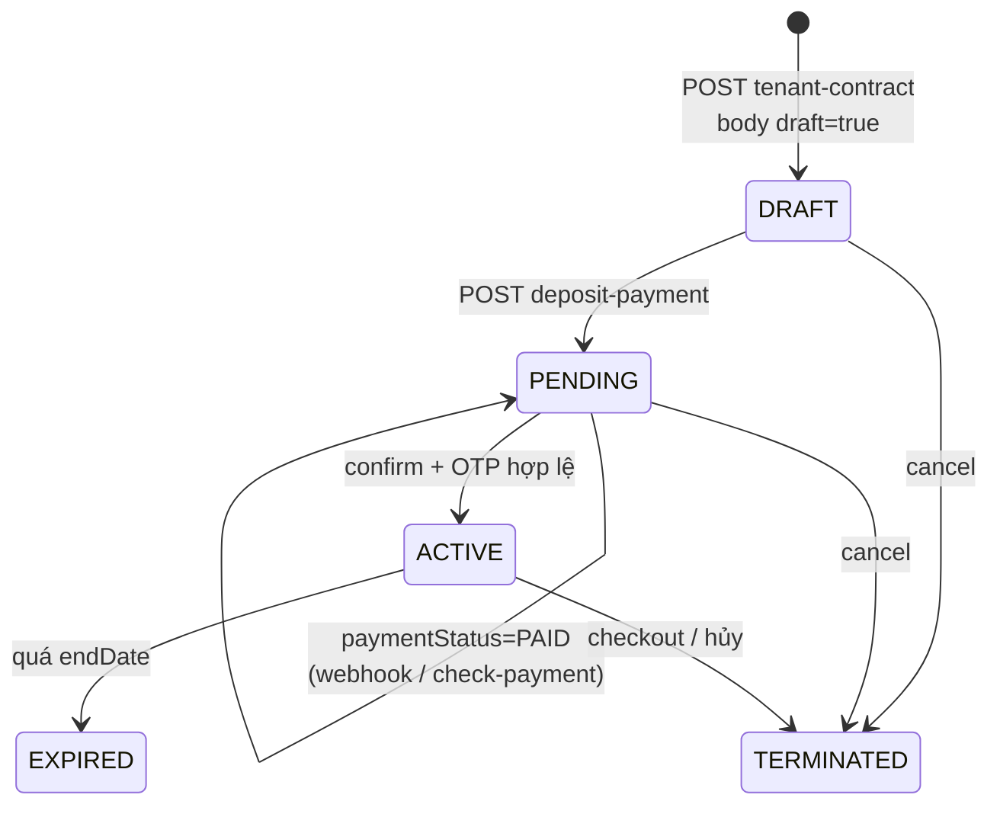
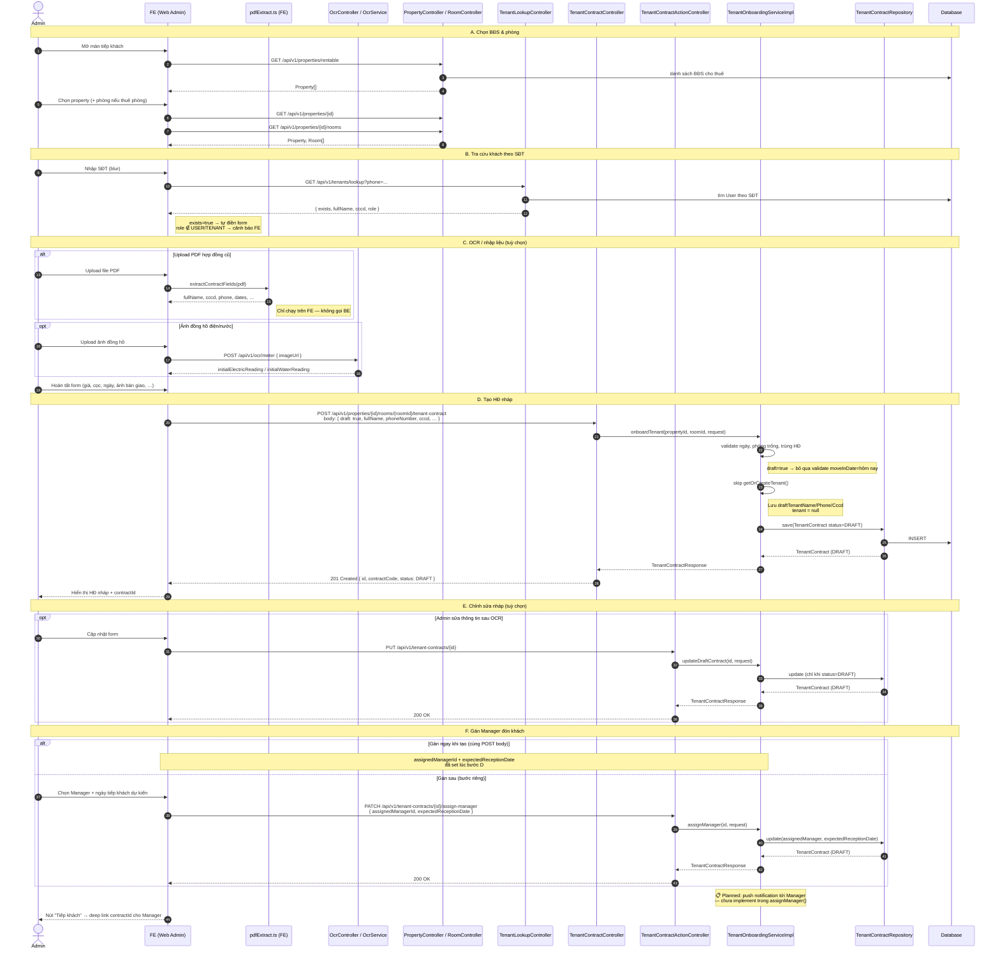
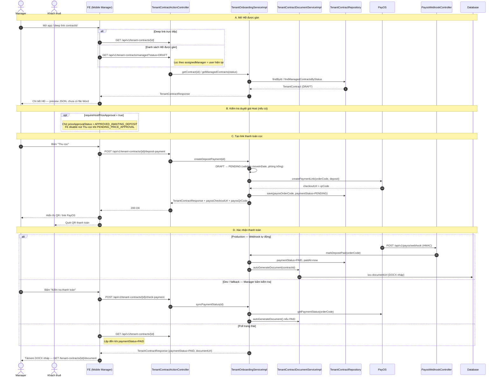
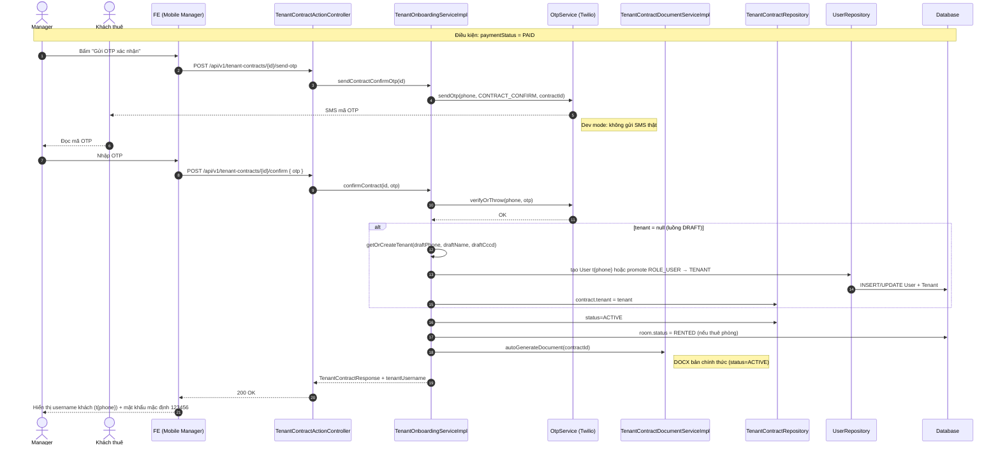
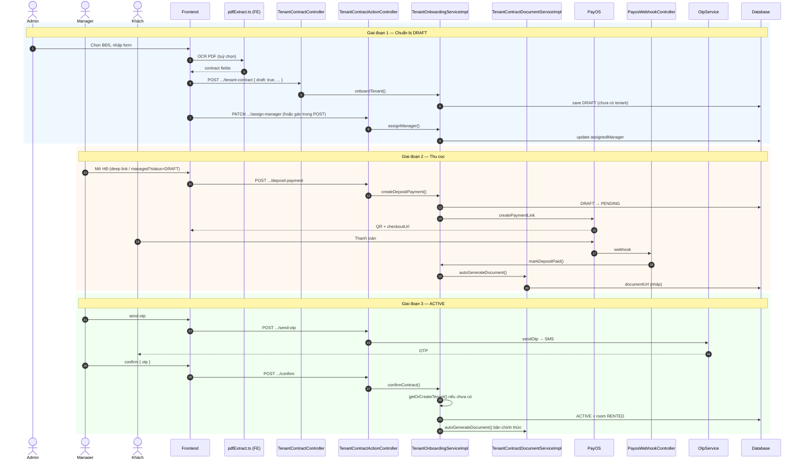
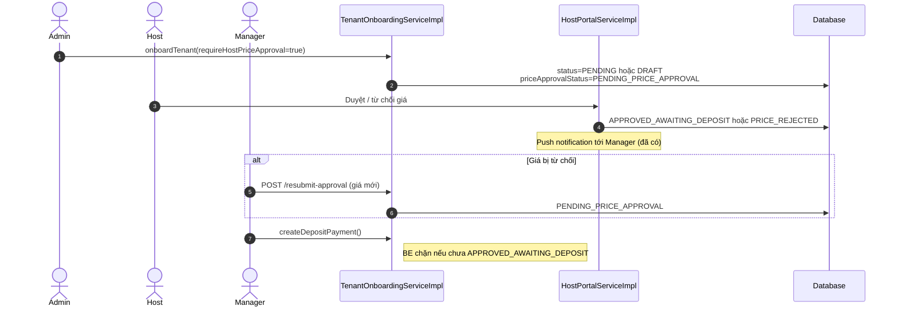

# Sequence Diagram — Luồng tiếp khách (Tenant Onboarding)

Tài liệu mô tả **sequence diagram đầy đủ** cho luồng onboarding khách thuê trong SLMS2026, đã chỉnh khớp **code BE hiện tại** (tháng 7/2026).

**Tham chiếu code:** `TenantOnboardingServiceImpl`, `TenantContractController`, `TenantContractActionController`, `TenantContractDocumentServiceImpl`, `PayosWebhookController`, `OcrController`

**Tài liệu liên quan:** [`FE-BE-tenant-onboarding-flow.md`](./FE-BE-tenant-onboarding-flow.md) · [`tenant-contract-template-spec.md`](./tenant-contract-template-spec.md)

---

## 1. Tổng quan

Luồng mobile tiếp khách (happy path) gồm **3 giai đoạn**:

| Giai đoạn | Vai trò chính | Trạng thái HĐ | Việc chính |
|-----------|---------------|---------------|------------|
| **1 — Chuẩn bị HĐ nháp** | Admin | `DRAFT` | Chọn BĐS/phòng, OCR/nhập form, tạo nháp, gán Manager |
| **2 — Tiếp khách & thu cọc** | Manager | `DRAFT` → `PENDING` → `PAID` | Mở HĐ, tạo link PayOS, khách thanh toán, xuất DOCX nháp |
| **3 — Kích hoạt HĐ** | Manager + Khách | `ACTIVE` | Gửi OTP SMS, xác nhận, tạo tài khoản tenant, phòng `RENTED` |

### Thuật ngữ trạng thái

| Khái niệm nghiệp vụ | Trong hệ thống |
|---------------------|----------------|
| Hợp đồng **nháp** | `ContractStatus.DRAFT` — chưa tạo `User`/`Tenant` |
| Hợp đồng **chờ tiếp khách** | `ContractStatus.PENDING` + `paymentStatus` null hoặc `PENDING` |
| Đã thanh toán cọc | `PaymentStatus.PAID` |
| Hợp đồng **active** | `ContractStatus.ACTIVE` |

### State machine (rút gọn)



---

## 2. Participants (thành phần)

| Participant | Vai trò | Ghi chú |
|-------------|---------|---------|
| **Admin** | Nhập liệu, tạo HĐ nháp, gán Manager | `ROLE_ADMIN` |
| **Manager** | Tiếp khách tại chỗ, thu cọc, OTP | `ROLE_MANAGER` |
| **Khách** | Quét QR PayOS, đọc OTP SMS | Không gọi API trực tiếp |
| **pdfExtract.ts** | Utility **FE** — trích xuất field từ file PDF HĐ cũ | Client-side, **không** phải BE |
| **OcrService** | BE — đọc chỉ số đồng hồ / hóa đơn EVN từ ảnh | `POST /api/v1/ocr/meter`, `/ocr/evn-bill` |
| **TenantContractController** | REST — tạo HĐ theo property/room | `POST .../tenant-contract` |
| **TenantContractActionController** | REST — thao tác theo `contractId` | deposit, OTP, assign-manager, … |
| **TenantOnboardingServiceImpl** | Service chính onboarding | `onboardTenant`, `assignManager`, PayOS, OTP, confirm |
| **TenantContractDocumentServiceImpl** | Fill template DOCX | `autoGenerateDocument` sau `PAID` và `confirm` |
| **TenantContractRepository** | Persistence `TenantContract` | |
| **PayOS** | Cổng thanh toán | Webhook HMAC |
| **OtpService** | Gửi/xác minh OTP SMS (Twilio) | |
| **PayosWebhookController** | Nhận webhook thanh toán | Public, không JWT |

> **Lưu ý:** Không có `TenantContractService` hay `createDraftContract()` riêng — toàn bộ logic nằm trong `TenantOnboardingServiceImpl.onboardTenant()` với `draft: true` trong body.

---

## 3. Giai đoạn 1 — Admin chuẩn bị HĐ nháp (`DRAFT`)

Bao gồm: chọn BĐS/phòng, tra khách, OCR (tuỳ chọn), tạo nháp, chỉnh sửa nháp, gán Manager.



### API map — Giai đoạn 1

| Bước | Method | Endpoint | Service |
|------|--------|----------|---------|
| Danh sách BĐS | GET | `/api/v1/properties/rentable` | `PropertyService` |
| Chi tiết căn | GET | `/api/v1/properties/{id}` | `PropertyService` |
| Danh sách phòng | GET | `/api/v1/properties/{id}/rooms` | `RoomService` |
| Tra khách SĐT | GET | `/api/v1/tenants/lookup?phone=` | `TenantLookupController` |
| OCR đồng hồ | POST | `/api/v1/ocr/meter` | `OcrService` |
| Tạo HĐ nháp (phòng) | POST | `/api/v1/properties/{propertyId}/rooms/{roomId}/tenant-contract` | `onboardTenant()` |
| Tạo HĐ nháp (nguyên căn) | POST | `/api/v1/properties/{propertyId}/tenant-contract` | `onboardTenant()` |
| Cập nhật nháp | PUT | `/api/v1/tenant-contracts/{id}` | `updateDraftContract()` |
| Gán Manager | PATCH | `/api/v1/tenant-contracts/{id}/assign-manager` | `assignManager()` |
| Danh sách HĐ nháp | GET | `/api/v1/tenant-contracts?status=DRAFT` | `getContractsByStatus()` |

---

## 4. Giai đoạn 2 — Manager tiếp khách & thu cọc (`DRAFT` → `PENDING` → `PAID`)



### API map — Giai đoạn 2

| Bước | Method | Endpoint | Service |
|------|--------|----------|---------|
| Chi tiết HĐ | GET | `/api/v1/tenant-contracts/{id}` | `getContractForUser()` |
| HĐ được gán (DRAFT/PENDING) | GET | `/api/v1/tenant-contracts/managed?status=DRAFT` | `getManagedContracts()` |
| Tạo link cọc | POST | `/api/v1/tenant-contracts/{id}/deposit-payment` | `createDepositPayment()` |
| Kiểm tra thanh toán | POST | `/api/v1/tenant-contracts/{id}/check-payment` | `syncPaymentStatus()` |
| Webhook PayOS | POST | `/api/v1/payos/webhook` | `markDepositPaid()` |
| Tải DOCX | GET | `/api/v1/tenant-contracts/{id}/document` | `getDocument()` |

---

## 5. Giai đoạn 3 — Xác nhận OTP & kích hoạt HĐ (`ACTIVE`)



### API map — Giai đoạn 3

| Bước | Method | Endpoint | Service |
|------|--------|----------|---------|
| Gửi OTP | POST | `/api/v1/tenant-contracts/{id}/send-otp` | `sendContractConfirmOtp()` |
| Kích hoạt HĐ | POST | `/api/v1/tenant-contracts/{id}/confirm` | `confirmContract()` |
| Hủy HĐ chờ | POST | `/api/v1/tenant-contracts/{id}/cancel` | `cancelContract()` |

---

## 6. Sequence diagram tổng hợp (3 giai đoạn)



---

## 7. Nhánh tuỳ chọn: Duyệt giá Host

Khi `requireHostPriceApproval = true` trong request tạo HĐ:



---

## 8. So sánh với diagram cũ (đã sửa)

| Diagram cũ | Sửa thành |
|------------|-----------|
| `TenantContractService.createDraftContract()` | `TenantOnboardingServiceImpl.onboardTenant()` |
| `POST ...?draft=true` (query param) | `POST` body `{ draft: true }` |
| `PATCH` qua `TenantContractController` | `PATCH` qua `TenantContractActionController` |
| `NotificationService.notifyManager()` | **Chưa có** — đánh dấu planned |
| `pdfExtract.ts (OCR)` gọi như BE service | **FE client-side** — tách khỏi `OcrService` BE |
| Chỉ có tạo nháp + assign | Bổ sung deposit, PayOS, OTP, confirm, update draft |
| `TenantContract (DRAFT)` nhưng đã có tenant | `draft=true` → **không** tạo `User`/`Tenant` cho đến `confirm` |
| Thiếu `DRAFT → PENDING` | Xảy ra tại `createDepositPayment()` |

---

## 9. Request body mẫu — Tạo HĐ nháp

```json
{
  "draft": true,
  "fullName": "Nguyễn Văn A",
  "cccd": "001234567890",
  "phoneNumber": "0901234567",
  "moveInDate": "2026-07-05",
  "endDate": "2027-07-05",
  "rentAmount": 5000000,
  "deposit": 5000000,
  "depositMonths": 1,
  "initialElectricReading": 1234.5,
  "initialWaterReading": 56.0,
  "requireDepositPayment": true,
  "requireHostPriceApproval": false,
  "assignedManagerId": "uuid-manager",
  "expectedReceptionDate": "2026-07-05",
  "draftContractFileUrl": "https://cloudinary.com/.../hop-dong-scan.pdf"
}
```

---

## 10. Checklist triển khai FE

- [ ] `pdfExtract.ts` chạy trên FE; kết quả điền vào form trước `POST`
- [ ] Sau tạo nháp: deep link `contractId` sang app Manager (không chỉ dựa `/managed` nếu chưa assign)
- [ ] `GET /managed?status=DRAFT` chỉ trả HĐ **đã gán** cho Manager đang đăng nhập
- [ ] Disable "Thu cọc" khi `priceApprovalStatus = PENDING_PRICE_APPROVAL`
- [ ] Poll `GET /tenant-contracts/{id}` hoặc `POST /check-payment` sau QR
- [ ] Sau `confirm`: hiển thị `tenantUsername` = `t{phone}`, mật khẩu mặc định `123456`
- [ ] Dev: OTP bất kỳ 6 chữ số; Prod: bật Twilio

---

## 11. File code tham chiếu

| File | Vai trò |
|------|---------|
| `TenantOnboardingServiceImpl.java` | Onboard, draft, assign, PayOS, OTP, confirm |
| `TenantContractController.java` | POST tạo HĐ theo property/room |
| `TenantContractActionController.java` | deposit, OTP, confirm, assign-manager, update draft |
| `TenantContractDocumentServiceImpl.java` | Fill template DOCX |
| `PayosWebhookController.java` | Webhook thanh toán |
| `OcrController.java` | OCR đồng hồ (không phải PDF HĐ) |
| `OnboardTenantRequest.java` | DTO — field `draft`, `assignedManagerId` |
| `AssignManagerRequest.java` | DTO — gán Manager sau |
