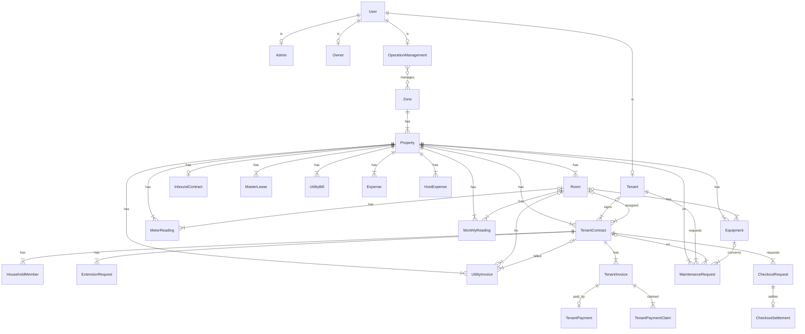

# SLMS ERD — Core (clean)

Mở file `.puml` bằng PlantUML / VS Code PlantUML, hoặc preview Mermaid bên dưới.

## Quan hệ (bảng nhanh)

| From | Card. | To | Ghi chú |
|------|-------|-----|---------|
| User | 1—0..1 | Admin / Owner / Tenant / OperationManagement | role profile |
| OperationManagement | *—* | Zone | quản lý khu vực |
| Zone | 1—* | Property | |
| Property | 1—* | Room | |
| Property | 1—0..1 | InboundContract | HĐ chủ nhà |
| Property | 1—* | MasterLease | |
| Property | 1—* | TenantContract | hub thuê |
| Tenant | 0..1—* | TenantContract | |
| Room | 0..1—* | TenantContract | null = thuê cả nhà |
| TenantContract | 1—* | HouseholdMember / ExtensionRequest | |
| Property | 1—* | UtilityBill | HĐ điện/nước nhà nước (tháng) |
| Property | 1—* | MeterReading / MonthlyReading / UtilityInvoice | |
| TenantContract | 0..1—* | UtilityInvoice | hóa đơn ĐN cho khách |
| TenantContract | 1—* | TenantInvoice | hóa đơn thuê tháng |
| TenantInvoice | 1—0..1 | TenantPayment | |
| TenantInvoice | 1—* | TenantPaymentClaim | |
| Property | 1—* | Expense / HostExpense | |
| Property | 1—* | Equipment / MaintenanceRequest | |
| TenantContract | 1—* | CheckoutRequest | |
| CheckoutRequest | 1—0..1 | CheckoutSettlement | |
