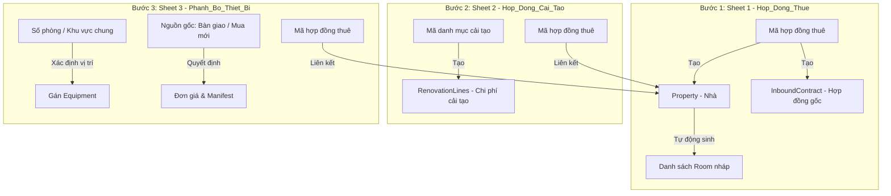

# Tài Liệu Đặc Tả Cấu Trúc File Excel Import Hàng Loạt (SLMS2026)

Tài liệu này hướng dẫn chi tiết cách thiết lập định dạng, kiểu dữ liệu, các ràng buộc validation và cấu trúc dữ liệu cho file Excel import hàng loạt phục vụ việc di cư dữ liệu **Nhà + Hợp đồng thuê**, **Chi phí cải tạo** và **Phân bổ trang thiết bị** vào hệ thống **SLMS2026**.

---

## 1. Sơ đồ Luồng nghiệp vụ Import (Workflow)

* Quy trình chạy tuần tự: **Bước 1** (Tạo nhà/hợp đồng gốc để sinh UUID) -> **Bước 2** (Áp dụng chi phí cải tạo) -> **Bước 3** (Lắp đặt trang thiết bị vào các phòng).

---

## 2. Đặc tả Chi tiết các Sheet trong File Excel

File Excel mẫu bao gồm **3 Sheet** cố định. Dưới đây là đặc tả chi tiết từng cột của từng sheet:

### Sheet 1: `1. Hop_Dong_Thue` (Hợp đồng thuê & Thông tin Nhà)
Mỗi dòng trong sheet này đại diện cho một căn nhà (Property) gắn liền với Hợp đồng thuê inbound (`InboundContract`).

| Cột | Tên cột (Header) | Mã thuộc tính | Kiểu dữ liệu | Bắt buộc | Ràng buộc & Định dạng | Ví dụ |
| :--- | :--- | :--- | :--- | :---: | :--- | :--- |
| **A** | **Mã hợp đồng** | `contractCode` | String | **Có** | **Khóa chính duy nhất**. Không dấu cách/ký tự đặc biệt. | `HD-2026-VILLACG` |
| **B** | **Tên tòa nhà** | `propertyName` | String | **Có** | Tên gợi nhớ của tòa nhà. | `Vinhomes Villa Cầu Giấy` |
| **C** | **Địa chỉ chi tiết** | `address` | String | **Có** | Số nhà, tên ngõ/đường. | `Số 18, Biệt thự 2` |
| **D** | **Xã/Phường** | `ward` | String | Không | Ghép thêm vào địa chỉ chi tiết (không map Zone). | `Dịch Vọng Hậu` |
| **E** | **Quận/Huyện** | `district` | String | **Có** | Map `Zone` **level 2** (Quận/Huyện). | `Cầu Giấy` |
| **F** | **Tỉnh/Thành phố** | `province` | String | **Có** | Map `Zone` **level 1** (Tỉnh/Thành phố). | `Hà Nội` |
| **G** | **Diện tích (m²)** | `areaSize` | Double | **Có** | Số thực lớn hơn 0. | `250.5` |
| **H** | **Tổng số tầng** | `totalFloor` | Integer | **Có** | Số nguyên dương > 0. | `3` |
| **I** | **Tổng số phòng** | `totalRooms` | Integer | **Có** | Số nguyên dương > 0. | `6` |
| **J** | **Tên chủ nhà** | `ownerName` | String | **Có** | Tên chủ nhà ký hợp đồng. | `Nguyễn Văn A` |
| **K** | **Tổng tiền thuê** | `totalRentAmount` | Decimal | **Có** | Số tiền lớn hơn 0 cho cả kỳ hạn. | `600000000` |
| **L** | **Ngày bắt đầu** | `startDate` | Date | **Có** | Định dạng: `YYYY-MM-DD`. | `2026-06-01` |
| **M** | **Ngày kết thúc** | `endDate` | Date | **Có** | Định dạng: `YYYY-MM-DD`. Phải sau Ngày bắt đầu. | `2031-05-31` |
| **N** | **Hình thức thuê** | `wholeHouse` | Dropdown | **Có** | Chỉ chọn: `WHOLE_HOUSE` hoặc `INDIVIDUAL_ROOM` | `WHOLE_HOUSE` |
| **O** | **Có cải tạo không** | `hasRenovation` | Dropdown | **Có** | Chỉ chọn: `TRUE` hoặc `FALSE` | `TRUE` |
| **P** | **Tỷ lệ chi phí dự phòng (%)** | `hostContingencyPercent` | Double | Không | Giá trị từ `0` đến `100`. | `5.0` |
| **Q** | **Mô tả chi tiết** | `descriptions` | String | **Có** | Thông tin mô tả tòa nhà. | `Biệt thự sân vườn rộng, có gara ô tô.` |

---

### Sheet 2: `2. Hop_Dong_Cai_Tao` (Các hạng mục chi phí cải tạo)
Sheet này lưu thông tin chi phí cải tạo cho các căn nhà có `hasRenovation = TRUE` ở Sheet 1.

| Cột | Tên cột (Header) | Mã thuộc tính | Kiểu dữ liệu | Bắt buộc | Ràng buộc & Định dạng | Ví dụ |
| :--- | :--- | :--- | :--- | :---: | :--- | :--- |
| **A** | **Mã hợp đồng thuê** | `contractCode` | String | **Có** | Phải trùng khớp với cột **Mã hợp đồng** của Sheet 1. | `HD-2026-VILLACG` |
| **B** | **Mã danh mục cải tạo** | `categoryCode` | String | **Có** | Phải khớp với mã (`code`) của `RenovationCategory` trong DB. | `CAT_PAINT` |
| **C** | **Tên danh mục (Gợi ý)**| `categoryName` | String | Không | Dùng để người dùng đối chiếu tên gợi nhớ. | `Sơn sửa tường` |
| **D** | **Chi phí cải tạo (VNĐ)**| `cost` | Decimal | **Có** | Số tiền lớn hơn 0. | `25000000` |
| **E** | **Ghi chú chi tiết** | `note` | String | Không | Mô tả hạng mục công việc. | `Sơn chống thấm mặt ngoài biệt thự` |

---

### Sheet 3: `3. Phanh_Bo_Thiet_Bi` (Trang thiết bị bàn giao hoặc mua mới)
Sheet này dùng để gán thiết bị vào các phòng hoặc khu vực chung.

| Cột | Tên cột (Header) | Mã thuộc tính | Kiểu dữ liệu | Bắt buộc | Ràng buộc & Định dạng | Ví dụ |
| :--- | :--- | :--- | :--- | :---: | :--- | :--- |
| **A** | **Mã hợp đồng thuê** | `contractCode` | String | **Có** | Phải trùng khớp với cột **Mã hợp đồng** của Sheet 1. | `HD-2026-VILLACG` |
| **B** | **Số phòng** | `roomNumber` | String | Phụ thuộc | **Bắt buộc nếu Cột C để trống**. Phải trùng khớp với số phòng tự động sinh. | `101` |
| **C** | **Khu vực chung** | `houseArea` | Dropdown | Phụ thuộc | **Bắt buộc nếu Cột B để trống**. Chỉ chọn: `LIVING_ROOM`, `KITCHEN`, `BATHROOM`, `BALCONY`, `GARAGE`, `OTHER` | `LIVING_ROOM` |
| **D** | **Tên Catalog thiết bị** | `catalogName` | String | **Có** | Phải trùng khớp với **Tên (name)** trong `EquipmentCatalog` của DB. | `Tivi Sony 65 inch` |
| **E** | **Nguồn gốc thiết bị** | `source` | Dropdown | **Có** | Chọn một trong: - `INITIAL_HANDOVER` (Chủ bàn giao) - `PURCHASED` (Hệ thống mua mới) | `PURCHASED` |
| **F** | **Trạng thái thiết bị** | `status` | Dropdown | **Có** | Chọn một trong: - `NEW`, `GOOD`, `DAMAGED`, `BROKEN` | `NEW` |
| **G** | **Số lượng** | `quantity` | Integer | **Có** | Số nguyên dương > 0. | `1` |
| **H** | **Đơn giá (VNĐ)** | `price` | Decimal | Phụ thuộc | **Bắt buộc nếu Nguồn gốc là `PURCHASED`**. Bằng 0 nếu là bàn giao. | `16500000` |
| **I** | **Ghi chú lắp đặt** | `note` | String | Không | Mô tả vị trí/lưu ý lắp đặt. | `Lắp đặt tại phòng khách tầng 1` |

---

## 3. Ví dụ dữ liệu thực tế (1 Căn nhà hoàn chỉnh)

Dưới đây là cách điền thông tin của căn nhà `Vinhomes Villa Cầu Giấy` (gồm 2 chi phí cải tạo và 3 thiết bị) trải rộng trên 3 Sheet:

### Sheet 1: `1. Hop_Dong_Thue`
*(Dòng đầu tiên)*
* **Mã hợp đồng**: `HD-2026-VILLACG`
* **Tên tòa nhà**: `Vinhomes Villa Cầu Giấy`
* **Địa chỉ chi tiết**: `Số 18, Biệt thự 2`
* **Xã/Phường**: `Dịch Vọng Hậu` | **Quận/Huyện**: `Cầu Giấy` | **Tỉnh/Thành**: `Hà Nội`
* **Diện tích**: `250.5` | **Số tầng**: `3` | **Số phòng**: `6`
* **Tên chủ nhà**: `Nguyễn Văn A`
* **Tổng tiền thuê**: `600,000,000`
* **Ngày bắt đầu**: `2026-06-01` | **Ngày kết thúc**: `2031-05-31`
* **Hình thức thuê**: `WHOLE_HOUSE`
* **Có cải tạo không**: `TRUE`
* **Mô tả chi tiết**: `Biệt thự sân vườn rộng, có gara ô tô.`

### Sheet 2: `2. Hop_Dong_Cai_Tao`
*(Có 2 dòng cải tạo)*

| Mã hợp đồng thuê (A) | Mã danh mục cải tạo (B) | Tên danh mục (C) | Chi phí cải tạo (D) | Ghi chú chi tiết (E) |
| :--- | :--- | :--- | :--- | :--- |
| `HD-2026-VILLACG` | `CAT_PAINT` | Sơn sửa tường | 25,000,000 | Sơn chống thấm mặt ngoài biệt thự |
| `HD-2026-VILLACG` | `CAT_FLOOR` | Lát nền sàn gỗ | 40,000,000 | Lát sàn gỗ công nghiệp cho 3 phòng ngủ tầng 2 |

### Sheet 3: `3. Phanh_Bo_Thiet_Bi`
*(Có 3 dòng phân bổ trang thiết bị)*

| Mã hợp đồng thuê (A) | Số phòng (B) | Khu vực chung (C) | Tên Catalog (D) | Nguồn gốc (E) | Trạng thái (F) | Số lượng (G) | Đơn giá (H) | Ghi chú (I) |
| :--- | :--- | :--- | :--- | :--- | :--- | :--- | :--- | :--- |
| `HD-2026-VILLACG` | `101` | | Điều hòa Daikin 9000 BTU | `INITIAL_HANDOVER` | `GOOD` | 1 | 0 | Máy lạnh có sẵn chủ bàn giao |
| `HD-2026-VILLACG` | `201` | | Giường ngủ gỗ sồi 1m8 | `PURCHASED` | `NEW` | 1 | 7,500,000 | Mua mới cho phòng ngủ Master |
| `HD-2026-VILLACG` | | `LIVING_ROOM` | Tivi Sony 65 inch | `PURCHASED` | `NEW` | 1 | 16,500,000 | Lắp đặt tại phòng khách tầng 1 |

---

## 4. Các Quy tắc Validate logic ở Backend

Khi viết code parse file Excel (dùng Apache POI hoặc EasyExcel), cần lập trình kiểm tra các ràng buộc logic sau:

1. **Ràng buộc Hợp đồng cải tạo (Sheet 2)**:
   * Nếu căn nhà ở Sheet 1 khai báo `hasRenovation = FALSE` nhưng ở Sheet 2 vẫn xuất hiện dòng chi phí cải tạo thuộc mã hợp đồng đó -> Báo lỗi dữ liệu không hợp lệ.
2. **Ràng buộc Đơn giá thiết bị (Sheet 3)**:
   * Nếu cột `Nguồn gốc` chọn `PURCHASED` -> Cột `Đơn giá` bắt buộc phải > 0.
   * Nếu cột `Nguồn gốc` chọn `INITIAL_HANDOVER` -> Cột `Đơn giá` tự động quy đổi về 0 nếu người dùng bỏ trống hoặc nhập giá khác.
3. **Đối chiếu Vị trí Thiết bị**:
   * Phải đảm bảo hoặc điền `Số phòng` hoặc điền `Khu vực chung`. Không được bỏ trống cả hai và không được điền đồng thời cả hai trên cùng một hàng.
4. **Đối chiếu Zone (Vị trí địa lý)**:
   * Hệ thống `Zone` chỉ có **2 cấp**: level 1 = Tỉnh/Thành phố, level 2 = Quận/Huyện.
   * Backend lấy (`province`, `district`) từ Excel để tìm `Zone` level 2 và gán vào `Property.zone`.
   * Cột `Xã/Phường` **không** map Zone — chỉ ghép vào địa chỉ chi tiết.
   * Sử dụng `.equalsIgnoreCase()` khi so khớp tên.
